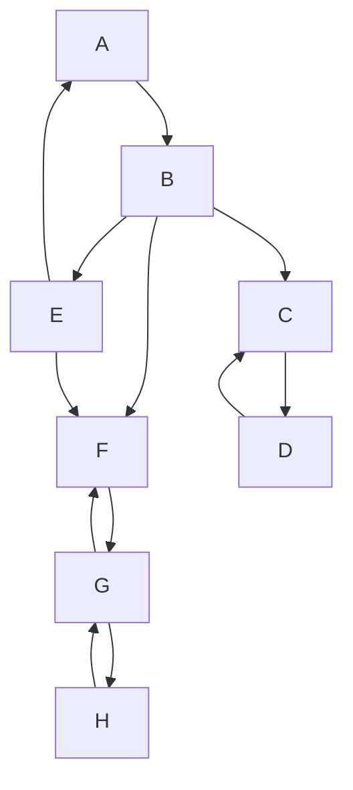
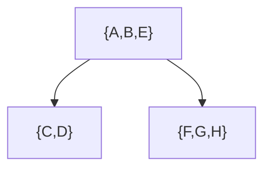

# Componentes fuertemente conexos (SCC)

Un **componente fuertemente conexo** (Strongly Connected Component, SCC) de un grafo dirigido es un subconjunto de vértices tal que, para todo par de vértices $u$ y $v$ dentro del componente, existe un camino dirigido de $u$ a $v$ y también de $v$ a $u$.

Un SCC es **maximal**: si se agrega cualquier vértice adicional, se pierde la propiedad de alcanzabilidad mutua entre todos los vértices.

**Grafo transpuesto ($G^T$)**: Es el grafo obtenido al invertir la dirección de todas las aristas de $G$. Se cumple que $G^T$ tiene los mismos SCC que $G$, solo que las aristas están en dirección contraria.

Sea $G^{SCC}$ el **grafo de componentes**, donde cada nodo representa un SCC y existe una arista entre dos componentes si hay al menos una arista en $G$ desde algún vértice del primer componente hacia algún vértice del segundo. $G^{SCC}$ es siempre un **DAG** (grafo acíclico dirigido), es decir, no contiene ciclos.

Este grafo tiene tres componentes fuertemente conexas: $\{A,B,E\}$, $\{C,D\}$, $\{F,G,H\}$. El grafo de componentes correspondiente es:

Nótese que este es un DAG, por lo tanto admite un **ordenamiento topológico**.

**Notación de tiempos en DFS**:
- $v.d$: tiempo de descubrimiento del vértice $v$.
- $v.f$: tiempo de finalización del vértice $v$.

Para un componente $C$, definimos:
- $d(C) = \min_{v \in C}(v.d)$: tiempo de descubrimiento del componente.
- $f(C) = \max_{v \in C}(v.f)$: tiempo de finalización del componente.

Dado que $G^{SCC}$ es un DAG, se cumple que si existe una arista de $C$ a $C'$ en $G^{SCC}$, entonces $f(C) > f(C')$ en una búsqueda en profundidad (DFS) sobre $G$. Esta propiedad es clave para algoritmos como el de Kosaraju o Tarjan, que identifican SCCs utilizando DFS y el grafo transpuesto.

---

## Tabla de resumen

Concepto | Definición | Observaciones |
| --- | --- | --- |
| **Componente fuertemente conexo (SCC)** | Subconjunto maximal de vértices donde cada par tiene caminos mutuos en un grafo dirigido. | Propiedad de equivalencia: reflexiva, simétrica y transitiva. |
| **Grafo transpuesto ($G^T$)** | Grafo con las mismas aristas que $G$ pero con direcciones invertidas. | Conserva los SCCs originales. |
| **Grafo de componentes ($G^{SCC}$)** | Grafo donde cada nodo es un SCC y las aristas conectan componentes si hay al menos una arista entre ellos en $G$. | Siempre es un DAG (grafo acíclico dirigido). |
| **Ordenamiento topológico** | Orden lineal de los vértices/nodos tal que toda arista va de un nodo anterior a uno posterior. | Existe en $G^{SCC}$ porque es un DAG. |
| **Tiempos en DFS** | $v.d$: descubrimiento; $v.f$: finalización. | Usados en algoritmos para detectar SCCs (Kosaraju, Tarjan). |
| **Propiedad de finalización** | Si hay arista de $C$ a $C'$ en $G^{SCC}$, entonces $f(C) > f(C')$ en DFS sobre $G$. | Base del algoritmo de Kosaraju: DFS en $G$, luego en $G^T$ en orden decreciente de $f$. |

**Comentarios adicionales**:
- Los SCCs son fundamentales en análisis de redes, sistemas de control, compiladores (análisis de flujo) y bases de datos.
- El algoritmo de **Tarjan** encuentra todos los SCCs en tiempo lineal $O(V+E)$ usando una sola DFS y una pila, sin necesidad del grafo transpuesto.
- En un grafo no dirigido, los componentes conexos son análogos a los SCCs, pero en grafos dirigidos la conectividad es más restrictiva.
- La condensación de un grafo en su $G^{SCC}$ permite simplificar problemas, como detección de ciclos o cálculo de caminos mínimos en DAGs.