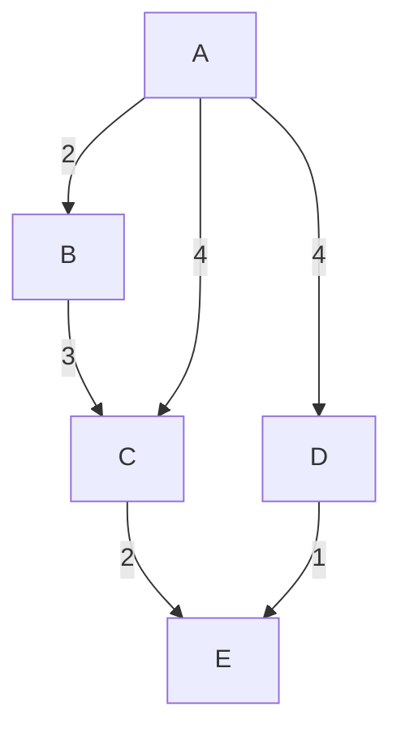

# Grafo ponderado

Un grafo ponderado es una tripla $G(V,E,w)$ donde $w$ es una función que asigna un peso real a cada una de las aristas.

## Peso de un camino en un grafo ponderado

Dado un camino $p = \{v_0,v_1,\ldots,v_k\}$, el peso del camino $p$ es:

$$
w(p) = \sum  \limits_{i=1}^{k} w(v_{i-1},v_i)
$$

Por ejemplo:

Algunos caminos desde A hasta E son:

1. A → B → C → E = 2 + 3 + 2 = 7
2. A → D → E = 4 + 1 = 5

# Distancia

La distancia más corta de $u$ a $v$ se define como:

$$
\delta(u,v) = \begin{cases}
	\min \{w(p) \mid p \text{ es un camino de } u \text{ a } v\} & \text{si existe un camino de } u \text{ a } v \\
	\infty & \text{si no existe tal camino} \\
	-\infty & \text{si existe un camino que contiene un ciclo de peso negativo alcanzable desde } u
\end{cases}
$$

El camino más corto no es necesariamente único; pueden existir varios caminos con el mismo peso mínimo.

Las cuatro variantes principales del problema de caminos más cortos son:

1. **SSSP** (Single-Source Shortest Path): dada una fuente $s$, calcular $\delta(s,v)$ para todos los vértices $v \in V$.
2. **SDSP** (Single-Destination Shortest Path): dado un destino $t$, calcular $\delta(v,t)$ para todos los vértices $v \in V$.
3. **SPSP** (Single-Pair Shortest Path): dados un origen $u$ y un destino $v$, calcular $\delta(u,v)$.
4. **APSP** (All-Pairs Shortest Path): calcular $\delta(u,v)$ para todos los pares de vértices $u, v \in V$.

# Propiedad de subestructura óptima

Todo camino más corto contiene subcaminos que también son óptimos. Formalmente, si un camino más corto de $u$ a $v$ pasa por vértices intermedios $i$ y $j$, entonces el subcamino de $i$ a $j$ también es un camino más corto entre $i$ y $j$. Si no lo fuera, podríamos reemplazarlo por un camino más corto, obteniendo un camino total de menor peso, lo cual contradice la optimalidad del camino original.

# Ciclos negativos

Un camino más corto **nunca** contiene un ciclo de peso positivo, ya que eliminarlo daría un camino de menor peso. Sin embargo, un camino más corto **puede** contener un ciclo de peso cero, pues eliminarlo no cambia el peso total.

Si en el grafo no hay ciclos de peso negativo alcanzables desde la fuente, entonces para todo vértice $v$ alcanzable desde $s$ existe un camino más corto $s \leadsto v$ que es simple (no repite vértices) y tiene a lo sumo $|V| - 1$ aristas.

**Observación importante:** La presencia de un ciclo de peso negativo alcanzable desde la fuente hace que la distancia $\delta(s,v)$ para los vértices alcanzables a través de ese ciclo sea $-\infty$, ya que se puede disminuir arbitrariamente el peso del camino dando vueltas al ciclo.

---

## Tabla de resumen

Concepto | Descripción | Observaciones |
| --- | --- | --- |
Grafo ponderado | Tripla $G(V,E,w)$ donde $w: E \to \mathbb{R}$ asigna un peso a cada arista. | Base para modelar problemas con costos, distancias, etc. |
Peso de un camino | Suma de los pesos de las aristas que lo componen: $w(p)=\sum_{i=1}^{k} w(v_{i-1},v_i)$. | Definición fundamental para comparar caminos. |
Distancia más corta ($\delta(u,v)$) | Mínimo peso entre todos los caminos de $u$ a $v$. Puede ser finita, $\infty$ (inaccesible) o $-\infty$ (ciclo negativo alcanzable). | Objetivo central de los algoritmos de caminos más cortos. |
SSSP | Calcular $\delta(s,v)$ para todo $v$ desde una fuente única $s$. | Algoritmos clásicos: Dijkstra (sin pesos negativos), Bellman‑Ford (admite pesos negativos, detecta ciclos negativos). |
SDSP | Calcular $\delta(v,t)$ para todo $v$ hacia un destino único $t$. | En grafos no dirigidos es equivalente a SSSP con fuente $t$. En dirigidos puede requerir inversión del grafo. |
SPSP | Calcular $\delta(u,v)$ para un par específico. | Puede resolverse como caso particular de SSSP o APSP. |
APSP | Calcular $\delta(u,v)$ para todos los pares $u,v$. | Algoritmos: Floyd‑Warshall, Johnson, múltiples ejecuciones de SSSP. |
Subestructura óptima | Un camino más corto contiene subcaminos más cortos entre sus vértices intermedios. | Propiedad clave que permite el diseño de algoritmos dinámicos y greedy. |
Ciclos negativos | Ciclos cuyo peso total es negativo. Si son alcanzables desde la fuente, hacen que $\delta(s,v) = -\infty$ para algunos vértices. | La detección de ciclos negativos es un subproblema importante (ej. Bellman‑Ford). |
Cota de longitud | Sin ciclos negativos, existe un camino más corto simple con $\leq |V|-1$ aristas. | Justifica que algoritmos como Bellman‑Ford necesiten a lo sumo $|V|-1$ iteraciones. |

**Comentarios adicionales:**

- La elección del algoritmo depende crucialmente de la presencia de pesos negativos. Dijkstra es más eficiente ($O((V+E)\log V)$ con cola de prioridad) pero no funciona con aristas negativas; Bellman‑Ford ($O(VE)$) es más general pero más lento.
- En muchos problemas prácticos (como redes de rutas), los pesos son no negativos, por lo que Dijkstra es la opción preferida.
- La propiedad de subestructura óptima es la base de la ecuación de Bellman, utilizada en programación dinámica para caminos más cortos.
- Para grafos densos, Floyd‑Warshall ($O(V^3)$) puede ser una buena opción para APSP, especialmente si su implementación sencilla es una ventaja.
- La detección de ciclos negativos tiene aplicaciones en finanzas (detección de oportunidades de arbitraje), análisis de redes y verificación de sistemas.