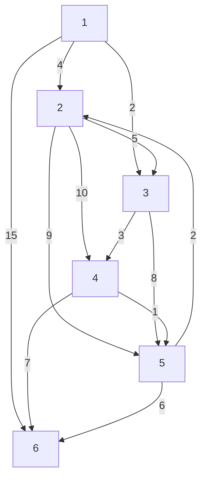

# Algoritmo de Floyd‑Warshall

Matriz de adyacencia con pesos:

1. Es $w(i,j)$ si hay una arista entre $i$ y $j$.
2. $\infty$ si no hay una arista entre $i$ y $j$.
3. 0 si $i = j$ (el mismo vértice).

La matriz de adyacencia es la matriz de conectividad que representa las distancias más cortas entre cada par de vértices **sin vértices intermedios**.

**No se admiten ciclos negativos.** Si existe un ciclo negativo, entonces $\delta(i,j) = -\infty$ para algunos $i,j \in V$.

Floyd‑Warshall detecta ciclos negativos analizando los elementos de la diagonal de la matriz final. Si algún elemento de la diagonal es negativo, entonces hay un ciclo negativo y la distancia calculada por el algoritmo no es correcta (sería $-\infty$).

## Definición recursiva

Sea $d_{ij}^{(k)}$ el peso del camino más corto desde $i$ hasta $j$ cuyos vértices intermedios son un subconjunto de $\{1,2,\dots ,k\}$.

1. Para $k = 0$ no hay intermediarios permitidos, entonces $d_{ij}^{(0)}$ es la matriz de adyacencia original.
2. Para $k = n$ (todos los vértices permitidos) se tiene $d_{ij}^{(n)} = \delta(i,j)$ (la distancia más corta verdadera).

## Cómo trabaja el algoritmo

Sea $p$ un camino más corto entre $i$ y $j$ con vértices intermedios en $\{1,\dots ,k\}$.

1. Si el vértice $k$ **no** está en el camino, entonces $d_{ij}^{(k)} = d_{ij}^{(k-1)}$.
2. Si el vértice $k$ **sí** está en el camino, entonces el camino se puede dividir en $i \rightsquigarrow k$ y $k \rightsquigarrow j$, ambos con vértices intermedios en $\{1,\dots ,k-1\}$. Por tanto,

    $$
    d_{ij}^{(k)} = d_{ik}^{(k-1)} + d_{kj}^{(k-1)}.
    $$

Combinando ambos casos obtenemos la **recurrencia de Floyd‑Warshall**:

$$
d_{ij}^{(k)} = \min\Bigl(d_{ij}^{(k-1)},\; d_{ik}^{(k-1)} + d_{kj}^{(k-1)}\Bigr).
$$

Es decir, en cada paso $k$ se elige el mínimo entre el camino que no usa el vértice $k$ y el camino que sí lo usa.

Esta recurrencia permite trabajar con una sola matriz que se actualiza *in‑place*, con lo cual la **complejidad espacial** es $O(n^2)$. La **complejidad temporal** es $O(n^3)$ porque se realizan tres bucles anidados sobre los $n$ vértices.

## Ejemplo (esquema paso a paso)

Dado que el usuario solicita un ejemplo con 6 vértices y 12 aristas, se presenta a continuación un esquema de cómo se desarrollaría el algoritmo. En la práctica, los pesos de las aristas deben ser proporcionados en una matriz de adyacencia inicial $D^{(0)}$.

1. **Inicialización**: Construir $D^{(0)}$ con los pesos directos, $\infty$ donde no hay arista y 0 en la diagonal.
2. **Iterar $k = 1$ hasta $n$**:

    - Para cada par $(i,j)$ calcular:

        $$
        D[i][j] = \min\bigl(D[i][j],\; D[i][k] + D[k][j]\bigr)
        $$

        (usando los valores de la iteración anterior).

3. **Detección de ciclos negativos**: Al final, si algún elemento $D[i][i] < 0$, existe un ciclo negativo accesible desde $i$.


# Algoritmo de Floyd‑Warshall

Matriz de adyacencia con pesos:

1. Es $w(i,j)$ si hay una arista entre $i$ y $j$.
2. $\infty$ si no hay una arista entre $i$ y $j$.
3. 0 si $i = j$ (el mismo vértice).

La matriz de adyacencia es la matriz de conectividad que representa las distancias más cortas entre cada par de vértices **sin vértices intermedios**.

**No se admiten ciclos negativos.** Si existe un ciclo negativo, entonces $\delta(i,j) = -\infty$ para algunos $i,j \in V$.

Floyd‑Warshall detecta ciclos negativos analizando los elementos de la diagonal de la matriz final. Si algún elemento de la diagonal es negativo, entonces hay un ciclo negativo y la distancia calculada por el algoritmo no es correcta (sería $-\infty$).

## Definición recursiva

Sea $d_{ij}^{(k)}$ el peso del camino más corto desde $i$ hasta $j$ cuyos vértices intermedios son un subconjunto de $\{1,2,\dots ,k\}$.

1. Para $k = 0$ no hay intermediarios permitidos, entonces $d_{ij}^{(0)}$ es la matriz de adyacencia original.
2. Para $k = n$ (todos los vértices permitidos) se tiene $d_{ij}^{(n)} = \delta(i,j)$ (la distancia más corta verdadera).

## Cómo trabaja el algoritmo

Sea $p$ un camino más corto entre $i$ y $j$ con vértices intermedios en $\{1,\dots ,k\}$.

1. Si el vértice $k$ **no** está en el camino, entonces $d_{ij}^{(k)} = d_{ij}^{(k-1)}$.
2. Si el vértice $k$ **sí** está en el camino, entonces el camino se puede dividir en $i \rightsquigarrow k$ y $k \rightsquigarrow j$, ambos con vértices intermedios en $\{1,\dots ,k-1\}$. Por tanto,

    $$
    d_{ij}^{(k)} = d_{ik}^{(k-1)} + d_{kj}^{(k-1)}.
    $$

Combinando ambos casos obtenemos la **recurrencia de Floyd‑Warshall**:

$$
d_{ij}^{(k)} = \min\Bigl(d_{ij}^{(k-1)},\; d_{ik}^{(k-1)} + d_{kj}^{(k-1)}\Bigr).
$$

Es decir, en cada paso $k$ se elige el mínimo entre el camino que no usa el vértice $k$ y el camino que sí lo usa.

Esta recurrencia permite trabajar con una sola matriz que se actualiza *in‑place*, con lo cual la **complejidad espacial** es $O(n^2)$. La **complejidad temporal** es $O(n^3)$ porque se realizan tres bucles anidados sobre los $n$ vértices.

## Ejemplo paso a paso con 6 vértices y 12 aristas

Se define un grafo dirigido ponderado sin ciclos negativos con vértices $V=\{1,2,3,4,5,6\}$ y las siguientes 12 aristas:

```
1→2: 4
1→3: 2
2→3: 5
2→4: 10
3→4: 3
3→5: 8
4→5: 1
4→6: 7
5→6: 6
1→6: 15
2→5: 9
5→2: 2
```


ennnnnnnnnnnnnnnnnnnnnnnnnnnnnnnnnnnnnnnnnnnnnnnnnnnnnnnnnnnnnnnnnnnnnnnnnnnnnnnnnnnnnnnnnnnnnnnnnnnnnnnnnnnnnnnnnnnnnnnnnnnnnnnnnnnnnnnnnnnnnnnnnnve
**Matriz de adyacencia inicial $D^{(0)}$** (se usa $\infty$ para indicar que no hay arista directa):

$$
\begin{array}{c|cccccc}
 & 1 & 2 & 3 & 4 & 5 & 6 \\
\hline
1 & 0 & 4 & 2 & \infty & \infty & 15 \\
2 & \infty & 0 & 5 & 10 & 9 & \infty \\
3 & \infty & \infty & 0 & 3 & 8 & \infty \\
4 & \infty & \infty & \infty & 0 & 1 & 7 \\
5 & \infty & 2 & \infty & \infty & 0 & 6 \\
6 & \infty & \infty & \infty & \infty & \infty & 0 \\
\end{array}
$$

Aplicamos el algoritmo iterando $k=1$ hasta $6$. En cada iteración, para todo par $(i,j)$ se calcula:

$$
D[i][j] \leftarrow \min\bigl(D[i][j],\; D[i][k] + D[k][j]\bigr).
$$

Aquí $D[i][k]$ es el valor actual de la distancia de $i$ a $k$, y $D[k][j]$ el de $k$ a $j$.

---

### Iteración $k=1$ (vértice 1 como intermediario)

El vértice 1 no tiene aristas entrantes (excepto desde sí mismo), por lo que no se produce ninguna actualización.  
$D^{(1)} = D^{(0)}$.

---

### Iteración $k=2$ (vértice 2 como intermediario)

Se examinan todos los pares $(i,j)$. Las actualizaciones relevantes son:

- Para $(i,j)=(1,4)$:  
  $D[1][2] + D[2][4] = 4 + 10 = 14$ (que es menor que $\infty$).  
  $\Rightarrow D[1][4] \leftarrow 14$.

- Para $(1,5)$:  
  $D[1][2] + D[2][5] = 4 + 9 = 13$ (menor que $\infty$).  
  $\Rightarrow D[1][5] \leftarrow 13$.

- Para $(5,3)$:  
  $D[5][2] + D[2][3] = 2 + 5 = 7$ (menor que $\infty$).  
  $\Rightarrow D[5][3] \leftarrow 7$.

- Para $(5,4)$:  
  $D[5][2] + D[2][4] = 2 + 10 = 12$ (menor que $\infty$).  
  $\Rightarrow D[5][4] \leftarrow 12$.

La matriz después de $k=2$ es $D^{(2)}$:

$$
\begin{array}{c|cccccc}
 & 1 & 2 & 3 & 4 & 5 & 6 \\
\hline
1 & 0 & 4 & 2 & 14 & 13 & 15 \\
2 & \infty & 0 & 5 & 10 & 9 & \infty \\
3 & \infty & \infty & 0 & 3 & 8 & \infty \\
4 & \infty & \infty & \infty & 0 & 1 & 7 \\
5 & \infty & 2 & 7 & 12 & 0 & 6 \\
6 & \infty & \infty & \infty & \infty & \infty & 0 \\
\end{array}
$$

---

### Iteración $k=3$ (vértice 3 como intermediario)

Actualizaciones clave:

- $(1,4)$: $D[1][3] + D[3][4] = 2 + 3 = 5$ (menor que 14). $\Rightarrow D[1][4] \leftarrow 5$.
- $(1,5)$: $D[1][3] + D[3][5] = 2 + 8 = 10$ (menor que 13). $\Rightarrow D[1][5] \leftarrow 10$.
- $(2,4)$: $D[2][3] + D[3][4] = 5 + 3 = 8$ (menor que 10). $\Rightarrow D[2][4] \leftarrow 8$.
- $(5,4)$: $D[5][3] + D[3][4] = 7 + 3 = 10$ (menor que 12). $\Rightarrow D[5][4] \leftarrow 10$.

Matriz $D^{(3)}$:

$$
\begin{array}{c|cccccc}
 & 1 & 2 & 3 & 4 & 5 & 6 \\
\hline
1 & 0 & 4 & 2 & 5 & 10 & 15 \\
2 & \infty & 0 & 5 & 8 & 9 & \infty \\
3 & \infty & \infty & 0 & 3 & 8 & \infty \\
4 & \infty & \infty & \infty & 0 & 1 & 7 \\
5 & \infty & 2 & 7 & 10 & 0 & 6 \\
6 & \infty & \infty & \infty & \infty & \infty & 0 \\
\end{array}
$$

---

### Iteración $k=4$ (vértice 4 como intermediario)

Actualizaciones:

- $(1,5)$: $D[1][4] + D[4][5] = 5 + 1 = 6$ (menor que 10). $\Rightarrow D[1][5] \leftarrow 6$.
- $(1,6)$: $D[1][4] + D[4][6] = 5 + 7 = 12$ (menor que 15). $\Rightarrow D[1][6] \leftarrow 12$.
- $(2,6)$: $D[2][4] + D[4][6] = 8 + 7 = 15$ (menor que $\infty$). $\Rightarrow D[2][6] \leftarrow 15$.
- $(3,5)$: $D[3][4] + D[4][5] = 3 + 1 = 4$ (menor que 8). $\Rightarrow D[3][5] \leftarrow 4$.
- $(3,6)$: $D[3][4] + D[4][6] = 3 + 7 = 10$ (menor que $\infty$). $\Rightarrow D[3][6] \leftarrow 10$.

Matriz $D^{(4)}$:

$$
\begin{array}{c|cccccc}
 & 1 & 2 & 3 & 4 & 5 & 6 \\
\hline
1 & 0 & 4 & 2 & 5 & 6 & 12 \\
2 & \infty & 0 & 5 & 8 & 9 & 15 \\
3 & \infty & \infty & 0 & 3 & 4 & 10 \\
4 & \infty & \infty & \infty & 0 & 1 & 7 \\
5 & \infty & 2 & 7 & 10 & 0 & 6 \\
6 & \infty & \infty & \infty & \infty & \infty & 0 \\
\end{array}
$$

---

### Iteración $k=5$ (vértice 5 como intermediario)

Actualizaciones:

- $(3,2)$: $D[3][5] + D[5][2] = 4 + 2 = 6$ (menor que $\infty$). $\Rightarrow D[3][2] \leftarrow 6$.
- $(4,2)$: $D[4][5] + D[5][2] = 1 + 2 = 3$ (menor que $\infty$). $\Rightarrow D[4][2] \leftarrow 3$.
- $(4,3)$: $D[4][5] + D[5][3] = 1 + 7 = 8$ (menor que $\infty$). $\Rightarrow D[4][3] \leftarrow 8$.

Matriz $D^{(5)}$:

$$
\begin{array}{c|cccccc}
 & 1 & 2 & 3 & 4 & 5 & 6 \\
\hline
1 & 0 & 4 & 2 & 5 & 6 & 12 \\
2 & \infty & 0 & 5 & 8 & 9 & 15 \\
3 & \infty & 6 & 0 & 3 & 4 & 10 \\
4 & \infty & 3 & 8 & 0 & 1 & 7 \\
5 & \infty & 2 & 7 & 10 & 0 & 6 \\
6 & \infty & \infty & \infty & \infty & \infty & 0 \\
\end{array}
$$

---

### Iteración $k=6$ (vértice 6 como intermediario)

El vértice 6 no tiene aristas salientes hacia otros vértices (excepto a sí mismo), por lo que no se producen nuevas mejoras.  
$D^{(6)} = D^{(5)}$.

---

### Matriz final de distancias más cortas

$$
D^{(6)} = 
\begin{array}{c|cccccc}
 & 1 & 2 & 3 & 4 & 5 & 6 \\
\hline
1 & 0 & 4 & 2 & 5 & 6 & 12 \\
2 & \infty & 0 & 5 & 8 & 9 & 15 \\
3 & \infty & 6 & 0 & 3 & 4 & 10 \\
4 & \infty & 3 & 8 & 0 & 1 & 7 \\
5 & \infty & 2 & 7 & 10 & 0 & 6 \\
6 & \infty & \infty & \infty & \infty & \infty & 0 \\
\end{array}
$$

Todos los elementos de la diagonal son $0$, por lo que no hay ciclos negativos. La matriz $D^{(6)}$ contiene las distancias más cortas entre cada par de vértices.

---

## Tabla resumen de conceptos

| Concepto | Descripción |
|----------|-------------|
| Matriz de adyacencia inicial ($D^{(0)}$) | Contiene los pesos directos entre vértices; $\infty$ si no hay arista, 0 en la diagonal. |
| $d_{ij}^{(k)}$ | Peso del camino más corto de $i$ a $j$ usando solo vértices intermedios $\{1,\dots ,k\}$. |
| Recurrencia de Floyd‑Warshall | $d_{ij}^{(k)} = \min(d_{ij}^{(k-1)},\; d_{ik}^{(k-1)} + d_{kj}^{(k-1)})$. |
| Complejidad temporal | $O(n^3)$ debido a los tres bucles anidados sobre los $n$ vértices. |
| Complejidad espacial | $O(n^2)$ porque se trabaja con una sola matriz de $n \times n$. |
| Ciclos negativos | Si en la matriz final algún elemento de la diagonal es negativo, existe al menos un ciclo negativo y las distancias calculadas no son válidas. |
| Inicialización de la diagonal | Se pone 0 para reflejar que la distancia de un vértice a sí mismo es 0 (sin ciclos negativos). |
| Actualización *in‑place* | La misma matriz se sobreescribe en cada iteración $k$, usando siempre los valores más recientes de la iteración anterior. |


- El algoritmo de Floyd‑Warshall es **óptimo para grafos densos** donde el número de aristas es cercano a $n^2$, ya que su complejidad cúbica se justifica.
- A diferencia de Dijkstra, Floyd‑Warshall **maneja aristas con peso negativo**, siempre que no existan ciclos negativos alcanzables.
- Es un algoritmo de **programación dinámica** clásico que explora sistemáticamente todos los posibles vértices intermedios.
- Una aplicación común es el cálculo de la **cerradura transitiva** de un grafo (modificando la operación de mínimo por un OR lógico).
- Para reconstruir los caminos más cortos (no solo las distancias) se suele mantener una matriz de predecesores que se actualiza junto con la matriz de distancias.
- En la práctica, la constante oculta en la notación $O(n^3)$ es pequeña, lo que hace que el algoritmo sea eficiente en implementaciones reales para $n$ moderado (varios cientos de vértices).
## Tabla resumen de conceptos

| Concepto | Descripción |
|----------|-------------|
| Matriz de adyacencia inicial ($D^{(0)}$) | Contiene los pesos directos entre vértices; $\infty$ si no hay arista, 0 en la diagonal. |
| $d_{ij}^{(k)}$ | Peso del camino más corto de $i$ a $j$ usando solo vértices intermedios $\{1,\dots ,k\}$. |
| Recurrencia de Floyd‑Warshall | $d_{ij}^{(k)} = \min(d_{ij}^{(k-1)},\; d_{ik}^{(k-1)} + d_{kj}^{(k-1)})$. |
| Complejidad temporal | $O(n^3)$ debido a los tres bucles anidados sobre los $n$ vértices. |
| Complejidad espacial | $O(n^2)$ porque se trabaja con una sola matriz de $n \times n$. |
| Ciclos negativos | Si en la matriz final algún elemento de la diagonal es negativo, existe al menos un ciclo negativo y las distancias calculadas no son válidas. |
| Inicialización de la diagonal | Se pone 0 para reflejar que la distancia de un vértice a sí mismo es 0 (sin ciclos negativos). |
| Actualización *in‑place* | La misma matriz se sobreescribe en cada iteración $k$, usando siempre los valores más recientes de la iteración anterior. |

## Comentarios adicionales

- El algoritmo de Floyd‑Warshall es **óptimo para grafos densos** donde el número de aristas es cercano a $n^2$, ya que su complejidad cúbica se justifica.
- A diferencia de Dijkstra, Floyd‑Warshall **maneja aristas con peso negativo**, siempre que no existan ciclos negativos alcanzables.
- Es un algoritmo de **programación dinámica** clásico que explora sistemáticamente todos los posibles vértices intermedios.
- Una aplicación común es el cálculo de la **cerradura transitiva** de un grafo (modificando la operación de mínimo por un OR lógico).
- Para reconstruir los caminos más cortos (no solo las distancias) se suele mantener una matriz de predecesores que se actualiza junto con la matriz de distancias.
- En la práctica, la constante oculta en la notación $O(n^3)$ es pequeña, lo que hace que el algoritmo sea eficiente en implementaciones reales para $n$ moderado (varios cientos de vértices).