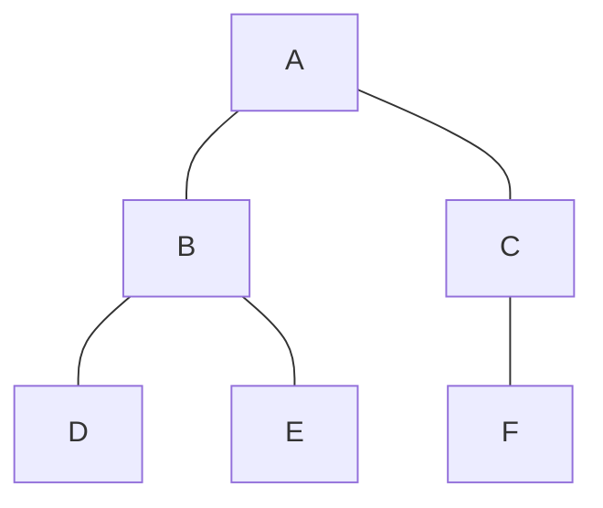
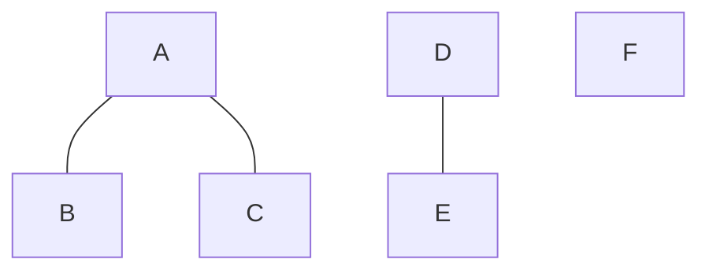
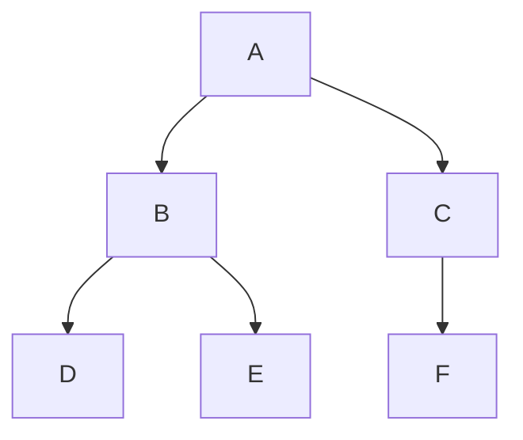
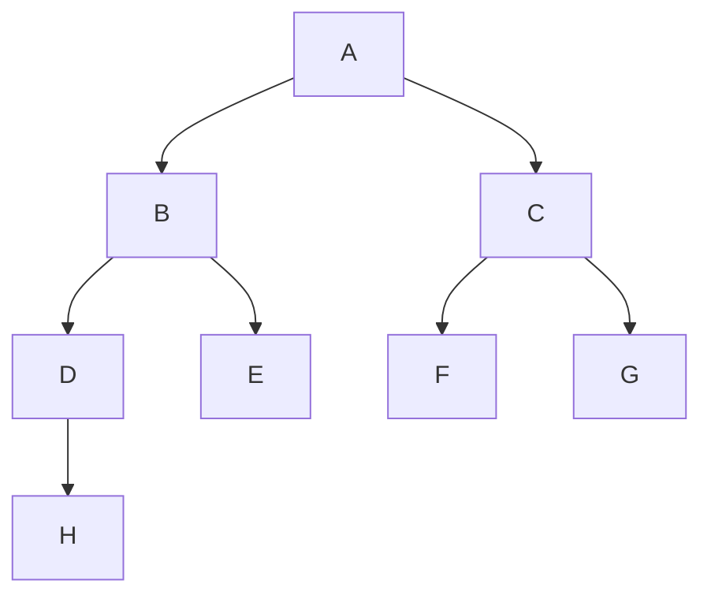
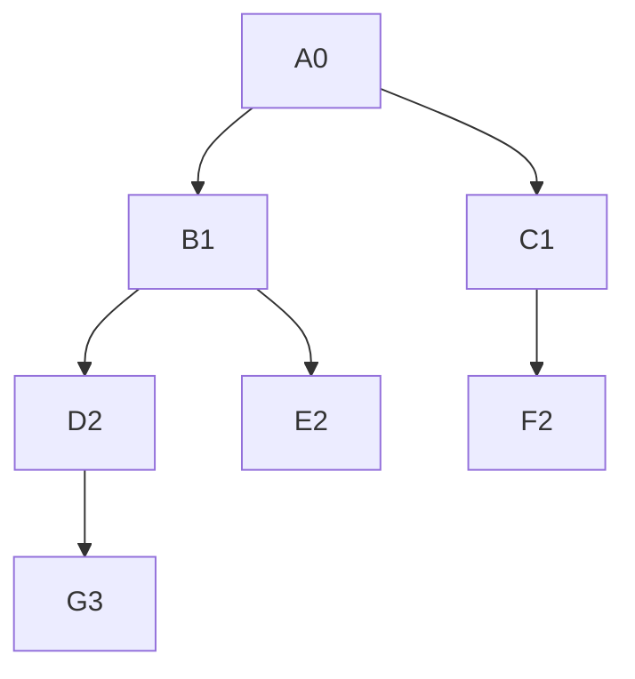

# Definiciones

- **Conexión mínima**: Al eliminar una arista cualquiera, el grafo se desconecta.
- **Recorridos**: DFS y BFS siempre producen el mismo resultado en árboles.
- **Utilidad**: Muchos algoritmos trabajan sobre esta estructura (divide y vencerás) y la complejidad de estos algoritmos depende de relaciones de recurrencia que podemos resolver usando árboles.

# Árbol libre

Es un grafo no dirigido, conexo y acíclico.

No existen circuitos ni ciclos: un ciclo es un camino simple que va desde un vértice a sí mismo (sin repetir aristas ni vértices).

**Ejemplo**: El grafo anterior es un árbol libre con 6 vértices y 5 aristas (|E| = |V| - 1 = 5). Es conexo y acíclico.

## Bosque

Es un grafo no dirigido, acíclico y no necesariamente conexo: cada componente conexa es un árbol.

**Ejemplo**: El grafo anterior tiene tres componentes: un árbol con vértices {A,B,C}, otro árbol con {D,E} y un vértice aislado {F} (que también es un árbol trivial). Esto constituye un bosque.

# Propiedades

Sea G un grafo no dirigido. Las siguientes afirmaciones son equivalentes (definen un árbol libre):

1. **G es un árbol libre.**
2. Cualquier par de vértices está conectado por un camino simple único.
3. G es conexo, pero al eliminar una arista se desconecta.
4. G es conexo y |E| = |V| - 1.
5. G es acíclico y |E| = |V| - 1.
6. G es acíclico y al agregar una arista aparece un ciclo.

**Ejemplo**: La propiedad 3 se ilustra eliminando cualquier arista del árbol anterior. Si se elimina la arista A–B, el grafo se desconecta en dos componentes.

# Árbol con raíz

Es un árbol libre T al cual hemos seleccionado un vértice como raíz. Esto lo transforma en una estructura jerárquica que parte desde la raíz como fuente hacia los demás.

La elección de la raíz es arbitraria; de un árbol libre pueden obtenerse muchos árboles con raíz diferentes.

**Ejemplo**: Partiendo del árbol libre anterior, elegimos A como raíz. Se definen relaciones jerárquicas: A es padre de B y C; B es padre de D y E; C es padre de F.

# Terminología

Sea u, v, r vértices de un árbol con raíz r, y supongamos que hay un camino desde r hasta v que pasa por u, con una arista (u, v).

1. **Padre e hijo**: u es el padre de v, denotado P(v), y v es hijo de u.
2. **Raíz**: La raíz r no tiene padre: P(r) = NIL.
3. **Hermanos**: Vértices que comparten el mismo padre.
4. **Tíos**: Vértices hermanos del padre de v.
5. **Ancestros**: Vértices en el camino desde r hasta v (incluyendo r y v). v es descendiente de cada ancestro.
6. **Ancestro/descendiente propio**: No incluye al mismo vértice.
7. **Hoja**: Vértice sin hijos.
8. **Vértice interno o nodo interno**: Vértice con al menos un hijo.
9. **Subárbol**: Al elegir un vértice cualquiera, separarlo del árbol y definirlo como raíz, se obtiene un subárbol.

**Ejemplo**: En este árbol con raíz A:
- A es raíz, no tiene padre.
- B y C son hijos de A, por lo tanto hermanos.
- D, E son hijos de B; F, G son hijos de C.
- D tiene como tío a C (hermano del padre B).
- Ancestros de H: A, B, D. Descendientes de B: D, E, H.
- H es hoja (sin hijos); B es vértice interno (tiene hijos).
- Si elegimos B como raíz del subárbol, obtenemos el subárbol con vértices {B, D, E, H}.

# Altura y profundidad

La **profundidad** de un vértice v, denotada d(v), es el número de aristas del camino desde la raíz hasta v. La profundidad de la raíz es 0.

La **altura** de un árbol es la mayor profundidad que tenga algún vértice (es decir, la profundidad máxima).

**Ejemplo**: En este árbol con raíz A:
- Profundidad de A: 0
- Profundidad de B y C: 1
- Profundidad de D, E, F: 2
- Profundidad de G: 3
- Altura del árbol: 3

---

# Tabla resumen

| Concepto | Definición | Ejemplo (diagrama) |
|----------|------------|---------------------|
| Árbol libre | Grafo no dirigido, conexo y acíclico. | [[árbol libre]] |
| Bosque | Grafo no dirigido acíclico, no necesariamente conexo; cada componente es un árbol. | [[bosque]] |
| Propiedades | Conjunto de 6 condiciones equivalentes que caracterizan un árbol libre. | [[propiedades]] |
| Árbol con raíz | Árbol libre con un vértice seleccionado como raíz, creando jerarquía. | [[árbol con raíz]] |
| Padre/Hijo | Relación directa en un árbol con raíz: u padre de v si (u,v) es arista en el camino desde la raíz. | [[terminología]] |
| Hermanos | Vértices con el mismo padre. | [[terminología]] |
| Tíos | Hermanos del padre de un vértice. | [[terminología]] |
| Ancestros/Descendientes | Vértices en el camino raíz–vértice; ancestro propio excluye a sí mismo. | [[terminología]] |
| Hoja | Vértice sin hijos. | [[terminología]] |
| Vértice interno | Vértice con al menos un hijo. | [[terminología]] |
| Subárbol | Árbol obtenido al tomar un vértice como raíz y removerlo del árbol original. | [[subárbol]] |
| Profundidad | Número de aristas desde la raíz hasta el vértice. | [[altura y profundidad]] |
| Altura | Máxima profundidad de cualquier vértice en el árbol. | [[altura y profundidad]] |

**Comentarios adicionales**:
- Los árboles son fundamentales en ciencias de la computación: estructuran datos jerárquicos, expresiones, decisiones, etc.
- El concepto de **árbol libre** no tiene raíz, mientras que el **árbol con raíz** es la versión orientada para representar relaciones padre–hijo.
- La propiedad de **|E| = |V| – 1** es la más usada para verificar si un grafo conexo es un árbol.
- En algoritmos, la altura determina la complejidad de operaciones en árboles binarios de búsqueda, heaps, etc.
- Recuerda que un árbol puede representarse recursivamente: un árbol es un nodo raíz con una lista de subárboles (sus hijos).