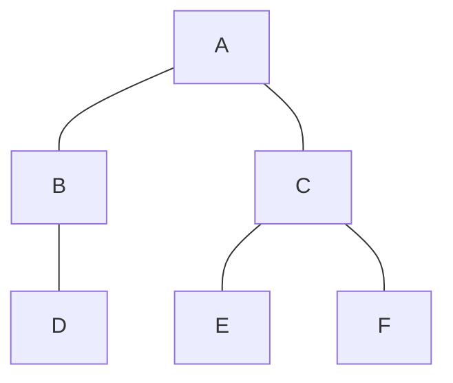
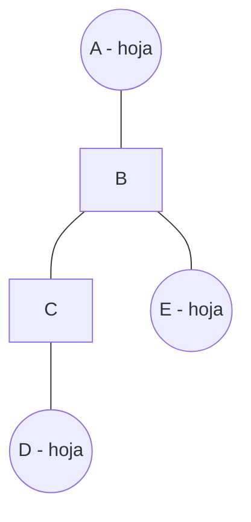
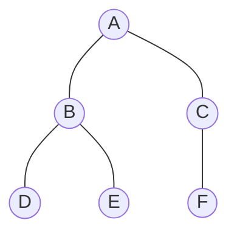
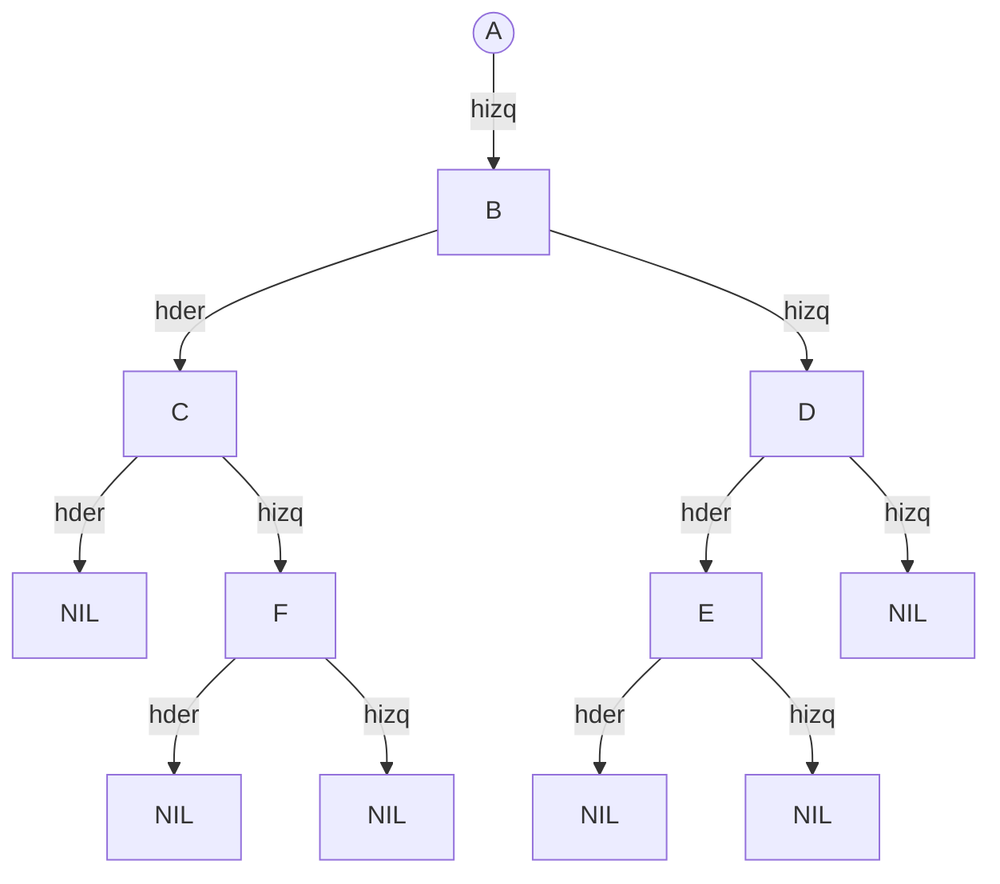

# Propiedades y representación de árboles

## Propiedades

**Teorema 1:** Todo árbol libre $T$ con $|V|$ vértices tiene $|V| - 1$ aristas.

**Demostración por inducción sobre $|V|$:**

- **Paso base:** $|V| = 1$ (un solo vértice). No hay aristas, se cumple $|E| = 0 = 1 - 1$.

- **Paso inductivo:** Suponga que todo árbol con $k$ vértices tiene $k-1$ aristas. Considere un árbol $T$ con $k+1$ vértices. Por el teorema de que todo árbol con al menos 2 vértices tiene al menos dos hojas (Teorema 2), $T$ posee una hoja $v$. Elimine $v$ y su arista incidente. El grafo resultante $T'$ tiene $|V'| = k$ vértices y es un árbol (quitar una hoja conserva la conexidad y aciclicidad). Por hipótesis inductiva, $|E'| = k - 1$. Al reinsertar $v$ y su arista, obtenemos $|E| = (k-1) + 1 = k = (k+1)-1$.

**Ejemplo gráfico del Teorema 1:**

Árbol con $|V|=6$ y $|E|=5$ (se cumple $|E| = |V|-1$).

---

**Teorema 2:** Todo árbol libre con $n \geq 2$ vértices tiene al menos dos hojas.

**Demostración (esquema):** Considere un camino simple maximal $v_1, v_2, \dots, v_k$. Los extremos $v_1$ y $v_k$ deben ser hojas; si no, podrían extenderse, generando una contradicción por aciclicidad.

**Ejemplo gráfico del Teorema 2:**

En este árbol con 5 vértices, las hojas son A, D y E (al menos dos hojas).

---

## Representación computacional

### Requisitos comunes

1. Obtener padre de un vértice.
2. Recorrer la lista de hijos de un vértice.
3. Consultar si un vértice es hoja.
4. Calcular profundidad (distancia a la raíz).

### Arreglo de padres

Para todo vértice $v \in V$ se almacena $P[v]$, donde $P[r] = \text{NIL}$ para la raíz.

**Propiedades:**
- Memoria: $\Theta(n)$.
- Obtener padre: $O(1)$.
- Subir hasta la raíz: $O(d(v))$ donde $d(v)$ es la profundidad.
- Lista de hijos: no hay acceso directo; recorrer todos los hijos es costosa ($O(n)$ por vértice).
- Útil en algoritmos que trabajan con ancestros o caminos hacia la raíz.

**Ejemplo:** Árbol con raíz A y su arreglo de padres.

| vértice | padre |
|---------|-------|
| A       | NIL   |
| B       | A     |
| C       | A     |
| D       | B     |
| E       | B     |
| F       | C     |

---

### Hijo-izquierdo y hermano-derecho (Left-Child Right-Sibling)

Para todo vértice $v$ se almacenan dos referencias:
- `hizq[v]`: apunta al hijo más a la izquierda de $v$ (primogénito).
- `hder[v]`: apunta al hermano derecho de $v$ (siguiente hijo del mismo padre).

Esta representación transforma un árbol de grado variable en una estructura binaria. Permite recorrer fácilmente la lista de hijos de un nodo a través de los punteros `hizq` (primer hijo) y luego los `hder` sucesivos.

**Propiedades:**
- Memoria: $\Theta(n)$.
- Recorrer hijos de un nodo: $O(\text{grado del nodo})$.
- Obtener el padre no es directo; se necesita una estructura auxiliar si se requiere.

**Ejemplo:** Mismo árbol anterior representado con hijo-izquierdo y hermano-derecho.

**Tabla de punteros:**

| vértice | hizq | hder |
|---------|------|------|
| A       | B    | NIL  |
| B       | D    | C    |
| C       | F    | NIL  |
| D       | NIL  | E    |
| E       | NIL  | NIL  |
| F       | NIL  | NIL  |

---

## Tabla resumen

| Concepto | Descripción | Representación/Ejemplo |
|----------|-------------|------------------------|
| **Teorema 1: |E| = |V|–1** | Todo árbol libre con $n$ vértices tiene $n-1$ aristas. | Diagrama con 6 vértices y 5 aristas. |
| **Teorema 2: al menos dos hojas** | Si $n \ge 2$, existen al menos dos vértices de grado 1. | Diagrama con tres hojas señaladas. |
| **Arreglo de padres** | Arreglo $P[1..n]$ donde $P[v]$ es el padre de $v$ y $P[r]=\text{NIL}$. | Tabla de ejemplo con 6 vértices. |
| **Hijo-izquierdo hermano-derecho** | Cada nodo almacena un puntero al primer hijo y otro al siguiente hermano. | Diagrama de punteros y tabla correspondiente. |

**Comentarios adicionales:**

- La representación por arreglo de padres es simple y eficiente para subir hacia la raíz, pero costosa para listar hijos. Es ideal cuando la operación principal es consultar ancestros.
- La representación hijo-izquierdo hermano-derecho convierte cualquier árbol general en un árbol binario, facilitando recorridos y algoritmos recursivos. Es útil en implementaciones de árboles de búsqueda generalizados.
- Ambas representaciones usan memoria lineal $O(n)$ y son equivalentes en capacidad expresiva.
- Para aplicaciones que requieren acceso rápido a hijos y padres simultáneamente, a veces se combinan ambas estructuras (por ejemplo, guardar también el padre en la representación LCRS).