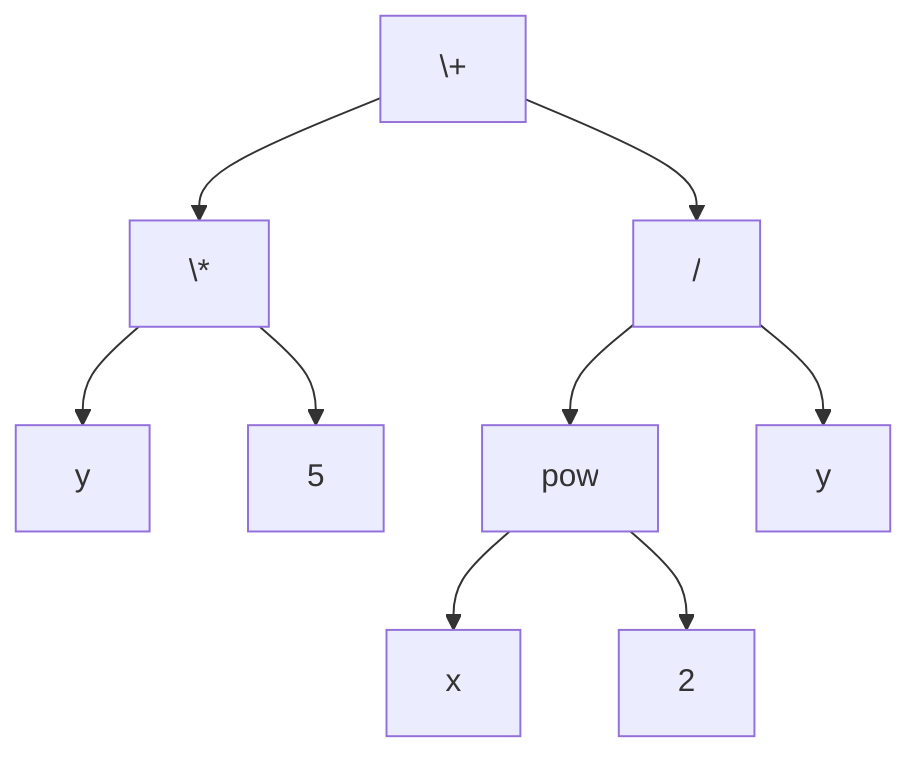

# Expectativas

## Distinguir árbol m-ario, m-ario completo y árbol binario.

Un **árbol m-ario** es aquel en el que cada vértice interno tiene **como máximo** *m* hijos.  
Un **árbol m-ario completo** es aquel en el que **todos** los vértices internos tienen exactamente *m* hijos.  
Un **árbol binario** es el caso particular donde *m = 2*.

## Enunciar y aplicar las cotas fundamentales de hojas y altura en árboles m-arios por inducción estructural.

- **Cota mínima de altura:** *h - 1* (corresponde a un árbol camino, donde cada nodo tiene un solo hijo).
- **Cota máxima de altura:** *log_m(n - 1) + 1*, donde *n* es el número total de vértices.
- **Relación fundamental en árbol m-ario completo:** *n = m·i + 1*, donde *i* es el número de vértices internos.
- **Cota de hojas:** *ℓ ≤ m^h*, donde *ℓ* es el número de hojas y *h* la altura.
- **Cotas para árboles binarios:** *h + 1 ≤ n ≤ 2^{h+1} - 1*.

## Formular la especificación recursiva binaria y distinguir las posiciones izquierda/derecha.

La especificación recursiva de un árbol binario es:

```
[T] = [] | [raíz [T] [T]]
```

Esto significa que un árbol binario puede ser:
- Vacío: `[]`
- O un nodo raíz con dos subárboles: izquierdo y derecho.

Se representa como una **tripleta** *(valor, izquierdo, derecho)*, donde las posiciones izquierda y derecha están claramente diferenciadas.

## Implementar los recorridos DFS (preorden, inorden, postorden) y BFS (por niveles) sobre un árbol binario.

### Recorridos DFS (Depth-First Search)

1. **Preorden:** raíz, izquierdo, derecho
2. **Inorden:** izquierdo, raíz, derecho
3. **Postorden:** izquierdo, derecho, raíz

```python
# Ejemplo de implementación de recorridos DFS en un árbol binario
class Nodo:
    def __init__(self, valor):
        self.valor = valor
        self.izquierdo = None  # Subárbol izquierdo
        self.derecho = None    # Subárbol derecho

def preorden(nodo):
    """Recorrido preorden: raíz, izquierdo, derecho"""
    if nodo:
        print(nodo.valor, end=" ")  # Visita la raíz
        preorden(nodo.izquierdo)     # Recorre subárbol izquierdo
        preorden(nodo.derecho)       # Recorre subárbol derecho

def inorden(nodo):
    """Recorrido inorden: izquierdo, raíz, derecho"""
    if nodo:
        inorden(nodo.izquierdo)      # Recorre subárbol izquierdo
        print(nodo.valor, end=" ")   # Visita la raíz
        inorden(nodo.derecho)        # Recorre subárbol derecho

def postorden(nodo):
    """Recorrido postorden: izquierdo, derecho, raíz"""
    if nodo:
        postorden(nodo.izquierdo)    # Recorre subárbol izquierdo
        postorden(nodo.derecho)      # Recorre subárbol derecho
        print(nodo.valor, end=" ")   # Visita la raíz
```

### Recorrido BFS (Breadth-First Search) por niveles

```python
from collections import deque

def bfs_por_niveles(raiz):
    """Recorrido por niveles usando una cola explícita"""
    if not raiz:
        return
    cola = deque([raiz])  # Inicializa la cola con la raíz
    while cola:
        nodo = cola.popleft()  # Extrae el primer nodo de la cola
        print(nodo.valor, end=" ")  # Visita el nodo
        if nodo.izquierdo:
            cola.append(nodo.izquierdo)  # Agrega hijo izquierdo a la cola
        if nodo.derecho:
            cola.append(nodo.derecho)    # Agrega hijo derecho a la cola
```

## Reconocer la conexión entre recorridos y notación prefija/infija/postfija (árboles de expresión)

Los árboles de expresión permiten representar expresiones aritméticas donde:
- Los **operadores** están en los nodos internos.
- Los **operandos** están en las hojas.

La conexión directa con los recorridos es:

| Recorrido | Notación | Ejemplo |
|-----------|----------|---------|
| Preorden  | Prefija (polaca) | `+ * y 5 / pow x 2 y` |
| Inorden   | Infija (con paréntesis) | `(y * 5) + (pow(x, 2) / y)` |
| Postorden | Postfija (polaca inversa) | `y 5 * x 2 pow y / +` |



## Tabla resumen de conceptos

| Concepto | Definición | Fórmula/Cota clave |
|----------|------------|-------------------|
| Árbol m-ario | Cada nodo interno tiene máximo *m* hijos | *n = m·i + 1* (completo) |
| Árbol m-ario completo | Todos los nodos internos tienen exactamente *m* hijos | *ℓ ≤ m^h* |
| Árbol binario | Caso particular con *m = 2* | *h + 1 ≤ n ≤ 2^{h+1} - 1* |
| Especificación recursiva | `[T] = [] \| [raíz [T] [T]]` | Tripleta (valor, izq, der) |
| Recorrido preorden | Raíz → Izquierdo → Derecho | Notación prefija |
| Recorrido inorden | Izquierdo → Raíz → Derecho | Notación infija |
| Recorrido postorden | Izquierdo → Derecho → Raíz | Notación postfija |
| Recorrido BFS | Por niveles con cola | Usa estructura FIFO |

**Comentarios adicionales:**
- La **inducción estructural** es la técnica fundamental para demostrar propiedades en árboles, ya que la definición recursiva permite razonar por casos base y paso inductivo.
- Los árboles de expresión son una aplicación directa de los árboles binarios, donde cada operador binario tiene exactamente dos subárboles (operandos).
- La elección del recorrido depende del problema: preorden para copiar estructuras, inorden para obtener secuencias ordenadas en ABB, postorden para liberar memoria, y BFS para encontrar caminos más cortos.