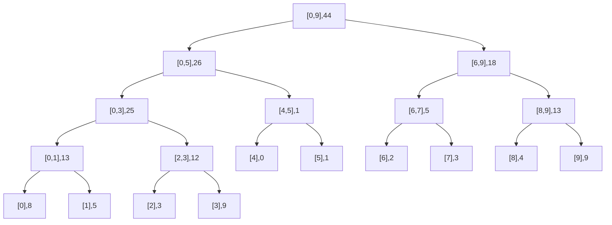

# Árboles de Segmentos

## ¿Qué son?

Es una estructura de datos en forma de árbol que representa una operación aplicada sobre un arreglo. Cada vértice interno representa un segmento del arreglo con una operación asociativa y con elemento neutro (suma, multiplicación, mínimo, máximo, etc.).

## Operación Build (Construcción)

Divide el arreglo en segmentos por mitades y guarda el resultado parcial de la función aplicada al segmento que representa el vértice interno. Por ejemplo, la suma del segmento que representa el vértice interno.

Esto ocupa a lo sumo $4N$ nodos, por lo tanto su complejidad es $\Theta(N)$.

Por ejemplo, para el arreglo:

$[8,5,3,9,0,1,2,3,4,9]$



## Operación Query (Consulta)

Dado un inicio $ql$ y un final $qr$:

1. **Disjunto**: Si el segmento actual no se intersecta con el rango de consulta, retorna el elemento neutro de la operación.
2. **Contenido**: Si el segmento actual está completamente contenido en el rango de consulta $(l \geq ql) \wedge (r \leq qr)$, retorna el valor almacenado en el nodo.
3. **Solapado**: Si el segmento actual se solapa parcialmente con el rango de consulta $(l < ql) \vee (r > qr)$, se recurre sobre el hijo izquierdo y el derecho, y se combinan los resultados con la operación.

### Ejemplo: $q(3,8)$

```
graph TD
	A["[0,9],Solapado"] --> B["[0,5],Solapado"]
	A --> C["[6,9],Solapado"]
	B --> D["[0,3],Solapado"]
	B --> E["[4,5],1"]
	C --> F["[6,7],5"]
	C --> G["[8,9],Solapado"]
	D --> H["[0,1],Disjunto 0"]
	D --> I["[2,3],Solapado"]
	E --> J["[4],---"]
	E --> K["[5],---"]
	F --> L["[6],---"]
	F --> M["[7],---"]
	G --> N["[8],4"]
	G --> O["[9],Disjunto 0"]
	H --> P["[0],---"]
	H --> Q["[1],---"]
	I --> R["[2],Disjunto 0"]
	I --> S["[3],9"]
```

Suma final: $A[4,5] + A[6,7] + 0 + A[3] + 0 + A[8] + 0$
$1 + 5 + 9 + 4 = 19$

Verificación: $[9,0,1,2,3,4] = 19$ OK

## Tabla de Resumen

| Concepto | Descripción | Complejidad |
|----------|-------------|-------------|
| **Árbol de Segmentos** | Estructura de datos en árbol que almacena resultados parciales de una operación asociativa sobre segmentos de un arreglo | Construcción: $\Theta(N)$ |
| **Build** | Construcción recursiva dividiendo el arreglo por mitades y almacenando el resultado de la operación en cada nodo | $\Theta(N)$ |
| **Query** | Consulta de la operación sobre un rango $[ql, qr]$ usando tres casos: disjunto, contenido y solapado | $\Theta(\log N)$ |
| **Update** | Actualización de un elemento del arreglo y propagación del cambio hacia arriba en el árbol | $\Theta(\log N)$ |
| **Elemento Neutro** | Valor que no afecta la operación (0 para suma, 1 para multiplicación, $\infty$ para mínimo, $-\infty$ para máximo) | - |
| **Operación Asociativa** | Propiedad que permite combinar resultados parciales sin importar el orden de agrupación: $(a \circ b) \circ c = a \circ (b \circ c)$ | - |

### Comentarios Adicionales

- Los árboles de segmentos son especialmente útiles para consultas de rango dinámicas, donde el arreglo puede modificarse entre consultas.
- Se pueden implementar con arreglos estáticos de tamaño $4N$ para simplificar la implementación iterativa o recursiva.
- Además de sumas, se pueden usar para calcular mínimos, máximos, productos, GCD, o cualquier operación asociativa con neutro.
- Existen variantes como árboles de segmentos con lazy propagation para actualizaciones de rango, y árboles de segmentos 2D para consultas en matrices.