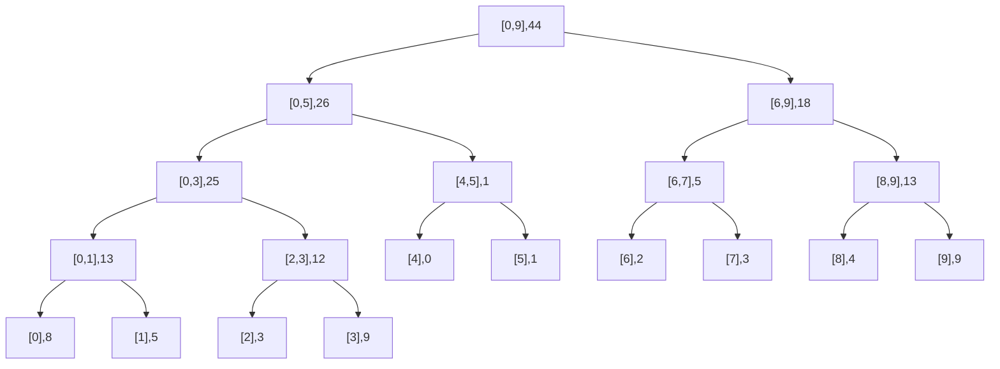
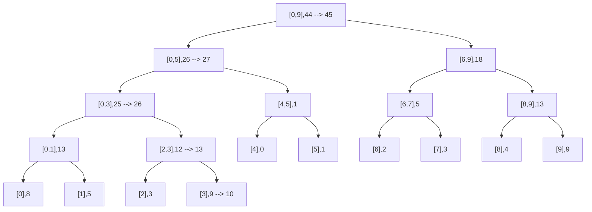
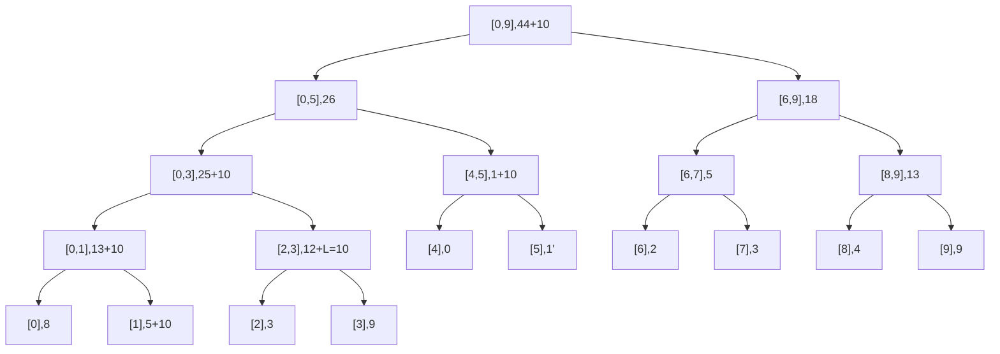

$[8,5,3,9,0,1,2,3,4,9]$

Deseo hacer $A[3] = 10$ mi arreglo queda $[8,5,3,10,0,1,2,3,4,9]$

Inicialmente para $[8,5,3,9,0,1,2,3,4,9]$ el arbol es:

Y ahora con el cambio $[8,5,3,10,0,1,2,3,4,9]$

En la actualizacion vamos a afectar directamente los ancentros de la posición que estamos modificando

# Evaluación perezosa

Tenemos cuando vamos a actualizar un rango, no necesiamente tenemos que actualizar todos los vertices asociados a esa actualización, por ejemplo para este caso, por ejemplo para el arreglo inicial vamos a aplicar update-range(1,4,10) $[8,5,3,9,0,1,2,3,4,9]$ 

En este caso no tocamos las hojas 2 y 3 fdado que quedan con una operacion pendiente L = 10 en el nodo 2 y 3 que esta contenido en el rango 1,4 que actualizamos.

En este caso no propagamos todos los cambios al arbol de segmentos.