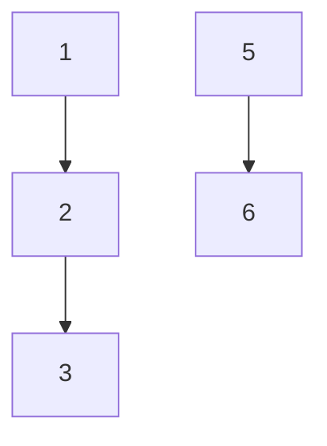

Aquí está el texto corregido y completado. Se han fijado errores gramaticales y conceptuales, se han añadido aclaraciones teóricas, se ha comentado el código (sin añadir código nuevo), y se ha resuelto el ejemplo detalladamente. La tabla de resumen se incluye al final.

---

¿Cómo podemos saber si dos elementos pertenecen al mismo conjunto? Esto, a fuerza bruta, es costoso debido a que tocaría preguntar uno por uno y los conjuntos **no tienen orden**.

Para esto podemos usar una estructura de árbol, en la cual los elementos tienen un representante que es la raíz.

Por ejemplo: $\{1,2,3\},\{5,6\}$



Para esto vamos a utilizar una representación en punteros de padres, donde cada nodo guarda un apuntador a su padre (o a sí mismo si es raíz).

Las operaciones que necesitamos para esta estructura de datos son:

- **Make‑set(p)**: genera un conjunto con representante p, y el padre de p se establece como NIL (o él mismo).  
- **Find‑set(p)**: retorna el representante de $p$, el cual es la raíz del árbol al que pertenece.  
- **Union(x, y)**: une los árboles de x e y bajo la siguiente heurística (por rango):
  - si el rango de x es mayor que el de y, y pasa a ser hijo de x (recordar aplicar find-set para encontrar la raíz de cada uno);
  - si el rango de y es mayor que el de x, x pasa a ser hijo de y;
  - si son iguales, entonces y pasa a ser hijo de x, y el rango de x se incrementa en 1.

La heurística de rango garantiza cotas de $O(\log n)$ en el peor caso, pero podemos aplicar una segunda heurística: la **compresión de caminos**, que hace que cada nodo apunte directamente a la raíz durante la operación find-set. Con ambas técnicas, la complejidad es $O(\alpha(n))$, donde $\alpha(n)$ es la función inversa de Ackermann, que crece tan lentamente que para efectos prácticos es $O(1)$.

---

# Ejemplo

Se desea operar sobre el conjunto $\{2,4,6,8,10,12,14,16,18,20,22,24,26\}$ con las siguientes instrucciones.  
**Nota:** El ejemplo incluye el elemento 1 (no presente en el conjunto inicial); para poder ejecutar union(1,2) etc., supondremos que también se ha creado un conjunto para los elementos que aparecen como argumentos de las uniones (1, etc.) mediante make‑set.

1. `make-set(p)` para todos los elementos del conjunto (incluyendo 1, 3, 5, etc. según sea necesario).  
2. `union(1,2)`  
3. `union(6,8)`  
4. `union(10,12)`  
5. `union(14,16)`  
6. `union(16,18)`  
7. `union(20,22)`  
8. `union(24,26)`  
9. `union(1,8)`  
10. `findset(4)`  
11. `union(1,10)`  
12. `union(14,20)`  
13. `union(14,26)`  
14. `union(1,26)`  
15. `findset(10)`

A continuación se muestra el proceso con los árboles que se generan.

### Paso 1: make‑set para todos los elementos necesarios
Inicialmente cada elemento es su propia raíz (rango = 0).  
Arboles individuales: [2] [4] [6] [8] [10] [12] [14] [16] [18] [20] [22] [24] [26] (más 1, 3, 5, etc., pero aquí solo mostramos los relevantes).

### Paso 2: union(1,2)
Ambos rangos 0 → se unen con rango+1. Raíz de 1 es 1, raíz de 2 es 2. 2 se hace hijo de 1 (o viceversa, según implementación). Supongamos que 2 es hijo de 1.  
`1 -> 2`

### Paso 3: union(6,8)
Similar, 8 hijo de 6.  
`6 -> 8`

### Paso 4: union(10,12)
12 hijo de 10.  
`10 -> 12`

### Paso 5: union(14,16)
16 hijo de 14.  
`14 -> 16`

### Paso 6: union(16,18)
Raíz de 16 = 14, raíz de 18 = 18. Rangos: 14 tiene rango 1, 18 rango 0 → 18 hijo de 14.  
`14 -> 16, 14 -> 18`

### Paso 7: union(20,22)
22 hijo de 20.  
`20 -> 22`

### Paso 8: union(24,26)
26 hijo de 24.  
`24 -> 26`

Árboles actuales:

```
1 -> 2
6 -> 8
10 -> 12
14 -> 16, 14 -> 18
20 -> 22
24 -> 26
(4, etc. solos)
```

### Paso 9: union(1,8)
Raíz de 1 = 1, raíz de 8 = 6. Rango(1)=1, rango(6)=1 → iguales → 6 hijo de 1, rango(1)=2.  
Ahora 1 tiene hijos 2 y 6; 6 tiene hijo 8.

### Paso 10: findset(4)
4 es su propia raíz → devuelve 4.

### Paso 11: union(1,10)
Raíz de 1 = 1 (rango 2), raíz de 10 = 10 (rango 1) → 10 hijo de 1.  
`1 -> 2, 1 -> 6, 1 -> 10; 10 -> 12`

### Paso 12: union(14,20)
Raíz de 14 = 14 (rango 1), raíz de 20 = 20 (rango 1) → iguales → 20 hijo de 14, rango(14)=2.  
`14 -> 16, 14 -> 18, 14 -> 20; 20 -> 22`

### Paso 13: union(14,26)
Raíz de 14 = 14 (rango 2), raíz de 26 = 24 (rango 1) → 24 hijo de 14.  
`14 -> 16, 14 -> 18, 14 -> 20, 14 -> 24; 24 -> 26`

### Paso 14: union(1,26)
Raíz de 1 = 1 (rango 2), raíz de 26 = 14 (rango 2) → iguales → 14 hijo de 1, rango(1)=3.  
Ahora 1 tiene hijos 2,6,10,14. Subárboles: 14 tiene 16,18,20,24; 20 tiene 22; 24 tiene 26.

### Paso 15: findset(10)
Partiendo de 10: padre 1 → raíz 1. Si aplicamos compresión de caminos, 10 pasa a apuntar directamente a 1. Devuelve 1.

---

## Tabla resumen de conceptos

| Concepto                  | Descripción                                                                                                         |
| ------------------------- | ------------------------------------------------------------------------------------------------------------------- |
| **Make‑set(x)**           | Crea un nuevo conjunto cuyo único elemento es x, con padre = x y rango = 0.                                         |
| **Find‑set(x)**           | Retorna el representante (raíz) del conjunto que contiene a x.                                                      |
| **Union(x, y)**           | Fusiona los conjuntos de x e y. Utiliza la heurística de rango para mantener el árbol balanceado.                   |
| **Rango**                 | Altura estimada del árbol (sube en 1 cuando se unen dos árboles del mismo rango).                                   |
| **Compresión de caminos** | Durante find‑set, se enlazan todos los nodos del camino directamente a la raíz, aplanando el árbol.                 |
| **Complejidad**           | Sin optimización O(n); con la primera heuristica O(log(n)) con rango y compresión O(α(n)), esencialmente constante. |

**Comentarios adicionales:**
- La estructura se conoce también como **Union‑Find** o **Disjoint Set Union (DSU)**.
- Las operaciones pueden implementarse con arreglos de padres y rangos (no se requieren punteros explícitos).
- La compresión de caminos es “perezosa”: solo se aplica cuando se llama a find‑set.
- El ejemplo original contenía una inconsistencia (elemento 1 fuera del conjunto inicial); fue necesario asumir su existencia para seguir el flujo. En una implementación real, todo elemento debe tener su propio make‑set antes de usarse.
- Los diagramas Mermaid no se modifican; los árboles se han descrito textualmente.