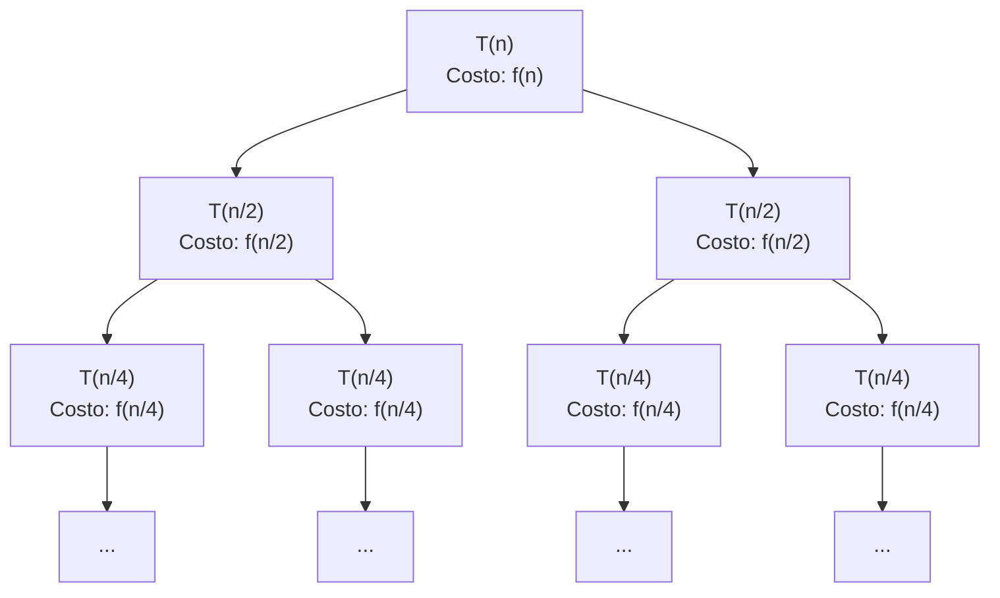

# Divide y vencerás

Muchos problemas en ciencias de la computación pueden ser resueltos bajo el enfoque de **divide y vencerás** (divide and conquer). Esta técnica consta de tres pasos fundamentales:

1. **Dividir**: el problema se descompone en subproblemas más pequeños. Los subproblemas deben ser de la misma naturaleza que el original (por ejemplo, ordenar un arreglo de $n$ elementos produce dos subproblemas de ordenar arreglos de tamaño $n/2$) y deben ser independientes, de modo que resolver uno no afecte la solución del otro.
2. **Conquistar**: se resuelven recursivamente los subproblemas hasta llegar al **caso base**, que tiene una solución trivial (por ejemplo, ordenar un arreglo de tamaño 1).
3. **Combinar**: se combinan las soluciones de los subproblemas para formar la solución del problema original. No todos los algoritmos de divide y vencerás requieren este paso explícito; por ejemplo, Quicksort no combina explícitamente, sino que la partición ordena "en el lugar".

## Esquema general

```python
def dividir(arr, p, r):
    # Caso recursivo: verifica si el arreglo tiene tamaño mayor a 1
    if p < r:
        # Calcula el punto medio para dividir el problema en dos mitades
        q = (p + r) // 2
        # Resuelve recursivamente el subproblema izquierdo [p, q]
        dividir(arr, p, q)
        # Resuelve recursivamente el subproblema derecho [q+1, r]
        dividir(arr, q + 1, r)
        # Combina las soluciones de ambos subproblemas (si es necesario)
        combinar(arr, p, q, r)

def combinar(arr, p, q, r):
    # Efectúa las operaciones para combinar las soluciones de los subproblemas
    # Este paso es específico del algoritmo (por ejemplo, merge en Mergesort)
    pass
```

**Nota**: en la práctica, la función `dividir` suele llamarse de manera recursiva y la combinación puede realizarse dentro de la misma función o en una separada, dependiendo del algoritmo específico.

## Análisis de complejidad

### Complejidad temporal

La complejidad temporal de un algoritmo de divide y vencerás se expresa generalmente mediante una **relación de recurrencia**:

$$T(n) = a \cdot T\left(\frac{n}{b}\right) + f(n)$$

donde:
- $a$: número de subproblemas en los que se divide el problema original.
- $\frac{n}{b}$: tamaño de cada subproblema (usualmente $b = 2$).
- $f(n)$: costo de dividir el problema más el costo de combinar las soluciones.
- $T(1) = \Theta(1)$: el caso base tiene costo constante.

Para resolver estas recurrencias se utilizan métodos como el **Teorema Maestro** o la expansión recursiva (árbol de recurrencia).

**Teorema Maestro**: Para recurrencias de la forma $T(n) = aT(n/b) + f(n)$:

1. Si $f(n) = O(n^{\log_b a - \epsilon})$ para algún $\epsilon > 0$, entonces $T(n) = \Theta(n^{\log_b a})$.
2. Si $f(n) = \Theta(n^{\log_b a} \log^k n)$ para algún $k \geq 0$, entonces $T(n) = \Theta(n^{\log_b a} \log^{k+1} n)$.
3. Si $f(n) = \Omega(n^{\log_b a + \epsilon})$ para algún $\epsilon > 0$ y $af(n/b) \leq cf(n)$ para algún $c < 1$ y $n$ suficientemente grande, entonces $T(n) = \Theta(f(n))$.

### Complejidad espacial

La complejidad espacial debe considerar:
- **Marcos de pila** (stack frames) de las llamadas recursivas.
- **Variables locales** y estructuras auxiliares creadas en cada llamada.
- **Profundidad de la recursión**: la máxima cantidad de llamadas anidadas simultáneamente.

Ejemplos:
- **Mergesort**: debe almacenar los subarreglos izquierdo y derecho, lo que requiere $O(n)$ espacio adicional. La profundidad de recursión es $O(\log n)$.
- **Quicksort**: solo almacena índices $p, q, r$ (espacio constante por llamada) y, en el caso promedio, tiene $O(\log n)$ marcos de pila, por lo que su complejidad espacial es $O(\log n)$. En el peor caso (cuando el pivote siempre es el elemento más pequeño o más grande), la profundidad es $O(n)$.

## Visualización del árbol de recursión



El árbol se divide hasta llegar a $T(1)$ (caso base). La **altura** del árbol es $\log_b n$ (donde $b$ es el factor de división). El **número de hojas** es $a^{\log_b n} = n^{\log_b a}$. Según la teoría de recursión, en cada rama de llamados recursivos hay como máximo $O(\log n)$ marcos de pila activos simultáneamente. El costo total se calcula sumando los costos de todos los niveles del árbol.

## Ejemplos clásicos de divide y vencerás

### 1. Mergesort

**Descripción**: divide el arreglo en mitades, ordena cada mitad recursivamente y luego combina (merge) las mitades ordenadas en tiempo lineal.

**Análisis**: 
- $T(n) = 2T(n/2) + O(n)$
- Por el Teorema Maestro: $T(n) = \Theta(n \log n)$
- Espacio: $O(n)$ (para los subarreglos auxiliares)

### 2. Quicksort

**Descripción**: elige un pivote, particiona el arreglo en elementos menores y mayores al pivote, y ordena recursivamente cada partición sin requerir espacio adicional.

**Análisis**:
- Caso promedio: $T(n) = 2T(n/2) + O(n) = \Theta(n \log n)$
- Caso peor: $T(n) = T(n-1) + O(n) = \Theta(n^2)$ (cuando el pivote siempre es extremo)
- Espacio: $O(\log n)$ en caso promedio, $O(n)$ en caso peor

### 3. Búsqueda binaria

**Descripción**: divide el espacio de búsqueda a la mitad en cada paso hasta encontrar el elemento o agotar el espacio.

**Análisis**:
- $T(n) = T(n/2) + O(1)$
- Por el Teorema Maestro: $T(n) = \Theta(\log n)$
- Espacio: $O(\log n)$ (recursivo) o $O(1)$ (iterativo)

### 4. Multiplicación de matrices de Strassen

**Descripción**: divide matrices de $n \times n$ en bloques de $n/2 \times n/2$, realiza 7 multiplicaciones de submatrices (en lugar de 8) y combina los resultados.

**Análisis**:
- $T(n) = 7T(n/2) + O(n^2)$
- Por el Teorema Maestro: $\log_2 7 \approx 2.807$, así que $T(n) = \Theta(n^{2.807})$
- Mejora sobre el método clásico $O(n^3)$

### 5. Algoritmo de Karatsuba para multiplicación de números grandes

**Descripción**: divide números en partes más pequeñas y combina los resultados con menos operaciones que la multiplicación clásica.

**Análisis**:
- $T(n) = 3T(n/2) + O(n)$
- Por el Teorema Maestro: $\log_2 3 \approx 1.585$, así que $T(n) = \Theta(n^{1.585})$
- Mejora sobre el método clásico $O(n^2)$

## Tabla de resumen de conceptos

| Concepto | Descripción | Ejemplo |
|----------|-------------|---------|
| **Divide y vencerás** | Paradigma algorítmico que resuelve un problema dividiéndolo en subproblemas más pequeños, resolviéndolos recursivamente y combinando sus soluciones. | Mergesort, Quicksort, búsqueda binaria. |
| **Caso base** | Instancia del problema que es suficientemente pequeña para resolverse directamente sin recursión. | Arreglo de tamaño 1 en ordenación. |
| **Relación de recurrencia** | Ecuación que describe el tiempo de ejecución $T(n)$ en función de tamaños más pequeños. | $T(n) = 2T(n/2) + O(n)$ para Mergesort. |
| **Teorema Maestro** | Método para resolver recurrencias de la forma $T(n) = aT(n/b) + f(n)$ mediante comparación entre $f(n)$ y $n^{\log_b a}$. | Permite clasificar soluciones rápidamente. |
| **Complejidad espacial recursiva** | Espacio adicional utilizado por la pila de llamadas y variables locales durante la recursión. | $O(\log n)$ para Quicksort (caso promedio), $O(n)$ para Mergesort. |
| **Profundidad de recursión** | Máxima cantidad de llamadas recursivas anidadas simultáneamente. | $O(\log n)$ para división por mitades, $O(n)$ en caso peor. |
| **Independencia de subproblemas** | Los subproblemas deben poder resolverse por separado sin interferencias. | En Mergesort, ordenar la mitad izquierda no afecta la derecha. |
| **Árbol de recursión** | Representación gráfica de las llamadas recursivas, sus tamaños y costos. | Árbol binario de altura $\log n$ para divisiones por mitades. |
| **Función de combinación $f(n)$** | Costo de dividir el problema y combinar las soluciones. | En Mergesort es el merge: $O(n)$. En búsqueda binaria es $O(1)$. |

## Comentarios adicionales

- **Ventajas del divide y vencerás**:
    - Conduce a algoritmos eficientes y elegantes.
    - Facilita el análisis de complejidad mediante recurrencias y el Teorema Maestro.
    - A menudo permite paralelización natural, ya que los subproblemas son independientes (útil en sistemas multicore).
    - Reduce la complejidad del problema original al trabajar con instancias más pequeñas.

- **Desventajas**:
    - La recursión introduce overhead de llamadas a función y gestión de marcos de pila.
    - Puede requerir memoria adicional para combinar resultados (como en Mergesort).
    - No siempre es la solución más eficiente; en algunos casos la iteración es preferible.
    - El peor caso puede ser significativamente peor que el promedio (como en Quicksort).

- **Comparación con programación dinámica**: mientras divide y vencerás resuelve subproblemas independientes sin reutilizar resultados, la programación dinámica resuelve subproblemas superpuestos y almacena sus soluciones para evitar recálculos. Si hay solapamiento, DP es preferible.

- **Importancia del caso base**: definir correctamente el caso base es crucial para evitar recursión infinita. Debe ser alcanzable mediante las divisiones sucesivas y trivial de resolver.

- **Optimización de recursión a iteración**: algunos algoritmos de divide y vencerás pueden implementarse iterativamente usando pilas explícitas, reduciendo el overhead de llamadas recursivas. Ejemplo: búsqueda binaria iterativa.

- **Elección del factor de división**: aunque la división por mitades es la más común ($b = 2$), otros factores como $b = 3$ pueden ser útiles en contextos específicos.

- **Aplicaciones más allá de ordenación**: este paradigma se usa en:
    - Problemas geométricos (par de puntos más cercano, envolvente convexa).
    - Transformadas rápidas (FFT - Fast Fourier Transform).
    - Algoritmos de grafos (búsqueda de componentes conexas, árbol de expansión mínima).
    - Procesamiento de imágenes y visión por computadora.
    - Análisis sintáctico y compilación.

- **Análisis asintótico**: el Teorema Maestro es poderoso pero requiere que la recurrencia sea equilibrada. Para recurrencias desbalanceadas, la expansión manual del árbol de recursión es necesaria.