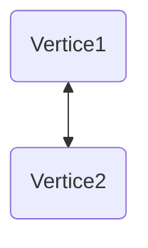

# Introducción a los Grafos

Los grafos son un conjunto de **vértices** (nodos) y **aristas** (conexiones). Formalmente, un grafo se define como $G(V,E)$, donde $V$ es el conjunto de vértices y $E \subseteq V \times V$ es el conjunto de aristas. Para cada arista $e \in E$, se cumple que $e = (u,v)$ con $u,v \in V$.

## Tipos de Grafos

### Grafos No Dirigidos
En estos grafos, las aristas no tienen dirección; es decir, $(u,v)$ es equivalente a $(v,u)$.

- **Grafo simple**: No admite bucles (aristas que conectan un vértice consigo mismo) ni aristas múltiples entre el mismo par de vértices.
- **Multigrafo**: Permite aristas múltiples entre el mismo par de vértices, pero no bucles.
- **Pseudografo**: Admite tanto bucles como aristas múltiples.

### Grafos Dirigidos (Digrafos)
Las aristas tienen dirección; $(u,v)$ es distinto de $(v,u)$ y representa una relación orientada de $u$ a $v$.

- **Grafo dirigido**: No permite aristas múltiples en la misma dirección entre un par de vértices.
- **Multigrafo dirigido**: Permite múltiples aristas en la misma dirección entre un par de vértices.

## Grado de un Grafo
El **grado** de un vértice en un grafo no dirigido es el número de aristas incidentes a él. En grafos dirigidos, se distingue entre **grado de entrada** (aristas que llegan) y **grado de salida** (aristas que salen). El grado de un grafo puede referirse a propiedades como el número de vértices o aristas, pero usualmente se especifica.

## Grafo Trivial
Un grafo trivial es aquel con un solo vértice (y posiblemente sin aristas) o el grafo vacío (sin vértices ni aristas).

## Representación Visual con Mermaid

**Comentarios sobre el código Mermaid:**
- `graph TD` indica un grafo dirigido dibujado en dirección top-down (de arriba a abajo).
- `A(Vertice1) <--> B(Vertice2)` define dos vértices etiquetados "Vertice1" y "Vertice2", conectados por una arista bidireccional (no dirigida en este contexto). En un grafo dirigido típico, se usaría `-->` para indicar dirección.

## Tabla Resumen de Conceptos

| Concepto | Definición | Ejemplo/Observaciones |
|----------|------------|-----------------------|
| **Grafo** | Estructura $G(V,E)$ con vértices $V$ y aristas $E$. | Base de la teoría de grafos. |
| **Grafo No Dirigido** | Aristas sin dirección; $(u,v) = (v,u)$. | Usado en redes sociales (amistades). |
| **Grafo Dirigido** | Aristas con dirección; $(u,v) \neq (v,u)$. | Modela flujos, dependencias. |
| **Grafo Simple** | Sin bucles ni aristas múltiples. | El tipo más básico y común. |
| **Multigrafo** | Permite aristas múltiples, sin bucles. | Útil para representar conexiones redundantes. |
| **Pseudografo** | Permite bucles y aristas múltiples. | Menos común en aplicaciones teóricas puras. |
| **Grado de Vértice** | Número de aristas incidentes (no dirigido). | En dirigidos: grado de entrada y salida. |
| **Grafo Trivial** | Un vértice o grafo vacío. | Caso base en demostraciones. |

## Comentarios Adicionales

- **Aplicaciones**: Los grafos son fundamentales en ciencias de la computación (estructuras de datos, redes), matemáticas (teoría de grafos), biología (redes tróficas) y sociología (análisis de redes sociales).
- **Representaciones**: Además de diagramas, los grafos se pueden representar mediante **matrices de adyacencia** o **listas de adyacencia**, cada una con ventajas computacionales según la operación.
- **Conexidad**: Un concepto clave es si el grafo es **conexo** (existe un camino entre cualquier par de vértices) o **fuertemente conexo** (en dirigidos, caminos en ambas direcciones).
- **Grafos Ponderados**: Las aristas pueden tener pesos (valores numéricos), extendiendo aplicaciones a optimización (ej. algoritmo de Dijkstra).
- **Consistencia teórica**: Asegurar que las definiciones sean precisas evita ambigüedades; por ejemplo, clarificar si "grado de un grafo" se refiere al vértice o a una propiedad global del grafo.