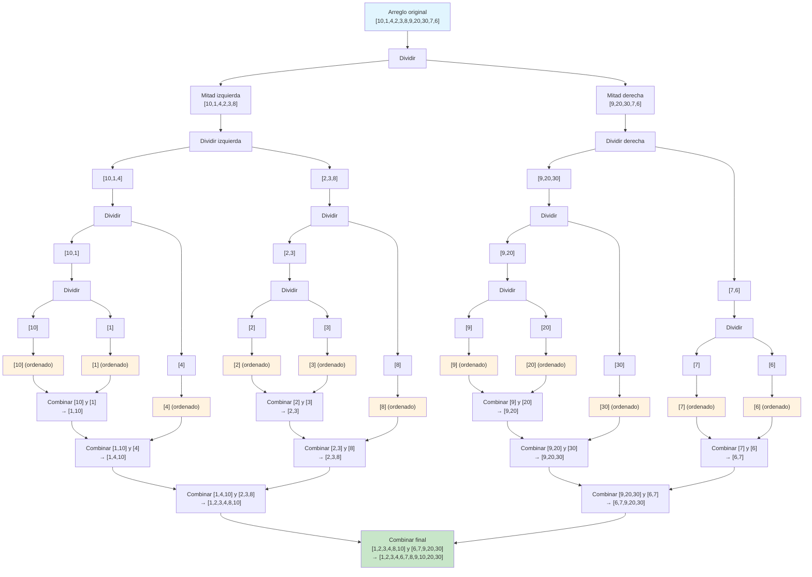

# Mergesort

Es un algoritmo de ordenamiento bajo el enfoque de **divide y vencerás**.

1. **Dividir** en mitades hasta el caso base (lista de tamaño 1 o 0), las cuales están ordenadas.
2. **Combinar**: se toman dos listas ordenadas y se genera una ordenada, esto tiene costo $O(n)$.

Un método para generar una lista ordenada a partir de dos listas ordenadas (combinar):

```scala
def merge(left: List[Int],
          right: List[Int]): List[Int] =
  (left, right) match {
    case (Nil, _) => right          // Si left está vacía, devuelve right
    case (_, Nil) => left           // Si right está vacía, devuelve left
    case (lh :: lt, rh :: rt) =>    // Compara los primeros elementos de cada lista
      if (lh <= rh) lh :: merge(lt, right)  // Si lh es menor o igual, lo toma de left
      else rh :: merge(left, rt)            // Si rh es menor, lo toma de right
  }
```

Aquí tenemos dos arreglos ordenados y vamos a generar otro ordenado; esto nos cuesta aproximadamente $n/2$ comparaciones, lo que es $O(n)$.

Y otro método para dividir:

```scala
def mergeSort(lst: List[Int]): List[Int] =
  lst match {
    case Nil => Nil                 // Caso base: lista vacía
    case _ :: Nil => lst            // Caso base: lista de un elemento (ya ordenada)
    case _ =>
      val mid = lst.length / 2      // Cuesta O(1) en listas (pero O(n) si se usa length)
      val (left, right) = lst.splitAt(mid) // Cuesta O(n) en listas (copia elementos)
      merge(mergeSort(left), mergeSort(right)) // Llamadas recursivas y combinación
  }
```

Por ser implementación con listas enlazadas, el costo de dividir es $O(n)$ (debido a `splitAt` y `length`). Si se usaran arreglos (arrays) con acceso por índice, dividir costaría $O(1)$.

Por lo tanto, el costo computacional es:

$$
T(n) = 2T\left(\frac{n}{2}\right) + O(n) + O(n)
$$

Esto es lo mismo que:

$$
T(n) = 2T\left(\frac{n}{2}\right) + O(n)
$$

Recordar que la notación $O(n)$ se refiere a cualquier función lineal (o de orden lineal).

Recuerden: tenemos 2 subproblemas de tamaño $n/2$.

**Complejidad espacial**: el problema es que este algoritmo genera dos listas (`left` y `right`) en cada llamada recursiva, lo que puede producir un alto consumo de memoria y riesgo de `StackOverflowError` en recursión profunda. Por esta razón, este algoritmo es más académico que aplicado en su forma recursiva pura. Caso contrario del algoritmo Quicksort, que puede ser implementado in-place.

**Nota teórica adicional**:  
- Mergesort es un algoritmo **estable** (mantiene el orden relativo de elementos iguales).  
- Su complejidad temporal es $O(n \log n)$ en todos los casos (peor, promedio y mejor).  
- No es in-place: requiere memoria adicional proporcional a $O(n)$.  
- Es adecuado para estructuras enlazadas (como listas) donde el acceso secuencial es eficiente.

---
# Ejercicio




---
## Tabla de resumen

Concepto | Descripción | Observaciones |
--- | --- | --- |
**Enfoque** | Divide y vencerás | Dividir el problema en subproblemas más pequeños, resolverlos y combinar resultados. |
**Caso base** | Lista de tamaño 0 o 1 | Ya están ordenadas por definición. |
**Operación principal** | Combinar (`merge`) | Fusiona dos listas ordenadas en una sola lista ordenada en $O(n)$. |
**Complejidad temporal** | $O(n \log n)$ | Resultado de la recurrencia $T(n) = 2T(n/2) + O(n)$. |
**Complejidad espacial** | $O(n)$ (no in-place) | Requiere memoria adicional para las sublistas. |
**Estabilidad** | Sí | Mantiene el orden relativo de elementos con igual clave. |
**Implementación típica** | Recursiva | Puede causar desbordamiento de pila en listas muy grandes. |
**Uso en listas vs. arrays** | Más natural en listas | En arrays, la división es $O(1)$ pero aún requiere memoria extra. |
**Ventaja principal** | Rendimiento garantizado $O(n \log n)$ | A diferencia de Quicksort, no tiene caso peor cuadrático. |
**Desventaja principal** | Memoria adicional | No es in-place, lo que limita su uso en entornos con restricciones de memoria. |

**Comentarios adicionales**:
- Mergesort es especialmente útil para ordenar datos enlazados (listas) y en ordenamientos externos (donde los datos no caben en memoria principal).
- La versión iterativa (bottom-up) de Mergesort evita la recursión profunda y es más amigable con la memoria en algunos contextos.
- En la práctica, combinaciones con Insertion Sort para tamaños pequeños pueden mejorar el rendimiento constante.
- La recurrencia $T(n) = 2T(n/2) + O(n)$ se resuelve mediante el teorema maestro, dando $T(n) = \Theta(n \log n)$.