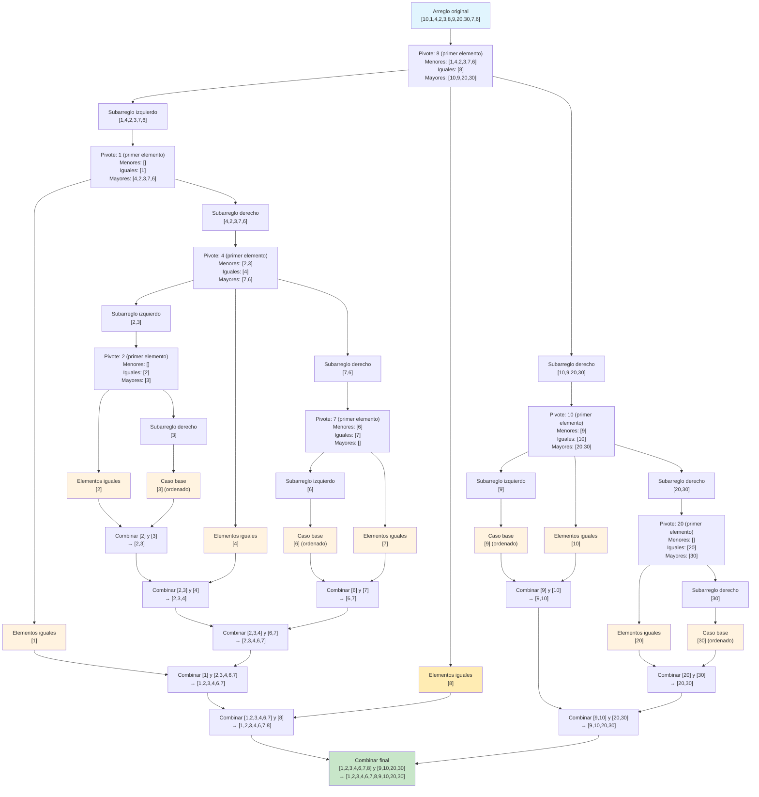

# Quicksort

## Funcionamiento

Quicksort es un algoritmo de ordenamiento basado en el paradigma **divide y vencerás**. Su funcionamiento se basa en los siguientes pasos:

1. **Selección del pivote**: Se elige un elemento del arreglo como pivote.
2. **Partición**: Se reorganizan los elementos del arreglo de manera que:
   - Todos los elementos **menores** que el pivote queden a su izquierda
   - Todos los elementos **iguales** al pivote queden en el medio
   - Todos los elementos **mayores** que el pivote queden a su derecha
3. **Recursión**: Se aplica el mismo proceso recursivamente a los subarreglos izquierdo y derecho.
4. **Caso base**: El proceso termina cuando se alcanzan subarreglos de tamaño 0 o 1, que ya están ordenados por definición.

Este algoritmo puede implementarse **in-place** (sin necesidad de crear nuevos arreglos) mediante intercambios de elementos, lo que lo hace eficiente en términos de memoria. Sin embargo, en paradigmas funcionales como Scala, donde los valores son inmutables, se requiere generar nuevas estructuras de datos.

## Anotación sobre estabilidad

**Concepto de estabilidad en algoritmos de ordenamiento**: Un algoritmo de ordenamiento se considera **estable** si mantiene el orden relativo de los elementos con claves iguales. Por ejemplo, si tenemos dos registros con el mismo valor de ordenación, un algoritmo estable garantiza que el que aparecía primero en la entrada también aparecerá primero en la salida.

**Quicksort es inestable** por naturaleza, ya que durante el proceso de partición, los elementos iguales al pivote pueden ser intercambiados de manera que se pierda su orden original relativo.

Además, Quicksort presenta **inestabilidad en su complejidad temporal**: pequeñas variaciones en la entrada (como un arreglo ya ordenado o inversamente ordenado cuando se usa el primer elemento como pivote) pueden llevarlo del caso promedio $O(n \log n)$ al peor caso $O(n^2)$. Esta sensibilidad a la entrada es lo que se conoce como **inestabilidad de complejidad**.

## Implementación conceptual (no código)

Para mejorar el rendimiento y evitar el peor caso, en la práctica se utilizan diversas estrategias de selección del pivote:
- **Pivote aleatorio**: Seleccionar un elemento aleatorio como pivote
- **Mediana de tres**: Usar la mediana del primer, medio y último elemento
- **Pivote del medio**: Seleccionar siempre el elemento en la posición media

## Tabla de resumen

Concepto | Descripción | Observaciones |
--- | --- | --- |
**Enfoque** | Divide y vencerás | Partición recursiva del arreglo alrededor de un pivote. |
**Operación principal** | Partición (`partition`) | Reorganiza elementos alrededor del pivote en $O(n)$. |
**Caso base** | Subarreglo de tamaño 0 o 1 | Ya están ordenados por definición. |
**Complejidad promedio** | $O(n \log n)$ | Cuando la partición divide el arreglo en partes balanceadas. |
**Complejidad peor caso** | $O(n^2)$ | Cuando el pivote es siempre el menor o mayor elemento. |
**Complejidad espacial** | $O(\log n)$ (in-place) | Memoria para la pila de recursión en implementación optimizada. |
**Estabilidad** | No | No mantiene el orden relativo de elementos con igual clave. |
**In-place** | Sí (en implementaciones imperativas) | Puede ordenar sin memoria adicional significativa. |
**Sensibilidad a entrada** | Alta | El rendimiento depende críticamente de la selección del pivote. |
**Ventaja principal** | Rapidez en promedio | Generalmente más rápido que otros $O(n \log n)$ en la práctica. |
**Desventaja principal** | Caso peor $O(n^2)$ | Requiere estrategias para evitar la degradación del rendimiento. |

**Comentarios adicionales**:
- Quicksort es generalmente más rápido que Mergesort en la práctica debido a constantes más pequeñas y mejor localidad de caché.
- La versión aleatorizada de Quicksort tiene complejidad esperada $O(n \log n)$ con alta probabilidad.
- Para arreglos pequeños (típicamente < 10-20 elementos), se suele cambiar a Insertion Sort por su menor sobrecarga.
- En entornos funcionales como Scala, la inmutabilidad obliga a crear nuevas listas, perdiendo la ventaja de ser in-place.
- El algoritmo Introsort combina Quicksort, Heapsort e Insertion Sort para garantizar $O(n \log n)$ en el peor caso manteniendo el buen rendimiento promedio.
- La elección del pivote es crítica: la mediana de tres es una estrategia común que balancea simplicidad y efectividad.

# Ejemplo

**Nota sobre la selección del pivote**: En este diagrama se utilizó el primer elemento como pivote en cada partición, que es una estrategia común pero puede llevar al peor caso $O(n^2)$ si el arreglo ya está ordenado. En la práctica, se usan estrategias como:
- Seleccionar un elemento aleatorio como pivote
- Usar la mediana de tres (primer, medio y último elemento)
- Seleccionar el elemento del medio

**Observación sobre estabilidad**: Como se menciona en la nota [[Quicksort]], este algoritmo es inestable porque pequeñas variaciones en la entrada (como un arreglo ya ordenado) pueden llevarlo del caso promedio $O(n \log n)$ al peor caso $O(n^2)$.