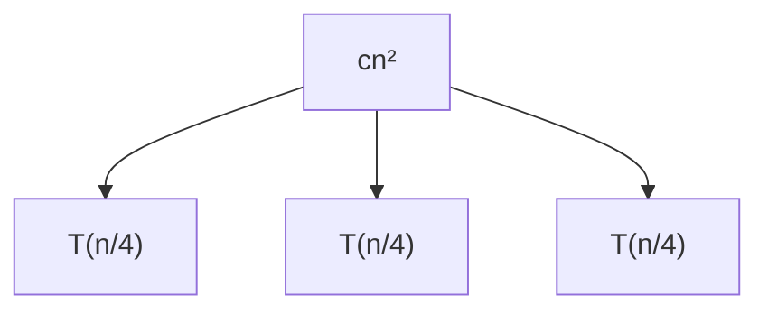
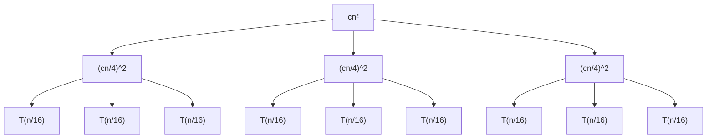

# Clase 16. Ejemplo del Método del Árbol de Recurrencia

Resolver la recurrencia:  
$T(n) = 3T(n/4) + cn^2$, con $T(1) = O(1)$.

## 1. Expansión del primer nivel

**Comentario:** El nodo raíz representa el costo no recursivo $cn^2$. De él surgen tres llamadas recursivas $T(n/4)$, correspondientes al término $3T(n/4)$.

## 2. Expansión del segundo nivel

**Comentario:** Cada nodo $T(n/4)$ se expande: su costo no recursivo es $c(n/4)^2$ y genera tres llamadas $T(n/16)$. El árbol muestra cómo el problema se divide en subproblemas más pequeños.

## 3. Sumatoria por niveles

Observamos el patrón de costos en cada nivel del árbol:

- Nivel 0: $cn^2 = 3^0 \cdot c \left( \frac{n}{4^0} \right)^2$
- Nivel 1: $3c\left(\frac{n}{4}\right)^2 = 3^1 \cdot c \left( \frac{n}{4^1} \right)^2$
- Nivel 2: $9c\left(\frac{n}{16}\right)^2 = 3^2 \cdot c \left( \frac{n}{4^2} \right)^2$
- Nivel 3: $27c\left(\frac{n}{64}\right)^2 = 3^3 \cdot c \left( \frac{n}{4^3} \right)^2$
- Nivel 4: $81c\left(\frac{n}{256}\right)^2 = 3^4 \cdot c \left( \frac{n}{4^4} \right)^2$

**Patrón general para el nivel $i$:**  
$3^i \cdot c \left( \frac{n}{4^i} \right)^2$

## 4. Condición de parada y altura del árbol

La expansión termina cuando el tamaño del subproblema es 1, es decir, cuando $T(n/4^i) = T(1)$.  
Esto ocurre cuando $\frac{n}{4^i} = 1 \Rightarrow n = 4^i \Rightarrow i = \log_4(n)$.

**Estructura del árbol:**
- **Niveles internos:** desde $i = 0$ hasta $i = \log_4(n) - 1$. Cada nivel tiene costo $3^i \cdot c \left( \frac{n}{4^i} \right)^2$.
- **Nivel de las hojas:** $i = \log_4(n)$. Contiene $3^{\log_4(n)}$ hojas, cada una con costo $T(1) = O(1)$.

## 5. Suma total de costos

La solución de la recurrencia es la suma de los costos de todos los niveles:

$$
T(n) = \sum_{i=0}^{\log_4(n)-1} 3^i \cdot c \left( \frac{n}{4^i} \right)^2 + 3^{\log_4(n)} \cdot T(1)
$$

Simplificamos la expresión:

$$
T(n) = c \sum_{i=0}^{\log_4(n)-1} 3^i \cdot \frac{n^2}{(4^i)^2} + 3^{\log_4(n)} \cdot T(1)
$$

$$
T(n) = c n^2 \sum_{i=0}^{\log_4(n)-1} 3^i \cdot \frac{1}{16^i} + 3^{\log_4(n)} \cdot T(1)
$$

$$
T(n) = c n^2 \sum_{i=0}^{\log_4(n)-1} \left( \frac{3}{16} \right)^i + 3^{\log_4(n)} \cdot T(1)
$$

Utilizamos la propiedad $a^{\log_b(c)} = c^{\log_b(a)}$ para simplificar el término de las hojas:

$$
3^{\log_4(n)} = n^{\log_4(3)}
$$

Entonces:

$$
T(n) = c n^2 \sum_{i=0}^{\log_4(n)-1} \left( \frac{3}{16} \right)^i + n^{\log_4(3)} \cdot T(1)
$$

## 6. Resolución de la sumatoria geométrica

La sumatoria es una serie geométrica finita de razón $r = \frac{3}{16}$:

$$
\sum_{i=0}^{k-1} r^i = \frac{r^k - 1}{r - 1}, \quad \text{con } k = \log_4(n)
$$

Sustituyendo:

$$
T(n) = c n^2 \cdot \frac{ \left( \frac{3}{16} \right)^{\log_4(n)} - 1 }{ \frac{3}{16} - 1 } + n^{\log_4(3)} \cdot T(1)
$$

Simplificamos el denominador:

$$
\frac{3}{16} - 1 = \frac{3}{16} - \frac{16}{16} = -\frac{13}{16}
$$

Por lo tanto:

$$
T(n) = c n^2 \cdot \frac{ \left( \frac{3}{16} \right)^{\log_4(n)} - 1 }{ -\frac{13}{16} } + n^{\log_4(3)} \cdot T(1)
$$

$$
T(n) = c n^2 \cdot \left(1 - \left( \frac{3}{16} \right)^{\log_4(n)} \right) \cdot \frac{16}{13} + n^{\log_4(3)} \cdot T(1)
$$

Aplicamos nuevamente la propiedad logarítmica para simplificar $\left( \frac{3}{16} \right)^{\log_4(n)}$:

$$
\left( \frac{3}{16} \right)^{\log_4(n)} = n^{\log_4(3/16)}
$$

Entonces:

$$
T(n) = \frac{16c}{13} n^2 \cdot \left(1 - n^{\log_4(3/16)} \right) + n^{\log_4(3)} \cdot T(1)
$$

## 7. Análisis asintótico

Evaluamos los exponentes clave:

1. $\log_4(3/16) = \log_4(3) - \log_4(16) = \log_4(3) - 2$. Dado que $\log_4(3) \approx 0.792$, entonces $\log_4(3/16) \approx -1.208 < 0$.
2. $\log_4(3) \approx 0.792 > 0$.
3. El término $n^{\log_4(3/16)} = n^{-1.208} = \frac{1}{n^{1.208}}$, que tiende a 0 cuando $n$ crece.

Por lo tanto, cuando $n$ es grande:

- $n^{\log_4(3/16)} \to 0$, haciendo que $\left(1 - n^{\log_4(3/16)} \right) \to 1$.
- El término dominante es $\frac{16c}{13} n^2$, que es $O(n^2)$.
- El término $n^{\log_4(3)} \cdot T(1)$ es $O(n^{0.792})$, que es de orden menor que $O(n^2)$.

**Conclusión:** $T(n) = O(n^2)$.

## 8. Tabla de resumen de conceptos

Concepto | Descripción | Observaciones
--- | --- | ---
Recurrencia | Ecuación que define una función en términos de sus valores en entradas más pequeñas. | En este caso: $T(n) = 3T(n/4) + cn^2$.
Método del árbol | Técnica para resolver recurrencias expandiendo visualmente las llamadas recursivas. | Permite identificar patrones en los costos por nivel.
Costo por nivel | Suma de los costos no recursivos en un nivel específico del árbol. | Patrón: $3^i \cdot c (n/4^i)^2$ para el nivel $i$.
Altura del árbol | Número de niveles hasta que el tamaño del subproblema es 1. | Determinada por $i = \log_4(n)$.
Nivel de las hojas | Último nivel del árbol, donde los subproblemas tienen tamaño 1. | Número de hojas: $3^{\log_4(n)} = n^{\log_4(3)}$.
Sumatoria geométrica | Serie donde cada término se obtiene multiplicando el anterior por una razón constante. | Se utilizó para sumar los costos de todos los niveles: $\sum (3/16)^i$.
Simplificación logarítmica | Propiedad: $a^{\log_b(c)} = c^{\log_b(a)}$. | Fundamental para expresar $3^{\log_4(n)}$ como $n^{\log_4(3)}$.
Análisis asintótico | Identificación del término dominante que determina el crecimiento de la función. | El término $O(n^2)$ domina sobre $O(n^{0.792})$, resultando en $T(n) = O(n^2)$.
Caso del Teorema Maestro | Corresponde al Caso 1: $f(n) = O(n^{\log_b a - \epsilon})$ con $\epsilon > 0$. | Aquí $a=3, b=4, \log_b a \approx 0.792, f(n)=cn^2=O(n^2)$. Como $2 > 0.792$, el costo lo domina $f(n)$.

## 9. Comentarios adicionales

- El método del árbol es especialmente útil para visualizar cómo se distribuyen los costos en recurrencias de "divide y vencerás". Confirma el resultado que se obtendría aplicando el **Teorema Maestro**.
- En este ejemplo, la razón de la sumatoria geométrica es $\frac{3}{16} < 1$, lo que indica que los costos de los niveles decrecen rápidamente. La suma converge a una constante multiplicada por $n^2$.
- La notación $O(1)$ para $T(1)$ es apropiada, ya que el costo base para un problema de tamaño constante se considera constante.
- La complejidad final $O(n^2)$ surge porque el costo de combinar (el término $cn^2$) crece más rápido que la reducción del tamaño de los subproblemas. El factor de ramificación (3) y el factor de división (4) no son suficientes para superar el costo cuadrático del trabajo no recursivo.