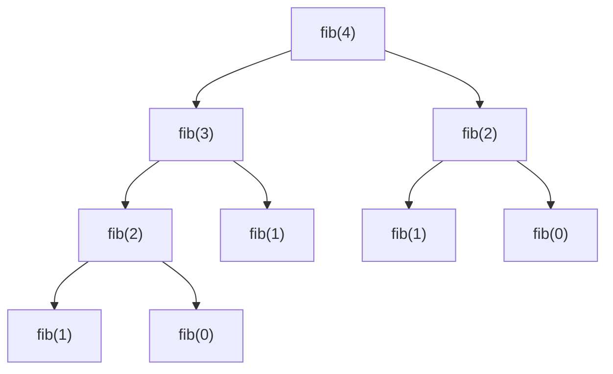

# Recursión de árbol

Es aquella que tiene más de un llamado recursivo. Esta no se puede optimizar fácilmente a recursión de cola directamente; sin embargo, si existe una solución iterativa equivalente, se puede convertir en recursión de cola.

## Definición matemática de Fibonacci

$$
fib(n) = \begin{cases}
	0 & \texttt{ si } n = 0 \\
	1 & \texttt{ si } n = 1 \\
	fib(n-1)+fib(n-2) & \texttt{ en otro caso }
	\end{cases}
$$

## Árbol de llamadas para fibonacci(4)



## Implementación en Scala

```scala
/**
 * Calcula el n-ésimo número de Fibonacci usando recursión de árbol.
 * 
 * @param n Posición en la sucesión de Fibonacci (entero no negativo).
 * @return Valor del n-ésimo número de Fibonacci.
 */
def fibonacci(n: Int): Int = {  
  // Casos base: fib(0) = 0, fib(1) = 1
  if (n <= 1) n  
  // Caso recursivo: suma de los dos números anteriores (múltiples llamadas recursivas)
  else fibonacci(n-1) + fibonacci(n-2)  
}
```

En este diseño tenemos más de un llamado recursivo en el caso recursivo, lo que genera una estructura de árbol de llamadas.

## Traza de ejecución para fib(4)

```scala
fib(4) = fib(3) + fib(2)
fib(4) = fib(2) + fib(1) + fib(2)
fib(4) = fib(1) + fib(0) + fib(1) + fib(2)
fib(4) = 1 + fib(0) + fib(1) + fib(2)
fib(4) = 1 + 0 + fib(1) + fib(2)
fib(4) = 1 + fib(1) + fib(2)
fib(4) = 1 + 1 + fib(2)
fib(4) = 2 + fib(2)
fib(4) = 2 + fib(1) + fib(0)
fib(4) = 2 + 1 + fib(0)
fib(4) = 3 + fib(0)
fib(4) = 3 + 0
fib(4) = 3
```

## Conceptos teóricos adicionales

- **Recursión de árbol (Tree Recursion)**: Patrón recursivo donde una función realiza múltiples llamadas recursivas en un solo caso, generando una estructura de árbol de llamadas.
- **Subproblemas superpuestos**: En el ejemplo de Fibonacci, `fib(2)` se calcula dos veces, `fib(1)` y `fib(0)` se calculan múltiples veces, lo que indica ineficiencia por recomputación.
- **Complejidad exponencial**: Para `fib(n)`, el número total de llamadas es aproximadamente O(2ⁿ), haciendo esta implementación impracticable para `n > 40`.
- **Profundidad de recursión**: La máxima profundidad de la pila es O(n), pero el número total de llamadas es exponencial.
- **Optimización mediante iteración**: Como se menciona, cuando existe una solución iterativa, se puede transformar a recursión de cola.

## Versión iterativa / recursión de cola para Fibonacci

```scala
import scala.annotation.tailrec

/**
 * Calcula Fibonacci usando recursión de cola (optimizada).
 * 
 * @param n Posición en la sucesión.
 * @param a Acumulador para fib(k) (inicia en 0 para fib(0)).
 * @param b Acumulador para fib(k+1) (inicia en 1 para fib(1)).
 * @return Valor de fib(n).
 */
@tailrec
def fibonacciTail(n: Int, a: Int = 0, b: Int = 1): Int = {
  if (n == 0) a
  else fibonacciTail(n - 1, b, a + b)
}

// Ejemplo: fibonacciTail(4) retorna 3
```

Esta recursión de árbol es difícil de optimizar directamente a recursión de cola porque requiere acceso a dos resultados previos simultáneamente. Lo mejor es usar una versión iterativa o transformar a recursión de cola con acumuladores múltiples.

## Tabla de resumen

Concepto | Descripción | Ejemplo/Nota |
| --- | --- | --- |
| **Recursión de árbol** | Función con múltiples llamadas recursivas en el caso recursivo. | `fibonacci(n-1) + fibonacci(n-2)` |
| **Estructura de árbol** | Las llamadas forman un árbol donde cada nodo puede tener 0, 1 o más hijos. | Diagrama de `fib(4)` |
| **Subproblemas superpuestos** | Mismos cálculos se repiten en ramas diferentes del árbol. | `fib(2)` calculado 2 veces |
| **Complejidad exponencial** | Número de llamadas crece exponencialmente con la entrada. | O(2ⁿ) para Fibonacci recursivo |
| **Ineficiencia computacional** | Recomputación redundante de valores ya calculados. | Principal desventaja |
| **Transformación a iterativo** | Solución: convertir a algoritmo iterativo o recursión de cola. | `fibonacciTail` con acumuladores |
| **Casos base múltiples** | Puede requerir más de un caso base para detener la recursión. | `n <= 1` cubre fib(0) y fib(1) |

## Comentarios adicionales

1. **Problema de eficiencia**: La implementación recursiva simple de Fibonacci tiene complejidad temporal O(2ⁿ) y es impráctica para n > 40. Para n=50, se requieren aproximadamente 1.12×10¹⁵ operaciones.

2. **Estrategias de optimización**:
   - **Memoización**: Almacenar resultados intermedios en una estructura de datos (array o mapa).
   - **Programación dinámica ascendente**: Calcular valores desde los casos base hacia arriba.
   - **Fórmula matemática**: Usar la fórmula de Binet para cálculo directo (aproximado para n grandes).

3. **Aplicaciones típicas de recursión de árbol**:
   - Problemas de combinaciones y permutaciones
   - Recorrido de árboles binarios y n-arios
   - Algoritmos de divide y vencerás (ej: mergesort, quicksort)
   - Resolución de juegos como el de las Torres de Hanoi

4. **Identificación de recursión de árbol**: Cuando la solución de un problema depende de la solución de múltiples subproblemas independientes del mismo tipo.


5. **Conclusión**: Mientras que la recursión de árbol es conceptualmente clara y fácil de implementar para muchos problemas, su ineficiencia la hace inadecuada para problemas con subproblemas superpuestos. En esos casos, se deben preferir técnicas como recursión de cola, programación dinámica o memoización.