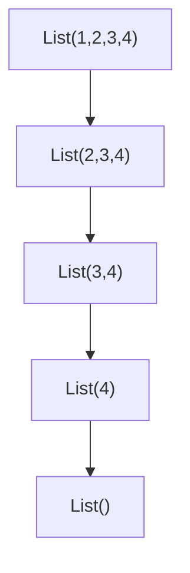

# Recursión lineal

La recursión lineal tiene los siguientes elementos:

1. **Caso base**: Proporciona una respuesta inmediata y detiene la recursión.
2. **Caso recursivo**: Compone la solución parcial y realiza una llamada recursiva que se acerca al caso base.

## Ejemplo en Scala

```scala
/**
 * Calcula la suma de los cuadrados de los elementos de una lista de enteros.
 * 
 * @param lst Lista de enteros.
 * @return Suma de los cuadrados de los elementos.
 */
def sumaCuadradosR(lst: List[Int]): Int = {  
  // Caso base: si la lista está vacía, la suma es 0.
  if (lst.isEmpty) 0  
  // Caso recursivo: suma el cuadrado del primer elemento con la suma de cuadrados del resto.
  else lst.head * lst.head + sumaCuadradosR(lst.tail)  
}

// Ejemplo de ejecución:
sumaCuadradosR(List(1, 2, 3, 4))
```

### Traza de ejecución:
```
sumaCuadradosR(List(1, 2, 3, 4))
1*1 + sumaCuadradosR(List(2, 3, 4))
1*1 + 2*2 + sumaCuadradosR(List(3, 4))
1*1 + 2*2 + 3*3 + sumaCuadradosR(List(4))
1*1 + 2*2 + 3*3 + 4*4 + sumaCuadradosR(List())
1*1 + 2*2 + 3*3 + 4*4 + 0
```

Observe que paulatinamente llegamos al caso base (usando `tail` para reducir la lista en cada paso).



## Consideraciones de rendimiento

En total deben almacenarse 5 marcos de pila (uno por cada llamada recursiva). Esto representa un problema porque si tenemos muchas llamadas recursivas, podemos saturar la pila de ejecución, causando un **stack overflow**.

### Conceptos teóricos adicionales:

- **Recursión lineal**: Solo se realiza una llamada recursiva por caso. La solución se construye al "desenrollar" la pila de llamadas.
- **Profundidad de recursión**: Número de llamadas recursivas anidadas. Está limitada por el tamaño de la pila.
- **Recursión de cola (tail recursion)**: Variante donde la llamada recursiva es la última operación. Permite optimización por el compilador (eliminación de recursión de cola), evitando el desbordamiento de pila.

## Tabla de resumen

Concepto | Descripción | Ejemplo/Nota |
| --- | --- | --- |
| **Recursión lineal** | Función que se llama a sí misma una vez por ejecución, reduciendo el problema hacia un caso base. | `sumaCuadradosR` |
| **Caso base** | Condición que detiene la recursión, proporcionando un resultado directo. | `if (lst.isEmpty) 0` |
| **Caso recursivo** | Paso donde se combina una parte de la solución con una llamada recursiva. | `lst.head*lst.head + sumaCuadradosR(lst.tail)` |
| **Marco de pila** | Registro en la pila de ejecución que almacena el estado de cada llamada. | 5 marcos para lista de 4 elementos |
| **Stack overflow** | Error por exceder la capacidad de la pila debido a demasiadas llamadas recursivas. | Riesgo en recursión profunda |
| **Recursión de cola** | Optimización donde la llamada recursiva es la última operación, permitiendo reutilizar el marco de pila. | No aplica en este ejemplo (la suma se hace después de la llamada) |

## Comentarios adicionales

- La recursión lineal es intuitiva pero ineficiente en memoria para problemas grandes debido al crecimiento lineal de la pila.
- En lenguajes funcionales como Scala, se recomienda usar **recursión de cola** cuando sea posible, aprovechando la optimización `@tailrec`.
- Alternativas iterativas (bucles) pueden ser más eficientes en memoria, aunque la recursión ofrece claridad conceptual para problemas con estructura recursiva natural.
- Para listas muy grandes, considere técnicas como **dividir y conquistar** (recursión no lineal) o transformar a recursión de cola.