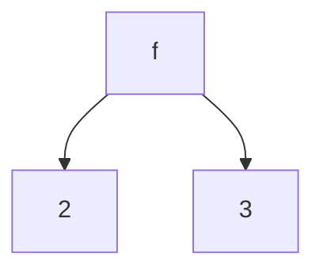
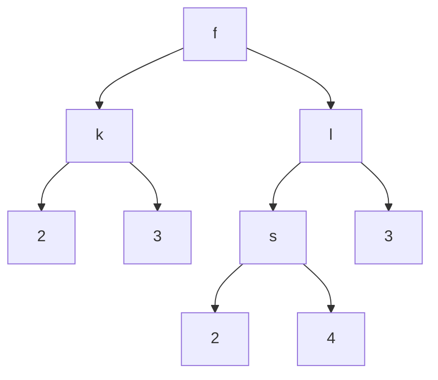

# Representación mediante Gramática BNF

## Formalmente

Utilizamos gramáticas de tipo 3 (regulares) de la forma $aA$, es decir, el símbolo terminal seguido del no terminal. Por esta razón, estas gramáticas son sensibles a la izquierda. Si dos reglas inician igual por la izquierda, EOPL no será capaz de distinguirlas, generando un conflicto de desplazamiento (shift conflict).

### Jerarquía de Chomsky y Gramáticas Tipo 3

Las gramáticas tipo 3 (regulares) son las más restrictivas en la jerarquía de Chomsky, caracterizadas por tener producciones de la forma:
- $A \rightarrow aB$ (recursión a la derecha)
- $A \rightarrow a$ (terminal)

Estas son menos expresivas que las gramáticas libres de contexto (tipo 2), pero más fáciles de procesar computacionalmente.

## Ejemplo: Lista de Números

```ebnf
<lista-numeros> ::= '()
                  ::= <int> <lista-numeros>
```

Ejemplos válidos:

```scheme
'()
'(1 2 3)
```

Esta gramática define listas que contienen únicamente números enteros. El caso base es la lista vacía, y la regla inductiva añade un número al inicio de una lista válida.

## Ejemplo: Árbol Binario

```ebnf
<b-tree> ::= <int>
           ::= <symbol> <b-tree> <b-tree>
```

Ejemplos válidos:

```scheme
1
'(f 2 3)
'(f (k 2 3) (l (s 2 4) 3))
```

En el caso de `(f 2 3)`:



En el caso de `'(f (k 2 3) (l (s 2 4) 3))`:



Un árbol binario puede ser un número entero (hoja) o un símbolo con dos subárboles (nodo interno). Esta estructura es fundamental en ciencia de la computación para representar datos jerárquicos.

## Ejemplo: Cálculo Lambda

```ebnf
<lambda-exp> ::= <identifier>
               ::= ("lambda" (<identifier>) <lambda-exp>)
               ::= (<lambda-exp> <lambda-exp>)
```

Ejemplos válidos:

```scheme
'x
'(lambda (x) x)
'(lambda (y) (lambda (s) k))
'(x (lambda (p) (x y)))
```

El cálculo lambda es un sistema formal que permite expresar funciones anónimas y aplicación de funciones. Las tres reglas definen:
1. Una variable identificador
2. Una abstracción lambda (definición de función anónima)
3. Una aplicación de funciones

## Código para Validar Datos

```scheme
#lang eopl

#|
Gramática para lista de números
<lista-numeros> ::= '()
                  ::= <int> <lista-numeros>

Definición inductiva:
- Caso base: '() pertenece a lista-numeros
- Regla inductiva: si n es número y l es lista-numeros, entonces (n . l) es lista-numeros
|#

; in-Ln?: lista -> boolean
; Valida que una lista contenga únicamente números
; Procesa recursivamente: verifica que el primer elemento sea número
; y que el resto sea una lista válida
(define in-Ln?
  (lambda (l)
    (cond
      [(null? l) #T]                           ; Caso base: lista vacía es válida
      [else
       (and (number? (car l))                  ; Verifica que el primer elemento sea número
            (in-Ln? (cdr l)))])))              ; Recursión: valida el resto de la lista

(newline)
(display "Lista de números")
(newline)
(display (in-Ln? '(1 2 3 4 5)))                ; #T - todos son números
(newline)
(display (in-Ln? '(2 3 4 5 6 e 1)))            ; #F - contiene símbolo 'e'
(newline)

#|
Gramática para árbol binario
<b-tree> ::= <int>
           ::= <symbol> <b-tree> <b-tree>

Definición inductiva:
- Caso base: un número entero es un árbol binario (hoja)
- Regla inductiva: si s es símbolo, t1 y t2 son árboles binarios,
  entonces (s t1 t2) es un árbol binario (nodo interno)
|#

; in-tree?: árbol -> boolean
; Valida que la estructura cumpla con la definición de árbol binario
; Un árbol es válido si:
; 1. Es un número (hoja), o
; 2. Es una lista donde primer elemento es símbolo y los siguientes son árboles válidos
(define in-tree?
  (lambda (t)
    (cond
      [(number? t) #T]                         ; Caso base: un número es un árbol válido
      [else
       (and
        (symbol? (car t))                      ; Verifica que el nodo sea un símbolo
        (in-tree? (cadr t))                    ; Verifica que el subárbol izquierdo sea válido
        (in-tree? (caddr t)))])))              ; Verifica que el subárbol derecho sea válido

(newline)
(display "Árbol binario")
(newline)
(display (in-tree? 5))                         ; #T - número es árbol válido
(newline)
(display (in-tree? '(k 1 2)))                  ; #T - símbolo con dos números
(newline)
(display (in-tree? '(s (t 1 2) (k (n 2 3) (s 4 2))))) ; #T - árbol complejo válido
(newline)
(display (in-tree? '(s (t 1 2) (k (n 2 3) (1 4 2))))) ; #F - primer elemento (1) no es símbolo

#|
Gramática para cálculo lambda
<lambda-exp> ::= <identifier>
               ::= ("lambda" (<identifier>) <lambda-exp>)
               ::= (<lambda-exp> <lambda-exp>)

Definición inductiva:
- Caso base: un identificador (símbolo) es una expresión lambda válida
- Regla 1: (lambda (x) e) es válida si x es identificador y e es expresión lambda
- Regla 2: (e1 e2) es válida si e1 y e2 son expresiones lambda (aplicación)
|#

; in-lambda-exp?: expresión -> boolean
; Valida que una expresión sea una expresión lambda válida
; Utiliza tres patrones de análisis:
; 1. Símbolos simples (variables)
; 2. Abstracciones lambda: (lambda (var) body)
; 3. Aplicaciones de funciones: (func arg)
(define in-lambda-exp?
  (lambda (exp)
    (cond
      [(symbol? exp) #T]                       ; Caso base: símbolo es expresión lambda válida
      [(and
        (equal? (car exp) 'lambda)             ; Verifica que inicie con 'lambda
        (symbol? (caadr exp))                  ; Verifica que el parámetro sea un símbolo
        )
       (in-lambda-exp? (caddr exp))]           ; Recursión: valida el cuerpo de la lambda
      [else
       (and
        (in-lambda-exp? (car exp))             ; Verifica que el operador sea expresión lambda
        (in-lambda-exp? (cadr exp)))])))       ; Verifica que el argumento sea expresión lambda

(display "Expresión lambda")
(newline)
(display (in-lambda-exp? 'x))                  ; #T - variable simple
(newline)
(display (in-lambda-exp? '(lambda (x) y)))     ; #T - abstracción lambda
(newline)
(display (in-lambda-exp? '(lambda (x) (lambda (y) x)))) ; #T - lambda anidada
(newline)
(display (in-lambda-exp? '(x y)))              ; #T - aplicación de función
(newline)
(display (in-lambda-exp? '((lambda (x) y) (x y)))) ; #T - aplicación de lambda
(newline)
(display (in-lambda-exp? '((lambda (s) z) (x y)))) ; #T - composición válida
```

## Relación entre Gramáticas BNF y Representación Inductiva

Las gramáticas BNF proporcionan una notación formal para especificar lenguajes, mientras que la representación inductiva define los datos que pertenecen a ese lenguaje. Cada regla en la gramática BNF corresponde a un caso en la función de pertenencia:

- **Reglas BNF** → **Casos en cond**
- **No terminales** → **Llamadas recursivas**
- **Terminales** → **Predicados de tipo** (`number?`, `symbol?`, etc.)

## Tabla de Resumen

| Concepto | Definición | Ejemplo | Función de Validación |
|----------|-----------|---------|----------------------|
| **Gramática BNF** | Notación formal para especificar la sintaxis de un lenguaje | `<list> ::= '() \|\| <int> <list>` | Define estructura; validación con `in-Ln?` |
| **Tipo 3 (Regular)** | Gramática menos expresiva de la jerarquía Chomsky; recursión a derecha | `A ::= aB` | Procesa de izquierda a derecha |
| **Caso Base** | Regla BNF que produce un terminal sin recursión | `<b-tree> ::= <int>` | Primera rama del `cond` |
| **Regla Recursiva** | Regla BNF que incluye el no terminal en su producción | `<lista> ::= <int> <lista>` | Llamada recursiva en `cond` |
| **Shift Conflict** | Ambigüedad cuando dos reglas inician igual por la izquierda | Reglas no diferenciables en EOPL | Causa error en el parser |
| **Árbol Binario** | Estructura jerárquica donde cada nodo tiene exactamente dos subárboles | `(f (k 1 2) 3)` | Validación con `in-tree?` |
| **Cálculo Lambda** | Sistema formal para expresar funciones anónimas y aplicación | `(lambda (x) (+ x 1))` | Validación con `in-lambda-exp?` |
| **Abstracción Lambda** | Definición de función anónima; forma `(lambda (param) body)` | `(lambda (x) x)` | Analiza estructura y parámetros |
| **Aplicación de Función** | Invocación de función; forma `(func arg)` | `(f x)` | Valida ambos operandos recursivamente |
| **Recursión Estructural** | Seguir la estructura del lenguaje en la validación | Procesar lista elemento a elemento | Garantiza terminación y cobertura completa |

## Comentarios Adicionales

- Las gramáticas tipo 3 son suficientes para lenguajes regulares pero insuficientes para lenguajes libres de contexto como el cálculo lambda (que requiere gramáticas tipo 2)
- Los conflictos de desplazamiento (shift conflicts) en EOPL indican ambigüedad gramatical que debe resolverse reescribiendo las reglas
- La validación recursiva de estructuras complejas (como árboles y expresiones lambda) refleja directamente la estructura de la gramática BNF
- Las funciones de pertenencia actúan como **parsers** que verifican si un dato cumple la sintaxis definida por la gramática
- La correspondencia entre BNF y código recursivo es sistemática: cada alternativa (`::=`) corresponde a un caso en `cond`, facilitando la traducción automática
- El cálculo lambda es fundamental en programación funcional y teoría de lenguajes de programación, siendo la base teórica de lenguajes como Lisp y Scheme
- Para lenguajes más complejos, se utilizan herramientas como generadores de parsers (yacc, bison) que automatizan la creación de validadores a partir de gramáticas BNF