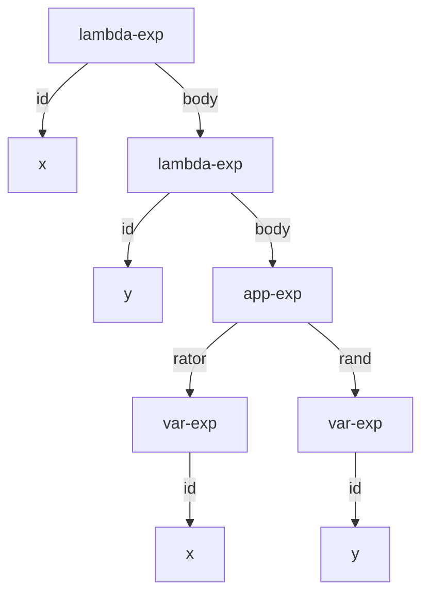

# Árbol de Sintaxis Abstracta (AST)

Los **Árboles de Sintaxis Abstracta (AST)** son representaciones basadas en la gramática de un lenguaje. Estas no tienen un tipo específico predefinido, sino que son representaciones estructuradas de un tipo de dato definido por el programador. Si un AST se puede construir, significa que se ha cumplido la regla de sintaxis (sigue la gramática) del lenguaje.

```scheme
#lang eopl
#|
Gramática de expresiones lambda:
<lc-exp> ::= <identifier>                  var-exp(id)
         ::= "lambda" "("<identifier>")" <lc-exp>  lambda-exp(id, body)
         ::= <lc-exp> <lc-exp>             app-exp(rator, rand)
|#

(define-datatype lc-exp lc-exp?
  (var-exp (id symbol?))                    ; Variable: identificador
  (lambda-exp (id symbol?)                  ; Abstracción lambda: parámetro
              (exp lc-exp?))                ; y cuerpo
  (app-exp (rator lc-exp?)                  ; Aplicación: operador
           (rand lc-exp?)))                 ; y operando

;; Ejemplo: AST de (λx. f (f x))
(define exp1
  (lambda-exp 'x
              (app-exp
               (var-exp 'f)                 ; Operador: f
               (app-exp
                (var-exp 'f)                ; Operador interno: f
                (var-exp 'x)))))            ; Operando interno: x

;; unparse: lc-exp → lista (sintaxis concreta)
;; Convierte un AST a su representación como lista (sintaxis concreta).
;; Este proceso se conoce como "pretty-printing" o "desanalizador".
(define unparse
  (lambda (exp)
    (cases lc-exp exp
      (var-exp (id) (list 'var-exp id))     ; Variable: (var-exp id)
      (lambda-exp (id exp1)
                  (list 'lambda-exp id (unparse exp1))) ; Lambda: (lambda-exp id cuerpo)
      (app-exp (rator rand)
               (list 'app-exp
                     (unparse rator)        ; Convierte operador
                     (unparse rand))))))    ; Convierte operando

;; parse: lista (sintaxis concreta) → lc-exp (AST)
;; Convierte una representación en lista a un AST.
;; Este proceso se conoce como "análisis sintáctico" o "parser".
(define parse
  (lambda (exp)
    (cond
      [(eqv? (car exp) 'var-exp)            ; Si es una variable
       (var-exp (cadr exp))]                ; Construye var-exp
      [(eqv? (car exp) 'lambda-exp)         ; Si es una abstracción lambda
       (lambda-exp (cadr exp)               ; Toma el identificador
                   (parse (caddr exp)))]    ; Parsea recursivamente el cuerpo
      [else                                 ; Si es una aplicación (asumimos 'app-exp)
       (app-exp
        (parse (cadr exp))                  ; Parsea el operador
        (parse (caddr exp)))]               ; Parsea el operando
      )
    )
  )
```

## Ejecución y demostración

```scheme
> exp1
#(struct:lambda-exp
  x
  #(struct:app-exp
    #(struct:var-exp f)
    #(struct:app-exp #(struct:var-exp f) #(struct:var-exp x))))

> (unparse exp1)
(lambda-exp x (app-exp (var-exp f) (app-exp (var-exp f) (var-exp x))))

> (parse (unparse exp1))
#(struct:lambda-exp
  x
  #(struct:app-exp
    #(struct:var-exp f)
    #(struct:app-exp #(struct:var-exp f) #(struct:var-exp x))))
```

**Observaciones**:
- `exp1` es un AST (representación interna estructurada)
- `(unparse exp1)` es una lista (representación concreta serializable)
- `(parse (unparse exp1))` es un AST (el original reconstruido)

## Flujo de un intérprete

El intérprete sigue típicamente este flujo:
1. **Parse**: Convierte código fuente (texto) en AST
2. **Evaluación**: Procesa el AST para calcular resultados
3. **Unparse**: Convierte el resultado de vuelta a una representación legible

El AST ayuda a representar los datos sin depender de tipos de datos como listas o de estrategias como procedimientos, proporcionando una representación canónica y estructurada.

## Representación gráfica de un AST

```scheme
;; AST de (λx. λy. (x y))
(lambda-exp 'x (lambda-exp 'y (app-exp (var-exp 'x) (var-exp 'y))))
```

Esta expresión se representa gráficamente como:



## Conceptos teóricos clave

1. **Sintaxis abstracta vs. sintaxis concreta**:
   - **Sintaxis concreta**: Representación textual del programa (código fuente)
   - **Sintaxis abstracta**: Representación estructurada en árbol que captura la esencia del programa

2. **Parse (análisis sintáctico)**: Proceso de convertir sintaxis concreta (texto) en sintaxis abstracta (AST). Detecta errores de sintaxis cuando no puede construir un AST válido.

3. **Unparse (desanalizador)**: Proceso inverso que convierte un AST en una representación concreta legible.

4. **Error de sintaxis**: Ocurre cuando el parser no puede construir un AST válido a partir de la entrada, indicando que el código no sigue la gramática del lenguaje.

5. **Round-trip property**: La propiedad de que `(parse (unparse ast))` produce un AST equivalente al original (salvo posiblemente por detalles de representación).

## Tabla de resumen

Concepto | Descripción | Ejemplo | Propósito
--- | --- | --- | ---
Árbol de Sintaxis Abstracta (AST) | Representación estructurada en árbol de un programa | `(lambda-exp 'x (var-exp 'y))` | Capturar la estructura esencial del programa
Sintaxis concreta | Representación textual del programa | `"(lambda (x) y)"` | Forma legible y escribible por humanos
Parse (análisis sintáctico) | Conversión de sintaxis concreta a abstracta | `(parse '(lambda-exp x (var-exp y)))` | Validar sintaxis y crear representación estructurada
Unparse (desanalizador) | Conversión de AST a representación concreta | `(unparse ast)` | Mostrar resultados y depurar
`define-datatype` | Constructo para definir tipos de datos algebraicos | `(define-datatype lc-exp ...)` | Especificar la estructura del AST
`cases` | Reconocimiento de patrones sobre tipos definidos | `(cases lc-exp exp ...)` | Procesar diferentes variantes del AST
Error de sintaxis | Incapacidad de construir un AST válido | Código mal formado | Indicar violaciones de la gramática
Round-trip property | Parse y unparse son inversos | `(parse (unparse ast)) ≈ ast` | Garantizar consistencia en las transformaciones

## Comentarios adicionales

1. **Ventajas del AST**:
   - Elimina detalles sintácticos irrelevantes (paréntesis, delimitadores)
   - Facilita la manipulación y transformación de programas
   - Permite análisis estáticos (verificación de tipos, optimizaciones)
   - Es independiente de la representación textual concreta

2. **Diseño de gramáticas abstractas**:
   - Debe haber una correspondencia clara entre reglas gramaticales y variantes del AST
   - Las construcciones sintácticamente diferentes pero semánticamente equivalentes pueden representarse con la misma variante
   - La gramática abstracta suele ser más simple que la concreta

3. **En el contexto de EOPL**:
   - El patrón parse-eval-unparse es fundamental para todos los intérpretes
   - `define-datatype` y `cases` proporcionan un sistema de tipos ligero pero poderoso
   - La separación entre sintaxis y semántica es un principio de diseño clave

4. **Errores comunes**:
   - Parser no exhaustivo (no maneja todos los casos de la gramática)
   - Confusión entre sintaxis concreta y abstracta
   - No validar completamente la entrada durante el parse

5. **Aplicaciones prácticas**:
   - Compiladores e intérpretes
   - Herramientas de refactorización de código
   - Análisis estático de programas
   - Generación de código
   - Linters y formateadores de código

Un **error de sintaxis** se produce precisamente cuando no se puede generar el AST correspondiente, ya que el código fuente no sigue las reglas gramaticales definidas para el lenguaje.