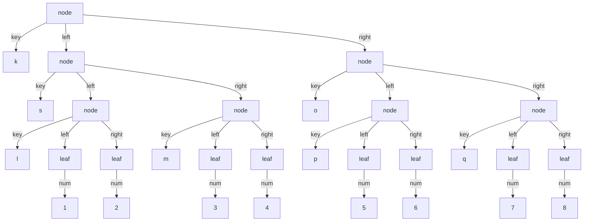

# Ejercicio: Árbol de Sintaxis Abstracta (AST) para árboles binarios

Dada la gramática de árbol binario:

```ebnf
<arbol-b> ::= <int>                    leaf(num)
          ::= <symbol> <arbol-b> <arbol-b>  node(key, left, right)
```

Construir los datatypes, parser y unparser. Además, construir el árbol AST de un árbol de al menos profundidad 3.

```scheme
#lang eopl
#|
Gramática de árbol binario:
<arbol-b> ::= <int>                    leaf(num)
          ::= <symbol> <arbol-b> <arbol-b>  node(key, left, right)
|#

;; Define el tipo de dato algebraico para árboles binarios
;; arbol-b?: predicado que verifica si un valor es un árbol binario
(define-datatype arbol-b arbol-b?
  (leaf (num number?))                    ; Hoja: contiene un número
  (node (key symbol?)                     ; Nodo: contiene una clave simbólica
        (left arbol-b?)                   ; subárbol izquierdo
        (right arbol-b?)))                ; subárbol derecho

;; AST de ejemplo: árbol binario con profundidad 3
;; Estructura completa con 8 hojas y 7 nodos internos
(define tree1
  (node
   'k                                     ; Nodo raíz con clave 'k
   (node 's                               ; Subárbol izquierdo con clave 's
         (node 'l (leaf 1) (leaf 2))     ; Subárbol izquierdo de 's
         (node 'm (leaf 3) (leaf 4)))    ; Subárbol derecho de 's
   (node 'o                               ; Subárbol derecho con clave 'o
         (node 'p (leaf 5) (leaf 6))     ; Subárbol izquierdo de 'o
         (node 'q (leaf 7) (leaf 8)))    ; Subárbol derecho de 'o
   )
  )

;; Representación en lista (sintaxis concreta) del mismo árbol
;; Esta es la forma que procesaría el parser
(define treeL
  '(node
    k
    (node s
          (node l (leaf 1) (leaf 2))
          (node m (leaf 3) (leaf 4)))
    (node o
          (node p (leaf 5) (leaf 6))
          (node q (leaf 7) (leaf 8)))
    )
  )

;; parser: lista (sintaxis concreta) → arbol-b (AST)
;; Convierte una representación en lista a un árbol binario AST
;; Implementación recursiva que sigue la estructura de la gramática
(define parser
  (lambda (lst)
    (if
     (equal? (car lst) 'leaf)             ; Si es una hoja
     (leaf (cadr lst))                    ; Construye leaf con el número
     (node                                ; Si es un nodo
      (cadr lst)                          ; Extrae la clave (símbolo)
      (parser (caddr lst))                ; Parsea recursivamente subárbol izquierdo
      (parser (cadddr lst)))              ; Parsea recursivamente subárbol derecho
     )
    )
  )

;; unparser: arbol-b (AST) → lista (sintaxis concreta)
;; Convierte un árbol binario AST a su representación como lista
;; Usa cases para reconocer el tipo de nodo
(define unparser
  (lambda (exp)
    (cases arbol-b exp
      (leaf (num) (list 'leaf num))       ; Hoja: (leaf número)
      (node (key left right)
            (list 'node                    ; Nodo: (node clave izquierdo derecho)
                  key
                  (unparser left)          ; Convierte subárbol izquierdo
                  (unparser right)))       ; Convierte subárbol derecho
      )
    )
  )
```

## Verificación del round-trip property

Para verificar que el parser y unparser son inversos:

```scheme
;; Verificación: (parser (unparser tree1)) debe ser igual a tree1
> (define tree1-unparsed (unparser tree1))
> (define tree1-reparsed (parser tree1-unparsed))
> (equal? (unparser tree1) (unparser tree1-reparsed))
#t
```

## Representación AST del árbol

El AST de `tree1` es:

```scheme
(define tree1
  (node
   'k
   (node 's
         (node 'l (leaf 1) (leaf 2))
         (node 'm (leaf 3) (leaf 4)))
   (node 'o
         (node 'p (leaf 5) (leaf 6))
         (node 'q (leaf 7) (leaf 8)))
   )
  )
```

## Representación gráfica del AST



## Conceptos teóricos importantes

1. **Profundidad del árbol**: La profundidad de `tree1` es 3, contando desde la raíz (nivel 0) hasta las hojas más profundas (nivel 3).

2. **Árbol binario completo**: Este ejemplo muestra un árbol binario completo donde cada nodo interno tiene exactamente dos hijos.

3. **Recursión estructural en el parser**: El parser implementa recursión estructural, procesando cada subárbol de la misma manera que el árbol completo.

4. **Posiciones de lista en Scheme**: 
   - `(car lst)`: primer elemento
   - `(cadr lst)`: segundo elemento (equivalente a `(car (cdr lst))`)
   - `(caddr lst)`: tercer elemento (equivalente a `(car (cdr (cdr lst)))`)
   - `(cadddr lst)`: cuarto elemento (equivalente a `(car (cdr (cdr (cdr lst))))`)

5. **Validación de entrada**: El parser asume que la entrada está bien formada. En una implementación robusta, se deberían agregar verificaciones de error.

## Tabla de resumen

Concepto | Descripción | Ejemplo en el ejercicio | Función
--- | --- | --- | ---
Tipo de dato algebraico | Definición de estructura de datos con variantes | `(define-datatype arbol-b ...)` | Especificar la forma de árboles binarios
AST (Árbol binario) | Representación estructurada en memoria | `tree1` con 7 nodos y 8 hojas | Almacenar datos jerárquicos
Sintaxis concreta | Representación serializable como lista | `treeL` | Intercambiar datos entre sistemas
Parser | Conversión de lista a AST | `(parser treeL)` | Validar y estructurar datos de entrada
Unparser | Conversión de AST a lista | `(unparser tree1)` | Serializar datos para salida
Recursión estructural | Patrón que sigue la forma del dato | `parser` y `unparser` | Procesar datos recursivos naturalmente
Profundidad del árbol | Longitud del camino más largo raíz-hoja | Profundidad 3 en `tree1` | Medir complejidad estructural
Round-trip property | Parser y unparser son inversos | `(parser (unparser ast)) = ast` | Garantizar consistencia

## Comentarios adicionales

1. **Diseño del parser**:
   - El parser actual asume entrada válida. En producción, se debe validar:
     - Que la lista no esté vacía
     - Que `'leaf` tenga exactamente un argumento numérico
     - Que `'node` tenga exactamente tres argumentos
     - Tipos correctos de los elementos

2. **Posibles mejoras**:
   ```scheme
   (define parser-robusto
     (lambda (lst)
       (cond
         [(null? lst) (error "Lista vacía")]
         [(equal? (car lst) 'leaf)
          (if (and (= (length lst) 2) (number? (cadr lst)))
              (leaf (cadr lst))
              (error "Formato de hoja inválido"))]
         [(equal? (car lst) 'node)
          (if (and (= (length lst) 4) (symbol? (cadr lst)))
              (node (cadr lst)
                    (parser-robusto (caddr lst))
                    (parser-robusto (cadddr lst)))
              (error "Formato de nodo inválido"))]
         [else (error "Formato desconocido")])))
   ```

3. **Aplicaciones de árboles binarios**:
   - Árboles de búsqueda binaria (BST)
   - Árboles de expresión aritmética
   - Árboles de decisión
   - Estructuras de datos jerárquicas

4. **Complejidad computacional**:
   - Tanto `parser` como `unparser` tienen complejidad O(n), donde n es el número de nodos
   - Visitan cada nodo exactamente una vez
   - La recursión puede causar desbordamiento de pila para árboles muy profundos

5. **Extensibilidad**:
   - Para agregar nuevos tipos de nodos, se modifica `define-datatype` y se actualizan `parser` y `unparser`
   - Ejemplo: agregar un nodo `empty` para árboles vacíos

6. **Testing**:
   - Probar con árboles de diferentes profundidades
   - Verificar el round-trip property para múltiples casos
   - Probar casos límite: árbol con un solo nodo, árbol degenerado (solo un lado)

Este ejercicio demuestra el patrón completo de procesamiento de datos estructurados: definición del tipo, construcción de valores, conversión desde/hacia representaciones externas, y manipulación de la estructura.