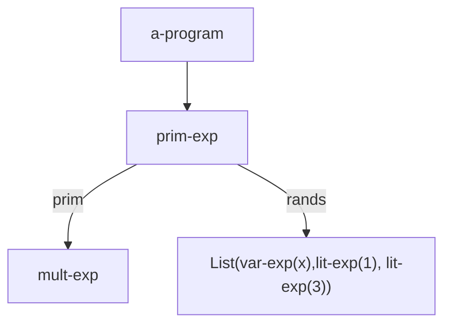
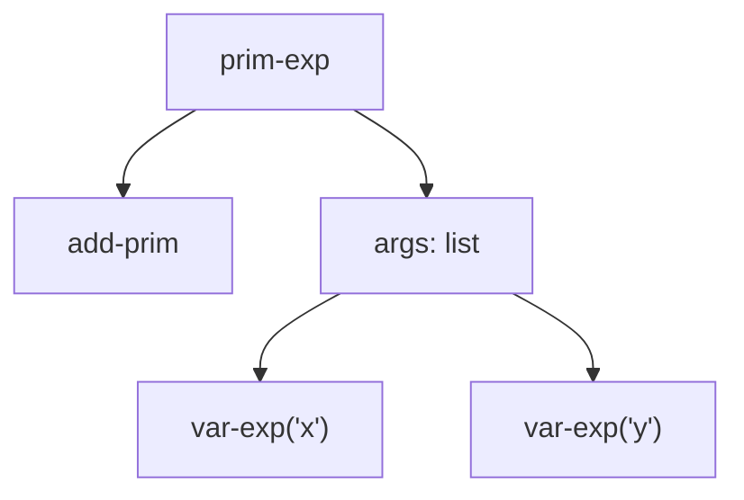
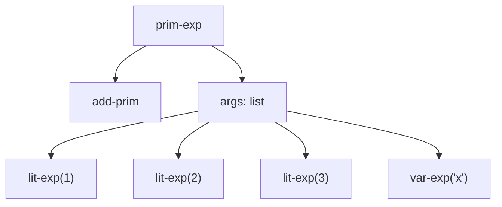

# Cómo es el proceso de interpretación o compilación

1. El texto de un programa es una secuencia de caracteres (lenguaje fuente o código fuente).
2. Los programas son pasados a través del **frontend**:
    1. Verifica la sintaxis del código; si no se cumple, da un error de sintaxis.
    2. Analiza el código y construye el **AST (Árbol de Sintaxis Abstracta)**, el cual permite que el programa sea interpretado o compilado.
3. **Intérprete**: Toma el AST y produce una salida. El intérprete está implementado en un lenguaje llamado **lenguaje de implementación** (o lenguaje de definición); por ejemplo, el intérprete de Python está escrito en C++. El código es portable.
4. **Compilador**: Toma un AST y lo transforma en **código de máquina** (para CPU) o **bytecode** (para máquina virtual). Un compilador tiene un **analizador** (extrae información útil del código) y un **traductor** (genera el código). El bytecode es código intermedio que luego es interpretado; es muy portable.
5. **Frontend**: Sin importar si va a compilar o interpretar, se requiere:
    1. **Scanning**: Extraer unidades significativas del código (tokens).
    2. **Parsing**: Toma los tokens y genera un AST.
6. **Scanner**: Recibe un string y genera una secuencia de tokens:
    1. Agrupa los caracteres en unidades significativas: números, identificadores, etc.
    2. Descarta información no relevante, como comentarios.
    3. Etiqueta las unidades significativas de acuerdo a su clase.

```scheme
*(x,1,3)

literal-string '* 1    ; Token: literal-string, valor: '*', línea 1
literal-string ( 1     ; Token: literal-string, valor: '(', línea 1
identifier 'x 1        ; Token: identifier, valor: 'x', línea 1
literal-string , 1     ; Token: literal-string, valor: ',', línea 1
number 1 1            ; Token: number, valor: 1, línea 1
literal-string , 1     ; Token: literal-string, valor: ',', línea 1
number 3 1            ; Token: number, valor: 3, línea 1
literal-string )      ; Token: literal-string, valor: ')', línea 1
```

7. **Parsing (análisis sintáctico)**:
    1. El parser recibe la secuencia de tokens.
    2. Da como salida el AST.
    3. En otro caso, si no es posible construir el AST, da un error de sintaxis.
8. Para el caso de los AST, los **símbolos terminales** están en las hojas del árbol, y los **no terminales** en los nodos internos.



## Conceptos teóricos adicionales

- **Lenguaje fuente vs. lenguaje objeto**: El lenguaje fuente es el que escribe el programador (ej. Python, Scheme). El lenguaje objeto es aquel al que se traduce (código máquina, bytecode, otro lenguaje de alto nivel).
- **Fases de un compilador**:
    1. **Frontend** (análisis): Léxico (scanner), sintáctico (parser), semántico (verificación de tipos, alcances).
    2. **Backend** (síntesis): Generación de código intermedio, optimización, generación de código final.
- **Máquina virtual**: Software que simula una CPU, ejecutando bytecode. Ejemplos: JVM (Java), CLR (.NET), BEAM (Erlang/Elixir).
- **Token**: Unidad léxica con un tipo y un valor. Ej: `NUMBER` con valor `42`, `IDENTIFIER` con valor `x`.
- **Error de sintaxis vs. error semántico**: El primero ocurre cuando el código no sigue la gramática del lenguaje; el segundo, cuando el código es sintácticamente correcto pero no tiene sentido (ej. sumar un número y un string).
- **Gramática libre de contexto**: Formalismo para describir la sintaxis de un lenguaje; se usa en el parsing para construir el AST.

## Tabla de resumen

| Concepto | Descripción | Ejemplo/Nota |
|----------|-------------|--------------|
| Código fuente | Secuencia de caracteres que conforman un programa en un lenguaje de programación. | Archivo `.py`, `.scm`. |
| Frontend | Parte del compilador/intérprete que analiza el código fuente. | Incluye scanner y parser. |
| Scanner (análisis léxico) | Convierte el código fuente en una secuencia de tokens, descartando espacios/comentarios. | Agrupa `123` como token `NUMBER`. |
| Token | Unidad léxica con tipo y valor; resultado del scanning. | `(IDENTIFIER, "x")`, `(NUMBER, 42)`. |
| Parser (análisis sintáctico) | Toma tokens y construye un AST según la gramática del lenguaje. | Detecta estructura de expresiones, declaraciones. |
| AST (Árbol de Sintaxis Abstracta) | Representación jerárquica de la estructura del programa, sin detalles léxicos. | Nodos: operaciones, hojas: literales/identificadores. |
| Intérprete | Ejecuta directamente el AST (o bytecode) y produce salida. | Python, Scheme, JavaScript (en navegadores). |
| Compilador | Traduce el AST a código objeto (máquina o bytecode). | GCC (C), javac (Java). |
| Lenguaje de implementación | Lenguaje en el que está escrito el intérprete/compilador. | CPython en C, muchos compiladores en C++. |
| Código de máquina | Instrucciones nativas de una CPU específica. | Binario ejecutable (`.exe`, sin extensión en Unix). |
| Bytecode | Código intermedio independiente de plataforma, ejecutado por una máquina virtual. | `.class` (Java), `.beam` (Erlang). |
| Máquina virtual | Software que ejecuta bytecode, abstractando el hardware. | JVM, CLR, BEAM. |
| Analizador (compilador) | Extrae información semántica del AST (tipos, alcances). | Chequeo de tipos, resolución de nombres. |
| Traductor (compilador) | Genera código objeto a partir del AST (posiblemente optimizado). | Generación de instrucciones máquina. |
| Error de sintaxis | Violación de las reglas gramaticales del lenguaje. | Falta paréntesis, palabra clave mal escrita. |
| Error semántico | Código sintácticamente correcto pero con significado inválido. | Tipo incorrecto, variable no declarada. |
| Símbolos terminales | Elementos básicos que no se descomponen más (tokens). | Números, identificadores, operadores. |
| Símbolos no terminales | Construcciones sintácticas que se expanden en otros símbolos. | Expresión, declaración, bloque. |

## Comentarios adicionales

- La distinción entre intérprete y compilador no es absoluta: muchos lenguajes usan enfoques híbridos (ej. Java compila a bytecode que luego se interpreta/JIT-compila).
- El AST es una representación intermedia crucial: permite aplicar optimizaciones, realizar análisis estático y facilitar la generación de código.
- El scanning y parsing son fases secuenciales, pero en implementaciones reales pueden solaparse (scanner on-demand) para eficiencia.
- Los errores detectados en el frontend (léxicos, sintácticos) son más fáciles de reportar al usuario que los errores en tiempo de ejecución.
- La portabilidad del bytecode viene al costo de overhead de ejecución en la máquina virtual, aunque técnicas como JIT (Just-In-Time) compilation reducen esta penalización.
- En el ejemplo del AST, `mult-exp` representa una operación de multiplicación, y `var-exp(x)`, `lit-exp(1)`, `lit-exp(3)` son los operandos (variable `x` y literales `1` y `3`).


# Ejemplo de Scanner y Generación de AST

## Expresión 1: `+(x,y)`

### Proceso de Scanning (Análisis Léxico)

El scanner procesa el string `"+(x,y)"` carácter por carácter:

| Carácter | Tipo de token  | Valor |
| -------- | -------------- | ----- |
| `+`      | literal-string | `"+"` |
| `(`      | literal-string | `"("` |
| `x`      | Identificador  | `"x"` |
| `,`      | literal-string | `","` |
| `y`      | Identificador  | `"y"` |
| `)`      | literal-string | `")"` |

### Proceso de Parsing (Análisis Sintáctico)

El parser toma la secuencia de tokens y construye el AST según la gramática:

**Gramática simplificada para expresiones:**
```
expression → operator "(" argument_list ")"
argument_list → expression ("," expression)*
expression → identifier | number
operator → "+" | "-" | "*" | "/"
```

**AST generado:**


## Expresión 2: `+(1,2,3,x)`

### Proceso de Scanning

El scanner procesa `"+(1,2,3,x)"`:

| Carácter | Tipo de token  | Valor |
| -------- | -------------- | ----- |
| `+`      | literal-string | `"+"` |
| `(`      | literal-string | `"("` |
| `1`      | Número         | `1`   |
| `,`      | literal-string | `","` |
| `2`      | Número         | `2`   |
| `,`      | literal-string | `","` |
| `3`      | Número         | `3`   |
| `,`      | literal-string | `","` |
| `x`      | Identificador  | `"x"` |
| `)`      | literal-string | `")"` |

### Proceso de Parsing

**AST generado:**



