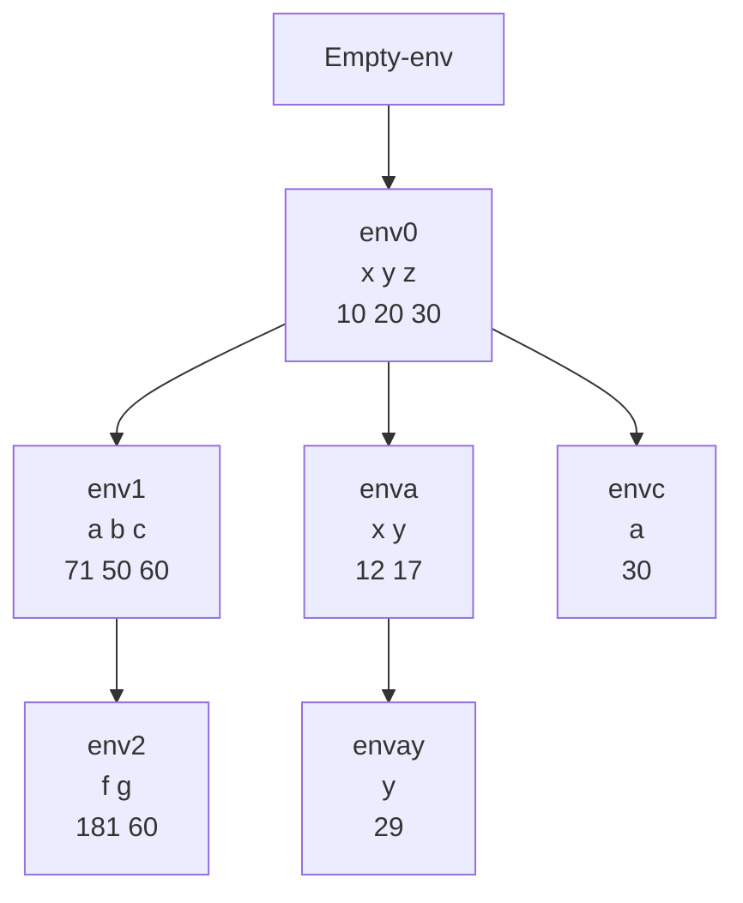

Asuma ambiente inicial vacio
```scheme
let
	x = 10
	y = 20
	z = 30
	in
		let
			a = let x = +(x,2) y = -(y,3) in let y = +(x,y) in +(x,y,z)
			b = +(z,y)
			c = if >(x,10) then +(x,10) else let a = +(x,y) in *(a,2)
		in
			let
				f = +(a,b,c)
				g = +(x,y,z)
				in
					+(f,g)
```
Resultado 241, hacer diagrama de ambientes



Sobre ambiente envay ejecutar $+(x,y,z) = (12,29,30) = 71$
Sobre ambiente envc ejecutar $*(2,a) = 60$
Sobre ambiente env2 ejecutar $+(f,g)=+(181,60)=241$