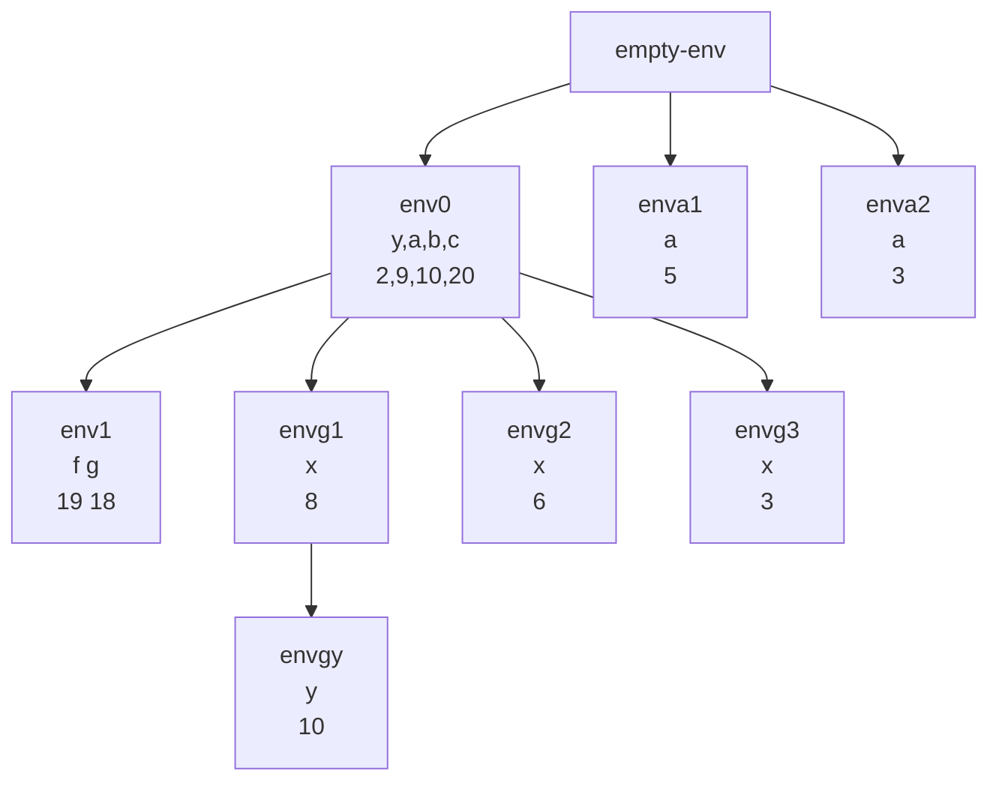

Asuma como ambiente inicial

```scheme
let 
    y = 2
	a = let a = let a = 3 in +(a,2)
	        in +(a,4) 
	b = 10
	c = 20
	in let
		f = if >(a,5) then +(a,b) else let k = +(a,b) in *(k,2)
		g = let x = 
				let x = let x = 3 in +(x,3)
		            in +(x,y)
		        in let y = +(x,2) in +(x,y)
		in
			+(a,b,c,f,g)
```
Solucion 76 Dibujar el diagrama de ambientes



Sobre el ambiente enva2, vamos a evaluar $+(a,2)$ que nos da 5

Ahora evaluamos en el ambiente enva1, $+(a,4)$ que nos da 9

Sobre el ambiente envg3 vamos a evaluar $+(x,3)$ que nos da 6

Sobre el ambiente envg2 vamos a evaluar $+(x,y)$ que nos da 8

Sobre el ambiente envg1 vamos a evaluar let y = +(x,2) in +(x,y)

Sobre el ambiente envgy evaluo $+(x,y)$ nos da 18

Sobre el ambiente env1 voy a evaluar $+(a,b,c,f,g) = +(9,10,20,19,18) = 76$
