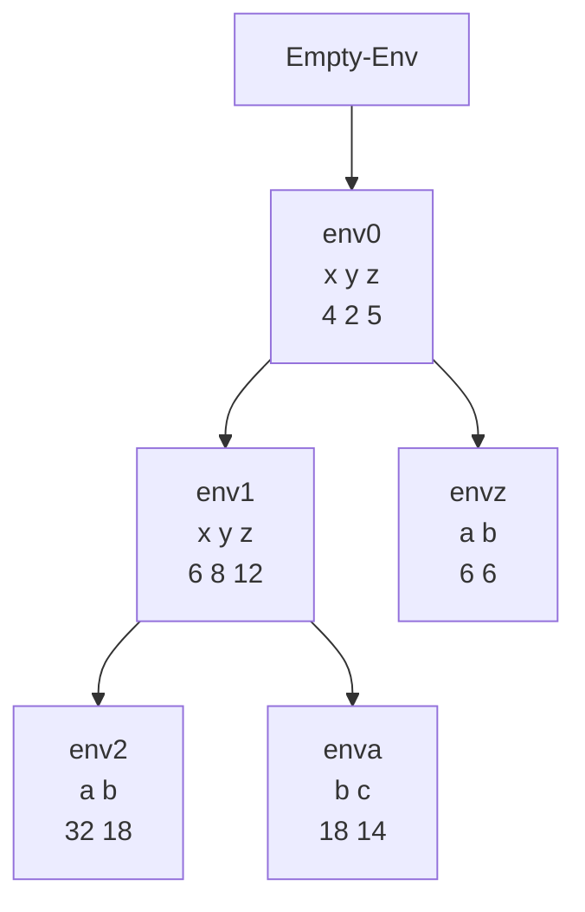

# Ligaduras

Hasta el momento solo hemos podido trabajar con un ambiente inicial que tiene un conjunto de ligaduras predefinido; no podemos cambiar ni agregar más ligaduras. Para superar esta limitación, introducimos la expresión `let`.

## Extensión de la gramática

```scheme
    ; Expresión let para crear ligaduras locales
    (expresion ("let" (arbno identificador "=" expresion) "in" expresion) let-exp)
```

## Cambios en el evaluador

```scheme
      (let-exp (ids rands body)
               (let
                   (
                    ; Evaluamos todas las expresiones del lado derecho en el ambiente actual
                    (lvalues (map (lambda (x) (evaluar-expresion x amb)) rands))
                    )
                 ; Extendemos el ambiente con las nuevas ligaduras y evaluamos el cuerpo
                 (evaluar-expresion body (ambiente-extendido ids lvalues amb))
                 )
               )
      )
```

## Conceptos teóricos

Las **ligaduras** (bindings) son asociaciones entre identificadores y valores que existen dentro de un **ambiente** (environment). El `let` es una construcción fundamental que permite:

1. **Crear ámbitos léxicos locales:** Las variables definidas en un `let` solo son visibles dentro de su cuerpo (después del `in`).
2. **Extender ambientes:** Cada `let` crea un nuevo ambiente que extiende al ambiente actual con nuevas ligaduras.
3. **Evaluación en paralelo:** Todas las expresiones del lado derecho se evalúan en el ambiente **actual** (antes de crear las nuevas ligaduras).
4. **Shadowing (ocultamiento):** Si un identificador en el `let` ya existe en el ambiente, la nueva ligadura oculta la anterior dentro del cuerpo del `let`.

La semántica del `let` es **no recursiva**: las expresiones del lado derecho no pueden referirse a los identificadores que se están definiendo en el mismo `let` (para eso se necesitaría `letrec`).

## Ejemplo

Suponga el ambiente inicial con `(x, y, z)` con valores `(4, 2, 5)`:

```scheme
let
    x = +(x,2)
    y = +(z,3)
    z = let
            a = +(z,1)
            b = +(x,2)
        in
            +(a,b)
in
    let
        a = let
                b = +(x,z)
                c = +(x,y)
            in
                +(b,c)
        b = +(x,z)
    in
        *(x,y)
```

## Diagrama de ambientes



## Explicación del diagrama

- **env0**: Ambiente inicial con `x=4, y=2, z=5`
- **env1**: Se crea al evaluar el primer `let`:
  - `x = +(4,2) = 6` (usa `x` de env0)
  - `y = +(5,3) = 8` (usa `z` de env0)
  - `z`: se evalúa como una expresión `let` interna
- **envz**: Ambiente para el `let` interno que define `z`:
  - `a = +(5,1) = 6` (usa `z` de env0)
  - `b = +(4,2) = 6` (usa `x` de env0)
  - Resultado: `+(6,6) = 12`
- **env2**: Segundo `let` en el cuerpo principal:
  - `a`: se evalúa como otro `let` interno
  - `b = +(6,12) = 18` (usa `x` y `z` de env1)
- **enva**: Ambiente para el `let` interno que define `a`:
  - `b = +(6,12) = 18` (usa `x` y `z` de env1)
  - `c = +(6,8) = 14` (usa `x` y `y` de env1)
  - Resultado: `+(18,14) = 32`

**Puntos importantes:**
- La expresión `+(a,b)` se evalúa en el ambiente envz.
- La expresión `+(b,c)` se evalúa en el ambiente enva.
- Sobre env2 vamos a evaluar `*(x,y)` = `*(6,8) = 48`.

**Regla clave:** Un ambiente se extiende **después** del `in` de un `let`. Antes del `in`, todas las expresiones se evalúan en el ambiente actual.

## Tabla de resumen

| Concepto | Descripción | Ejemplo/Notas |
|----------|-------------|---------------|
| **Ligadura (Binding)** | Asociación entre un identificador y un valor en un ambiente. | `x = 5` crea una ligadura de `x` al valor `5`. |
| **Ambiente (Environment)** | Conjunto de ligaduras visibles en un punto del programa. | Estructura jerárquica que se extiende. |
| **Expresión `let`** | Construcción que crea ligaduras locales con ámbito léxico. | `let x = 5 in +(x,1)` |
| **Extensión de ambiente** | Creación de un nuevo ambiente que añade ligaduras a uno existente. | `ambiente-extendido` en la implementación. |
| **Evaluación en paralelo** | Todas las expresiones en `let` se evalúan en el ambiente actual. | No hay referencias cruzadas entre definiciones. |
| **Shadowing (Ocultamiento)** | Una ligadura nueva oculta una anterior con el mismo nombre. | Útil para redefinir variables localmente. |
| **Ámbito léxico** | Las variables son visibles solo dentro de su ámbito de definición. | Determinado por la estructura anidada del código. |

## Comentarios adicionales

- El `let` implementado sigue la semántica estándar de **let no recursivo** (Scheme's `let` vs `let*`).
- La evaluación de las expresiones del lado derecho ocurre **antes** de crear las nuevas ligaduras, lo que evita referencias circulares.
- Los ambientes forman una **estructura jerárquica** (árbol) donde cada nuevo ambiente apunta a su padre.
- El **shadowing** es una característica importante que permite reutilizar nombres sin afectar ligaduras externas.
- En la práctica, los ambientes suelen implementarse como listas de marcos (frames) o diccionarios encadenados.
- La complejidad de la búsqueda de variables depende de la profundidad del ambiente, pero normalmente es eficiente.
- Esta implementación de `let` es fundamental para construir abstracciones y manejar estado local en programas más grandes.