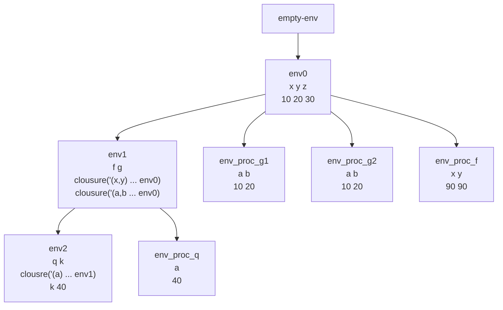

Los procedimientos nos permite reutilizar partes del código, es importante en Programación Funcional entender dos cosas

1. Los procedimientos son valores
2. Los procedimientos son deterministas

Para representarlos vamos a usar las clausuras

1. Lista de identificadores (argumentos)
2. Cuerpo del procedimiento (su expresion)
3. El ambiente de creación: Para garantizar consistencia, un procedimiento debe dar el mismo valor con los mismos argumentos sin importar donde fue llamado, esto es un problemas que tenemos con las ligaduras libres (resuelven buscando en el ambiente)

Y posteriormente a la hora de evauarlos evaluamos el cuerpo del procedimiento en un ambiente extendido del ambiente de creacion que incluye los identificadores y los valores que enviamos

En la gramatica vamos a considerar

```scheme
    (expresion ("proc" "(" (separated-list identificador ",") ")" expresion) proc-exp)
    (expresion ("(" expresion (arbno expresion) ")") app-exp)

```

Ahora en el evaluador

```scheme
      (proc-exp (ids body)
                (closure ids body amb))
      (app-exp (rator rands)
               (let
                   (
                    (lrands (map (lambda (x) (evaluar-expresion x amb)) rands))
                    (procV (evaluar-expresion rator amb))
                    )
                 (if
                  (procval? procV)
                  (cases procval procV
                    (closure (lid body old-env)
                             (if (= (length lid) (length lrands))
                                 (evaluar-expresion body
                                                (ambiente-extendido lid lrands old-env))
                                 (eopl:error "El número de argumentos no es correcto, debe enviar" (length lid)  " y usted ha enviado" (length lrands))
                                 )
                             ))
                  (eopl:error "No puede evaluarse algo que no sea un procedimiento" procV) 
                  )
                 )
               )
      )

    )
  )

```

Ya con esto podemos escribir cosas como

```scheme
let
	f = proc(x,y) +(x,y)
	in
		(f 10 20)

```

# Ejemplo

Suponga ambiente inicial vacio

```scheme
let
	x = 10
	y = 20
	z = 30
in
	let
		f = proc(x,y) +(x,y,z)
		g = proc(a,b) +(a,b,x,y,z)
	in
		let
		q = proc(a) (f (g x y) (g x y))
		k = 40
		in
			(q k)

```

Respuestas 210



Sobre env2 voy a evaluar (q k), que es (q 40)

Sobre el envprocq voy a evaluar (f (g x y) (g x y)) que es equivalente (f (g 10 20) (g 10 20))

Sobre el ambiente envprocg1 voy a evaluar +(a,b,x,y,z), +(10,20,10,20,30) = 90

Aqui hemos resuelto el primer llamado en envprocq1 (f 90 (g 10 20))

De forma similar resolvemos para envprocg2, y en envprocq ya tenemos (f 90 90)

Sobre el ambiente envprocf evaluamos +(x,y,z), que da +(90,90,30) = 210