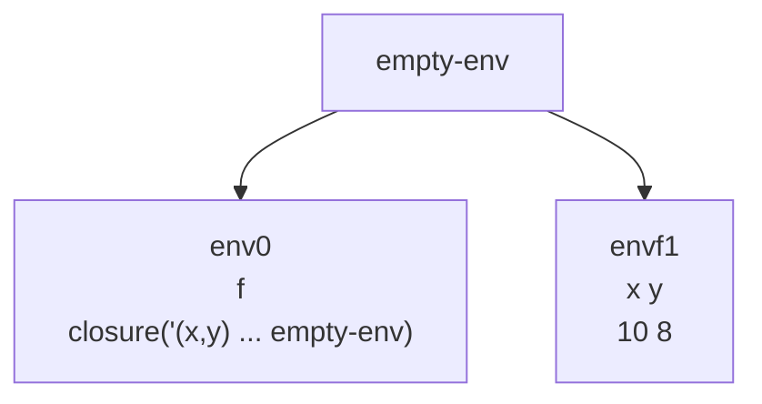

Hasta ahora los procedimientos no se pueden conocer a si mismos dado que la clausura almacena el ambiente anterior, ejemplo

```scheme
let
	f = proc(x,y) if >(x,0) +(y, f(sub1(x),y)) else y
	x = 10
	y = 8
in
	(f x y)
```

Al evaluar tenemos esto



Sobre el ambiente envf1 voy a evaluar

```scheme
if >(x,0) +(y, (f sub1(x) y)) else y
if >(10,0) +(y, (f sub1(x) y)) else y
 +(y, f(sub1(x),y)) 
+(8, f(9,8)) 
```
Al intentar buscar f en este ambiente, terminamos en el ambiente vacio lo que produce un error

# Temas

1. [Cambios interprete proc recursivos](Cambios%20interprete%20proc%20recursivos.md)
2. [Ejemplo](Ejemplo.md)
3. [Ejercicio](Ejercicio.md)
