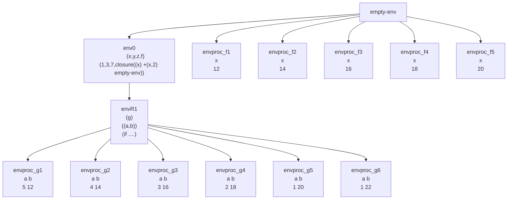

# Ejemplo de evaluación con `letrec`

Suponga el ambiente inicial `env0`:

```scheme
(x, y, z, f)
(1, 3, 7, closure((x) +(x, 2) empty-env))
```

Evaluar la siguiente expresión:

```scheme
let
    p = 5
    q = 12
in
    letrec
        g(a, b) = if >(a, 0) then +(b, (g sub1(a) (f b))) else 0
    in
        (g p q)
```

**Resultado:** 80



## Explicación paso a paso

1. Sobre el ambiente `envR1` evaluamos `(g p q)` que será `(g 5 12)`.
2. Esto hace que se busque `g` en el ambiente extendido recursivo, lo que produce una clausura `(closure (a, b) if... envR1)`. Aquí la clausura extiende del mismo ambiente extendido recursivo.
3. Sobre el ambiente `envproc_g1` vamos a evaluar `if >(a, 0) then +(b, (g sub1(a) (f b))) else 0`. La condición `>(5, 0)` es verdadera, por lo que se ejecuta `+(12, (g 4 (f 12)))`. `(f 12)` nos produce `14`, entonces se ejecuta `+(12, (g 4 14))`. Tener en cuenta que hay una suma pendiente `+(12, resultado siguiente llamado)`.
4. Esto genera otro ambiente `envproc_g2` donde `a = 4`, `b = 14`. Esto produce el mismo efecto que el anterior, lo que nos da `+(14, (g 3 16))`.
5. Siguiendo el patrón, los siguientes llamados son `(g 2 18)`, `(g 1 20)` y `(g 0 22)`, y para `f` son `(f 16)`, `(f 18)` y `(f 20)`.
6. El último llamado `(g 0 22)` retorna `0` y nos queda la suma acumulada así: `+(12, 14, 16, 18, 20, 0) = 80`.

## Conceptos teóricos y ajustes

### 1. Anidamiento de ámbitos
El ejemplo muestra un **let** dentro de un **letrec**. El `let` externo define variables simples (`p`, `q`), mientras que el `letrec` interno define el procedimiento recursivo `g`. Esto ilustra cómo los ambientes se anidan: `envR1` extiende el ambiente creado por el `let`, que a su vez extiende `env0`.

### 2. Clausuras y ambientes de evaluación
Cuando se invoca `g`, se crea una clausura que captura `envR1`. Esta clausura se aplica con argumentos `5` y `12`, creando `envproc_g1`. La importancia es que **cada llamada recursiva genera un nuevo ambiente de procedimiento**, pero todos comparten la misma clausura original que apunta a `envR1`.

### 3. Recursión y acumulación de resultados
El procedimiento `g` implementa recursión con **acumulación en la pila de llamadas**. Cada llamada recursiva deja pendiente una suma `+(b, ...)`, y cuando se alcanza el caso base (`a = 0`), se desapilan todas las sumas acumuladas.

### 4. Interacción con procedimientos externos
`g` llama al procedimiento `f` definido en `env0`. Esto muestra cómo los ambientes permiten acceso a definiciones externas, manteniendo el **encadenamiento estático** (lexical scoping).

### 5. Traza de evaluación
El diagrama mermaid ilustra claramente:
- La jerarquía de ambientes
- Los múltiples ambientes de procedimiento creados para cada llamada recursiva
- Los ambientes creados para las llamadas a `f`
- Cómo `envR1` permanece accesible para todas las clausuras de `g`

# Tabla de resumen

| Concepto | Descripción | Ejemplo en el código |
|----------|-------------|----------------------|
| Ambiente inicial (`env0`) | Contiene variables simples y una clausura para `f`. | `(x=1, y=3, z=7, f=closure((x) +(x,2) empty-env))` |
| `let` simple | Define variables no recursivas en un nuevo ámbito. | `p = 5, q = 12` |
| `letrec` | Define procedimientos recursivos/mutuamente recursivos. | `g(a,b) = if >(a,0) then ...` |
| Ambiente extendido recursivo (`envR1`) | Ambiente especial que pospone creación de clausuras. | Almacena definición de `g` para generarla bajo demanda. |
| Clausura recursiva | Clausura que captura el ambiente recursivo donde se definió. | `closure((a,b) if... envR1)` |
| Llamada recursiva | Invocación de un procedimiento desde su propio cuerpo. | `(g sub1(a) (f b))` dentro del cuerpo de `g` |
| Ambiente de procedimiento | Ambiente creado al aplicar una clausura con argumentos. | `envproc_g1`, `envproc_g2`, etc. |
| Caso base | Condición que detiene la recursión. | `if >(a,0) ... else 0` cuando `a = 0` |
| Acumulación en pila | Resultados que se acumulan durante el desapilado recursivo. | `+(12, +(14, +(16, +(18, +(20, 0)))))` |

# Comentarios adicionales

- Este ejemplo ilustra **recursión lineal** donde cada llamada reduce un parámetro (`a`) hasta llegar al caso base. El patrón es común en funciones que procesan estructuras lineales.
- La evaluación muestra **orden de evaluación aplicativo**: los argumentos `(f b)` y `sub1(a)` se evalúan completamente antes de la llamada recursiva.
- El resultado final (80) surge de sumar los valores de `b` en cada llamada recursiva: 12 + 14 + 16 + 18 + 20 = 80. El 0 del caso base no contribuye a la suma.
- La eficiencia podría mejorarse con **recursión de cola** (tail recursion), donde el resultado se acumula en un parámetro adicional en lugar de en la pila de llamadas.
- El diagrama evidencia la **explosión de ambientes** en evaluaciones recursivas profundas, lo que justifica optimizaciones como **entornos de vinculación estáticos** en implementaciones reales.