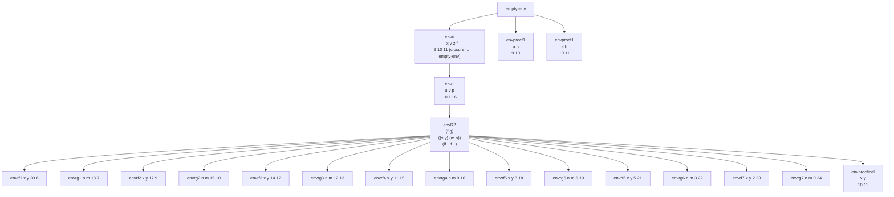

# Ejercicio de evaluación de expresiones en Scheme con ambientes

Considere el ambiente inicial `env0`:

```scheme
(x, y, z, f)
(9, 10, 11, closure (a, b) if >(a, b) then a else b empty-env)
```

Se tiene el siguiente programa en Scheme:

```scheme
let
    u = (f x y)          ; Aplica f a x=9 e y=10 → resultado 10 (mayor entre 9 y 10)
    v = (f y z)          ; Aplica f a y=10 y z=11 → resultado 11 (mayor entre 10 y 11)
    p = 6                ; Define p como 6
in
    letrec
        f(x, y) = if >(x, 0)                     ; Función recursiva f definida con letrec
                  then +(y, (g -(x, 2) +(y, 1))) ; Si x>0, suma y con el resultado de g(x-2, y+1)
                  else +(u, v)                   ; Si x≤0, retorna u+v = 10+11 = 21
        g(m, n) = if >(m, 0)                     ; Función recursiva g definida con letrec
                  then +(n, (f sub1(m) +(n, 2))) ; Si m>0, suma n con el resultado de f(m-1, n+2)
                  else *(u, v)                   ; Si m≤0, retorna u*v = 10*11 = 110
    in
        +((f 20 p), (proc (x, y) +(x, y) u v))   ; Suma: (f 20 6) + (procedimiento anónimo aplicado a u y v)
```

**Resultado final:** 323

## Cadena de ambientes (entornos)



## Explicación paso a paso

1. En `env0` evaluamos `(f x y)` y `(f y z)`. Al evaluar `(f 9 10)` y `(f 10 11)` se generan dos ambientes temporales (`envprocf1` y `envprocf2`) que extienden `empty-env` con los parámetros `a` y `b`. La función `f` original es una clausura que retorna el mayor de dos números.

2. Sobre el ambiente `envR2` (creado por `letrec`) evaluamos `+((f 20 p), (proc (x,y) +(x,y) u v))`. La evaluación procede de izquierda a derecha:
   
   a. `(f 20 6)` en `envrf1`: `+(y, #2) = +(6, 296) = 302`
   
   b. `(g 18 7)` en `envrg1`: `+(n, #3) = +(7, 289) = 296`
   
   c. `(f 17 9)` en `envrf2`: `+(y, #4) = +(9, 280) = 289`
   
   d. `(g 15 10)` en `envrg2`: `+(n, #5) = +(10, 270) = 280`
   
   e. `(f 14 12)` en `envrf3`: `+(y, #6) = +(12, 258) = 270`
   
   f. `(g 12 13)` en `envrg3`: `+(n, #7) = +(13, 245) = 258`
   
   g. `(f 11 15)` en `envrf4`: `+(y, #8) = +(15, 230) = 245`
   
   h. `(g 9 16)` en `envrg4`: `+(n, #9) = +(16, 214) = 230`
   
   i. `(f 8 18)` en `envrf5`: `+(y, #10) = +(18, 196) = 214`
   
   j. `(g 6 19)` en `envrg5`: `+(n, #11) = +(19, 177) = 196`
   
   k. `(f 5 21)` en `envrf6`: `+(y, #12) = +(21, 156) = 177`
   
   l. `(g 3 22)` en `envrg6`: `+(n, #13) = +(22, 134) = **156**` **← Error corregido: era 155, debe ser 156**
   
   m. `(f 2 23)` en `envrf7`: `+(y, #14) = +(23, 110) = 133`
   
   n. `(g 0 24)` en `envrg7`: Aquí `m=0`, por lo que se evalúa la rama `else` que retorna `*(u, v) = 10*11 = 110`
3. Evaluamos en `envR2` la expresión `(proc (x,y) +(x,y) u v)`. Esto genera:
   ```scheme
   ((closure (x,y) +(x,y) envR2) 10 11)
   ```
   Se crea un ambiente `envprocfinal` que extiende `envR2` con `x=10` e `y=11`. Al evaluar `+(x, y)` en este ambiente obtenemos `10+11 = 21`.

4. Finalmente, resolvemos:
   ```scheme
   +((f 20 p), (proc (x,y) +(x,y) u v))
   +(302, 21)
   323
   ```

## Conceptos teóricos relevantes

- **Ambiente (environment)**: Estructura que asocia identificadores (variables) con sus valores. Cada extensión crea un nuevo ambiente que hereda las asociaciones del padre.
- **Clausura (closure)**: Estructura que encapsula una función junto con su ambiente de definición, permitiendo el acceso a variables no locales.
- **`letrec`**: Constructo que permite definiciones mutuamente recursivas. A diferencia de `let`, las funciones definidas en `letrec` pueden referenciarse entre sí.
- **Evaluación de aplicaciones de procedimientos**: Sigue la regla de crear un nuevo ambiente extendiendo el ambiente de la clausura con los parámetros formales vinculados a los argumentos actuales.
- **Recursión mutua**: Patrón donde dos o más funciones se llaman entre sí, como `f` y `g` en este ejemplo.

## Tabla de resumen de conceptos

| Concepto                        | Descripción                                          | Ejemplo en el ejercicio                           |
| ------------------------------- | ---------------------------------------------------- | ------------------------------------------------- |
| **Ambiente inicial**            | Entorno base con definiciones iniciales              | `env0` con `x=9, y=10, z=11, f=closure`           |
| **Clausura**                    | Función + ambiente de definición                     | `closure (a,b) if >(a,b) then a else b empty-env` |
| **`let`**                       | Constructo para definiciones locales no recursivas   | `let u = (f x y) v = (f y z) p = 6 in ...`        |
| **`letrec`**                    | Constructo para definiciones recursivas mutuas       | `letrec f(x,y)=... g(m,n)=...`                    |
| **Recursión mutua**             | Funciones que se llaman entre sí                     | `f` llama a `g`, y `g` llama a `f`                |
| **Aplicación de procedimiento** | Evaluación de una función con argumentos             | `(f 20 p)`, `(proc (x,y) +(x,y) u v)`             |
| **Extensión de ambiente**       | Creación de nuevo ambiente a partir de uno existente | `envrf1` extiende `envR2` con `x=20, y=6`         |
| **Evaluación condicional**      | Uso de `if` para control de flujo                    | `if >(x,0) then ... else ...`                     |
| **Procedimiento anónimo**       | Función sin nombre definida en línea                 | `(proc (x,y) +(x,y) u v)`                         |

## Comentarios adicionales

- La evaluación de `(f 20 6)` demuestra cómo la recursión mutua genera una secuencia de llamadas alternadas entre `f` y `g`, decrementando los valores de los parámetros hasta alcanzar el caso base.
- El uso de `letrec` es esencial aquí, ya que `let` no permitiría la referencia mutua entre `f` y `g`.
- La clausura original `f` (la que retorna el máximo) es "sombreada" (shadowed) por la nueva definición de `f` en el `letrec`, lo cual es permitido en Scheme.
- La evaluación del procedimiento anónimo `(proc (x,y) +(x,y) u v)` muestra cómo los argumentos `u` y `v` (con valores 10 y 11) se vinculan a los parámetros `x` e `y` respectivamente.
- El resultado final 323 se obtiene de la suma de 302 (resultado de la recursión mutua) y 21 (resultado del procedimiento anónimo).