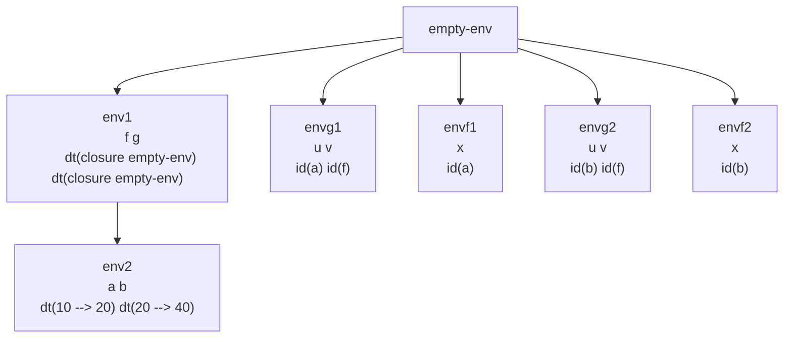

# Ejemplo de Paso por Referencia

Suponga **paso por referencia** para la siguiente expresión:

```scheme
let
    f = proc(x)  ; Procedimiento que duplica su argumento por referencia
        begin
            set x = *(2, x);  ; Modifica la variable referenciada por x, duplicando su valor
            x                 ; Retorna el nuevo valor de x
        end
    g = proc(u, v)  ; Procedimiento que aplica v a u y suma el resultado a u
        begin
            set u = +(u, (v u));  ; u = u + (v aplicado a u). v debe ser un procedimiento.
            u                     ; Retorna el nuevo valor de u
        end
in
    let
        a = 10
        b = 20
    in
        +((g a f), (g b f))  ; Suma el resultado de aplicar g a 'a' y a 'b' con 'f'
```

**Resultado:** 90



## Evaluación Paso a Paso (Paso por Referencia)

1.  **Primera llamada `(g a f)`:** Se crea el ambiente `G1` donde `u` es una referencia a `a` (valor 10) y `v` es una referencia a `f`.
2.  **En `G1` se evalúa `+(u, (v u))`:** El orden de evaluación es **de izquierda a derecha**.
    *   Primero se evalúa `u` → 10.
    *   Luego se evalúa `(v u)` → esto es `(f a)`.
        *   Se crea el ambiente `F1` donde `x` es una referencia a `a`.
        *   Se ejecuta `set x = *(2, x)`: Esto modifica la celda a la que apuntan `x` y `a`, cambiando su valor de **10 a 20**.
        *   `f` retorna el nuevo valor de `x` (que es el de `a`): **20**.
    *   Ahora en `G1` podemos resolver `+(10, 20) = 30`.
    *   La asignación `set u = 30` modifica la celda de `a` a **30**. `g` retorna 30.
    *   **Estado actual:** `a = 30`, `b = 20`.

3.  **Segunda llamada `(g b f)`:** Se crea el ambiente `G2` donde `u` es una referencia a `b` (valor 20) y `v` es una referencia a `f`.
4.  **En `G2` se evalúa `+(u, (v u))`:**
    *   Primero se evalúa `u` → 20.
    *   Luego se evalúa `(v u)` → esto es `(f b)`.
        *   Se crea el ambiente `F2` donde `x` es una referencia a `b`.
        *   Se ejecuta `set x = *(2, x)`: Esto modifica la celda de `b`, cambiando su valor de **20 a 40**.
        *   `f` retorna **40**.
    *   En `G2` resolvemos `+(20, 40) = 60`.
    *   La asignación `set u = 60` modifica la celda de `b` a **60**. `g` retorna 60.
    *   **Estado final:** `a = 30`, `b = 60`.

5.  **Evaluación final en `env2`:** Se calcula `+((g a f), (g b f))` → `+(30, 60)` = **90**.

---

## Importancia del Orden de Evaluación

**PILAS:** Si cambiamos `+(u, (v u))` por `+((v u), u)` en la definición de `g`, el resultado sería **120**. Esto demuestra que el orden de evaluación de los sub-expresiones con efectos laterales **afecta el resultado final**.

**Explicación del cambio:**
Con `+((v u), u)` en `(g a f)`:
1.  Primero se evalúa `(v u)` (`(f a)`), que cambia `a` de 10 a 20 y retorna 20.
2.  Luego se evalúa `u`, que ahora vale 20.
3.  La suma es `+(20, 20) = 40`, y `a` queda en 40.
Un proceso similar para `b` llevaría a `b = 80`. La suma final sería `+(40, 80) = 120`.

---

## Tabla de Resumen de Conceptos

| Concepto | Descripción | Implicación en el Ejemplo |
| :--- | :--- | :--- |
| **Paso por Referencia en Llamadas** | Los parámetros `u` y `v` en `g`, y `x` en `f`, reciben referencias a las variables del llamador (`a`, `b`, `f`). | Las modificaciones con `set` dentro de `f` y `g` afectan directamente a `a` y `b` en el ambiente exterior. |
| **Aliasing** | Múltiples nombres (`u` en `G1` y `x` en `F1`) se refieren a la misma celda mutable (`a`). | Un cambio a través de un alias (`x`) es visible inmediatamente a través del otro (`u`). |
| **Orden de Evaluación** | El orden en que se evalúan los operandos de una operación (ej., `+`) es crucial cuando estos tienen efectos laterales. | Cambiar de `+(u, (v u))` a `+((v u), u)` produce resultados diferentes (90 vs 120) porque cambia el momento en que se lee el valor de `u`. |
| **Efectos Laterales Acumulativos** | Un procedimiento puede modificar su argumento, y ese cambio persiste para futuras operaciones. | `f` modifica su argumento, y ese valor modificado es usado luego en la suma dentro de `g`. |
| **Procedimientos como Argumentos** | Un procedimiento (`f`) puede pasarse como argumento a otro procedimiento (`g`). | Esto permite una gran flexibilidad. `g` es un procedimiento de orden superior que aplica un procedimiento `v` a su argumento `u`. |
| **Estado Mutable Global** | El estado de las variables `a` y `b` evoluciona a lo largo de la evaluación completa del programa. | No podemos entender el valor de `(g a f)` solo mirando su código; debemos rastrear el **historial de modificaciones** de `a`. |

## Comentarios Adicionales sobre el Tema

*   **Depuración Compleja:** Programar con paso por referencia y efectos laterales hace que el flujo de datos sea menos obvio. Depurar requiere rastrear no solo el valor de las variables, sino también **qué alias existen** para ellas en cada punto del programa.
*   **Semántica Definida del Lenguaje:** El ejemplo subraya por qué los lenguajes de programación deben definir explícitamente su **orden de evaluación** (e.g., izquierda-a-derecha, derecho-a-izquierda, no especificado). En lenguajes con efectos laterales, un orden no especificado puede llevar a resultados no portables.
*   **Diseño de APIs:** Al diseñar procedimientos que modifican sus argumentos (como `f` y `g`), es una buena práctica documentar claramente este comportamiento. Muchos estilos de programación modernos prefieren evitar la modificación de argumentos y, en su lugar, **retornar nuevos valores**, para hacer el código más predecible y fácil de razonar.
*   **Optimizaciones y Efectos Laterales:** Los compiladores tienen dificultades para optimizar código con efectos laterales impredecibles. Por ejemplo, no pueden reordenar ni eliminar llamadas a procedimientos si no pueden probar que son libres de efectos laterales (que no modifican estado observable).