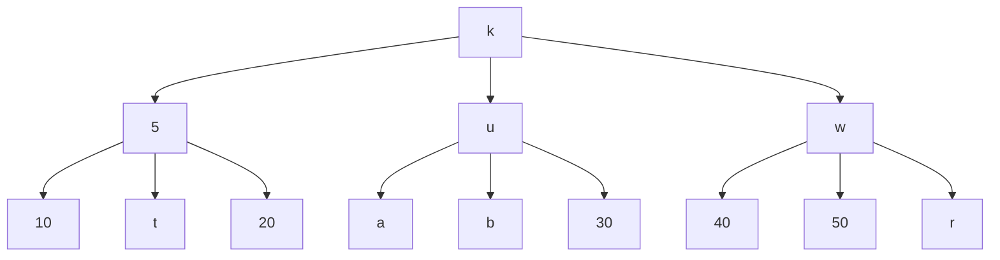

# Ejercicio: Definición de Árboles con Variantes Mixtas

## Enunciado
Generar una definición de datos para árboles bajo la siguiente especificación:

```ebnf
<arbol-t> ::= <int>   
              leaf-int(num)
          ::= <symbol>
              leaf-symbol(sym)
          ::= <symbol> <arbol-t> <arbol-t> <arbol-t>
              node-sym(key,h1,h2,h3)
          ::= <int> <arbol-t> <arbol-t> <arbol-t>
              node-int(key,h1,h2,h3)
```

Realizar el `define-datatype`, definir un árbol de al menos profundidad 2 balanceado combinando los tipos de nodos y hojas, y crear las funciones:
1. `arbol-t->listsym` - extrae todos los símbolos del árbol
2. `arbol-t->num` - suma de todos los números en el árbol

## Solución

### Definición del Tipo de Dato `arbol-t`

```scheme
#lang eopl
#|
<arbol-t> ::= <int>   
              leaf-int(num)
          ::= <symbol>
              leaf-symbol(sym)
          ::= <symbol> <arbol-t> <arbol-t> <arbol-t>
              node-sym(key,h1,h2,h3)
          ::= <int> <arbol-t> <arbol-t> <arbol-t>
              node-int(key,h1,h2,h3)
|#

;; Definición del tipo de dato árbol con variantes mixtas
(define-datatype arbol-t arbol-t?
  (leaf-int (num number?))       ; Hoja que contiene un número entero
  (leaf-sym (sym symbol?))       ; Hoja que contiene un símbolo
  (node-sym                      ; Nodo con clave simbólica y tres hijos
   (key symbol?)                ; Clave del nodo (símbolo)
   (h1 arbol-t?)                ; Primer hijo (árbol)
   (h2 arbol-t?)                ; Segundo hijo (árbol)
   (h3 arbol-t?)                ; Tercer hijo (árbol)
   )
  (node-int                      ; Nodo con clave numérica y tres hijos
   (key number?)                ; Clave del nodo (número)
   (h1 arbol-t?)                ; Primer hijo (árbol)
   (h2 arbol-t?)                ; Segundo hijo (árbol)
   (h3 arbol-t?)                ; Tercer hijo (árbol)
   )
  )

;; Ejemplo de construcción de un árbol balanceado de profundidad 2
;; El árbol combina nodos con claves simbólicas y numéricas
(define arbol1
  (node-sym 'k                     ; Nodo raíz con clave simbólica 'k
            (node-int 5            ; Primer hijo: nodo con clave numérica 5
                     (leaf-int 10) ;   Hoja numérica 10
                     (leaf-sym 't) ;   Hoja simbólica 't
                     (leaf-int 20) ;   Hoja numérica 20
                     )
            (node-sym 'u           ; Segundo hijo: nodo con clave simbólica 'u
                     (leaf-sym 'a) ;   Hoja simbólica 'a
                     (leaf-sym 'b) ;   Hoja simbólica 'b
                     (leaf-int 30) ;   Hoja numérica 30
                     )
            (node-sym 'w           ; Tercer hijo: nodo con clave simbólica 'w
                     (leaf-int 40) ;   Hoja numérica 40
                     (leaf-int 50) ;   Hoja numérica 50
                     (leaf-sym 'r) ;   Hoja simbólica 'r
                     )))
```

### Representación Visual del Árbol



## Desarrollo de las Funciones

### 1. `arbol-t->listsym`: Extracción de Símbolos

```scheme
;; arbol-t->listsym: arbol-t -> lista de símbolos
;; Extrae todos los símbolos presentes en el árbol
(define arbol-t->listsym
  (lambda (arb)
    (cases arbol-t arb
      (leaf-int (num) '())                    ; Hoja numérica: no aporta símbolos
      (leaf-sym (sym) (list sym))             ; Hoja simbólica: devuelve lista con el símbolo
      (node-sym (key h1 h2 h3)                ; Nodo con clave simbólica
                (append
                 (list key)                    ; Incluye la clave del nodo
                 (arbol-t->listsym h1)        ; Procesa recursivamente el primer hijo
                 (arbol-t->listsym h2)        ; Procesa recursivamente el segundo hijo
                 (arbol-t->listsym h3)        ; Procesa recursivamente el tercer hijo
                 ))
      (node-int (key h1 h2 h3)                ; Nodo con clave numérica
                (append
                 (arbol-t->listsym h1)        ; Procesa recursivamente el primer hijo
                 (arbol-t->listsym h2)        ; Procesa recursivamente el segundo hijo
                 (arbol-t->listsym h3)        ; Procesa recursivamente el tercer hijo
                 )))
    )
  )

;; Prueba de la función
(newline)
(display "Símbolos en el árbol: ")
(display (arbol-t->listsym arbol1))
;; Resultado esperado: (k t a b u r w) - el orden depende del recorrido
```

### 2. `arbol-t->num`: Suma de Números

```scheme
;; arbol-t->num: arbol-t -> número
;; Calcula la suma de todos los números en el árbol
(define arbol-t->num
  (lambda (arb)
    (cases arbol-t arb
      (leaf-int (num) num)                    ; Hoja numérica: devuelve su valor
      (leaf-sym (sym) 0)                      ; Hoja simbólica: no aporta valor numérico
      (node-sym (key h1 h2 h3)                ; Nodo con clave simbólica
                (+
                 (arbol-t->num h1)            ; Suma del primer hijo
                 (arbol-t->num h2)            ; Suma del segundo hijo
                 (arbol-t->num h3)            ; Suma del tercer hijo
                 ))
      (node-int (key h1 h2 h3)                ; Nodo con clave numérica
                (+
                 key                          ; Incluye la clave del nodo
                 (arbol-t->num h1)            ; Suma del primer hijo
                 (arbol-t->num h2)            ; Suma del segundo hijo
                 (arbol-t->num h3)            ; Suma del tercer hijo
                 )))
    )
  )

;; Prueba de la función
(newline)
(display "Suma de números en el árbol: ")
(display (arbol-t->num arbol1))
;; Resultado esperado: 10 + 20 + 30 + 40 + 50 + 5 = 155
```

## Conceptos Teóricos

### Tipos de Datos con Variantes Heterogéneas
El tipo `arbol-t` presenta una característica importante: **variantes heterogéneas**. Esto significa que:
- Diferentes variantes pueden tener diferentes tipos de claves (`symbol?` vs `number?`)
- La estructura es polimórfica en cuanto al tipo de datos almacenado
- Cada variante define su propio conjunto de restricciones de tipo

### Recorrido de Árboles
Las funciones implementadas demuestran dos patrones comunes de recorrido:
1. **Recorrido en profundidad (DFS)**: Se procesan completamente los subárboles antes de continuar
2. **Recursión estructural**: La estructura de la función sigue la estructura del tipo de dato

### Diseño de Observadores
Los observadores (`arbol-t->listsym` y `arbol-t->num`) muestran cómo:
- Cada variante requiere un tratamiento específico
- Los casos base (hojas) determinan los valores de terminación
- Los casos recursivos (nodos) combinan resultados de subárboles

## Tabla de Resumen

| Concepto | Descripción | Ejemplo en el Ejercicio |
|----------|-------------|-------------------------|
| **Tipo con variantes heterogéneas** | Tipo con variantes que difieren en los tipos de sus campos | `node-sym` (clave símbolo) vs `node-int` (clave número) |
| **Casos base múltiples** | Más de una variante que termina la recursión | `leaf-int` y `leaf-sym` como casos base |
| **Recorrido acumulativo** | Procesamiento que acumula resultados durante el recorrido | `arbol-t->listsym` acumula símbolos en una lista |
| **Recorrido con filtrado** | Procesamiento que selecciona ciertos elementos | `arbol-t->listsym` ignora números, `arbol-t->num` ignora símbolos |
| **Aridad variable** | Diferentes variantes pueden tener diferente número de campos | Nodos tienen 4 campos, hojas tienen 1 campo |
| **Composición de resultados** | Combinación de resultados de subárboles | Uso de `append` y `+` para combinar resultados recursivos |
| **Predicados de tipo en campos** | Restricciones específicas por campo | `(key symbol?)` en `node-sym`, `(key number?)` en `node-int` |

## Comentarios Adicionales

### Patrones de Diseño en Tipos Recursivos
1. **Separación de responsabilidades**: Cada variante representa un concepto distinto en el dominio del problema.
2. **Extensibilidad**: Nuevas variantes pueden añadirse sin modificar el código existente (principio abierto/cerrado).
3. **Exhaustividad**: `cases` garantiza que todas las variantes sean consideradas, previniendo errores por casos no manejados.

### Consideraciones de Eficiencia
- **Recorridos múltiples**: Si necesitamos múltiples informaciones del árbol, podría ser más eficiente crear una función que calcule todo en un solo recorrido.
- **Recursión de cola**: Para árboles muy profundos, podría considerarse transformar la recursión a iteración usando acumuladores.
- **Memoria**: Las listas creadas con `append` pueden generar overhead; en algunos casos es preferible usar `cons` al revés y luego `reverse`.

### Aplicaciones Prácticas
1. **Árboles de sintaxis abstracta (AST)**: Similar a compiladores donde diferentes nodos representan diferentes construcciones del lenguaje.
2. **Estructuras de datos indexadas**: Donde diferentes tipos de nodos optimizan diferentes operaciones.
3. **Bases de datos jerárquicas**: Donde diferentes tipos de nodos almacenan diferentes tipos de datos.

### Errores Comunes a Evitar
1. **Olvidar casos base**: Asegurarse de que todos los caminos recursivos terminen.
2. **Manejo inconsistente de tipos**: Tratar todos los campos según sus predicados de tipo.
3. **Orden de procesamiento**: En árboles con significado semántico (como expresiones), el orden puede ser importante.

### Pruebas y Verificación
- Probar con árboles vacíos (aunque en este diseño no hay variante para árbol vacío)
- Probar con árboles desbalanceados
- Verificar que funciones con árboles que contienen solo un tipo de variante
- Validar resultados con cálculos manuales para árboles pequeños