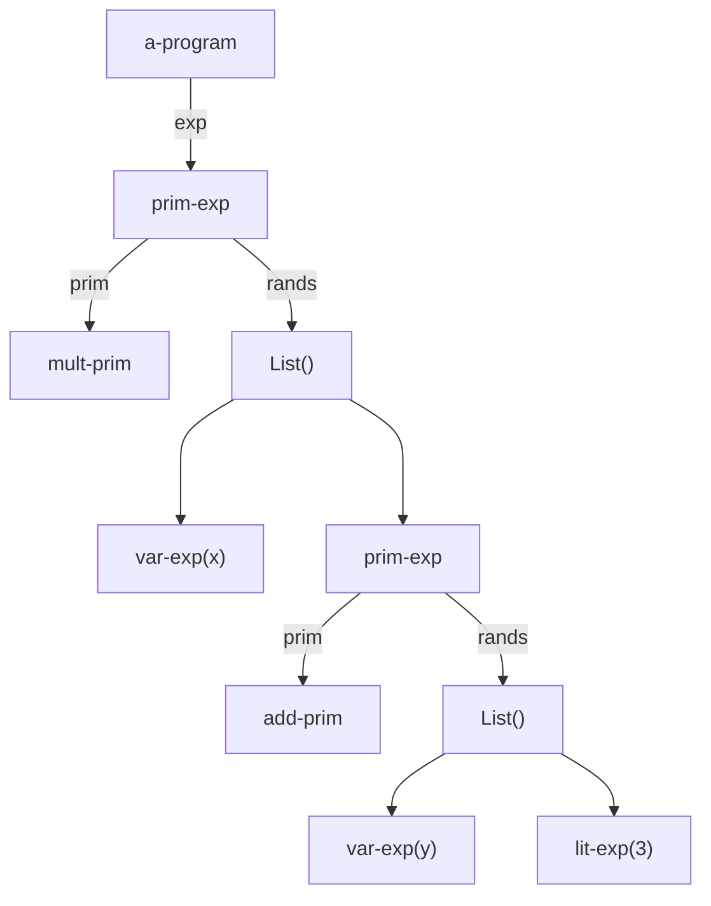

# Scanner y Parser

## Scanner (Analizador Léxico)

Lee el código fuente carácter por carácter y genera **tokens** (o unidades léxicas significativas). Su función principal es descartar información no relevante para el análisis sintáctico, como espacios en blanco, tabulaciones y comentarios.

La **especificación léxica** del lenguaje define las reglas para identificar estos tokens. Por ejemplo, especifica:
1.  Qué constituye un **número** (ej: secuencia de dígitos).
2.  Qué constituye un **identificador** (ej: una letra seguida de letras, dígitos o guiones bajos).
3.  Qué constituye un **comentario** (ej: `//` hasta fin de línea o `/* ... */`).

**Ejemplo de salida del Scanner:**
Para la expresión en un lenguaje similar a Scheme: `*(x,+(y,3))`

```scheme
'(
    (literal-string * 1)   ; Token clase 'literal-string', valor '*', encontrado en línea 1
    (literal-string ( 1)   ; Paréntesis que abre la lista de argumentos
    (identificador 'x 1)   ; Token clase 'identificador', símbolo 'x'
    (literal-string , 1)   ; Separador de argumentos
    (literal-string + 1)   ; Operador de suma
    (literal-string ( 1)   ; Paréntesis que abre argumentos de '+'
    (identificador 'y 1)   ; Token clase 'identificador', símbolo 'y'
    (literal-string , 1)   ; Separador de argumentos
    (numero 3 1)          ; Token clase 'numero', valor 3
    (literal-string ) 1)   ; Paréntesis que cierra argumentos de '+'
    (literal-string ) 1)   ; Paréntesis que cierra argumentos de '*'
)
```
*Observación: La salida captura para cada token su **clase léxica**, su **valor literal** (lexema) y la **línea** en la que se encontró, lo que es crucial para reportar errores.*

## Parser (Analizador Sintáctico)

El parser toma la secuencia plana de tokens retornada por el scanner y, aplicando las **reglas gramaticales** (sintaxis) del lenguaje, construye una representación estructurada jerárquica: el **Árbol de Sintaxis Abstracta (AST)**.

Si la secuencia de tokens no se ajusta a ninguna regla gramatical válida, el parser detecta un **error de sintaxis** y no puede construir el AST.

**Ejemplo de AST:**
Para la expresión `*(x,+(y,3))`, el AST podría representarse con la siguiente estructura (simplificada):



## Conceptos Teóricos y Ajustes

*   **Token**: Unidad mínima con significado en el lenguaje (ej: palabra clave, identificador, operador, literal). El scanner los produce.
*   **Lexema**: La secuencia de caracteres que forma un token específico (ej: para el token `identificador`, el lexema podría ser `"contador"`).
*   **Gramática Libre de Contexto (GLC)**: Conjunto formal de reglas de producción que define la sintaxis del lenguaje. El parser está implementado para reconocer cadenas válidas según esta gramática.
*   **Árbol de Sintaxis Abstracta (AST)**: Representación en árbol que captura la estructura anidada y la semántica del programa, omitiendo detalles sintácticos no esenciales (como paréntesis o puntos y coma). Es la salida del parser y la entrada para las fases posteriores (análisis semántico, generación de código, interpretación).
*   **Análisis Sintáctico (Parsing)**: Proceso de determinar si una secuencia de tokens satisface la gramática del lenguaje y, de ser así, derivar su estructura (AST). Existen estrategias como **descenso recursivo** o **análisis LR**.

## Tabla de Resumen

Componente | Función Principal | Entrada | Salida | Error Típico
--- | --- | --- | --- | ---
**Scanner (Analizador Léxico)** | Dividir el código fuente en tokens significativos. | Cadena de caracteres (código fuente). | Secuencia de tokens (clase, valor, posición). | Error Léxico (ej: carácter no reconocido).
**Parser (Analizador Sintáctico)** | Verificar la estructura gramatical y construir el AST. | Secuencia de tokens. | Árbol de Sintaxis Abstracta (AST). | Error de Sintaxis (ej: paréntesis no balanceado, orden incorrecto de tokens).

## Comentarios Adicionales

1.  **Separación de Responsabilidades**: La división entre scanner y parser simplifica el diseño del compilador/intérprete. El scanner maneja patrones regulares (expresiones regulares), mientras que el parser maneja estructuras anidadas y recursivas (gramáticas libres de contexto).
2.  **Recuperación de Errores**: Tanto el scanner como el parser suelen implementar mecanismos para recuperarse de errores y continuar el análisis, permitiendo reportar múltiples problemas en una sola ejecución.
3.  **Herramientas Automáticas**: Existen generadores de scanners (como **Lex** o **Flex**) y parsers (como **Yacc** o **Bison**) que, a partir de una especificación léxica y gramatical, generan el código correspondiente en un lenguaje de programación, acelerando el desarrollo de compiladores.
4.  **Relación con el Frontend**: Juntos, el scanner y el parser forman el **frontend** o fase de análisis de un compilador/intérprete. Su correcto funcionamiento es esencial para que las fases posteriores (análisis semántico, optimización, generación de código) puedan trabajar con una representación válida y estructurada del programa.