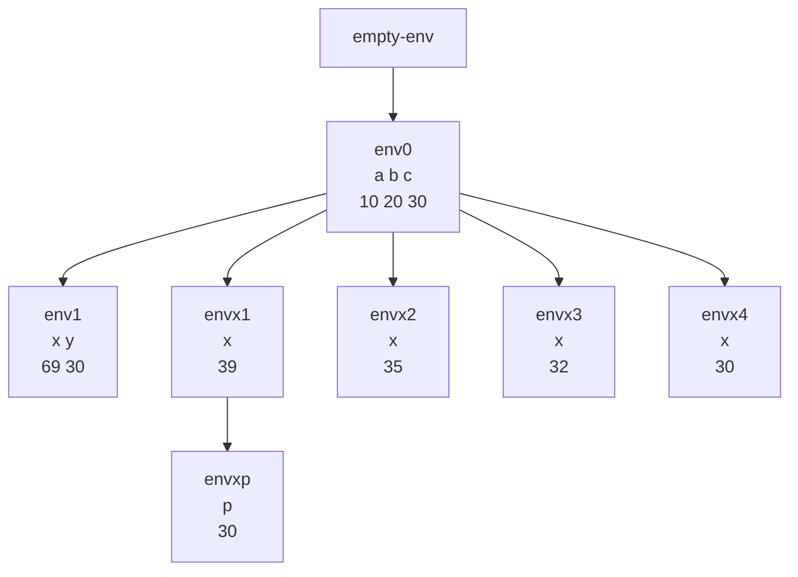

# Ejemplo

Suponga ambiente inicial vacío:

```scheme
let
    a = 10
    b = 20
    c = 30
in
    let
        x = let x = let x = let x = let x = +(a,b)
                                    in +(x,2)
                        in +(x,3)
                in +(x,4)
            in let p = +(a,b) in +(x,p)
        y = +(a,b)
    in
        +(x,y)
```

Esto da 99.



## Explicación del Proceso de Evaluación

1. **Sobre el ambiente envx4** ejecuto `+(x,2)` donde `x = 30` (resultado de `+(a,b)`), lo que da 32.
2. **Sobre el ambiente envx3** ejecuto `+(x,3)` donde `x = 32`, lo que da 35.
3. **Sobre el ambiente envx2** ejecuto `+(x,4)` donde `x = 35`, lo que da 39.
4. **Sobre el ambiente envx1** ejecuto `let p = +(a,b) in +(x,p)`, lo que implica crear otro ambiente `envxp`.
5. **Sobre el ambiente envxp** ejecuto `+(x,p)` donde `x = 39` y `p = 30` (resultado de `+(a,b)`), lo que da 69.
6. **Finalmente sobre el ambiente env1** ejecuto `+(x,y)` donde `x = 69` y `y = 30` (resultado de `+(a,b)`), lo que da 99.

## Conceptos Teóricos

Este ejercicio ilustra varios conceptos fundamentales de los lenguajes de programación con alcance léxico:

1. **Anidamiento de ambientes**: Cada `let` crea un nuevo ambiente que extiende al ambiente actual, formando una cadena de ambientes.
2. **Shadowing (ocultamiento)**: Cuando un identificador se redefine en un `let` interno, la nueva definición "oculta" la anterior dentro de ese alcance.
3. **Evaluación de expresiones**: Las expresiones se evalúan en el ambiente más cercano que contenga la definición del identificador.
4. **Alcance léxico (estático)**: Las referencias a variables se resuelven basándose en la estructura del código, no en el orden de ejecución.

En este ejemplo específico:
- El identificador `x` se redefine múltiples veces en diferentes niveles de anidamiento.
- Cada nueva definición de `x` crea una nueva ligadura en un ambiente diferente.
- Las expresiones `+(a,b)` siempre evalúan a 30 porque `a` y `b` están definidos en el ambiente más externo (`env0`).
- El diagrama muestra la jerarquía de ambientes creados durante la evaluación.

## Tabla de Resumen

| Concepto | Descripción | Ejemplo en el Ejercicio | Resultado |
|----------|-------------|-------------------------|-----------|
| **Ambiente inicial vacío** | Ambiente sin ligaduras definidas. | Punto de partida de la evaluación. | `empty-env` |
| **`let` externo** | Introduce las primeras ligaduras en el ambiente. | `let a=10 b=20 c=30 in ...` | Crea `env0` |
| **`let` anidado** | `let` dentro de otro `let`, creando ambientes jerárquicos. | Múltiples `let x = ...` anidados | Crea `envx1` a `envx4` |
| **Shadowing** | Redefinición de un identificador en un alcance interno. | `x` se redefine 4 veces | Cada `x` oculta al anterior en su alcance |
| **Expresión aritmética** | Operación que combina valores. | `+(a,b)`, `+(x,2)`, etc. | Produce valores numéricos |
| **Referencia a variables externas** | Uso de identificadores definidos en ambientes superiores. | `+(a,b)` dentro de `let` internos | Siempre evalúa a 30 |
| **`let` dentro de expresión** | `let` usado como parte de una expresión de inicialización. | `x = let p = +(a,b) in +(x,p)` | Crea `envxp` temporal |
| **Evaluación final** | Resultado de la expresión más externa. | `+(x,y)` en el ambiente más interno | 99 |

## Comentarios Adicionales

- Este ejercicio demuestra cómo los ambientes forman una **pila de marcos** donde cada nuevo `let` agrega un marco en la parte superior.
- El **shadowing** es una característica importante que permite reutilizar nombres de variables en diferentes contextos sin conflictos.
- La evaluación sigue un **orden de adentro hacia afuera**: las expresiones más internas se evalúan primero.
- En la implementación real del intérprete, cada llamada a `ambiente-extendido` crea un nuevo ambiente como se muestra en el diagrama.
- El valor final (99) se obtiene mediante la combinación de todas las operaciones aritméticas y el manejo adecuado de los ambientes.
- Este patrón de `let` anidados es común en programas funcionales para crear **contextos de evaluación** temporales.
- La traza de evaluación muestra claramente cómo cada expresión se evalúa en el ambiente correcto, respetando las reglas de alcance léxico.