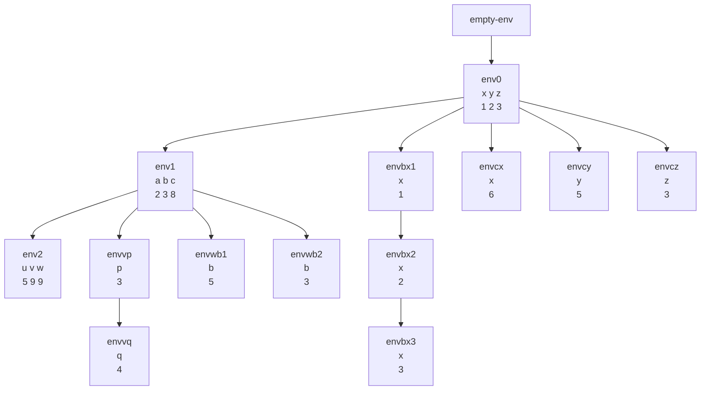

Considere el ambiente inicial env0 con (x,y,z) con valores (1,2,3)
```scheme
let
	a = +(x,1)
	b = let x = x in let x = y in let x = z in x
	c = let x = let y = let z = +(x,y) in +(z,y)
				in +(x,y)
		in +(x,y)
	in
		let
		u = +(a,b)
		v = +(a,let p = +(x,y) in let q = +(x,z) in +(p,q))
		w = +(a,let b = let b = +(x,y) in +(b,2) in +(a,b))
		in
			+(u,v,w)
```
Da 23



- Evaluamos $+(z,y)$ en el ambiente envcz $+(3,2)=5$
- Evaluamos $+(x,y)$ en el ambiente envcy $+(1,5)=6$
- Evaluamos $+(x,y)$ en el ambiente envcx $+(6,2)=8$
- Evaluamos $+(p,q)$ en el ambiente envvq, nos da 7
- Evaluamos $+(a,7)$ en el ambiente env1, lo que da 9
- Evaluamos $+(b,2)$ en el ambiente envwb2, lo que da 5
- Evaluamos $+(a,b)$ en el ambiente envwb1, lo que da 7
- Evaluamos $+(a,7)$ en el ambiente env1, lo que da 9
- Evaluamos $+(u,v,w)$ en el ambiente env2, lo que $+(5,9,9)$ no da 23