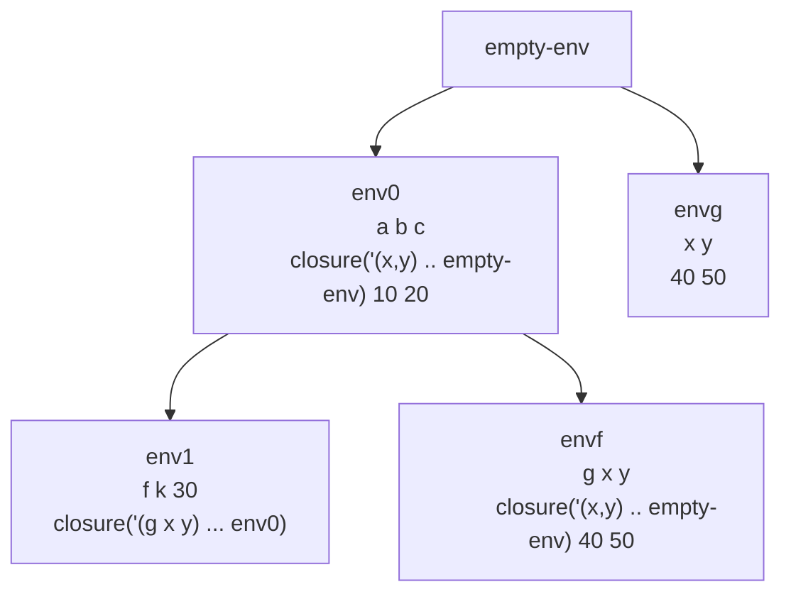

# Definiciones

Un procedimiento permite usar segmentos de código de forma repetida, sin tener que escribirla de nuevo, abstracción procedural.

Para agregar a la gramatica los procedimientos tenemos:

```scheme
    (expresion ("proc" "(" (separated-list identificador ",") ")" expresion) proc-exp)

```

Esto me permite escribir cosas como

```scheme
let
	f = proc(x,y) +(x,y)
	...
```

Tengo que evaluar los procedimientos, para esto se agrega la siguiente producción a la gramática

```scheme
    (expresion ("(" expresion (arbno expresion) ")") app-exp)

```

Para definir un procedimiento vamos a incluir una clausura, que permite almacenar el ambiente donde el procedimiento fue creado

```scheme
(define-datatype procval procval?
  (closure (lid (list-of symbol?))
           (body expresion?)
           (amb-creation ambiente?)))
```

En el evaluador tenemos

```scheme
      (proc-exp (ids body)
                (closure ids body amb))
```

Cuando creo una clausura, retorno un TAD tipo closure que almacena los ids, el cuerpo y el ambiente fue creado

```scheme
proc (x,y) +(x,y)
#(struct:closure 
;Lista de IDs
  (x y) 

; Expresion o cuerpo
#(struct:prim-exp #(struct:sum-prim) (#(struct:var-exp x) #(struct:var-exp y))) 

; Ambiente donde fue creado
#(struct:ambiente-extendido (x y z) (4 2 5) #(struct:ambiente-extendido (a b c) (4 5 6) #(struct:ambiente-vacio))))
```

Y ahora tenemos la evaluacion del procedimiento en el evaluador

```scheme
 (app-exp (rator rands)
               (let
                   (
                    (lrands (map (lambda (x) (evaluar-expresion x amb)) rands))
                    (procV (evaluar-expresion rator amb))
                    )
                 (if
                  (procval? procV)
                  (cases procval procV
                    (closure (lid body old-env)
                             (if (= (length lid) (length lrands))
                                 (evaluar-expresion body
                                                (ambiente-extendido lid lrands old-env))
                                 (eopl:error "El número de argumentos no es correcto, debe enviar" (length lid)  " y usted ha enviado" (length lrands))
                                 )
                             ))
                  (eopl:error "No puede evaluarse algo que no sea un procedimiento" procV) 
                  )
                 )
               )
      )

```

# Ejemplo

Considere el ambiente inicial vacio
```scheme
let
	a = proc(x,y) +(x,y)
	b = 10
	c = 20
	in
		let
			f = proc(g,x,y) (g x y)
			k = 30
			in
				(f a +(b,k) +(c,k))

```
Da 90



1. Sobre env1 vamos a evaluar (f a +(b,k) +(c,k)) al evaluarlo, (closure('(g x y) ... env0) closure('(x,y) .. empty-env) 40 50) aqui tenemos dos partes
	1. Rator closure('(g x y) ... env0)
	2. Rands (list closure('(x,y) .. empty-env) 40 50)
2. Se va generar un ambiente extendido con los datos del rator, extendiendo de env0
3. Sobre envf voy a evaluar (g x y), que es (g 40 50), g es closure('(x,y) .. empty-env) , al evaluar implica que debo hacer un ambiente con x,y extendiendo del ambiente vacio
4. Sobre envg evaluo +(x,y), estos valen 40 y 50, dandonos 90
5. Por lo tanto el valor final es 90


# Ejercicio

Suponga ambiente inicial (x,y,z) (1 2 3)
```scheme
let
	f = proc(x,y) +(x,y,z)
	g = proc(a,b) +(a,b,x,y,z)
	in
		let 
		k = let x = (f x y) in +(x,y)
		j = let f = proc(a) +(a,x) in (f y) 
		in
			+(k,j)
```
R/ 19

