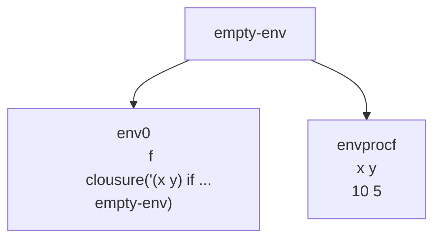

Hasta el momento hemos desarrollado un lenguaje que puede:

1. Realizar operaciones aritmeticas y relacionales
2. Puede manejar condicionales
3. Puede manejar ligaduras locales
4. Puede manejar procedimientos

Tenemos que nuestro lenguaje tiene 

- Valores expresados: Numeros y booleanos
- Valores denotados: Numeros y booleanos

En general, podemos realizar codificacion, pero tenemos cierta limitación, y es que tiene que ver con que los procedimientos se conozcan a si mismos

```scheme
let
	f = proc(x,y) if >(x,0) then +(y, (f sub1(x) y)) else y
in
	(f 10 5)
```

Vamos a dibujar el diagrama de ambientes de esta expresión



1. En el ambiente env0 vamos a evaluar (f 10 5), esto produce que se extienda un ambiente de empty-env con x valiendo 10, y valiendo 5
2. En envprocf vamos a evaluar el cuerpo del procedimiento  if >(x,0) then +(y, (f sub1(x) y)) else y, validamos >(10,0) si, entonces va hacer +(y, (f sub1(x) y))  --> +(5, (f sub1(10) 5)) --> +(5, (f 9 5)) va intentar buscar f, el problema es que envprocf no lo tiene, entonces busca en el ambiente vacio **haciendo falle la busqueda** 


# Temas

1. [Implementacion letrec](Implementacion%20letrec.md)
2. [Ejemplo](Ejemplo.md)
3. [Ejercicio](Ejercicio.md)