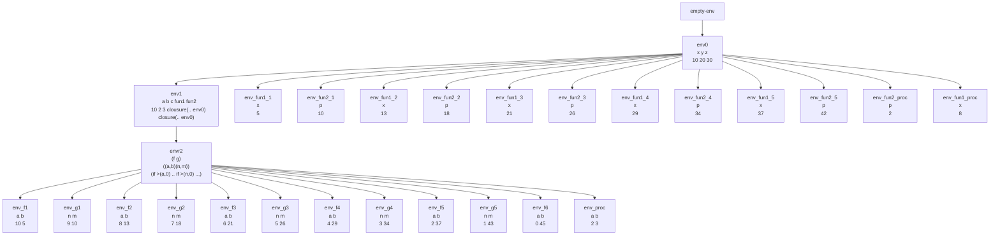

# Ejemplo de evaluación con `letrec`

Suponga ambiente inicial:

```
(x y z)
(10 20 30)
```

Evaluamos esta expresión:

```scheme
let
    a = -(z,y)
    b = /(y,x)
    c = /(z,x)
    fun1 = proc(x) +(x,5)
    fun2 = proc(p) +(p,3)
in
    letrec
        f(a,b) = if >(a,0) then +(b,(g sub1(a) (fun1 b)))
                            else +(a,b)
        g(n,m) = if >(n,0) then +(m, (f sub1(n) (fun2 m)))
                            else *(a,b)
    in
        +((f a +(b,c)), (proc (a,b) (fun1 +((fun2 a), b)) b c))
```

Esto da como resultado **293**.



## Proceso de evaluación detallado:

1. **Evaluamos** `+((f a +(b,c)), (proc (a,b) (fun1 +((fun2 a), b)) b c))` en `envr2`
   
2. **Empezamos por** `(f 10 +(2,3)) = (f 10 5)`
   
3. **Cuando evaluamos** `(f 10 5)` encontramos que está en un ambiente extendido recursivo, lo que genera un `(closure ... envr2)`:
   
   - **envf1** `(f 10 5)` = `+(5,(g 9 (fun1 5)))` = `+(5,(g 9 10))` = `(5, 275)` = 280
   - **envg1** `(g 9 10)` = `+(10, (f 8 (fun2 10)))` = `+(10, (f 8 13)` = `+(10,265)` = 275
   - **envf2** `(f 8 13)` = `+(13,(g 7 (fun1 13)))` = `+(13,(g 7 18))` = `+(13,252)` = 265
   - **envg2** `(g 7 18)` = `+(18, (f 6 (fun2 18)))` = `+(18, 234)` = 252
   - **envf3** `(f 6 21)` = `+(21,(g 5 (fun1 21)))` = `+(21,213)` = 234
   - **envg3** `(g 5 26)` = `+(26, (f 4 (fun2 26)))` = `+(26,187)` = 213
   - **envf4** `(f 4 29)` = `+(29,(g 3 (fun1 29)))` = `+(29,158)` = 187
   - **envg4** `(g 3 34)` = `+(34, (f 2 (fun2 34)))` = `+(34,124)` = 158
   - **envf5** `(f 2 37)` = `+(37,(g 1 (fun1 37)))` = `+(37,87)` = 124
   - **envg5** `(g 1 42)` = `+(42, (f 0 (fun2 42)))` = `+(42,45)` = 87
   - **envf6** `(f 0 45)` = `+(0,45)` = 45 (caso base)
   - **Total:** 280

4. **Al resolver** nos queda `+(280, (proc (a,b) (fun1 +((fun2 a), b)) b c))`
   
5. **Al evaluar** `proc (a,b) (fun1 +((fun2 a), b))` se genera una clausura `(closure '(a,b) ... envr2)` (procval 2 3)
   
6. **Sobre el ambiente** `envproc` vamos a evaluar `(fun1 +((fun2 2), 3))` = `(fun1 +(5, 3))` = `(fun1 8)` = 13
   
7. **En total** evaluamos `+(280,13)` = **293**

## Conceptos teóricos ilustrados:

### 1. **Anidamiento de ambientes**
El ejemplo muestra cómo los ambientes se anidan jerárquicamente:
- `env0`: Variables globales `(x y z)`
- `env1`: Variables del `let` externo `(a b c fun1 fun2)`
- `envr2`: Ambiente recursivo para `letrec` con `(f g)`

### 2. **Clausuras y ambientes de evaluación**
Cada procedimiento (`fun1`, `fun2`, `f`, `g`) captura el ambiente en el que fue definido:
- `fun1` y `fun2` capturan `env0`
- `f` y `g` capturan `envr2` (que incluye referencias a sí mismos)

### 3. **Recursión mutua en acción**
`f` llama a `g` y `g` llama a `f`, demostrando recursión mutua:
- Cada llamada crea un nuevo marco de ambiente con los parámetros actuales
- Las referencias a `f` y `g` siempre resuelven a las clausuras en `envr2`

### 4. **Evaluación de expresiones complejas**
El ejemplo combina:
- Aritmética básica (`-`, `/`, `+`, `*`)
- Condicionales (`if >(...)`)
- Llamadas a procedimientos
- Procedimientos anónimos (lambda)

### 5. **Resolución de variables**
Notar que en `g`, la expresión `*(a,b)` referencia las variables `a` y `b` del `let` externo, no los parámetros locales de `g`. Esto ilustra cómo la resolución de variables sigue la cadena de ambientes.

## Tabla de resumen

| Concepto | Ejemplo en el código | Explicación |
|----------|----------------------|-------------|
| **Ambiente inicial** | `env0: (x y z) = (10 20 30)` | Contexto global de evaluación |
| **Let con procedimientos** | `fun1 = proc(x) +(x,5)` | Definición de procedimientos simples que capturan `env0` |
| **Letrec con recursión mutua** | `f(a,b) = ... g(n,m) = ...` | Definición de procedimientos mutuamente recursivos |
| **Captura de ambiente** | `closure '(a,b) ... envr2` | Las clausuras capturan el ambiente donde se definen |
| **Recursión mutua** | `f` llama a `g`, `g` llama a `f` | Procedimientos que se referencian entre sí |
| **Evaluación anidada** | `(f a +(b,c))` | Las expresiones se evalúan de adentro hacia afuera |
| **Procedimientos anónimos** | `(proc (a,b) ... b c)` | Lambda expressions evaluadas in situ |
| **Resolución léxica** | `*(a,b)` en `g` referencia `env1` | Las variables se resuelven según el ámbito léxico |
| **Múltiples marcos** | `env_f1`, `env_g1`, etc. | Cada llamada crea un nuevo marco de ambiente |
| **Caso base recursivo** | `(f 0 45) = +(0,45)` | Condición de terminación de la recursión |

## Comentarios adicionales

1. **Complejidad de seguimiento**: Este ejemplo ilustra por qué los ambientes y clausuras pueden volverse complejos de seguir manualmente, especialmente con recursión mutua.

2. **Eficiencia vs. claridad**: La implementación con clausuras generadas bajo demanda (evaluación perezosa) es conceptualmente clara pero puede no ser la más eficiente en términos de rendimiento.

3. **Ámbito léxico**: El ejemplo muestra claramente el ámbito léxico: `fun1` y `fun2` siempre usan `env0` para resolver variables libres, independientemente de dónde se llamen.

4. **Recursión indirecta**: La recursión entre `f` y `g` es indirecta, lo que sería imposible de implementar con definiciones separadas de `let`.

5. **Variables libres vs. ligadas**: En la expresión `*(a,b)` dentro de `g`, `a` y `b` son variables libres que se resuelven en `env1`, no en el marco local de `g`.

6. **Importancia del orden**: El orden de evaluación de los argumentos (`(f a +(b,c))`) afecta los resultados intermedios pero no el final, dado que no hay efectos secundarios.

7. **Verificación de tipos**: En un lenguaje tipado, este código requeriría verificación para asegurar que todas las operaciones aritméticas reciben números y que `sub1` recibe un número positivo.