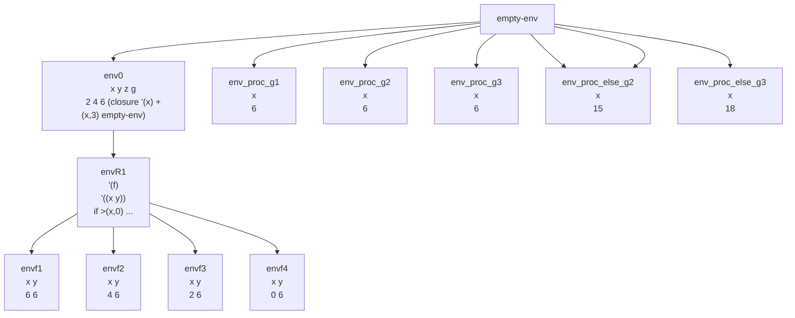

Supone ambiente inicial env0

```scheme
(x y z g)
(2 4 6 (closure '(x) +(x,3) empty-env))
```

Evaluar
```scheme

letrec
	f(x,y) = if >(x,0) then +((g y), (f -(x,2) y))
			else (g (g (g +(x,y,z))))
	in
		(f z +(x,y))
```
Resultado es 48



1. Sobre envR1 vamos a evaluar (f z +(x,y)) --> (f 6 6)
2. Se sabe que f esta en un ambiente extendido recursivo, entonces mirar que pasa
	1. (f 6 6) = +((g 6), (f 4 6)) = +(9, (f 4 6)) = +(9,39) = 48
	2. (f 4 6) = +((g 6), (f 2 6)) = +(9, (f 2 6)) = +(9,30) = 39
	3. (f 2 6) = +((g 6), (f 0 6)) = +(9, (f 2 6)) = +(9,21) = 30
	4. (f 0 6) = (g (g (g +(x,y,z))))= (g (g (g 12))))= (g (g 15)) = = (g 18) = 21 