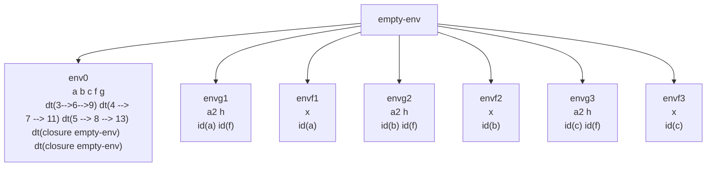

# Ejemplo paso por referencia

```scheme
let
    a = 3
    b = 4
    c = 5
    f = proc(x) begin set x = +(x,3); x end
    g = proc(a2, h) begin set a2 = +(a2, (h a2)); a2 end
in
    +((g a f),(g b f),(g c f))
```

Da 33

Probar también con `set a2 = +((h a2),a2);` da 42



## Explicación paso a paso

1. `(g a f)` → `a2 = id(a)`, `h = id(f)`
   - `a2` es un target indirecto que apunta a `a`
   - `h` es un target indirecto que apunta a `f`

2. En `envg1` evaluamos `+(a2, (h a2))` → `+(3, (h a2))`
   - `a2` se desreferencia obteniendo 3

3. `(h a2)` toma en cuenta que `a2` es un target indirecto de `a`, por lo tanto se pasa la referencia original de `a`
   - Se crea `envf1` con `x = id(a)` (target indirecto)

4. En ambiente `envf1` se ejecuta `set x = +(x,3)`
   - `x` apunta a `a`, por lo que `a` pasa a valer 6
   - Retorna 6

5. En `envg1`: `set a2 = +(3,6) = 9`
   - `a2` apunta a `a`, por lo que `a` pasa a valer 9

6. Una vez realizado esto: `+(9, (g b f), (g c f))`

7. Ahora repetimos `(g b f)`: `b` pasa a valer 11
   - Proceso similar: `b = 4 → 7 → 11`

8. Una vez realizado tenemos: `+(9, 11, (g c f))`

9. Ahora repetimos `(g c f)`: `c` pasa a valer 13
   - Proceso similar: `c = 5 → 8 → 13`

10. Una vez realizado tenemos: `+(9, 11, 13) = 33` ✓

## Variante con orden cambiado

Vamos a hacer el cambio `+((h a2),a2);`:

```
a => 3 --> 6 --> 12
b => 4 --> 7 --> 14
c => 5 --> 8 --> 16
```

Sumemos los 3 valores: `+(12, 14, 16) = 42`

**Conclusión**: El orden de las operaciones afecta el resultado debido al paso por referencia y los efectos secundarios.

---

## Tabla de resumen

| Concepto | Descripción | Ejemplo en el código |
|----------|-------------|---------------------|
| **Target indirecto** | Referencia a una variable pasada como argumento. | `a2 = id(a)` en `envg1` |
| **Target directo** | Valor pasado directamente (no referenciable). | No aparece explícitamente en este ejemplo |
| **Aliasing** | Múltiples nombres referencian la misma ubicación. | `a`, `a2` y `x` apuntan a la misma celda |
| **Efecto lateral** | Modificación de estado visible fuera del ámbito local. | `set x = +(x,3)` modifica `a` globalmente |
| **Orden de evaluación** | Importante cuando hay efectos secundarios. | `+(a2, (h a2))` vs `+((h a2), a2)` producen resultados diferentes |
| **Propagación de cambios** | Modificaciones se transmiten a través de referencias. | Cambio en `f` afecta a `a`, que afecta al resultado de `g` |
| **Ambientes anidados** | Cada llamada crea un nuevo ambiente con sus propias ligaduras. | `envg1`, `envf1`, etc., son ambientes distintos |

## Comentarios adicionales

1. **Transitividad de efectos**: Cuando `f` modifica `x`, está modificando `a` indirectamente, y este cambio afecta inmediatamente el cálculo en `g`.

2. **Dependencia del orden**: En expresiones con efectos secundarios, el orden de evaluación de los operandos es crucial. La evaluación de izquierda a derecha vs. derecha a izquierda puede cambiar el resultado.

3. **Acumulación de cambios**: Cada llamada a `g` acumula modificaciones sobre las variables originales, demostrando cómo el estado persiste entre invocaciones.

4. **Debugging complejo**: Seguir el flujo de modificaciones requiere rastrear múltiples niveles de indirección y ambientes, ilustrando por qué el código con mutabilidad y paso por referencia es más difícil de razonar.

5. **Semántica operacional**: El diagrama mermaid muestra claramente cómo se crean nuevos ambientes para cada llamada y cómo se comparten referencias entre ellos, proporcionando una visualización útil de la semántica.