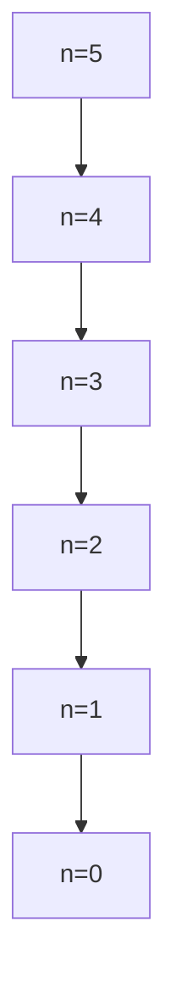

# Recursión

## 1. Recursión lineal

La recursión lineal es un método de resolución de problemas en el que una función se llama a sí misma una vez en cada ejecución, generando una secuencia de llamadas que se resuelven de manera secuencial hasta alcanzar el caso base.

```scala
/*  
 * This Scala source file was generated by the Gradle 'init' task.
 */
package funcional.template  
  
object App {  
  
  /**
   * Calcula el factorial de un número entero no negativo usando recursión lineal.
   * 
   * @param n El número entero del cual se calculará el factorial.
   * @return El factorial de n (n!).
   * 
   * Características:
   * - Caso base: cuando n == 0, retorna 1.
   * - Caso recursivo: n * factorialR(n-1)
   * - Cada llamada recursiva genera un nuevo marco de pila.
   */
  def factorialR(n: Int): Int = {  
    if (n == 0) 1                    // Caso base: 0! = 1
    else n * factorialR(n - 1)       // Caso recursivo: n! = n * (n-1)!
  }  
  
  def main(args: Array[String]): Unit = {  
    println(factorialR(5))           // Imprime 120 (5! = 5*4*3*2*1)
  }  
  
  def greeting(): String = "Hello, world!"  
}
```

Cuando invocamos `factorialR(5)` sucede:



Observe que para resolver `factorialR(5)` debo esperar a `factorialR(4)` y así sucesivamente hasta el caso base. Cada llamada recursiva genera un nuevo marco de pila que contiene su propio contexto (variables locales, parámetros, dirección de retorno). En este caso únicamente se almacena el valor de $n$, pero en algoritmos más complejos pueden ser muchas variables o estructuras de datos, lo que puede producir desbordamiento de pila (stack overflow) para entradas grandes.

## 2. Recursión de cola (Tail Recursion)

La recursión de cola es una forma especial de recursión donde la llamada recursiva es la última operación que se ejecuta en la función. Esto permite que algunos lenguajes de programación (como Scala, cuando se usa la anotación `@tailrec`) optimicen el código reutilizando el mismo marco de pila para todas las llamadas, evitando así el crecimiento lineal de la pila.

**Importante:** No todos los lenguajes de programación implementan esta optimización (conocida como Tail Call Optimization - TCO). Lenguajes como Java o C++ (en la mayoría de sus implementaciones estándar) no la realizan automáticamente, por lo que la recursión de cola en ellos sigue consumiendo espacio en la pila como la recursión lineal.

```scala
/*  
 * This Scala source file was generated by the Gradle 'init' task.
 */
package funcional.template  
  
object App {  

  /**
   * Calcula el factorial de un número entero no negativo usando recursión de cola.
   * 
   * @param n El número entero del cual se calculará el factorial.
   * @param cnt Contador interno que comienza en 1 y se incrementa hasta n.
   * @param ac Acumulador que almacena el producto parcial.
   * @return El factorial de n (n!).
   * 
   * Características:
   * - La anotación @tailrec obliga al compilador a verificar que es realmente recursión de cola.
   * - El estado se pasa explícitamente a través de los parámetros `cnt` y `ac`.
   * - Solo se utiliza un marco de pila durante toda la ejecución (si TCO está activo).
   */
  @scala.annotation.tailrec  
  def factorialIt(n: Int, cnt: Int = 1, ac: Int = 1): Int = {  
    if (cnt > n) ac                     // Caso base: cuando el contador supera n, retorna el acumulador
    else factorialIt(n, cnt + 1, cnt * ac) // Llamada recursiva de cola: actualiza estado y se llama a sí misma
  }  
  
  def main(args: Array[String]): Unit = {  
    println(factorialIt(5))             // Imprime 120, usando un solo marco de pila (con TCO)
  }  
  
  def greeting(): String = "Hello, world!"  
}
```

En este caso, gracias a la anotación `@tailrec` y a que Scala implementa Tail Call Optimization, solo se utiliza un marco de pila durante toda la ejecución.

Para diseñar una función de recursión de cola

1. En la condición inicial está el caso base acc = 1 que es factorial de 0, observe que la condición n > cnt, hace en este caso 1 > 0 por lo tanto retorna acc que vale 1
2. En los llamados recursivos
	1. Paulatinamente llegamos a la condición donde el if se vuelve verdadero (condición de parada)
	2. A medida que llamamos la función el acc va llevando los valores 0!, 1!, 2!, 3!, hasta n!

## 3. Función recursiva vs. Proceso recursivo

Es importante distinguir entre la **definición** de una función (sintaxis) y el **proceso** que genera su ejecución (semántica):

1.  **Recursión lineal:** Tanto la función como el **proceso** son recursivos. El proceso se expande (construye una cadena de operaciones diferidas) y luego se contrae (realiza las multiplicaciones al regresar de las llamadas).
2.  **Recursión de cola:** La función se define de manera recursiva, pero el **proceso** es iterativo. El estado se actualiza en cada paso y no hay operaciones pendientes al regresar, lo que permite la reutilización del marco de pila.

No todos los lenguajes soportan la optimización de llamada de cola. Para más detalles, consulte el [artículo de Wikipedia sobre Tail Call](https://en.wikipedia.org/wiki/Tail_call).

---

## Tabla de Resumen de Conceptos

| Concepto | Definición | Características Clave | Ventajas | Desventajas |
|----------|------------|-----------------------|----------|-------------|
| **Recursión Lineal** | Función que se llama a sí misma y donde la llamada recursiva no es la última operación. | - Necesita múltiples marcos de pila.<br>- Proceso recursivo (expansión/contracción).<br>- Caso base obligatorio para terminar. | - Expresividad y claridad para ciertos problemas (ej: recorrido de árboles).<br>- Fácil de entender conceptualmente. | - Riesgo de desbordamiento de pila (stack overflow) para entradas grandes.<br>- Menor eficiencia en uso de memoria. |
| **Recursión de Cola** | Función donde la llamada recursiva es la última operación ejecutada (tail call). | - El estado se pasa a través de parámetros acumuladores.<br>- Con TCO, usa un solo marco de pila.<br>- Proceso iterativo. | - Elimina riesgo de desbordamiento de pila (con TCO).<br>- Eficiencia de memoria similar a un bucle.<br>- El compilador Scala (`@tailrec`) verifica la condición. | - Puede ser menos intuitiva de escribir.<br>- Requiere reestructurar el algoritmo para usar acumuladores.<br>- No todos los lenguajes implementan TCO. |
| **Caso Base** | Condición que detiene las llamadas recursivas. | - Esencial para evitar recursión infinita.<br>- Proporciona el resultado trivial. | - Garantiza la terminación del programa. | - Definirlo incorrectamente causa errores o bucles infinitos. |
| **Marco de Pila (Stack Frame)** | Área de memoria que almacena el estado de una llamada a función. | - Contiene parámetros, variables locales y dirección de retorno.<br>- Se apila en cada llamada. | - Permite el flujo de control y retorno. | - Recursos limitados. El crecimiento lineal puede agotar la pila. |
| **Tail Call Optimization (TCO)** | Optimización del compilador/intérprete que reutiliza el marco de pila para llamadas de cola. | - Convierte la recursión de cola en un bucle a nivel de máquina.<br>- No es estándar en todos los lenguajes (ej: Java, C++). | - Eficiencia de memoria constante O(1).<br>- Permite recursión profunda sin overflow. | - Depende del lenguaje y de la implementación. |

---

## Comentarios Adicionales

*   **Elección del Método:** Use recursión lineal para algoritmos donde la claridad y la correspondencia directa con la definición matemática sean prioritarias, y el tamaño de entrada sea conocido y limitado. Use recursión de cola (en lenguajes que soporten TCO) cuando la eficiencia de memoria sea crítica o se espere una profundidad recursiva grande.
*   **Verificación en Scala:** Siempre que intente implementar recursión de cola en Scala, utilice la anotación `@scala.annotation.tailrec`. Si el compilador no la acepta, significa que su función no es realmente de cola y no será optimizada.
*   **Alternativa en lenguajes sin TCO:** En lenguajes como Java o C++, donde generalmente no hay TCO, se debe preferir el uso de **iteración explícita (bucles)** para algoritmos que de otra manera requerirían recursión profunda, o bien, reformular el algoritmo para usar una **pila explícita** gestionada por el programador en el heap.
*   **Árbol de Recursión:** Para analizar el comportamiento y la complejidad de una función recursiva, es útil dibujar su árbol de llamadas. Esto ayuda a visualizar el caso base, la profundidad y el número total de llamadas.
*   **Recursión Múltiple:** Existen problemas (como la sucesión de Fibonacci definida de forma ingenua) que implican **recursión múltiple** (más de una llamada recursiva por caso). Estos algoritmos suelen ser muy ineficientes (complejidad exponencial) y son candidatos a técnicas de optimización como **memoización** o **programación dinámica**.