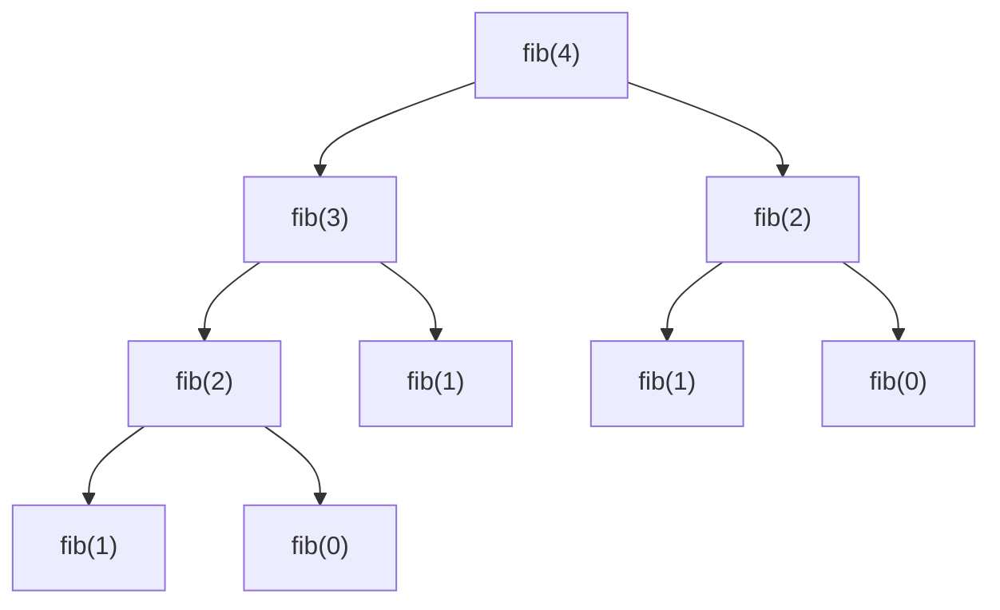

Tenemos más de un llamado, ejemplo de fibunnaci


$$
fib(n) \begin{cases}
          0 & \texttt{ si } & n = 0 \\
          1 & \texttt{ si } & n = 1 \\
          fib(n-1) + f(n-2) & \texttt{ en otro caso } & \\
        \end{cases}
$$

Evaluar fib(4)



Como se resuelve

```scala
fib(4) = fib(3) + fib(2)
fib(4) = fib(2) + fib(1) + fib(2)
fib(4) = fib(1) + fib(0) + fib(1) + fib(2)
fib(4) = 1 + fib(0) + fib(1) + fib(2)
fib(4) = 1 + 0 + fib(1) + fib(2)
fib(4) = 1  + fib(1) + fib(2)
fib(4) = 1 + 1 + fib(2)
fib(4) = 2 + fib(2)
fib(4) = 2 + fib(1) + fib(0)
fib(4) = 2 + 1 + fib(0)
fib(4) = 3 + fib(0)
fib(4) = 3 + 0
fib(4) = 3
```

EL numenro de marcos de pila es la profundidad del arbol, porque como evaluamos de izquiedrda a derecha, estos se van resolviendo paulatinamente.