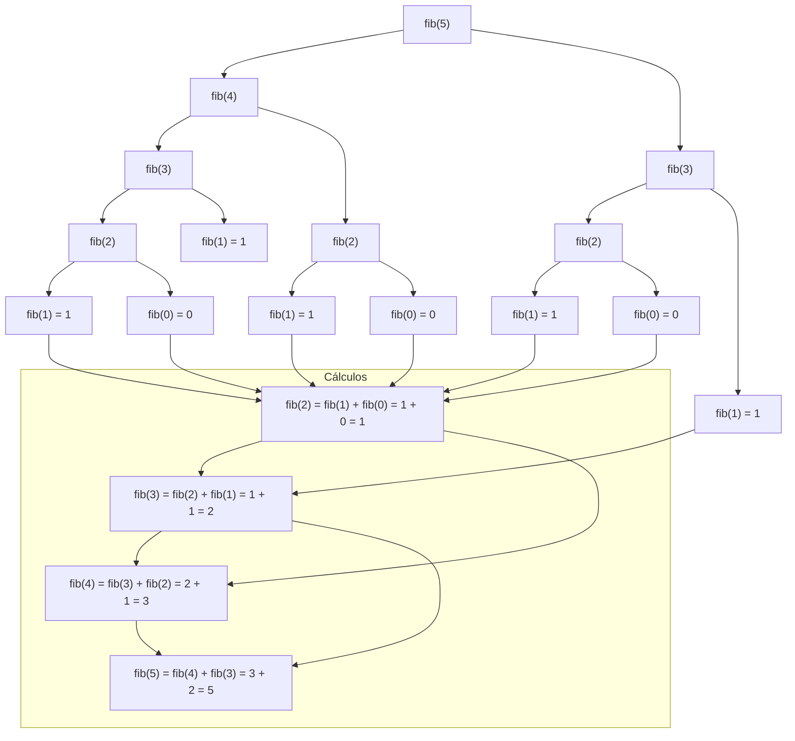

# Recursión de árbol

La recursión de árbol ocurre cuando una función recursiva realiza más de un llamado recursivo en su cuerpo. A diferencia de la recursión lineal (un solo llamado recursivo) o la recursión de cola (llamado recursivo como última operación), la recursión de árbol genera múltiples llamados recursivos que se ramifican como un árbol, creando una estructura de llamados con múltiples ramas.

## Definición matemática de la secuencia de Fibonacci

La secuencia de Fibonacci es un ejemplo clásico de recursión de árbol. Se define matemáticamente como:

$$
fib(n) = \begin{cases}
0 & \text{si } n = 0 \\
1 & \text{si } n = 1 \\
fib(n-1) + fib(n-2) & \text{en otro caso}
\end{cases}
$$

## Implementación en Scala

```scala
/**
  * Calcula el n-ésimo número de Fibonacci usando recursión de árbol.
  * Esta implementación es simple pero computacionalmente ineficiente
  * debido a los cálculos redundantes.
  * 
  * @param n El índice en la secuencia de Fibonacci (debe ser n ≥ 0).
  * @return El n-ésimo número de Fibonacci.
  * @throws IllegalArgumentException si n es negativo.
  */
def fib(n: Int): Int = {
  // Casos base: fib(0) = 0, fib(1) = 1
  if (n <= 1) n
  // Caso recursivo de árbol: dos llamados recursivos independientes
  else fib(n - 1) + fib(n - 2)
}

// Ejemplo de ejecución paso a paso para fib(5):
// fib(5) = fib(4) + fib(3)
// fib(5) = fib(3) + fib(2) + fib(3)
// fib(5) = fib(2) + fib(1) + fib(2) + fib(3)
// fib(5) = fib(1) + fib(0) + fib(1) + fib(2) + fib(3)
// fib(5) = 1 + fib(0) + fib(1) + fib(2) + fib(3)
// fib(5) = 1 + 0 + fib(1) + fib(2) + fib(3)
// fib(5) = 1 + fib(1) + fib(2) + fib(3)
// fib(5) = 1 + 1 + fib(2) + fib(3)
// fib(5) = 2 + fib(2) + fib(3)
// fib(5) = 2 + fib(1) + fib(0) + fib(3)
// fib(5) = 2 + 1 + fib(0) + fib(3)
// fib(5) = 3 + fib(0) + fib(3)
// fib(5) = 3 + 0 + fib(3)
// fib(5) = 3 + fib(3)
// fib(5) = 3 + fib(2) + fib(1)
// fib(5) = 3 + fib(1) + fib(0) + fib(1)
// fib(5) = 3 + 1 + fib(0) + fib(1)
// fib(5) = 4 + fib(0) + fib(1)
// fib(5) = 4 + 0 + fib(1)
// fib(5) = 4 + fib(1)
// fib(5) = 4 + 1
// fib(5) = 5
```

## Diagrama de llamados recursivos para fib(5)



## Características de la recursión de árbol

### Complejidad computacional
- **Complejidad temporal**: O(2ⁿ) en la implementación recursiva simple (crecimiento exponencial)
- **Complejidad espacial**: O(n) en la pila de ejecución (profundidad máxima del árbol)

### Problemas de eficiencia
La implementación recursiva simple de Fibonacci presenta los siguientes problemas:

1. **Cálculos redundantes**: 
   - `fib(3)` se calcula 2 veces
   - `fib(2)` se calcula 3 veces
   - `fib(1)` se calcula 5 veces
   - `fib(0)` se calcula 3 veces

2. **Crecimiento exponencial**: El número total de llamados crece aproximadamente como 2ⁿ, lo que hace que el algoritmo sea impracticable para n > 40.

3. **Ineficiencia práctica**: Para valores moderados de n, el tiempo de cálculo se vuelve prohibitivo debido a la repetición de cálculos.

### Optimizaciones posibles
1. **Memoización (caching)**: Almacenar resultados intermedios en una estructura de datos para evitar cálculos repetidos.
2. **Programación dinámica ascendente**: Calcular los valores de Fibonacci de manera iterativa, de abajo hacia arriba.
3. **Recursión con memoización**: Combinar el enfoque recursivo con almacenamiento de resultados.
4. **Técnicas matemáticas**: Usar fórmulas cerradas como la fórmula de Binet para calcular Fibonacci en tiempo constante.

## Conceptos teóricos adicionales

### Subestructura óptima
La recursión de árbol es efectiva para problemas que exhiben subestructura óptima, donde la solución óptima del problema puede construirse a partir de soluciones óptimas de subproblemas más pequeños.

### Solapamiento de subproblemas
Cuando los mismos subproblemas se resuelven múltiples veces (como en Fibonacci), el problema tiene solapamiento de subproblemas, lo que lo hace candidato para técnicas de optimización como memoización o programación dinámica.

### Profundidad de recursión
En recursión de árbol, la profundidad máxima de recursión está determinada por la rama más larga del árbol. Para Fibonacci, la profundidad es n, lo que puede causar desbordamiento de pila para valores grandes de n.

### Árbol de recursión vs. árbol de búsqueda
Es importante distinguir entre:
- **Árbol de recursión**: Representa las llamadas a función durante la ejecución.
- **Árbol de búsqueda**: Estructura de datos que se recorre mediante recursión.

## Tabla de resumen

| Concepto | Descripción | Ejemplo en Fibonacci | Implicaciones |
|----------|-------------|----------------------|---------------|
| Recursión de árbol | Recursión con múltiples llamados recursivos en la misma función | `fib(n) = fib(n-1) + fib(n-2)` | Genera estructura en forma de árbol |
| Ramificación | Cada llamada puede generar múltiples llamadas recursivas | Cada `fib(n)` genera llamadas a `fib(n-1)` y `fib(n-2)` | Factor de ramificación = 2 |
| Complejidad temporal | Generalmente exponencial para implementaciones ingenuas | O(2ⁿ) para Fibonacci recursivo simple | Impracticable para n grande |
| Complejidad espacial | O(n) en la pila (profundidad del árbol) | Profundidad máxima = n | Riesgo de StackOverflow |
| Cálculos redundantes | Problema común donde se recalculan los mismos subproblemas | `fib(3)` calculado 2 veces, `fib(2)` 3 veces | Oportunidad para optimización |
| Subestructura óptima | La solución se construye de soluciones de subproblemas | `fib(n)` depende de `fib(n-1)` y `fib(n-2)` | Permite enfoque recursivo |
| Solapamiento de subproblemas | Mismos subproblemas aparecen múltiples veces | Fibonacci tiene solapamiento significativo | Candidato para memoización |

## Comparación de tipos de recursión

| Tipo | Llamados recursivos | Complejidad espacial | Complejidad temporal | Ejemplo típico |
|------|-------------------|---------------------|---------------------|----------------|
| Lineal | 1 por llamada | O(n) | O(n) | Factorial recursivo |
| Cola | 1 por llamada (optimizable) | O(1) con TCO | O(n) | Factorial iterativo |
| Árbol | ≥ 2 por llamada | O(n) | O(2ⁿ) (exponencial) | Fibonacci recursivo |

## Implementaciones alternativas de Fibonacci

### Versión iterativa (programación dinámica)
```scala
/**
  * Calcula el n-ésimo número de Fibonacci usando programación dinámica iterativa.
  * Complejidad: O(n) tiempo, O(1) espacio.
  * 
  * @param n El índice en la secuencia de Fibonacci.
  * @return El n-ésimo número de Fibonacci.
  */
def fibIterativo(n: Int): Int = {
  // Casos base
  if (n <= 1) return n
  
  // Variables para almacenar los dos últimos valores
  var a = 0  // fib(i-2)
  var b = 1  // fib(i-1)
  
  // Calcular iterativamente desde 2 hasta n
  for (i <- 2 to n) {
    val temp = a + b  // fib(i) = fib(i-1) + fib(i-2)
    a = b             // Actualizar fib(i-2)
    b = temp          // Actualizar fib(i-1)
  }
  
  b  // fib(n)
}
```


## Comentarios adicionales

1. **Aplicaciones de recursión de árbol**:
   - Algoritmos de divide y vencerás (quicksort, mergesort, búsqueda binaria)
   - Recorrido de árboles y grafos (DFS, BFS)
   - Resolución de problemas combinatorios (subconjuntos, permutaciones)
   - Búsqueda en espacios de estados (backtracking, juegos)
   - Algoritmos de optimización (programación dinámica)

2. **Análisis matemático del árbol de Fibonacci**:
   - Número total de nodos: aproximadamente 2ⁿ⁺¹ - 1
   - Número de hojas: igual a fib(n+1)
   - Altura del árbol: n (profundidad máxima)
   - Relación con el número áureo φ: fib(n) ≈ φⁿ/√5 cuando n es grande

3. **Consideraciones para el diseño de algoritmos recursivos de árbol**:
   - Evaluar si el problema tiene subestructura óptima
   - Identificar solapamiento de subproblemas para aplicar optimizaciones
   - Establecer límites de profundidad para evitar desbordamiento de pila
   - Documentar claramente los casos base y la relación de recurrencia
   - Considerar el balance del árbol para optimizar el rendimiento

4. **Herramientas y técnicas de depuración**:
   - Contadores de llamadas recursivas para medir la complejidad
   - Visualización del árbol de llamadas para entender el flujo
   - Profiling para identificar cálculos redundantes
   - Análisis de complejidad asintótica para predecir el rendimiento
   - Pruebas con valores límite para verificar casos base

5. **Optimizaciones avanzadas**:
   - **Memoización automática**: Usar decoradores o funciones de orden superior
   - **Programación dinámica con tabulación**: Almacenar resultados en tablas
   - **Técnicas de poda**: Eliminar ramas innecesarias del árbol de búsqueda
   - **Paralelización**: Ejecutar ramas independientes en paralelo cuando sea posible

6. **Limitaciones y alternativas**:
   - Para problemas con solapamiento significativo, preferir programación dinámica
   - Para recursión profunda, considerar enfoques iterativos o recursión de cola
   - Para problemas con múltiples dimensiones, usar memoización multidimensional
   - Para optimización combinatoria, considerar algoritmos heurísticos o aproximados