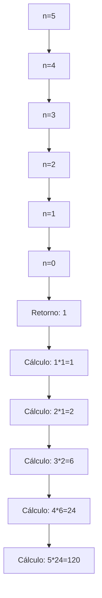

# Recursión lineal

La recursión lineal es un tipo de función recursiva que se comporta como un proceso recursivo, ya que para calcular un valor se depende de un valor anterior. En este tipo de recursión, cada llamada recursiva genera una nueva llamada hasta alcanzar el caso base, y luego se resuelven las llamadas pendientes en orden inverso.

## Definición matemática

La función factorial es un ejemplo clásico de recursión lineal. Se define como:

$$
f(n) = \begin{cases}
      1 & \text{si } n = 0 \\
      n \cdot f(n-1) & \text{en otro caso}
      \end{cases}
$$

## Implementación en Scala

```scala
/**
  * Calcula el factorial de un número entero no negativo usando recursión lineal.
  * 
  * @param n El número entero para calcular su factorial.
  * @return El factorial de n.
  * @throws IllegalArgumentException si n es negativo.
  */
def factorial(n: Int): Int = {
  // Caso base: cuando n es 0, el factorial es 1
  if (n == 0) 1
  // Caso recursivo: n * factorial(n-1)
  else n * factorial(n - 1)
}

// Ejemplo de ejecución: factorial(5)
// factorial(5) = 5 * factorial(4)
// factorial(4) = 4 * factorial(3)
// factorial(3) = 3 * factorial(2)
// factorial(2) = 2 * factorial(1)
// factorial(1) = 1 * factorial(0)
// factorial(0) = 1 // Caso base alcanzado

// Resolución de las llamadas recursivas:
// factorial(1) = 1 * 1 = 1
// factorial(2) = 2 * 1 = 2
// factorial(3) = 3 * 2 = 6
// factorial(4) = 4 * 6 = 24
// factorial(5) = 5 * 24 = 120
```

## Diseño de funciones recursivas

Para diseñar correctamente una función recursiva, se deben seguir estos principios:

1. **Caso base**: Debe definirse primero y proporcionar una respuesta inmediata sin necesidad de más llamadas recursivas. Este caso detiene la recursión.

2. **Caso recursivo**: Debe componer la solución a partir de resultados de llamadas recursivas con parámetros que se acerquen progresivamente al caso base.

## Consideraciones de rendimiento y memoria

En la recursión lineal, cada llamada recursiva crea un nuevo marco en la pila de ejecución (stack frame). Esto significa que para calcular `factorial(n)` se necesitan `n+1` marcos de pila. Para valores grandes de `n`, esto puede provocar un desbordamiento de pila (StackOverflowError).

La ejecución de `factorial(5)` puede visualizarse como:



## Conceptos teóricos adicionales

### Recursión vs. Iteración
La recursión lineal puede convertirse en iteración mediante el uso de bucles, lo que generalmente es más eficiente en términos de memoria. Sin embargo, la recursión suele ofrecer una representación más clara y natural para ciertos problemas.

### Recursión de cola (Tail Recursion)
Una optimización importante para la recursión lineal es la recursión de cola, donde la llamada recursiva es la última operación en la función. Scala puede optimizar este tipo de recursión para evitar el crecimiento de la pila, convirtiéndola en un bucle iterativo a nivel de bytecode.

### Validación de entrada
En implementaciones reales, es importante validar que el parámetro de entrada sea no negativo, ya que el factorial no está definido para números negativos.

## Tabla de resumen

| Concepto | Descripción | Ejemplo |
|----------|-------------|---------|
| Recursión lineal | Tipo de recursión donde cada llamada genera exactamente una nueva llamada recursiva hasta alcanzar el caso base | `factorial(n) = n * factorial(n-1)` |
| Caso base | Condición que detiene la recursión, proporcionando un resultado directo | `factorial(0) = 1` |
| Caso recursivo | Parte de la función que realiza la llamada recursiva con parámetros modificados | `n * factorial(n-1)` |
| Pila de ejecución | Estructura de datos que almacena información de llamadas a funciones, incluyendo parámetros y dirección de retorno | Cada llamada a `factorial` crea un nuevo marco en la pila |
| Desbordamiento de pila | Error que ocurre cuando se excede la capacidad de la pila de ejecución | Puede ocurrir con `factorial` para valores grandes de `n` |
| Complejidad espacial | Cantidad de memoria utilizada, que en recursión lineal es O(n) | `factorial(n)` requiere O(n) espacio en la pila |
| Complejidad temporal | Número de operaciones realizadas, que en recursión lineal es O(n) | `factorial(n)` realiza O(n) multiplicaciones |

## Comentarios adicionales

1. **Limitaciones prácticas**: Para valores grandes de `n`, la recursión lineal del factorial puede causar desbordamiento de pila antes de que el resultado sea calculable. En Scala, se puede usar la anotación `@tailrec` para asegurar que el compilador optimice la recursión cuando sea posible.

2. **Alternativas**: Para funciones como el factorial, es preferible usar iteración o recursión de cola para evitar problemas de rendimiento y memoria.

3. **Aplicaciones**: La recursión lineal es fundamental en muchos algoritmos, incluyendo el cálculo de secuencias (Fibonacci), recorrido de estructuras de datos lineales (listas enlazadas) y en la evaluación de expresiones matemáticas.

4. **Depuración**: Al depurar funciones recursivas, es útil rastrear la profundidad de recursión y los valores de los parámetros en cada llamada para identificar posibles problemas en la lógica o casos base incorrectos.

5. **Generalización**: El patrón de recursión lineal puede extenderse a problemas donde la solución de un problema de tamaño `n` depende de la solución de un problema de tamaño `n-1`, manteniendo una relación directa entre el tamaño del problema y la profundidad de recursión.