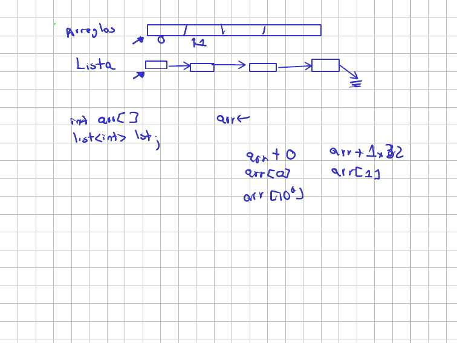
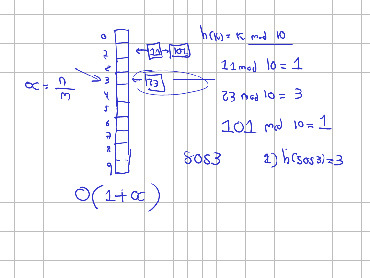
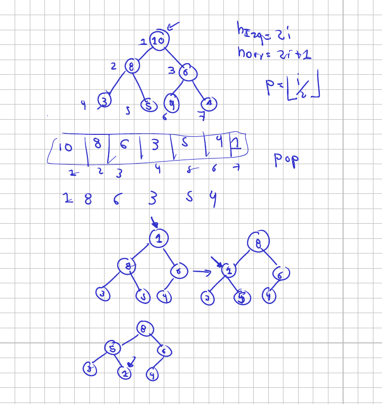
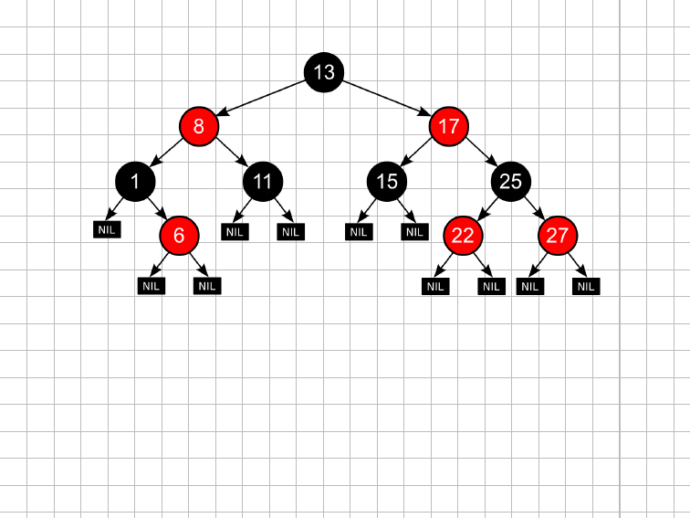

# Clase 1. Repaso de estructuras de datos y notación asintótica

Viernes 31 de julio de 2026. Grupos A y B.

Los dos grupos ven la misma sesión el mismo día, uno de 7 a 9 y el otro de 9 a
11, así que estas notas sirven para ambos. Lo que cambia entre una y otra son
las preguntas que salen en el salón; el recorrido es el mismo.

La sesión tiene dos mitades. La primera repasa las estructuras que ya trae cada
lenguaje y, sobre todo, cuánto cuesta cada una de sus operaciones. La segunda
responde la pregunta que queda flotando: ¿qué significa exactamente ese $O$ que
aparece en todas las tablas, y cómo se demuestra que algo pertenece a él?

## Diapositivas

Esta versión incluye lo que se dibujó en el tablero durante la clase, en las
páginas donde apareció.

{ type=application/pdf style="min-height:70vh;width:100%" }

## Elegir estructura es elegir un costo

Tres situaciones para arrancar:

1. Deshacer la última acción en un editor de texto (Ctrl+Z).
2. Atender los turnos de una fila en un banco.
3. Buscar el teléfono de un contacto a partir de su nombre.

Las respuestas salieron rápido: pila, cola, diccionario. Ctrl+Z deshace lo
último que se hizo, que es exactamente la política LIFO; la fila atiende al
primero que llegó, que es FIFO; y el nombre funciona como clave del teléfono.

Pero la respuesta interesante no es cuál estructura, sino cuánto cuesta. El
Ctrl+Z se podría implementar con una lista y recorrerla hasta el final cada vez.
Funcionaría. Lo que cambia es que cada deshacer pasaría de costar $O(1)$ a
costar $O(n)$, y ese es el tipo de decisión que este curso pide justificar.
Todas estas estructuras ya vienen implementadas; lo que hay que saber es qué
paga uno por usarlas.

## Arreglo y lista: la diferencia está en cómo se llega al elemento

Antes de las tablas, la pregunta de fondo. ¿En qué se diferencian de verdad un
arreglo y una lista enlazada, si los dos guardan una colección de elementos del
mismo tipo?



Un arreglo es una reserva contigua de memoria. La variable no guarda el arreglo:
guarda la dirección donde empieza. Por eso los arreglos se pasan por referencia
y no por valor, en C, en C++ y también en Java; copiar un arreglo bidimensional
completo en la pila cada vez que se llama una función sería inviable.

Y por eso la indexación es aritmética de punteros:

| Se escribe | Lo que ocurre por debajo |
|---|---|
| `arr[0]` | `arr + 0` — el primer elemento está justo donde apunta la variable |
| `arr[1]` | `arr + 1 × 32` — un desplazamiento del tamaño del tipo |
| `arr[1000000]` | `arr + 1000000 × 32` |

Esa es la razón real de que los índices empiecen en cero, y no una manía de los
ingenieros de sistemas: el primer elemento no necesita desplazamiento. La forma
`arr[i]` es azúcar sintáctico sobre `*(arr + i)`.

Ahora la pregunta que importa. ¿Cuánto cuesta llegar a `arr[1000000]`? La
respuesta es $O(1)$, y el motivo es que la CPU suma dos números de 64 bits en
tiempo constante sin importar qué tan grandes sean. Sumarle cero a una dirección
cuesta lo mismo que sumarle un millón.

La lista enlazada también guarda la dirección del primero, pero ahí se acaba el
parecido. Los nodos pueden estar en cualquier parte de la memoria; lo único que
los conecta son los apuntadores. Para llegar al elemento diez hay que pasar por
los nueve anteriores, y para llegar al millón hay que pasar por 999 999. El
acceso aleatorio cuesta $O(n)$.

A cambio, la lista crece y decrece sin problema. El arreglo tiene tamaño fijo:
si uno reservó diez posiciones y necesita once, toca reservar otro bloque y
copiar. Eso es justamente lo que hace `std::vector` por dentro, y es la razón de
que su `push_back` sea $O(1)$ *amortizado* y no $O(1)$ a secas.

## Cuatro maneras de sumar diez millones de números

Con esa diferencia en la cabeza, el experimento en vivo. El programa suma la
misma lista de $10^7$ enteros de cuatro formas distintas y mide el tiempo de
cada una.

```python title="complejidad.py"
import time
import numpy as np

n = 10000000
lst = [x for x in range(0, n)]   # lista nativa con 0, 1, ..., n-1

# Version A: recorrer con indice. Cada lst[i] obliga al interprete a
# resolver la posicion i, diez millones de veces.
ini = time.time()
sumA = 0
for i in range(0, n):
    sumA += lst[i]
fin = time.time()
print("El tiempo de ejecución es", fin - ini)

# Version B: recorrer con iterador. Ya esta parado sobre el elemento y
# solo avanza; no vuelve a resolver la posicion.
ini = time.time()
sumB = 0
for elm in lst:
    sumB += elm
fin = time.time()
print("El tiempo de ejecución es", fin - ini)

# Version C: NumPy suma el arreglo completo en su capa de C, sin volver
# al interprete entre elemento y elemento.
arr = np.array(lst)
ini = time.time()
sumC = arr.sum()
fin = time.time()
print("El tiempo de ejecución es", fin - ini)

# Version D: el arreglo rapido, pero recorrido con indice desde Python.
# Cada arr[i] cruza la frontera entre C y Python. Es la trampa.
arr = np.array(lst)
ini = time.time()
sumD = 0
for i in range(0, n):
    sumD += arr[i]
fin = time.time()
print("El tiempo de ejecución es", fin - ini)

print(sumA, sumB, sumC, sumD)
```

El archivo enlazado al final trae estos mismos comentarios ampliados, línea por
línea.

La salida de la clase:

```console
$ python3 complejidad.py
El tiempo de ejecución es 1.289076805114746
El tiempo de ejecución es 0.9835584163665771
El tiempo de ejecución es 0.004431247711181641
El tiempo de ejecución es 2.0747287273406982
49999995000000 49999995000000 49999995000000 49999995000000
```

Las cuatro sumas dan lo mismo. Los tiempos, no:

| Versión | Cómo recorre | Tiempo |
|---|---|---:|
| A | `lst[i]` con índice | 1,29 s |
| B | `for elm in lst` con iterador | 0,98 s |
| C | `arr.sum()` de NumPy | 0,0044 s |
| D | `arr[i]` con índice, sobre el arreglo de NumPy | 2,07 s |

Tres lecturas.

**A contra B.** Las dos recorren toda la lista y hacen el mismo número de sumas,
pero el iterador es más rápido. Cuando uno indexa, el intérprete resuelve la
posición desde cero cada vez; el iterador ya está parado en el elemento y solo
avanza al siguiente. Es la diferencia entre preguntar la dirección cada vez y
seguir caminando por la calle. El iterador también explica por qué se puede
recorrer una lista enlazada hacia adelante con costo total $O(n)$ y no $O(n^2)$.

**C.** `arr.sum()` baja a la capa de C que hay debajo de NumPy y hace la suma
completa allá, sin volver al intérprete de Python entre elemento y elemento. Dos
órdenes de magnitud de diferencia, con exactamente el mismo resultado.

**D.** Esta es la sorpresa de la clase: indexar el arreglo de NumPy salió *peor*
que indexar la lista nativa. Cada `arr[i]` cruza la frontera entre C y Python y
envuelve el entero en un objeto de Python, diez millones de veces. Toda la
ventaja se pierde y encima se paga la conversión.

Los tiempos exactos cambian de una máquina a otra y de una corrida a otra; A y D
quedan tan cerca que pueden intercambiarse de lugar. Lo que no cambia es el
orden de magnitud: la versión D es unas quinientas veces más lenta que la C,
o sea que recorrer un `ndarray` con índice deja a NumPy corriendo a la
velocidad de un ciclo de Python.

!!! warning "La regla que sale de aquí"

    Si usan NumPy, no indexen. NumPy sirve porque trabaja con el arreglo
    completo de una vez; un `for` sobre sus posiciones anula la razón por la que
    uno lo trajo. Y el punto general vale más allá de NumPy: la complejidad
    computacional depende de la estructura, pero también de cómo se la usa.

Sobre el lenguaje: Python es interpretado, y eso se paga. La analogía de la
clase fue la de conversar con alguien que habla otro idioma a través de un
intérprete. Funciona, pero cada frase pasa por un tercero. Si uno aprende el
idioma, habla directo, y eso es lo que hace un lenguaje compilado. Las
bibliotecas como NumPy son la manera de saltarse al intérprete sin dejar Python.

## Operaciones de valor y operaciones en sitio

Un detalle de Python que conviene tener claro desde ahora, porque se cuela en
las tareas:

```pycon
>>> a = {1,2,3,4,4,4}
>>> b = {1,4,5}
>>> a.union(b) #Operacion de valor
{1, 2, 3, 4, 5}
>>> a.update(b) #Operacion inplace
>>> a
{1, 2, 3, 4, 5}
>>> #Cuidado
>>> l = [1,2,3,4]
>>> f = l.append(10)
>>> l #Modificado
[1, 2, 3, 4, 10]
>>> f #Valor nulo (la operacion no retorna valor)
>>> type(f)
<class 'NoneType'>
```

`union` devuelve un conjunto nuevo y deja `a` intacto. `update` modifica `a` y no
devuelve nada. Lo mismo pasa con `append`, `sort` y `reverse` sobre listas: son
operaciones en sitio y retornan `None`. Escribir `l = l.append(10)` no agrega el
diez a la lista, deja `l` valiendo `None` y el programa se cae tres líneas
después, en un lugar que no tiene nada que ver.

## Las tablas de costos

Estas son las tablas del repaso. Sirven de referencia para el resto del
semestre, así que vale la pena tenerlas a mano.

### Listas

| Operación | `std::list` | `std::deque` | `deque` (Python) | Costo |
|---|---|---|---|:---:|
| push back | `l.push_back(x)` | `l.push_back(x)` | `l.append(x)` | $O(1)$ |
| push front | `l.push_front(x)` | `l.push_front(x)` | `l.appendleft(x)` | $O(1)$ |
| pop back | `l.pop_back()` | `l.pop_back()` | `l.pop()` | $O(1)$ |
| pop front | `l.pop_front()` | `l.pop_front()` | `l.popleft()` | $O(1)$ |
| front | `l.front()` | `l.front()` | `l[0]` | $O(1)$ |
| back | `l.back()` | `l.back()` | `l[-1]` | $O(1)$ |
| insert | `l.insert(it, x)` | `l.insert(it, x)` | `l.insert(pos, x)` | $O(k)$ |
| erase | `l.erase(it)` | `l.erase(it)` | `del l[pos]` | $O(k)$ |
| size | `l.size()` | `l.size()` | `len(l)` | $O(1)$ |
| empty | `l.empty()` | `l.empty()` | `len(l) == 0` | $O(1)$ |

Hay referencias directas a los dos extremos, así que todo lo que solo toca los
extremos es $O(1)$. Insertar o borrar en la posición $k$ obliga a llegar hasta
ella primero, y eso cuesta $O(k)$.

### Pilas

| Operación | `std::vector` | `std::stack` | `deque` (Python) | Costo |
|---|---|---|---|:---:|
| push | `t.push_back(x)` | `t.push(x)` | `t.append(x)` | $O(1)$* |
| top | `t[t.size()-1]` | `t.top()` | `t[-1]` | $O(1)$ |
| pop | `t.pop_back()` | `t.pop()` | `t.pop()` | $O(1)$ |
| size | `t.size()` | `t.size()` | `len(t)` | $O(1)$ |
| empty | `t.empty()` | `t.empty()` | `len(t) == 0` | $O(1)$ |

Toda operación toca únicamente el tope. El asterisco es el de siempre: en
`vector`, `push_back` es $O(1)$ amortizado porque de vez en cuando toca
redimensionar el arreglo interno y copiar.

### Colas

| Operación | `std::queue` | `deque` (Python) | Costo |
|---|---|---|:---:|
| push | `t.push(x)` | `t.append(x)` | $O(1)$ |
| front | `t.front()` | `t[0]` | $O(1)$ |
| pop | `t.pop()` | `t.popleft()` | $O(1)$ |
| size | `t.size()` | `len(t)` | $O(1)$ |
| empty | `t.empty()` | `len(t) == 0` | $O(1)$ |

!!! danger "El error de Python que cuesta TLE en la arena"

    Una pila sí se puede armar con la lista nativa de Python: `append` y `pop()`
    trabajan en el último elemento y ambos son $O(1)$.

    Una cola, no. `l.pop(0)` saca el primero y desplaza todos los demás una
    posición, así que cuesta $O(n)$. Un BFS escrito así pasa de $O(V + E)$ a
    $O(V \cdot E)$ y el juez lo rechaza por tiempo. Para colas se usa
    `collections.deque`. Esto pasó el semestre pasado más de una vez.

### Tablas de direccionamiento directo

| Operación | `vector` (C++) | `map` (C++) | `list` (Python) | `dict` (Python) |
|---|---|---|---|---|
| assign | `t.push_back(v)` $O(1)$* | `t[c] = v` $O(\log n)$ | `t.append(v)` $O(1)$* | `t[c] = v` $O(1)$ |
| update | `t[i] = v` $O(1)$ | `t[c] = v` $O(\log n)$ | `t[i] = v` $O(1)$ | `t[c] = v` $O(1)$ |
| query | `t[i]` $O(1)$ | `t[c]` $O(\log n)$ | `t[i]` $O(1)$ | `c in t` $O(1)$ |

Con índices, la posición se calcula con un desplazamiento en memoria. El `map`
de C++ guarda un árbol rojinegro balanceado, de ahí el $O(\log n)$; el `dict` de
Python usa una tabla hash, de ahí el $O(1)$ en promedio.

### Colas de prioridad

| Operación | `priority_queue` (C++) | `heapq` (Python) | Costo |
|---|---|---|:---:|
| push | `t.push(x)` | `heappush(t, x)` | $O(\log n)$ |
| top | `t.top()` | `t[0]` | $O(1)$ |
| pop | `t.pop()` | `heappop(t)` | $O(\log n)$ |
| size | `t.size()` | `len(t)` | $O(1)$ |
| empty | `t.empty()` | `len(t) == 0` | $O(1)$ |

!!! warning "Cuidado al traducir entre lenguajes"

    `priority_queue` de C++ entrega primero el **mayor**; `heapq` de Python
    entrega primero el **menor**. Para invertir el orden en Python se guardan los
    valores negados, o se guarda una tupla `(prioridad, elemento)` con la
    prioridad ya invertida.

### Conjuntos

| Operación | `set` (C++) | `set` (Python) | Costo C++ | Costo Python |
|---|---|---|:---:|:---:|
| insert | `t.insert(x)` | `t.add(x)` | $O(\log n)$ | $O(1)$ |
| erase | `t.erase(x)` | `t.discard(x)` | $O(\log n)$ | $O(1)$ |
| size | `t.size()` | `len(t)` | $O(1)$ | $O(1)$ |
| empty | `t.empty()` | `len(t) == 0` | $O(1)$ | $O(1)$ |

### Resumen

| Estructura | C++ | Python | Operaciones dominantes |
|---|---|---|---|
| Lista | `list`, `deque` | `collections.deque` | extremos $O(1)$; posición $k$: $O(k)$ |
| Pila | `stack`, `vector` | `deque`, `list` | push/pop $O(1)$ |
| Cola | `queue` | `deque` | push/pop $O(1)$ |
| Direcc. directo | `vector`, `map` | `list`, `dict` | índice $O(1)$; `map` $O(\log n)$; `dict` $O(1)$ |
| Cola de prioridad | `priority_queue` | `heapq` | push/pop $O(\log n)$; top $O(1)$ |
| Conjunto | `set` | `set` | insert/erase $O(\log n)$ / $O(1)$ |

## De dónde sale el $O(1 + \alpha)$ de la tabla hash

Los costos de la tabla anterior no son magia. Tres de ellos se dibujaron en el
tablero, empezando por la tabla hash.



La tabla tiene diez casillas, numeradas de 0 a 9, y la función hash es el método
de la división:

$$h(k) = k \bmod 10$$

Se puede usar módulo 10 porque el residuo de dividir entre diez solo puede ser
un número entre 0 y 9, que es justo el rango de posiciones disponibles.

Con esa función: $11 \bmod 10 = 1$, entonces el 11 va a la casilla 1.
$23 \bmod 10 = 3$, el 23 va a la 3. Pero llega el 101, y $101 \bmod 10 = 1$, que
ya está ocupada por el 11. Eso es una **colisión**, y con muchos datos es
inevitable: no se puede tener una tabla tan grande como el universo de llaves
posibles. La salida es el **encadenamiento**: la casilla guarda una lista
enlazada y el 101 se cuelga detrás del 11.

Ahora, el factor de carga. Si hay $n$ elementos repartidos en $m$ casillas:

$$\alpha = \frac{n}{m}$$

Con cien datos en diez casillas, $\alpha = 10$: cada cadena tiene unos diez
elementos. Esa repartición pareja es lo que garantiza una buena función hash, y
la clase la planteó como el problema de alojar cien personas en diez
habitaciones: uno quiere diez por habitación, no cien en una sola.

Con eso, el costo de buscar la llave 5053 se descompone en dos partes:

1. Calcular $h(5053) = 3$. Es una operación aritmética: $O(1)$.
2. Ir a la casilla 3. Está direccionada, no hay que recorrer las anteriores:
   $O(1)$.
3. Recorrer la cadena que cuelga de ahí: en promedio $\alpha$.

De ahí sale el $O(1 + \alpha)$.

!!! note "Qué rompe la garantía"

    El $\alpha$ promedio depende de que los datos se distribuyan bien. Si todas
    las llaves fueran múltiplos de diez, todas caerían en la casilla 0 y la tabla
    degeneraría en una única lista enlazada: $O(n)$. Por eso las
    implementaciones de Python, Java y C++ no usan la llave cruda, sino que le
    aplican una codificación antes (el método `hash`) para repartirla mejor.

`tabla_hash.py` arma esta misma tabla, encadena las colisiones y compara las dos
distribuciones. Las dos guardan cien llaves en diez casillas, así que tienen
idéntico factor de carga; lo que cambia es dónde caen:

```console
$ python3 tabla_hash.py
El ejemplo del tablero
  h( 11) = 1
  h( 23) = 3
  h(101) = 1
  casillas: [[], [11, 101], [], [23], [], [], [], [], [], []]
  el 101 colisiona con el 11 y se encadena detras de el
  buscar 101 -> encontrada: True | casilla: 1 | pasos en la cadena: 2

100 llaves bien repartidas frente a 100 llaves multiplos de 10
  alpha = 10.0 en las dos tablas (mismo n, mismo m)
  cadenas con buena distribucion: [10, 10, 10, 10, 10, 10, 10, 10, 10, 10]
  cadenas con mala  distribucion: [100, 0, 0, 0, 0, 0, 0, 0, 0, 0]
  la cadena mas larga pasa de 10 a 100 elementos
```

El $\alpha$ es el mismo en los dos casos y aun así el costo real es
completamente distinto. Por eso $O(1 + \alpha)$ es un promedio con supuestos, no
una garantía.

## De dónde sale el $O(\log n)$ del montículo

Una cola de prioridad es una fila donde no sale primero el que llegó primero,
sino el más urgente. Por debajo casi siempre hay un **montículo** (*heap*), que
es un árbol binario con dos propiedades:

- **Propiedad de orden.** Los hijos de un nodo son menores o iguales que él (en
  un montículo de máximos).
- **Propiedad de forma.** El árbol se llena por niveles y de izquierda a derecha;
  no puede haber un nodo a la derecha que esté más abajo que un hueco a la
  izquierda.



Lo bonito es que no hace falta implementarlo con nodos y apuntadores. Con el
arreglo indexado desde 1 basta:

| Relación | Fórmula |
|---|---|
| Hijo izquierdo de $i$ | $2i$ |
| Hijo derecho de $i$ | $2i + 1$ |
| Padre de $i$ | $\lfloor i/2 \rfloor$ |

El montículo del tablero se representa así:

| Posición | 1 | 2 | 3 | 4 | 5 | 6 | 7 |
|---|:---:|:---:|:---:|:---:|:---:|:---:|:---:|
| Valor | 10 | 8 | 6 | 3 | 5 | 4 | 1 |

El hijo izquierdo de la posición 2 (el 8) está en la posición 4, que es el 3; el
derecho, en la 5, que es el 5. Cuadra con el dibujo.

### Traza de `pop`

Sacar el máximo no es simplemente borrar la raíz: eso dejaría el árbol partido en
dos. Lo que se hace es quitar la raíz, subir el último elemento a su lugar y
hundirlo hasta que la propiedad de orden se restablezca. Esa bajada es
`heapify`.

| Paso | Arreglo | Qué pasó |
|---|---|---|
| Inicio | `10 8 6 3 5 4 1` | — |
| Quitar raíz, subir el último | `1 8 6 3 5 4` | el 1 queda arriba y viola el orden |
| Intercambiar con el hijo mayor (8) | `8 1 6 3 5 4` | el 1 baja un nivel, sigue violando |
| Intercambiar con el hijo mayor (5) | `8 5 6 3 1 4` | ya cumple; termina |

Cada intercambio cuesta $O(1)$ (son dos posiciones de un arreglo) y el elemento
baja un nivel por intercambio. Como el árbol está balanceado por la propiedad de
forma, su altura es $\log n$, y ese es el número máximo de intercambios. De ahí
sale el $O(\log n)$ de `pop`.

`push` es el mismo argumento al revés: el elemento nuevo entra al final, y sube
mientras sea mayor que su padre. Si se inserta un 20 en el montículo de arriba,
entra en la última posición, se compara con su padre, sube, se vuelve a comparar
y sube otra vez hasta la raíz. Como máximo, la altura del árbol.

El `top`, en cambio, es $O(1)$: el máximo siempre está en la posición 1.

`monticulo.py` implementa las tres operaciones con las fórmulas de arriba y va
imprimiendo cada intercambio, de modo que la salida es la traza del tablero:

```console
$ python3 monticulo.py
monticulo inicial          : [10, 8, 6, 3, 5, 4, 1]
  raiz (el maximo)         : 10
  hijo izquierdo de la pos 2: 3
  hijo derecho   de la pos 2: 5

pop: extraer el maximo
  sube el ultimo a la raiz  : [1, 8, 6, 3, 5, 4]
  intercambia con el hijo mayor: [8, 1, 6, 3, 5, 4]
  intercambia con el hijo mayor: [8, 5, 6, 3, 1, 4]
  maximo extraido          : 10
  monticulo resultante     : [8, 5, 6, 3, 1, 4]

push: insertar el 20
  sube 20 un nivel      : [8, 5, 20, 3, 1, 4, 6]
  sube 20 un nivel      : [20, 5, 8, 3, 1, 4, 6]
  monticulo resultante     : [20, 5, 8, 3, 1, 4, 6]
```

Dos intercambios para bajar, dos para subir. En un montículo de mil elementos
serían diez, y en uno de un millón, veinte: eso es el logaritmo.

## Conjuntos y mapas: dos implementaciones, dos costos

La última tabla del repaso tiene un renglón raro: `set` de C++ cuesta
$O(\log n)$ y `set` de Python cuesta $O(1)$. La razón es que están construidos
sobre estructuras distintas.

El de C++ es un **árbol rojinegro**, que es un árbol binario de búsqueda con
color en los nodos.



En un árbol binario de búsqueda, los hijos izquierdos son menores y los derechos
son mayores, así que buscar es ir preguntando y bajar por un solo lado. El
problema es el peor caso: si uno inserta 1, 2, 3, 4, 5 en ese orden, cada
elemento entra a la derecha del anterior y el árbol degenera en algo que es, en
la práctica, una lista enlazada con un apuntador desperdiciado. Buscar vuelve a
costar $O(n)$.

El rojinegro corrige eso con las rotaciones a izquierda y a derecha, que
reacomodan el árbol después de cada inserción. La propiedad que mantiene es
sobre la **altura negra**: el número de nodos negros es el mismo en todos los
caminos de la raíz a las hojas, y eso obliga a que la rama más larga no pase del
doble de la más corta. La altura queda en $O(\log n)$ y las operaciones también.

Como un conjunto no admite repetidos, en él las comparaciones son estrictas: a
la izquierda estrictamente menores, a la derecha estrictamente mayores.

El `set` y el `dict` de Python van por el otro camino: tabla hash. De ahí el
$O(1)$ en promedio, con la advertencia del factor de carga que ya vimos.

!!! note "Dos apuntes que salieron al margen"

    **Las listas y los árboles son la misma idea.** Una lista es un elemento
    seguido de una lista. Un árbol binario es un elemento seguido de dos árboles.
    La única diferencia es cuántos apuntadores tiene el nodo, y por eso la
    recursión sobre una lista hace un llamado y la recursión sobre un árbol hace
    dos. Esta observación va a volver cuando lleguemos a grafos.

    **Los árboles B están debajo de las bases de datos.** Cuando uno indexa una
    columna, lo que construye el motor es un árbol de búsqueda; por eso una
    consulta sobre columna indexada baja de $O(n)$ a $O(\log n)$. Si una consulta
    va lenta, la segunda cosa que hay que revisar (después de mirar que no haya
    una barbaridad en el medio) es si la columna está indexada.

## Segunda parte: ¿de dónde salen esos costos?

Las tablas están llenas de $O(1)$, $O(\log n)$, $O(k)$. Toca definir qué
significa ese símbolo, y antes de eso, cómo se estima el costo de un pedazo de
código.

La convención es sencilla: las **operaciones elementales** —asignaciones,
operaciones aritméticas, comparaciones— cuestan 1. Con las estructuras de datos
hay que tener más cuidado, porque ahí el costo lo dan las tablas de arriba.

### Contar operaciones línea a línea

```python
def suma(datos):
    total = 0                        # una asignacion: cuesta c1, una vez
    i = 0                            # otra asignacion: cuesta c2, una vez
    while i < len(datos):            # comparacion: c3, y corre n+1 veces
        total = total + datos[i]     # suma y asignacion: c4, n veces
        i = i + 1                    # incremento: c5, n veces
    return total                     # c6, una vez
```

| Línea | Costo | Veces |
|---|:---:|:---:|
| `total = 0` | $c_1$ | 1 |
| `i = 0` | $c_2$ | 1 |
| `while i < len(datos)` | $c_3$ | $n+1$ |
| `total = total + datos[i]` | $c_4$ | $n$ |
| `i = i + 1` | $c_5$ | $n$ |
| `return total` | $c_6$ | 1 |

El $n+1$ de la comparación es la pregunta que siempre sale. El cuerpo del ciclo
corre $n$ veces, pero la condición se evalúa una vez más: la última evaluación es
la que resulta falsa y termina el ciclo. Esa comparación también cuenta.

Sumando:

$$T(n) = (c_3 + c_4 + c_5)\, n + (c_1 + c_2 + c_3 + c_6) = a\,n + b$$

Una recta en $n$. Si todas las operaciones cuestan 1, queda $T(n) = 3n + 4$.

### Verificarlo corriendo el programa

Nada de esto hay que creerlo. `conteo_operaciones.py` ejecuta la misma función
con un contador por línea y reproduce la tabla:

```console
$ python3 conteo_operaciones.py
suma([1, 2, 3, 4]) = 10

n = 0, suma = 0
  total = 0                    1
  i = 0                        1
  while i < len(datos)         1
  total = total + datos[i]     0
  i = i + 1                    0
  return total                 1

n = 5, suma = 10
  total = 0                    1
  i = 0                        1
  while i < len(datos)         6
  total = total + datos[i]     5
  i = i + 1                    5
  return total                 1

n = 10, suma = 45
  total = 0                    1
  i = 0                        1
  while i < len(datos)        11
  total = total + datos[i]    10
  i = i + 1                   10
  return total                 1

n =  10   operaciones =  34
n =  20   operaciones =  64
n =  40   operaciones = 124
n =  80   operaciones = 244
```

Con $n = 5$ la comparación corre 6 veces y el cuerpo 5, tal como dice la tabla.
Y los totales cuadran con $3n + 4$: $34$, $64$, $124$, $244$. Al duplicar $n$, el
número de operaciones se duplica.

### ¿Importan $a$ y $b$?

Supongamos que corremos `suma` en un computador el doble de rápido. Las dos
constantes se reducen a la mitad. ¿Cambia la forma en que crece $T(n)$?

No. Sigue siendo una recta, y para $n$ grande el término $a\,n$ domina sobre
$b$. Lo que distingue a un algoritmo de otro es la forma de crecimiento, no las
constantes, y para comparar formas ignorando constantes existe la notación
asintótica.

## La notación $O$

La idea de partida es la de cota superior: $g(x)$ acota por arriba a $f(x)$ si
$f(x) \le g(x)$. Con eso, una misma función acota a muchas: desde cierto punto,
$x^2$ queda por encima de $x$, de $\sqrt{x}$ y de $\log x$.

Pero la idea cruda no alcanza, y las diapositivas la arreglan con dos preguntas.

**¿Y si la función oscila?** ¿Es $x^2$ cota superior de $\operatorname{sen}(x) + x$?
Cerca del origen no: en $x = 1$, $\operatorname{sen}(1) + 1 \approx 1{,}84 > 1$.
Pero de cierto punto en adelante sí. La salida es exigir la desigualdad solo
para $x \ge k$: una cota asintótica, no global.

**¿Y si la cota no alcanza?** ¿Es $x$ cota superior de $2x$? No, para ningún
$x > 0$. Pero $3x$ sí lo es. La salida es permitir multiplicar por una
constante $c$, que absorbe los factores que no cambian la forma de crecimiento.

Juntando las dos, la definición formal.

**Definición (CLRS, Sección 3.1, p. 47).**

$$O(g(n)) = \{\, f(n) : \text{existen constantes positivas } c \text{ y } k \text{ tales que } 0 \le f(n) \le c \cdot g(n) \text{ para todo } n \ge k \,\}$$

Cuatro observaciones sobre esa definición:

- $O(g(n))$ es un **conjunto de funciones**. Lo correcto es escribir
  $f(n) \in O(g(n))$. CLRS escribe $f(n) = O(g(n))$, que es un abuso de notación
  aceptado, pero no deja de ser un abuso: no se puede igualar una cosa a muchas.
- CLRS llama $n_0$ a la constante que aquí llamamos $k$. En el curso usamos $k$.
- A las constantes $c$ y $k$ las llamamos **testigos**. Exhibirlas es lo que
  demuestra la pertenencia.
- La cota inferior en $0$ no es decorativa: no vamos a considerar complejidades
  negativas. Un algoritmo con tiempo negativo respondería antes de recibir la
  entrada.

Así, $O(x^2)$ contiene a $x$, a $\sqrt{x}$, a $\log x$, a
$\operatorname{sen}(x) + x$ y a $50x + 7$. Lo que no contiene es $x^3$: por
grande que se escoja la constante, digamos un millón, $x^3$ termina superando a
$10^6 \cdot x^2$. El crecimiento gana siempre.

## Cómo se escribe una demostración en este curso

Esta es la receta, y se usa igual en quices, talleres y parciales:

1. **Teorema.** El enunciado preciso de lo que se quiere demostrar.
2. **Demostración.** Se declara la estrategia antes de desarrollar: de forma
   directa, por inducción matemática o por contradicción.
3. **Desarrollo.** La cadena de desigualdades. Aquí aparecen los testigos.
4. **Conclusión.** El cierre explícito, con los testigos: «por lo tanto, se
   puede concluir que… con testigos $c = \ldots$ y $k = \ldots$».

!!! tip "Qué es un testigo"

    La demostración es lo general; el testigo es el valor concreto que la hace
    verificable. Es la diferencia entre demostrar que la suma de dos pares es par
    ($2m + 2n = 2(m+n)$, para todo $m$ y $n$) y exhibir el 10 y el 20. La
    analogía que usó la clase: uno se casa ante testigos, y son ellos los que
    acreditan que el acto ocurrió.

### Buscar los testigos por tanteo

Antes de escribir nada, uno tantea. Para $3n^2 \in O(n^2)$ hay que encontrar $c$
y $k$ con $3n^2 \le c \cdot n^2$ para todo $n \ge k$:

| $c$ | ¿$3n^2 \le c \cdot n^2$ para todo $n \ge 1$? | Veredicto |
|:---:|---|:---:|
| 1 | $3n^2 \le n^2$ es falso | ✗ |
| 2 | $3n^2 \le 2n^2$ es falso | ✗ |
| 3 | $3n^2 \le 3n^2$ vale para todo $n \ge 1$ | ✓ |

Testigos: $c = 3$ y $k = 1$. Ahora sí se escribe.

### La demostración escrita

> **Teorema.** $3n^2 \in O(n^2)$.
>
> **Demostración.** Se procede de forma directa.
>
> *Desarrollo.* Sea $n \ge 1$. Entonces $0 \le 3n^2 \le 3 \cdot n^2$, de modo que
> la definición de $O(n^2)$ se cumple con $c = 3$ y $k = 1$.
>
> *Conclusión.* Por lo tanto, se puede concluir que $3n^2 \in O(n^2)$ con
> testigos $c = 3$ y $k = 1$. $\blacksquare$

### El mismo molde, otros datos

> **Teorema.** $7x^2 \in O(x^3)$.
>
> **Demostración.** Se procede de forma directa.
>
> *Desarrollo.* Sea $x \ge 7$. Entonces $7 \le x$ y, multiplicando ambos lados
> por $x^2 > 0$, $7x^2 \le x \cdot x^2 = 1 \cdot x^3$, de modo que la definición
> se cumple con $c = 1$ y $k = 7$.
>
> *Conclusión.* Por lo tanto, se puede concluir que $7x^2 \in O(x^3)$ con
> testigos $c = 1$ y $k = 7$. $\blacksquare$

Note que aquí $k = 7$ y en el anterior $k = 1$. El valor de $k$ sale del
desarrollo, no es siempre uno.

### Cuando no hay testigos: contradicción

¿Y al revés? ¿Es $x^3 \in O(7x^2)$? A ojo se ve que no, porque el cubo se pasa
del techo. Pero hay que demostrarlo, y como no hay testigos que exhibir, la
estrategia cambia.

> **Teorema.** $x^3 \notin O(7x^2)$.
>
> **Demostración.** Se procede por contradicción.
>
> *Desarrollo.* Supongamos que $x^3 \in O(7x^2)$. Entonces existen constantes
> positivas $c$ y $k$ tales que $x^3 \le c \cdot 7x^2$ para todo $x \ge k$.
> Dividiendo por $x^2 > 0$ se obtiene $x \le 7c$ para todo $x \ge k$. Pero $x$
> crece sin límite: en $x = \max(k, 7c) + 1$ la desigualdad falla. Contradicción.
>
> *Conclusión.* Por lo tanto, se puede concluir que $x^3 \notin O(7x^2)$.
> $\blacksquare$

La clave del argumento: el teorema exige que la desigualdad valga para *todos*
los $x \ge k$, y lo que se obtuvo la acota a los $x \le 7c$. Como $7c$ es una
constante y $x$ no para de crecer, en algún momento la desigualdad se vuelve
falsa.

### Tres errores que cuestan puntos

- **Evaluar en un solo valor.** «En $x = 10$ sí se cumple» no demuestra nada. La
  desigualdad debe valer para todos los $x \ge k$. Ese 10 es un testigo, pero
  falta lo general.
- **Testigos que dependen de $n$.** Los testigos son constantes. Un «testigo»
  como $c = n$ no es un testigo.
- **Conclusión sin testigos.** En una demostración de pertenencia, el cierre dice
  con qué $c$ y qué $k$ se concluye. Sin eso, la demostración está incompleta.
  En una no pertenencia no hay testigos que exhibir, porque la estrategia es
  otra.

## Las notaciones $\Omega$ y $\Theta$

**Definición (CLRS, Sección 3.1, p. 48).**

$$\Omega(g(n)) = \{\, f(n) : \text{existen constantes positivas } c \text{ y } k \text{ tales que } 0 \le c \cdot g(n) \le f(n) \text{ para todo } n \ge k \,\}$$

Es la misma definición con la desigualdad volteada: $g$ acota por debajo. Si el
tiempo de un algoritmo está en $\Omega(n)$, sus tiempos quedan por encima de la
recta $c \cdot n$ desde $k$ en adelante.

> **Teorema 3.1 (CLRS, p. 48).** Para dos funciones $f(n)$ y $g(n)$ cualesquiera,
> $f(n) \in \Theta(g(n))$ si y solo si $f(n) \in O(g(n))$ y
> $f(n) \in \Omega(g(n))$.

$\Theta$ es la cota ajustada: techo y piso a la vez. Por ejemplo,
$3n^2 \in \Theta(n^2)$: la pertenencia a $O(n^2)$ ya se demostró con testigos
$c = 3$, $k = 1$, y la pertenencia a $\Omega(n^2)$ sale de $1 \cdot n^2 \le 3n^2$
con testigos $c = 1$, $k = 1$.

Las tres notaciones quedan presentadas; el curso trabaja principalmente con $O$,
pero en los parciales suelen aparecer puntos con $\Omega$ y $\Theta$.

!!! example "Dónde se ve esto en la vida real"

    La documentación de `Arrays.sort` de Java dice que el algoritmo es un
    *dual-pivot quicksort* que «ofrece rendimiento $O(n \log n)$» y advierte que
    con ciertas distribuciones de datos puede degradarse a cuadrático. Ahí está
    la notación funcionando como contrato: lo que la biblioteca promete y bajo
    qué condiciones deja de prometerlo.

## Terminología y peor caso

| Complejidad | Terminología |
|:---:|---|
| $O(1)$ | constante |
| $O(\log n)$ | logarítmica |
| $O(n)$ | lineal |
| $O(n \log n)$ | $n \log n$ |
| $O(n^b)$ | polinomial |
| $O(b^n)$ | exponencial |
| $O(n!)$ | factorial |

Con este vocabulario, las tablas del repaso se leen distinto: el `top` de una
cola de prioridad tiene complejidad constante; su `push`, logarítmica.

### Por qué la base del logaritmo no importa

Por el cambio de base,

$$\log_a b = \frac{\log_2 b}{\log_2 a}$$

y $1/\log_2 a$ es una constante. Entonces $\log_a b$ y $\log_2 b$ difieren en un
factor constante, y las notaciones asintóticas son conjuntos de funciones que
ignoran precisamente esos factores. Por eso se escribe $O(\log n)$ sin decir la
base.

### La cota se toma sobre el peor caso

Cuando se reporta que un algoritmo es $O(g(n))$, el análisis se hace sobre el
peor caso: así la cota no puede resultar peor de lo anunciado.

Ahora la pregunta capciosa. Si $T_1(n) \in O(n^2)$ y $T_2(n) \in O(n \log n)$,
¿el algoritmo 2 siempre es más rápido que el 1?

No. Las cotas hablan del peor caso y esconden las constantes. Para entradas
pequeñas, un algoritmo cuadrático con constantes chicas le gana a uno
$n \log n$ con constantes grandes. El ejemplo de la clase es el par de siempre:
el ordenamiento por inserción le gana al mergesort para arreglos de unas pocas
decenas de elementos, y de ahí en adelante pierde para siempre.

| Algoritmo | Peor caso | Mejor caso |
|---|:---:|:---:|
| Mergesort | $\Theta(n \log n)$ | $\Theta(n \log n)$ |
| Ordenamiento por inserción | $\Theta(n^2)$ | $\Theta(n)$ |

!!! warning "Un abuso de lenguaje frecuente"

    El tiempo del ordenamiento por inserción no es una única función de $n$:
    cambia con la entrada. La cota $O(n^2)$ sí vale para toda entrada, porque
    acota por encima. El abuso está en decir que su tiempo es $\Theta(n^2)$ a
    secas, porque con la entrada ya ordenada hace una sola pasada y el tiempo es
    lineal. Lo preciso es: **el peor caso** es $\Theta(n^2)$.

    El mejor caso, el caso medio y el análisis amortizado se estudian en el curso
    siguiente, Análisis de Algoritmos.

## Para practicar

Del cierre de las diapositivas. Escriban teorema, estrategia, desarrollo y
conclusión con testigos:

1. $x^2 + 2x + 1 \in O(x^2)$.
2. $\log_2 n \in O(n)$; partan de que $n < 2^n$.
3. $x^2 + 4x + 17 \in O(x^3)$, y además $x^3 \notin O(x^2 + 4x + 17)$.
4. $x \log_2 x \in O(x^2)$.
5. Expliquen qué significa que una función sea $O(1)$ y qué significa que sea
   $\Theta(1)$.

Pistas, para verificar el rumbo:

1. Acoten cada término por el dominante:
   $x^2 + 2x + 1 \le x^2 + 2x^2 + x^2 = 4x^2$ para $x \ge 1$. Testigos $c = 4$,
   $k = 1$.
2. Tomen logaritmo en base 2 a ambos lados de $n < 2^n$. Testigos $c = 1$,
   $k = 1$.
3. Misma técnica del punto 1: $x^2 + 4x + 17 \le 22x^3$ para $x \ge 1$. Para la
   no pertenencia, imiten la demostración por contradicción de
   $x^3 \notin O(7x^2)$.
4. Usen $\log_2 x \le x$ para $x \ge 1$ y multipliquen por $x$. Testigos $c = 1$,
   $k = 1$.
5. Revisen la definición con $g(n) = 1$.

Y uno de cierre, para resolver por su cuenta: demuestren que
$2^{n+1} \in O(2^n)$ y decidan, con demostración, si $2^{2n} \in O(2^n)$.

## Código de la clase

Todos los archivos están comentados línea por línea, con el costo de cada
operación anotado al lado. Bájenlos, córranlos y cámbienles cosas: la idea es
que sirvan para experimentar, no solo para leer.

Del experimento en vivo:

- [complejidad.py](codigo/complejidad.py) — las cuatro formas de sumar, con el
  porqué de cada tiempo
- [salida.txt](codigo/salida.txt) — los tiempos medidos en clase
- [inplace.txt](codigo/inplace.txt) — operaciones de valor y en sitio

De las diapositivas:

- [listas.py](codigo/listas.py) — operaciones de `deque` en Python, cada una con
  su costo
- [listas.cpp](codigo/listas.cpp) — las mismas en C++17
- [conteo_operaciones.py](codigo/conteo_operaciones.py) — el contador línea a
  línea que reproduce la tabla de $T(n)$

De lo que se dibujó en el tablero:

- [tabla_hash.py](codigo/tabla_hash.py) — tabla hash con encadenamiento, factor
  de carga y qué pasa cuando la función hash reparte mal
- [monticulo.py](codigo/monticulo.py) — montículo sobre un arreglo indexado desde
  1, con la traza de `pop` y de `push` paso a paso

Para correrlos:

```bash
python3 complejidad.py
python3 conteo_operaciones.py
python3 tabla_hash.py
python3 monticulo.py
g++ -std=c++17 -o listas listas.cpp && ./listas
```

!!! tip "Tres cosas para probar cambiándoles el código"

    1. En `complejidad.py`, bajen `n` a un millón y vuelvan a medir. ¿Se mantiene
       la proporción entre las cuatro versiones?
    2. En `tabla_hash.py`, cambien `m` de 10 a 97 (un primo) y miren cómo quedan
       las cadenas con las llaves múltiplos de 10.
    3. En `monticulo.py`, empiecen con un montículo de quince elementos y cuenten
       los intercambios de `pop`. Deberían ser a lo sumo tres.

## Recursos

- [VisuAlgo](https://visualgo.net/en) — visualizaciones interactivas de las
  estructuras de esta clase. Vale la pena jugar con los montículos y con el
  árbol rojinegro para ver las rotaciones en movimiento.
- [Curso de Estructuras de Datos del profesor Carlos Ramírez](https://www.carlosramirez.info/teaching/estructuras-de-datos)
  — material de repaso de todo lo de la primera mitad.
- CLRS está en la biblioteca. Vale la pena tenerlo prestado el semestre entero.

!!! danger "Sobre la arena"

    Antes de enviar a `arena.javerianacali.edu.co`, prueben localmente. Una
    recursión infinita o una falla de segmentación pueden tumbar el juez, y hay
    cuatro cursos dependiendo de él. El sistema deja registro de quién envió qué.

## Referencias

- T. H. Cormen, C. E. Leiserson, R. L. Rivest, C. Stein. *Introduction to
  Algorithms*, 3.ª ed., MIT Press, 2009. Secciones 2.2 (análisis de algoritmos),
  3.1 (notación asintótica), 6.5 (colas de prioridad), 10.1–10.2 (pilas, colas y
  listas enlazadas), 11.1–11.2 (direccionamiento directo y tablas hash) y
  capítulo 13 (árboles rojinegros).
- Documentación de referencia: [cppreference.com](https://cppreference.com) y
  [docs.python.org](https://docs.python.org).
