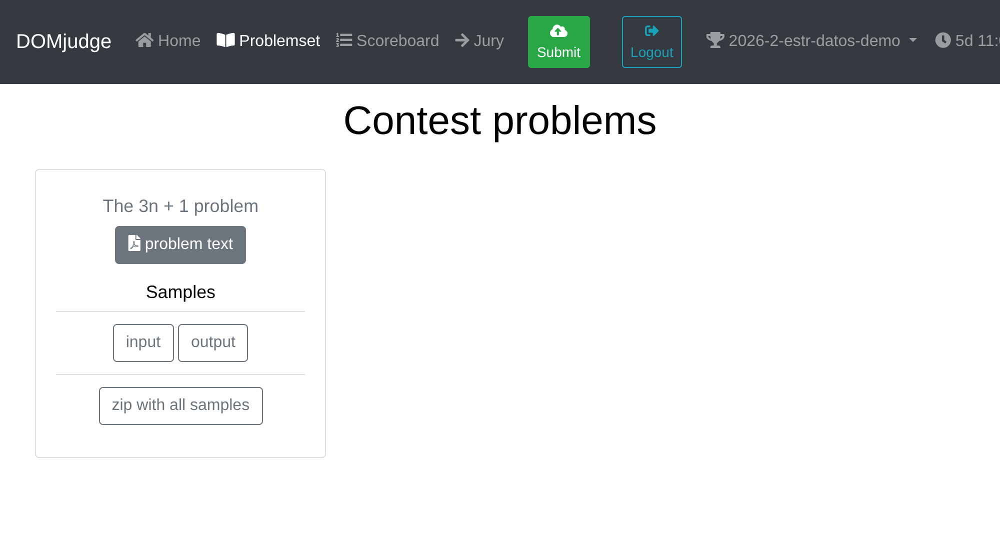
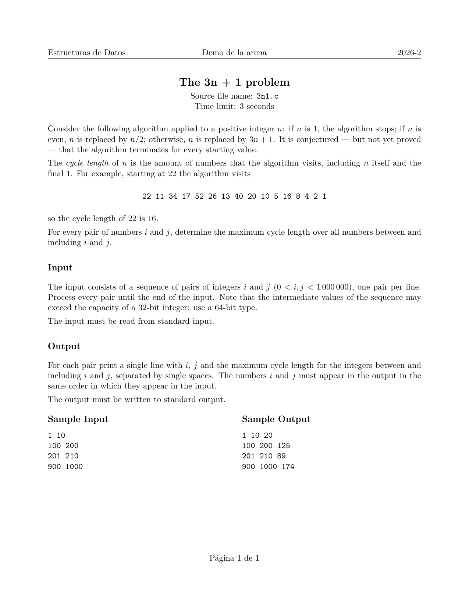
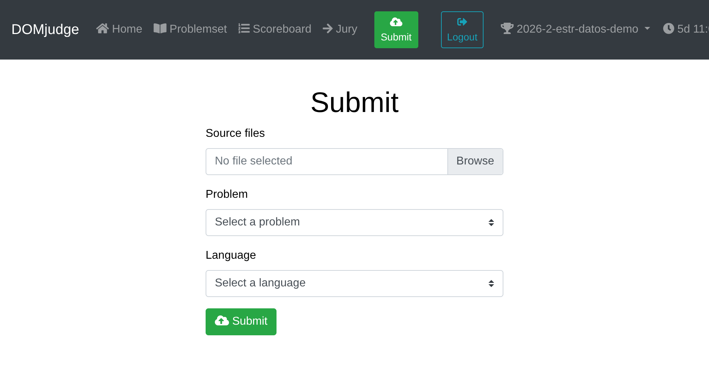
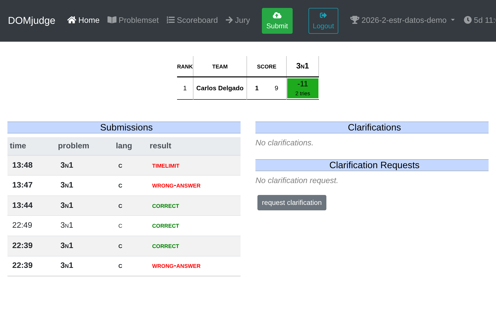
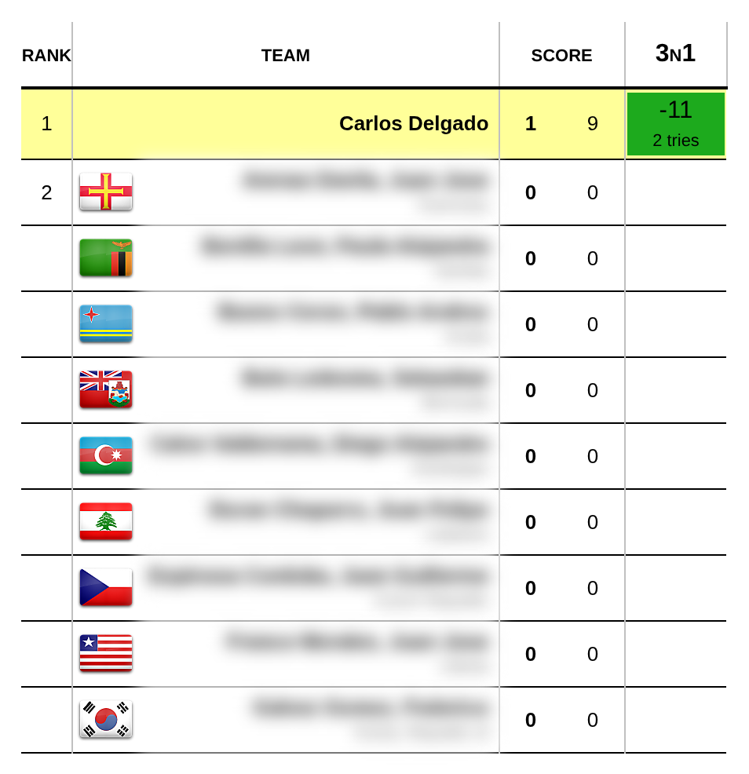

# Apéndice A. El juez automático

Los ejercicios de programación del curso se entregan y se califican en un juez
automático: un servidor que compila cada envío, lo corre contra juegos de datos
que nadie vio antes y devuelve un veredicto. Esta nota es el recorrido completo
—entrar, leer un enunciado, probar en la máquina propia, enviar, interpretar la
respuesta— y termina con la ficha técnica del servidor, que resuelve buena parte
de las preguntas que aparecen a mitad de una tarea.

El juez del curso es **DOMjudge 7.0.3** y vive en
[`arena.javerianacali.edu.co`](http://arena.javerianacali.edu.co/domjudge/team).

!!! warning "Dos detalles de la dirección"

    Va con `http`, no con `https`: el puerto 443 acepta la conexión pero nunca
    completa el saludo TLS. Y termina en `/domjudge/team`; el marcador público
    está en `/domjudge/public`.

    Si la página no carga, lo primero que hay que revisar es que no haya una VPN
    comercial encendida. El servidor está dentro de la red de la Universidad y
    varias VPN lo dejan inalcanzable.

## Diapositivas

{ type=application/pdf style="min-height:70vh;width:100%" }

## Qué hace el servidor con un envío

Cuando se sube un archivo fuente, el servidor:

1. Lo compila con la misma línea de compilación para todo el mundo.
2. Lo ejecuta con varios juegos de datos que el estudiante no conoce.
3. Le da a cada ejecución un tope de tiempo y de memoria.
4. Compara la salida producida con la salida esperada.
5. Devuelve un veredicto.

Nada de eso es interactivo. El programa lee de la entrada estándar, escribe en la
salida estándar y termina. No pide datos, no muestra menús, no lee archivos y no
espera que alguien esté mirando la pantalla. En la práctica el servidor conecta un
archivo a la entrada del programa y guarda en otro archivo lo que el programa
escriba: exactamente lo que uno hace en la terminal con
`./sol < entrada.txt > salida.txt`.

De ahí salen dos costumbres que hay que desaprender:

| Programa de clase | Programa para el juez |
|---|---|
| Saluda al usuario | No saluda |
| Pide el dato: «Ingrese n» | Lee el dato sin anunciarlo |
| Explica el resultado | Escribe solo el resultado |
| Resuelve un caso y termina | Resuelve todos los casos que vengan |

## El recorrido

### Entrar


Desde la portada del servidor se sigue el enlace *Team interface* y ahí se
escriben las credenciales del curso.

### Elegir el concurso

Arriba a la derecha hay un selector con los concursos disponibles. Cada tarea es
un concurso distinto, y **el problema solo aparece si está seleccionado el
concurso correcto**. Es la causa número uno de «no me sale el problema».

### Abrir el enunciado



En *Problemset* está la lista de problemas. El botón *problem text* abre el PDF;
*input* y *output* descargan el ejemplo oficial, y *zip with all samples* los trae
juntos.



### Enviar



Se sube **el archivo fuente**, no el ejecutable ni un comprimido, y se revisa que
el problema y el lenguaje sean los que corresponden. El campo *Entry point* solo
se llena en lenguajes que lo piden, como Kotlin; para C, C++ y Python se deja
vacío.

## El problema de la demostración

El concurso de práctica trae *The 3n + 1 problem*, que es el problema 100 de UVa.

!!! abstract "Statement"

    Consider the following algorithm applied to a positive integer $n$: if $n$ is
    1, the algorithm stops; if $n$ is even, $n$ is replaced by $n/2$; otherwise,
    $n$ is replaced by $3n + 1$.

    The cycle length of $n$ is the amount of numbers that the algorithm visits,
    including $n$ itself and the final 1.

    For every pair of numbers $i$ and $j$, determine the maximum cycle length over
    all numbers between and including $i$ and $j$.

Partiendo de 22 el algoritmo visita

$$22,\; 11,\; 34,\; 17,\; 52,\; 26,\; 13,\; 40,\; 20,\; 10,\; 5,\; 16,\; 8,\; 4,\; 2,\; 1$$

Son 16 números contando el 22 del principio y el 1 del final, así que la longitud
de ciclo de 22 es 16.

### Formatos

La entrada es una sucesión de pares $i$, $j$, uno por línea, y se procesa hasta
que se acabe el archivo: cuántos pares hay no se anuncia en ninguna parte. Por
cada par se imprime una línea con $i$, $j$ y la longitud de ciclo máxima,
separados por un espacio.

```text title="3n1.in"
1 10
100 200
201 210
900 1000
```

```text title="3n1.out"
1 10 20
100 200 125
201 210 89
900 1000 174
```

### Las dos trampas

!!! danger "El orden del par"

    Nada obliga a que $i$ sea menor que $j$. El intervalo hay que recorrerlo del
    menor al mayor, pero al imprimir van $i$ y $j$ como llegaron. Con la entrada
    `10 1` la respuesta es `10 1 20`, no `1 10 20` ni `10 1 0`.

!!! danger "El tamaño de los números"

    Aunque $i$ y $j$ se quedan por debajo de un millón, los valores intermedios de
    la sucesión suben mucho más. Hay que usar un tipo de 64 bits: `long long` en C.

### La solución

```c title="3n1.c"
/* The 3n+1 problem: por cada par i j se busca la
   longitud de ciclo mas grande del intervalo. */
#include <stdio.h>

/* Cuantos numeros visita el algoritmo desde n hasta
   llegar a 1, contando los dos extremos. */
long long longitud(long long n)
{
    long long cuenta;

    cuenta = 1;
    while (n > 1)
    {
        if (n % 2 == 0)
        {
            n = n / 2;
        }
        else
        {
            n = 3 * n + 1;
        }
        cuenta = cuenta + 1;
    }

    return cuenta;
}

int main(void)
{
    long long i, j, desde, hasta, n, mejor, actual;

    while (scanf("%lld %lld", &i, &j) == 2)
    {
        /* El intervalo se recorre de menor a mayor;
           i y j se imprimen como llegaron. */
        desde = i;
        hasta = j;
        if (desde > hasta)
        {
            desde = j;
            hasta = i;
        }

        mejor = 0;
        n = desde;
        while (n <= hasta)
        {
            actual = longitud(n);
            if (actual > mejor)
            {
                mejor = actual;
            }
            n = n + 1;
        }

        printf("%lld %lld %lld\n", i, j, mejor);
    }

    return 0;
}
```

Y la misma idea en C++, donde solo cambian la lectura y la escritura:

```cpp title="3n1.cpp"
/* The 3n+1 problem, version en C++. Misma idea que
   en C; cambian la lectura y la escritura. */
#include <iostream>

long long longitud(long long n)
{
    long long cuenta;

    cuenta = 1;
    while (n > 1)
    {
        if (n % 2 == 0)
        {
            n = n / 2;
        }
        else
        {
            n = 3 * n + 1;
        }
        cuenta = cuenta + 1;
    }

    return cuenta;
}

int main()
{
    long long i, j, desde, hasta, n, mejor, actual;

    while (std::cin >> i >> j)
    {
        desde = i;
        hasta = j;
        if (desde > hasta)
        {
            desde = j;
            hasta = i;
        }

        mejor = 0;
        n = desde;
        while (n <= hasta)
        {
            actual = longitud(n);
            if (actual > mejor)
            {
                mejor = actual;
            }
            n = n + 1;
        }

        std::cout << i << " " << j << " "
                  << mejor << "\n";
    }

    return 0;
}
```

Por cada par se recorren $|j - i| + 1$ números, y por cada número se sigue su
cadena hasta llegar a 1. Si $L$ es la cadena más larga del intervalo, un par
cuesta $O((|j-i|+1) \cdot L)$ y el espacio es $O(1)$. El intervalo completo,
`1 999999`, se resuelve en unos $0{,}2$ segundos contra un tope de 3, así que la
solución directa alcanza sin guardar resultados intermedios.

## Probar antes de enviar

El ciclo de trabajo local son cuatro pasos y tres comandos:

```bash
gcc -Wall -Wextra 3n1.c -o sol
./sol < 3n1.in > salida.out
diff salida.out 3n1.out
```

Si `diff` no imprime nada, las dos salidas son idénticas. Esa es la señal para
enviar. Cuando sí hay diferencia, responde así:

```
1c1
< 10 1 0
---
> 10 1 20
```

`1c1` dice que la línea 1 del primer archivo hay que cambiarla por la línea 1 del
segundo. Las líneas con `<` son las que produjo el programa; las que llevan `>`,
las que se esperaban.

!!! tip "Ver los caracteres que no se ven"

    Un espacio al final de la línea o un salto de línea faltante no se distinguen
    a simple vista. `cat -A` los muestra: marca el final de cada línea con `$` y
    los tabuladores con `^I`.

    ```bash
    ./sol < 3n1.in | cat -A | head -3
    ```

### Los casos que el ejemplo no trae

El ejemplo oficial es el caso amable: en sus cuatro líneas $i$ siempre es menor
que $j$. Vale la pena agregar a mano un par al revés (`10 1`), un par de un solo
número (`22 22`), el intervalo más grande que permita el enunciado y una entrada
vacía, que debe producir salida vacía sin quedarse colgado.

!!! warning "Pasar el ejemplo no garantiza el veredicto"

    Los juegos de datos del servidor son otros y más grandes, e incluyen los
    extremos. Un programa que solo se probó con el ejemplo del enunciado llega al
    juez sin haber visto sus casos difíciles.

## Los veredictos



Los tres programas de la imagen compilan sin errores y los tres calculan
longitudes de ciclo. Solo uno pasó.

| Veredicto | Qué revisar |
|---|---|
| `CORRECT` | Nada. La solución pasó todos los juegos de datos. |
| `WRONG-ANSWER` | El formato de salida, los casos límite y el desbordamiento de los tipos. |
| `TIMELIMIT` | El costo del algoritmo, o un ciclo que no termina cuando se acaba la entrada. |
| `RUN-ERROR` | Índices fuera de rango, división entre cero, memoria no reservada, o un `return` distinto de cero. |
| `NO-OUTPUT` | El programa terminó sin escribir nada: se cayó antes de imprimir, o quedó esperando una entrada que no llega. |
| `OUTPUT-LIMIT` | Un ciclo que imprime sin parar. |
| `MEMORY-LIMIT` | Reservas desmedidas, o recursión que no toca fondo. |
| `COMPILER-ERROR` | El código no compila con la línea del servidor. |

### El que dio `WRONG-ANSWER`

```c title="3n1-sinorden.c"
/* Version que NO pasa: supone que i siempre viene
   antes que j. Pasa el ejemplo del enunciado. */
#include <stdio.h>

long long longitud(long long n)
{
    long long cuenta;

    cuenta = 1;
    while (n > 1)
    {
        if (n % 2 == 0)
        {
            n = n / 2;
        }
        else
        {
            n = 3 * n + 1;
        }
        cuenta = cuenta + 1;
    }

    return cuenta;
}

int main(void)
{
    long long i, j, n, mejor, actual;

    while (scanf("%lld %lld", &i, &j) == 2)
    {
        mejor = 0;
        n = i;
        while (n <= j)
        {
            actual = longitud(n);
            if (actual > mejor)
            {
                mejor = actual;
            }
            n = n + 1;
        }

        printf("%lld %lld %lld\n", i, j, mejor);
    }

    return 0;
}
```

Con el ejemplo del enunciado da bien: sus cuatro pares vienen en orden creciente,
así que hace lo mismo que la solución buena. Cuando llega `10 1`, en cambio, la
condición `n <= j` es falsa desde el principio, el ciclo no entra nunca, `mejor` se
queda en 0 y el programa imprime `10 1 0`. El servidor sí prueba pares al revés.

### El que dio `TIMELIMIT`

```c title="3n1-lento.c"
/* Version que agota el tiempo: por cada par recorre
   desde 1 y descarta lo que quede por debajo de i.
   Las respuestas son correctas; el costo, no. */
#include <stdio.h>

long long longitud(long long n)
{
    long long cuenta;

    cuenta = 1;
    while (n > 1)
    {
        if (n % 2 == 0)
        {
            n = n / 2;
        }
        else
        {
            n = 3 * n + 1;
        }
        cuenta = cuenta + 1;
    }

    return cuenta;
}

int main(void)
{
    long long i, j, desde, hasta, n, mejor, actual;

    while (scanf("%lld %lld", &i, &j) == 2)
    {
        desde = i;
        hasta = j;
        if (desde > hasta)
        {
            desde = j;
            hasta = i;
        }

        mejor = 0;
        n = 1;
        while (n <= hasta)
        {
            actual = longitud(n);
            if (n >= desde && actual > mejor)
            {
                mejor = actual;
            }
            n = n + 1;
        }

        printf("%lld %lld %lld\n", i, j, mejor);
    }

    return 0;
}
```

Esta sí ordena el par, pero por cada consulta arranca el recorrido en 1 en lugar de
arrancar en el extremo menor. El filtro `n >= desde` descarta lo que sobra, así que
las respuestas son correctas: el problema no es qué calcula sino cuánto le cuesta.
Con cien pares estrechos cerca del millón, la versión buena tarda cinco milésimas y
esta casi 20 segundos. El tope es de 3.

!!! note "Qué dice ese veredicto"

    `TIMELIMIT` no señala un error de lógica sino uno de costo. Revisar la salida
    no sirve: hay que contar cuántas operaciones hace el programa, que es
    justamente el análisis de complejidad del curso. La pregunta es cuántas veces
    se ejecuta el ciclo más interno en el peor caso.

### El marcador



Los envíos fallidos quedan registrados y suman penalización: 20 minutos por cada
intento fallido de un problema que después se resuelve. Los errores de compilación
también cuentan.

## Cómo compara el juez la salida

Este es el punto que más malentendidos produce, así que vale la pena decir
exactamente qué hace el servidor del curso. El comparador es el validador por
defecto de Kattis, que DOMjudge trae compilado, invocado sin opciones. Lee las dos
salidas —la del estudiante y la esperada— **token por token**, donde un token es
cualquier cosa separada por espacios en blanco. Con esa configuración:

- Los espacios en blanco entre tokens no importan: da lo mismo un espacio que tres,
  o un salto de línea que un tabulador. Los saltos de línea al final tampoco.
- Las mayúsculas no importan: `YES` y `yes` cuentan como el mismo token.
- Un token de más al final es `WRONG-ANSWER`, con el mensaje *trailing output*.
- Un token de menos también, con el mensaje *user EOF while judge had more output*.
- Si los dos tokens son texto y difieren, es `WRONG-ANSWER` en la línea donde
  ocurrió.

!!! warning "Esto es lo que hace hoy, no un permiso"

    Que el comparador tolere espacios no es razón para descuidar el formato. Un
    problema puede traer su propio comparador —más estricto, o con tolerancia
    numérica— y el enunciado manda siempre. La costumbre sana es imprimir
    exactamente lo que pide el enunciado.

    Lo que sí conviene recordar es lo contrario: el saludo, el «Ingrese n» o el
    «El resultado es:» son tokens de más y hunden un programa que calcula bien.

## Ficha técnica del servidor

Los valores de esta tabla se leyeron de la configuración del servidor del curso el
20 de agosto de 2026.

| Qué | Valor |
|---|---|
| Versión | DOMjudge 7.0.3 sobre Apache 2.4.38 |
| Interfaz de equipo | `http://arena.javerianacali.edu.co/domjudge/team` |
| Lenguajes habilitados | C (`.c`), C++ (`.cpp`, `.cc`, `.cxx`, `.c++`), Python 3 (`.py`) |
| Compilación de C | `gcc -x c -Wall -O2 -static -pipe -o programa fuente.c -lm` |
| Compilación de C++ | `g++ -x c++ -Wall -O2 -static -pipe -o programa fuente.cpp` |
| Tope de tiempo | el que fije cada problema (3 s en la demostración) |
| Margen antes de matar el proceso | 1 s o 10 % del tope, el mayor de los dos |
| Memoria por ejecución | 2 000 000 kB, ajustable por problema |
| Salida máxima | 500 000 kB; lo que exceda se trunca |
| Procesos por envío | 64 |
| Tamaño del fuente | 256 kB, hasta 100 archivos por envío |
| Comparador por omisión | validador por defecto de Kattis, sin opciones |
| Salida del compilador | siempre visible para el equipo |
| Diff contra el ejemplo | deshabilitado |
| Penalización | 20 minutos por envío fallido, errores de compilación incluidos |

Tres consecuencias prácticas de esa lista:

**El juez compila con `-O2` y sin `-Wextra`.** Compilar en casa con
`gcc -Wall -Wextra` es más estricto que el servidor, que es como debe ser. Lo que
no aparece en casa y sí en el juez son los efectos de la optimización sobre código
con comportamiento indefinido: una variable sin inicializar puede dar bien en la
máquina propia y mal allá.

**La salida del compilador siempre se puede leer.** Al abrir el envío en la
interfaz de equipo aparecen las advertencias, incluso cuando el veredicto fue
`CORRECT`. Es información gratis: una advertencia de `-Wall` en un programa que dio
`WRONG-ANSWER` suele ser el error.

**La evaluación se detiene en la primera falla.** El servidor no sigue corriendo
los juegos de datos restantes una vez encuentra el veredicto definitivo, así que el
número de casos que pasaron antes no dice mucho sobre qué tan cerca estuvo la
solución.

## Errores frecuentes

- **«No aparece el problema.»** Casi siempre es el concurso equivocado en el
  selector de arriba a la derecha, o un concurso que todavía no empieza o que ya
  cerró. Fuera de la ventana del concurso el botón *Submit* no acepta envíos.
- **Subir el ejecutable o un `.zip`.** Se envía el `.c` o el `.cpp`.
- **Elegir mal el lenguaje.** Un `.cpp` enviado como C da `COMPILER-ERROR`.
- **Leer un solo caso.** El programa tiene que leer hasta el final del archivo. En
  C, `scanf` devuelve cuántos valores logró leer —2 mientras haya par, `EOF` al
  final—; en C++, `std::cin >> i >> j` se evalúa como falso cuando ya no hay nada.
  Al probar a mano, el final del archivo se produce con ++ctrl+d++ en Linux y
  macOS, o ++ctrl+z++ y Enter en Windows.
- **Dejar `system("pause")`, `getch()` o `conio.h`.** No existen en el servidor y,
  si existieran, dejarían el programa esperando para siempre.
- **Imprimir un `long long` con `%d`.** El formato es `%lld`.
- **Confiar en el reloj del sitio.** Las horas que muestra el servidor están en el
  huso de Nueva York, que entre marzo y noviembre va una hora adelante de Colombia.
  La fecha de cierre que vale es la que anuncia el curso; el contador de la esquina
  superior derecha, que dice cuánto falta, es la referencia confiable dentro del
  sitio.

## Pedir una aclaración

La interfaz de equipo tiene un botón *request clarification* que deja la pregunta
registrada y con respuesta visible. Es para lo que de verdad lo necesita: un
problema del servidor, un enunciado ambiguo o un juego de datos que contradiga lo
enunciado.

Antes de escribirla conviene releer el formato de salida y probar el caso que se
cree contradictorio. La mayoría de las dudas se resuelven ahí mismo.

## Antes de oprimir Submit

1. El programa no imprime nada que el enunciado no pida.
2. Lee hasta el final del archivo, no un solo caso.
3. Compila con `-Wall -Wextra` y sin advertencias.
4. `diff` contra el ejemplo oficial no dice nada.
5. Se probaron los casos límite que el ejemplo no trae.
6. Los tipos aguantan los valores intermedios.
7. En el formulario, el problema y el lenguaje son los que corresponden.

!!! danger "De quién es la responsabilidad"

    Verificar la solución antes de enviarla es parte del trabajo, no un paso
    opcional. Un envío que falla por no haber probado —salida con texto de más, un
    solo caso leído, un tipo que se desborda, un ciclo que no termina— corre por
    cuenta de quien lo envió.

    No se aceptan como reclamo que el programa «funcionaba en mi máquina», que «el
    ejemplo del enunciado daba bien» o que «se subió el archivo equivocado». Los
    tres se evitan con la lista de arriba, y los tres se revisan en menos de un
    minuto.

    Y una advertencia adicional: hay cuatro cursos dependiendo del mismo servidor.
    Una recursión infinita o una falla de segmentación probada allá, en vez de
    probada en casa, afecta a todo el mundo. El sistema deja registro de quién
    envió qué.

## Archivos de esta nota

- [`3n1.c`](codigo/3n1.c) — la solución, en C.
- [`3n1.cpp`](codigo/3n1.cpp) — la misma, en C++.
- [`3n1.in`](codigo/3n1.in) y [`3n1.out`](codigo/3n1.out) — el ejemplo oficial.
- [`3n1-sinorden.c`](codigo/3n1-sinorden.c) — la versión que da `WRONG-ANSWER`.
- [`3n1-lento.c`](codigo/3n1-lento.c) — la que da `TIMELIMIT`.

## Referencias

- DOMjudge Team. *DOMjudge Team Manual*.
  [domjudge.org/docs/manual](https://www.domjudge.org/docs/manual/)
- S. Halim, F. Halim, S. Skiena y M. Revilla. *Competitive Programming*. Capítulo 1,
  sobre el formato de entrada y salida de los problemas tipo juez.
- T. H. Cormen, C. E. Leiserson, R. L. Rivest y C. Stein. *Introduction to
  Algorithms*, 4.ª ed., MIT Press, 2022. Secciones 2.2 y 3.1, para el análisis que
  hace falta cuando el veredicto es `TIMELIMIT`.
