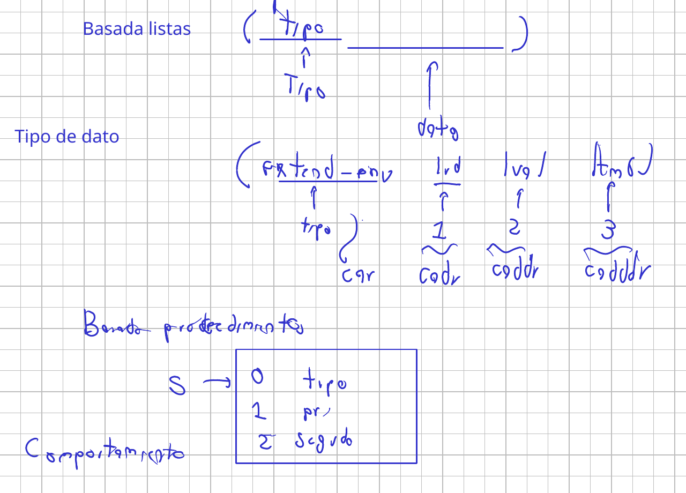
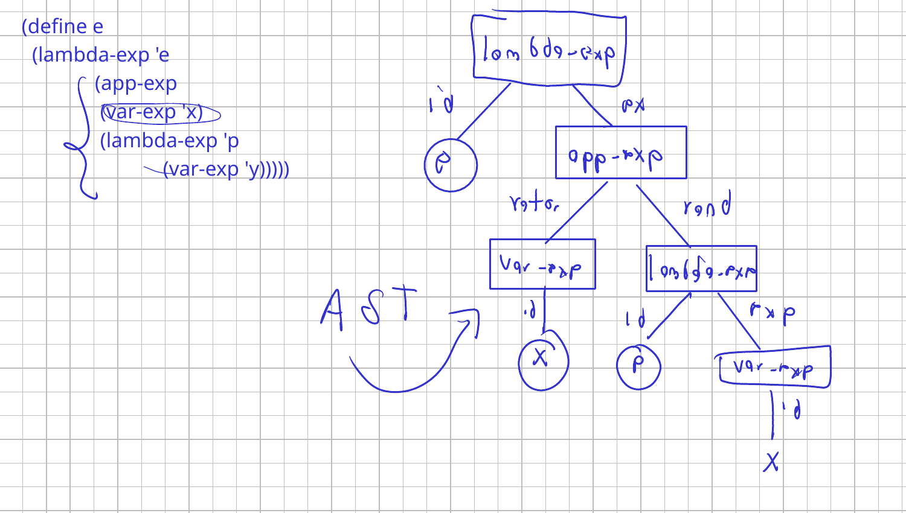

# Clase 2. Estrategias para representar datos: TAD y ambientes

Martes 15 de septiembre de 2026.

Los procedimientos que siguen una gramática funcionan. La pregunta que abre
la sesión es de qué dependen: `sumar-lista` lleva `car` y `cdr` porque la
lista es la que Racket ofrece, y si el dato se construyera de otra forma
habría que releer cada cliente. La sesión separa lo que un tipo de dato
ofrece de cómo está construido, y termina en los dos tipos que el intérprete
va a necesitar: los ambientes y las expresiones del cálculo lambda.

Las diapositivas están en el Campus Virtual. Aquí quedan las notas y el código
que se escribió en clase, en la carpeta `codigo/`.

Referencia: Friedman y Wand, *Essentials of Programming Languages*, 3.ª
edición, §2.1 a §2.3.

## El cliente conoce la representación

El repaso arranca con una lista de enteros y su gramática, en
[`codigo/ejemplosGramaticas.rkt`](codigo/ejemplosGramaticas.rkt):

```
<lst> ::= '()
      ::= <int> <lst>
```

```scheme
(define sumar-lista
  (lambda (lst)
    (cond
      [(null? lst) 0]                                 ; <lst> ::= '()
      [else (+ (car lst) (sumar-lista (cdr lst)))]))) ; <lst> ::= <int> <lst>
```

Dos producciones, dos cláusulas. El no terminal `<lst>` reaparece dentro de
la segunda producción, y ahí va la llamada recursiva: cuando el mismo tipo de
dato aparece dentro de sí mismo, la misma función se llama a sí misma.
`(sumar-lista '(1 2 3 4 5))` da 15.

Lo que hay que mirar es el `car` y el `cdr`. Están ahí porque la lista es la
lista de Racket, una representación que Racket eligió y que el programa
acepta sin preguntar. Si mañana el dato viene en otra forma, todo cliente que
tenga `car` y `cadr` incrustados cambia.

Un tipo de dato tiene dos capas. Abajo está la **implementación**: cómo se
construye el dato por dentro. Arriba está la **interfaz**: lo que el tipo le
ofrece a quien programa con él. Un `int` en C++ ocupa 32 bits y la suma la
hace el procesador; en Python un entero es un objeto y la suma es un método
de ese objeto. `2 + 2` da 4 en los dos, y quien programa no nota la
diferencia porque solo usa lo que el tipo ofrece: sumar, restar, multiplicar,
comparar. Por eso Python puede tener enteros sin desbordamiento, que crecen
en el montículo hasta donde alcance la memoria, y Java puede tener los dos,
el `int` primitivo y el `Integer` objeto.

## Abstracción de datos

La interfaz dice qué representa el tipo, cuáles son sus operaciones y qué
cumplen. La implementación provee una representación concreta y el código de
las operaciones sobre ella (EOPL §2.1). Se escribe $\lceil n \rceil$ para
la representación del valor $n$, sin decir qué es.

El número natural queda especificado con cuatro operaciones:

| Operación | Cumple |
|---|---|
| `zero` | $= \lceil 0 \rceil$ |
| `(is-zero? ⌈n⌉)` | `#t` si $n = 0$, `#f` en otro caso |
| `(succ ⌈n⌉)` | $= \lceil n+1 \rceil$ |
| `(pred ⌈n+1⌉)` | $= \lceil n \rceil$ |

La especificación no dice si $\lceil n \rceil$ es una lista, un entero de
Racket o un vector. Tampoco define `pred` sobre $\lceil 0 \rceil$: quien lo
pida recibe un error. Un cliente que use solo esas cuatro operaciones
sobrevive a cualquier cambio de representación que respete la tabla.

## Tres representaciones del mismo TAD

La primera, los números de Racket, quedó en las diapositivas. En clase se
escribieron las otras dos.

### Unaria: una lista de `#t`

En [`codigo/ejemploRepresentacionNumerosI.rkt`](codigo/ejemploRepresentacionNumerosI.rkt).
$\lceil 0 \rceil$ es la lista vacía y $\lceil n+1 \rceil$ es `(cons #t ⌈n⌉)`,
así que $\lceil 3 \rceil$ es `(#t #t #t)`:

```scheme
(define zero '())
(define iszero? null?)

(define succ
  (lambda (n)
    (cons #t n)))

(define pred
  (lambda (n)
    (if (iszero? n)
        (eopl:error "No se puede obtener el predecesor de 0")
        (cdr n))))
```

Debajo de esas cuatro definiciones empieza el **área del programador**, que
solo puede usar lo que el tipo ofrece. El cinco son cinco aplicaciones de
`succ` sobre `zero`:

```scheme
(define cinco (succ (succ (succ (succ (succ zero))))))
(define cuatro (succ (succ (succ (succ zero)))))
```

Para sumar solo hay `succ` y `pred`, y con eso alcanza: mover una unidad de
`b` hacia `a` hasta que `b` se acabe. $5 + 4$ es lo mismo que $6 + 3$, que
$7 + 2$, que $8 + 1$, que $9 + 0$.

```scheme
(define suma
  (lambda (a b)
    (cond
      [(iszero? b) a]
      [else (suma (succ a) (pred b))])))
```

| Paso | `a` | `b` | `(iszero? b)` |
|---|---|---|---|
| 0 | $\lceil 5 \rceil$ | $\lceil 4 \rceil$ | no |
| 1 | $\lceil 6 \rceil$ | $\lceil 3 \rceil$ | no |
| 2 | $\lceil 7 \rceil$ | $\lceil 2 \rceil$ | no |
| 3 | $\lceil 8 \rceil$ | $\lceil 1 \rceil$ | no |
| 4 | $\lceil 9 \rceil$ | $\lceil 0 \rceil$ | sí: devuelve `a` |

El resultado es una lista de nueve `#t`, y la forma de comprobarlo desde
afuera es `(length (suma cuatro cinco))`. La longitud de `a` más la de `b`
se conserva en cada paso: ese es el invariante que hace correcta la suma.

Multiplicar es sumar `a` consigo mismo `b` veces. Hace falta un acumulador
que arranque en `zero`, y la forma de tenerlo sin cambiar la firma es un
`letrec` con un procedimiento auxiliar de cola:

```scheme
(define mult
  (lambda (a b)
    (letrec
        ((multaux
          (lambda (a b acc)
            (cond
              [(iszero? b) acc]
              [else (multaux a (pred b) (suma acc a))]))))
      (multaux a b zero))))
```

En clase $4 \times 5$ dio primero 40, porque el intento sumaba `a` consigo
mismo en lugar de sumarlo al acumulador, y después 16, porque una condición
de más cortaba la última suma. La versión de arriba no lleva ninguna de las
dos cosas: el caso base devuelve el acumulador, el otro caso le suma `a`, y
`(length (mult cuatro cinco))` da 20.

La potencia repite la forma con `mult` en lugar de `suma`, y arranca en
$\lceil 1 \rceil$, que es `(succ zero)`, porque $a^0 = 1$:

```scheme
(define potencia
  (lambda (a b)
    (letrec
        ((potencia
          (lambda (a b acc)
            (cond
              [(iszero? b) acc]
              [else (potencia a (pred b) (mult acc a))]))))
      (potencia a b (succ zero)))))
```

`(length (potencia cuatro cinco))` da 1024, una lista de mil veinticuatro
`#t`. El procedimiento interno se llama igual que el externo. Dentro del
`letrec` la declaración interna oculta a la externa, y la llamada recursiva
resuelve con la más cercana: es el ocultamiento del tema de alcance, ahora en
un caso útil.

### Bignum: dígitos en base $N$

En [`codigo/ejemploRepresentacionNumerosII.rkt`](codigo/ejemploRepresentacionNumerosII.rkt).
Se fija una base y $\lceil n \rceil$ es `(cons r ⌈q⌉)` cuando $n = r + qN$
con $0 \leq r < N$. El dígito menos significativo va adelante, al revés de
como se escribe un número:

| Base | Lista | Vale |
|---|---|---|
| 16 | `(15 10)` | $15 + 10 \times 16 = 175$ |
| 10 | `(2 3)` | $2 + 3 \times 10 = 32$ |
| 10 | `(1 2 3)` | $1 + 20 + 300 = 321$ |
| 2 | `(1 1 0 1)` | $1 + 2 + 0 + 8 = 11$ |

`zero` sigue siendo la lista vacía e `iszero?` sigue siendo `null?`. Lo que
cambia es `succ`, porque ahora hay **acarreo**: si el primer dígito ya es
$N - 1$, se vuelve 0 y la unidad pasa al resto.

```scheme
(define base 16)

(define succ
  (lambda (n)
    (cond
      [(iszero? n) '(1)]
      [(equal? (car n) (- base 1)) (cons 0 (succ (cdr n)))]
      [else (cons (+ 1 (car n)) (cdr n))])))
```

En base 10, $1299 + 1$ es `(9 9 2 1)`: el 9 se vuelve 0 y acarrea, el
siguiente 9 se vuelve 0 y acarrea, el 2 se vuelve 3 y ahí se detiene:
`(0 0 3 1)`, que es 1300.

`pred` tiene el **préstamo** simétrico: un 0 adelante se vuelve $N - 1$ y se
le resta uno al resto. Y tiene un caso especial que no se ve hasta que falla:
el predecesor de $\lceil 1 \rceil$ tiene que ser `'()`, no `(0)`, porque
$\lceil 0 \rceil$ es la lista vacía y `(0)` no es ningún número de la
definición.

```scheme
(define pred
  (lambda (n)
    (if (iszero? n)
        (eopl:error "No se puede obtener el predecesor de 0")
        (cond
          [(equal? n (succ zero)) '()]
          [(equal? (car n) 0) (cons (- base 1) (pred (cdr n)))]
          [else (cons (- (car n) 1) (cdr n))]))))
```

En base 10, $10 - 1$ es `(pred '(0 1))`: el 0 se vuelve 9 y el resto `(1)`
pasa por el caso especial, así que queda `(9)`. En clase el préstamo llamó
primero a `(pred n)` en lugar de `(pred (cdr n))`, y el programa no
terminaba: el argumento no se acercaba al caso base.

Con eso, `suma`, `mult` y `potencia` se pegan tal cual debajo, sin cambiar
una línea, y `(potencia cuatro cinco)` sale en la base que esté definida:

| `base` | `(potencia cuatro cinco)` | Lectura |
|---|---|---|
| 2 | `(0 0 0 0 0 0 0 0 0 0 1)` | $2^{10} = 1024$ |
| 10 | `(4 2 0 1)` | $4 + 20 + 0 + 1000 = 1024$ |
| 16 | `(0 0 4)` | $4 \times 256 = 1024$ |

Quien escribió `suma` no se enteró de que cambió la representación. Lo único
que usó fue lo que el tipo ofrece, y eso no cambió.

## Receta para construir un TAD

Dada la gramática de un tipo de dato, la interfaz sale sola (EOPL §2.2):

1. Un **constructor** por cada producción. Construye una instancia del dato.
2. Un **predicado** por cada producción. Responde a qué variante pertenece un
   valor.
3. Un **extractor** por cada pieza de información que recibe un constructor.
   Saca esa pieza.

Predicados y extractores son los **observadores**. Y los nombres siguen una
convención que se lee sin abrir la implementación: el constructor lleva el
nombre de la variante, el predicado agrega `?` al final, y el extractor une el
nombre de la variante con `->` y el nombre de la pieza.

En el taller, la gramática del polinomio trae el nombre de cada variante en
un recuadro y esos son los que hay que respetar: `poli` es el constructor,
`poli?` el predicado, `poli->var` y `poli->terms` los extractores;
`mas-terminos` da `mas-terminos?`, `mas-terminos->term` y
`mas-terminos->resto`; `sin-terminos` no recibe piezas y por eso no tiene
extractores.

## El TAD ambiente: la interfaz

Un ambiente guarda identificadores con sus valores. Es lo que un intérprete
consulta para resolver una referencia: cuando aparece `x` en el cuerpo de un
programa, el ambiente dice a qué valor está ligada. Y modela un marco de la
pila de ejecución: las variables locales de un procedimiento se ven dentro de
él y no afuera, y esa visibilidad es un ambiente que se extiende al entrar y
se abandona al salir.

La gramática que se usó en clase liga una lista de identificadores con una
lista de valores en cada eslabón, como hace un `let` con varias
declaraciones:

```
<environment> ::= '()
                  empty-env()
              ::= <lista de ids> <lista de valores> <environment>
                  extend-env(lid lval old-env)
```

La receta sobre dos producciones, con tres piezas en la segunda, da dos
constructores, dos predicados y tres extractores:

| Constructores | Predicados | Extractores |
|---|---|---|
| `empty-env` | `empty-env?` | |
| `extend-env` | `extend-env?` | `extend-env->lid`, `extend-env->lval`, `extend-env->old-env` |

Del lado del programador hay una sola operación, `apply-env`: recibe un
ambiente y una variable, y devuelve el valor. Es lo único que se puede hacer
con una variable ya declarada, consultarla.

## Ambientes: representación basada en listas

En [`codigo/ambientesListas.rkt`](codigo/ambientesListas.rkt). Cada ambiente
es una lista que lleva en la primera posición la etiqueta de su variante:

```scheme
(define empty-env
  (lambda ()
    (list 'empty-env)))

(define extend-env
  (lambda (lid lval old-env)
    (list 'extend-env lid lval old-env)))
```

Como la etiqueta va siempre adelante, todos los predicados preguntan por el
`car`, y los extractores son las tres posiciones siguientes:

```scheme
(define empty-env?
  (lambda (e)
    (equal? (car e) 'empty-env)))

(define extend-env?
  (lambda (e)
    (equal? (car e) 'extend-env)))

(define extend-env->lid     (lambda (e) (cadr e)))
(define extend-env->lval    (lambda (e) (caddr e)))
(define extend-env->old-env (lambda (e) (cadddr e)))
```

Aquí, y solo aquí, aparecen `car` y `cadr`. El ambiente de la sesión se
construye con los constructores, de adentro hacia afuera:

```scheme
(define e
  (extend-env '(a b c) '(1 2 3)
              (extend-env '(x y z) '(4 5 6)
                          (empty-env))))
```

Y al imprimirlo se ve la lista anidada, que es la cadena de ambientes tal
cual: `(extend-env (a b c) (1 2 3) (extend-env (x y z) (4 5 6) (empty-env)))`.

`apply-env` tiene un caso por producción. El ambiente vacío no tiene
variables, así que responde con error. El extendido busca en sus dos listas
paralelas, y si las agota sigue en el ambiente viejo. La búsqueda es un
`letrec` interno, porque recorre `lid` y `lval` al mismo tiempo:

```scheme
(define apply-env
  (lambda (e var)
    (cond
      [(empty-env? e)
       (eopl:error 'apply-env "La variable ~s no está en el ambiente" var)]
      [(extend-env? e)
       (letrec
           ((buscar-var
             (lambda (lid lval old-env)
               (cond
                 [(null? lid) (apply-env old-env var)]
                 [(equal? (car lid) var) (car lval)]
                 [else (buscar-var (cdr lid) (cdr lval) old-env)]))))
         (buscar-var
          (extend-env->lid e)
          (extend-env->lval e)
          (extend-env->old-env e)))]
      [else (eopl:error 'apply-env "El dato ~s es invalido" e)])))
```

El cuerpo no lleva ni un `car` sobre el ambiente: las tres piezas salen por
los extractores, y los `car` y `cdr` que quedan son sobre las listas de
identificadores y de valores, que sí son listas de Racket por definición de
la gramática. La cláusula final atiende lo que no es ninguna de las dos
variantes, porque la gramática solo produce esas dos.

`(apply-env e 'z)` recorre el eslabón de afuera preguntando por `a`, `b` y
`c`, agota la lista, pasa al ambiente viejo y ahí encuentra `z` en la tercera
posición: 6. `(apply-env e 'b)` da 2 en el primer eslabón. `(apply-env e 'w)`
llega a `empty-env` y produce el error.

## Ambientes: representación basada en procedimientos

En [`codigo/ambientesProcedimientos.rkt`](codigo/ambientesProcedimientos.rkt).
Un valor del TAD no tiene que ser una estructura de datos: puede ser un
procedimiento que responde a las preguntas que la interfaz permite hacer
(EOPL §2.2.3). Cada ambiente es una clausura que recibe un selector: con 0
devuelve la etiqueta de la variante, con 1, 2 y 3 devuelve cada pieza.

```scheme
(define empty-env
  (lambda ()
    (lambda (s)
      (cond
        [(= s 0) 'empty-env]
        [else (eopl:error "Señal no valida para empty-env")]))))

(define extend-env
  (lambda (lid lval old-env)
    (lambda (s)
      (cond
        [(= s 0) 'extend-env]
        [(= s 1) lid]
        [(= s 2) lval]
        [(= s 3) old-env]
        [else (eopl:error "Señal no valida para extend-env")]))))
```

Los observadores cambian `(car e)` por `(e 0)` y `(cadr e)` por `(e 1)`, y
nada más: mismos nombres, misma aridad, mismos resultados.

```scheme
(define empty-env?  (lambda (e) (equal? (e 0) 'empty-env)))
(define extend-env? (lambda (e) (equal? (e 0) 'extend-env)))

(define extend-env->lid     (lambda (e) (e 1)))
(define extend-env->lval    (lambda (e) (e 2)))
(define extend-env->old-env (lambda (e) (e 3)))
```



En el tablero quedaron las dos lado a lado. En la lista, el tipo va adelante
y cada pieza tiene una posición: `car`, `cadr`, `caddr`, `cadddr`. En el
procedimiento, la posición se vuelve una señal, y lo que antes era la forma
del dato ahora es el comportamiento de la clausura ante cada señal.

`e` se define igual que antes y `apply-env` se copia carácter por carácter.
`(apply-env e 'b)` sigue dando 2 y `(apply-env e 'z)` sigue dando 6. Lo que
cambia es lo que se ve al imprimir `e`: ya no es una lista sino
`#<procedure>`. Con una lista se puede sacar el `car` y el `cdr` desde
cualquier parte del programa; con un procedimiento lo único que se puede
hacer es aplicarlo, y eso cierra la representación: ningún cliente puede
saltarse la interfaz, ni por descuido.

La representación se elige una vez para todo el programa. Un ambiente
construido con los constructores de listas y consultado con los observadores
de procedimientos falla, porque Racket intenta aplicar una lista.

## Expresiones del cálculo lambda

La gramática con la que se trabaja todo el curso, ahora con el nombre de cada
variante (EOPL §2.3):

```
<lc-exp> ::= <identifier>
             var-exp(id)
         ::= "lambda" "(" <identifier> ")" <lc-exp>
             lambda-exp(id exp)
         ::= <lc-exp> <lc-exp>
             app-exp(rator rand)
```

Tres producciones: tres constructores, tres predicados, y cinco extractores
porque las piezas son $1 + 2 + 2$. Las dos representaciones están en
[`codigo/lcexplistas.rkt`](codigo/lcexplistas.rkt) y
[`codigo/lcexpprocs.rkt`](codigo/lcexpprocs.rkt), con la misma forma que los
ambientes: lista etiquetada en una, clausura con selector en la otra. La
expresión de trabajo es $\lambda e.(x\ \lambda p.y)$:

```scheme
(define e
  (lambda-exp 'e
              (app-exp
               (var-exp 'x)
               (lambda-exp 'p
                           (var-exp 'y)))))
```



Esa expresión es un árbol, el **árbol de sintaxis abstracta**: cada nodo es
un constructor y cada arista lleva el nombre del extractor que baja por ella.
`lambda-exp` tiene dos hijos, `id` y `exp`; `app-exp` tiene `rator` y
`rand`; `var-exp` solo tiene `id`. La hoja de abajo a la derecha quedó como
`x` en el tablero, y en el código es `y`.

`occurs-free?` recibe la expresión y la variable, y sigue la definición de
tres casos: un identificador ocurre libre si es la variable; en una lambda,
si el parámetro es otro y la variable ocurre libre en el cuerpo; en una
aplicación, si ocurre libre en el operador o en el operando.

```scheme
(define occurs-free?
  (lambda (e var)
    (cond
      [(var-exp? e) (equal? (var-exp->id e) var)]
      [(lambda-exp? e)
       (and
        (not (equal? var (lambda-exp->id e)))
        (occurs-free? (lambda-exp->exp e) var))]
      [(app-exp? e)
       (or
        (occurs-free? (app-exp->rator e) var)
        (occurs-free? (app-exp->rand e) var))]
      [else
       (eopl:error 'occurs-free?
                   "La expresion ~s no es correcta"
                   e)])))
```

`occurs-bound?` tiene los mismos tres casos con otra pregunta. Un
identificador solo nunca ocurre ligado. En una lambda, la variable ocurre
ligada si ocurre ligada en el cuerpo, o bien si el parámetro es ella misma y
ocurre libre en el cuerpo: esa ocurrencia libre es la que el parámetro liga.
En una aplicación, si ocurre ligada en cualquiera de las dos partes.

```scheme
(define occurs-bound?
  (lambda (e var)
    (cond
      [(var-exp? e) #f]
      [(lambda-exp? e)
       (or
        (occurs-bound? (lambda-exp->exp e) var)
        (and
         (equal? var (lambda-exp->id e))
         (occurs-free? (lambda-exp->exp e) var)))]
      [(app-exp? e)
       (or
        (occurs-bound? (app-exp->rator e) var)
        (occurs-bound? (app-exp->rand e) var))]
      [else
       (eopl:error 'occurs-bound?
                   "La expresion ~s no es correcta"
                   e)])))
```

Sobre $\lambda e.(x\ \lambda p.y)$:

| Variable | `occurs-free?` | `occurs-bound?` |
|---|---|---|
| `x` | `#t` | `#f` |
| `y` | `#t` | `#f` |
| `e` | `#f` | `#f` |
| `p` | `#f` | `#f` |

`x` y `y` ocurren libres porque ninguna lambda las declara. `e` y `p` están
declaradas y nunca se usan: no ocurren, así que no ocurren ni libres ni
ligadas. Para que `occurs-bound?` responda `#t` hace falta una ocurrencia
dentro del alcance de su lambda, como la `x` interior de
$(\lambda x.x\ \ x)$, donde la exterior ocurre libre y las dos respuestas dan
`#t` a la vez.

Los dos procedimientos hablan con la expresión solo por la interfaz, y por
eso son idénticos en los dos archivos. Cambiar de listas a procedimientos fue
copiar y pegar el área del programador, y los resultados son los mismos.

## Ejercicios de la segunda mitad

La segunda mitad fue sobre las
[actividades interactivas](./Ejercicios.md) de la sesión, y tres se
resolvieron en el tablero. En la cola con dos representaciones, los tres
clientes se pegaron sobre la segunda sin cambiarlos, y la razón es la misma
de toda la sesión: solo usan los procedimientos de la interfaz. Quien devuelve
el dato tal cual pasa las pruebas con la primera representación y no con la
segunda, y ahí queda claro quién había mirado adentro.

En la bignum en base 10, `succ` y `pred` salieron con la misma forma que las
de la sesión: el acarreo cuando el dígito llega a 9 y el préstamo cuando es
0, con el cuidado de que el predecesor de uno sea la lista vacía. Un
paréntesis de más cerró una cláusula antes de tiempo, y se encontró leyendo en
voz alta el cierre de cada forma. El editor de la página no empareja
paréntesis; DrRacket sí.

En los clientes del ambiente, `ligada?` responde `#f` al llegar a `empty-env`
en lugar de fallar, y en lo demás recorre la cadena igual que `apply-env`.
Las demás actividades quedan para la casa: quien entienda esta sesión tiene
resueltas dos de las tres representaciones del taller.

## Los apuntes del tablero

La hoja de la sesión, tal como quedó: las dos formas de definir un dato
recursivo, por reglas de inferencia y por gramática; el esquema de
implementación e interfaz con el `int` de C++ y el objeto de Python; la
receta del TAD aplicada al ambiente, con sus constructores, predicados y
extractores; las dos representaciones lado a lado, y el árbol de la
expresión de trabajo.

{ type=application/pdf style="min-height:70vh;width:100%" }

## Lo que sigue

Escribir a mano constructores, predicados y extractores es mecánico, y en un
tipo con varias producciones se vuelve largo. `#lang eopl` los genera a
partir de la gramática con `define-datatype`, y reemplaza la cadena de
`cond` por `cases`. Con eso el programa se vuelve un dato, el árbol de
sintaxis abstracta, y sobre ese árbol se construye todo lo que viene: el
intérprete, los procedimientos, la asignación y los tipos. Esta sesión y la
que sigue son la base del resto del curso.
