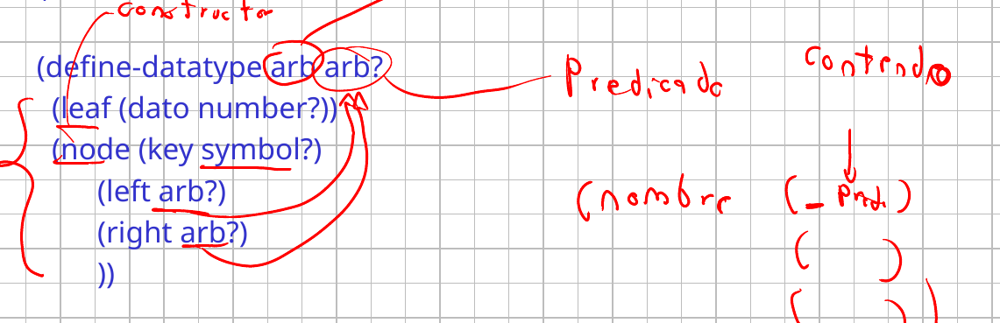
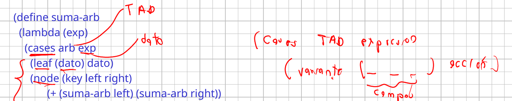
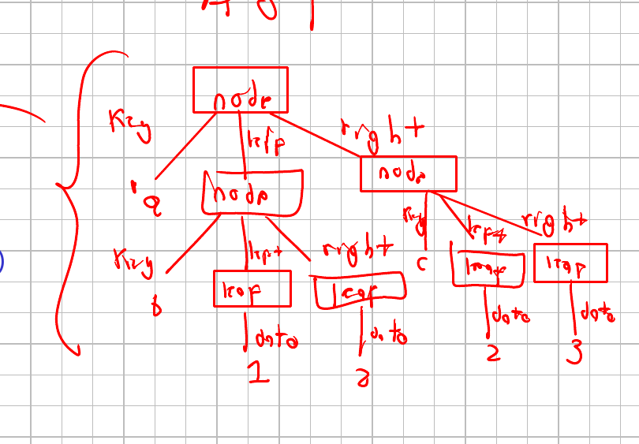
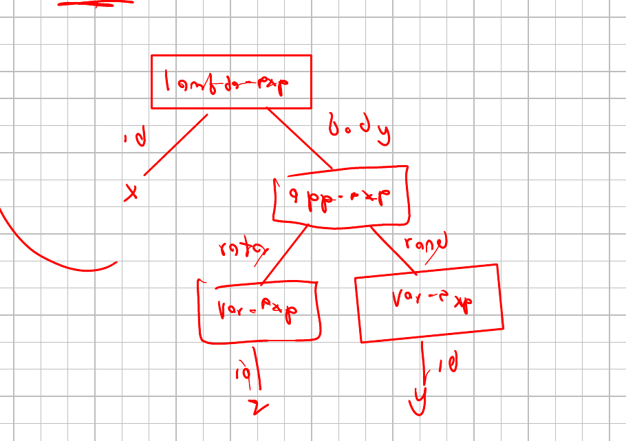
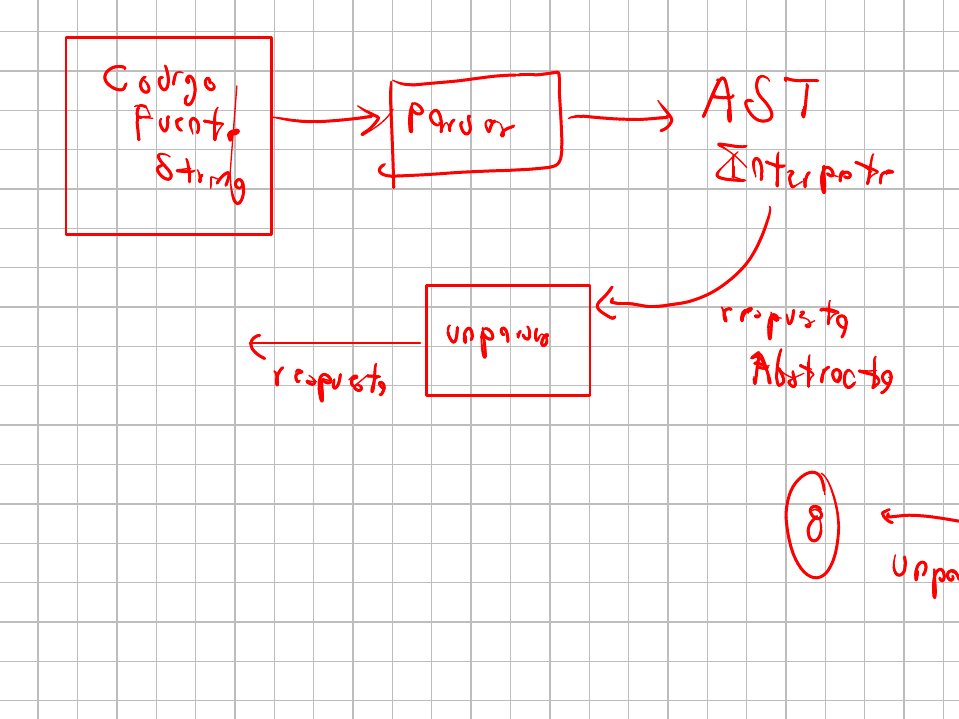
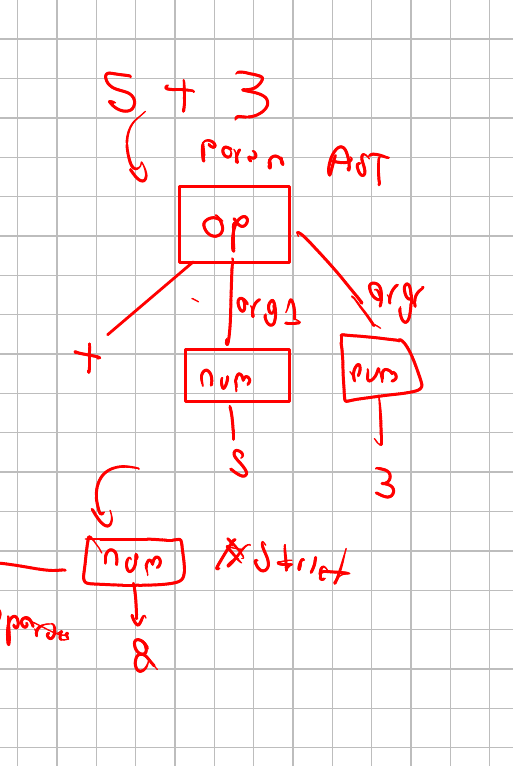

# Clase 3. Datatypes y árboles de sintaxis abstracta

Martes 22 de septiembre de 2026.

Construir un TAD a mano es trabajo mecánico: un constructor y un predicado
por variante, un extractor por cada pieza, y nadie revisando que los datos
sean los que la gramática pide. `#lang eopl` trae dos formas que se encargan
de eso. `define-datatype` genera la interfaz completa a partir de la
gramática, y `cases` reemplaza la cadena de `cond`. Con ellas el dato deja de
ser una lista o una clausura y pasa a ser un árbol que representa la
gramática, el árbol de sintaxis abstracta, sobre el que se construye el resto
del curso.

Las diapositivas están en el Campus Virtual. Aquí quedan las notas, el código
que se escribió en clase, en la carpeta `codigo/`, y los apuntes del tablero.

Referencia: Friedman y Wand, *Essentials of Programming Languages*, 3.ª
edición, §2.4 y §2.5.

## Repaso: la receta del TAD

Un tipo de dato tiene dos capas. La implementación es cómo está construido
por dentro: el entero de 32 bits, o el objeto que se comporta como entero.
La interfaz es con lo que el programador trabaja, y en el caso del entero son
las operaciones aritméticas.

Para construir uno hay procedimientos constructores y procedimientos
observadores, que se dividen en predicados y extractores. La receta, dada la
gramática:

1. Un constructor por cada variante del tipo de dato.
2. Un predicado por cada variante.
3. Un extractor por cada parte de cada variante.

## El árbol binario escrito a mano

La gramática de la sesión, un árbol binario cuyas hojas son enteros y cuyos
nodos llevan un símbolo, en
[`codigo/1arbolProc.rkt`](codigo/1arbolProc.rkt):

```
<arb> ::= <int>
          leaf(dato)
      ::= <symbol> <arb> <arb>
          node(key left right)
```

Dos producciones: dos constructores, dos predicados, y cuatro extractores,
uno para el dato de la hoja y tres para las piezas del nodo. La
representación es la basada en procedimientos, donde cada valor es una
clausura que responde a una señal:

```scheme
(define leaf
  (lambda (dato)
    (lambda (s)
      (cond
        [(= s 0) 'leaf]
        [(= s 1) dato]
        [else (eopl:error 'leaf "Error en leaf ~s" s)]))))

(define node
  (lambda (key left right)
    (lambda (s)
      (cond
        [(= s 0) 'node]
        [(= s 1) key]
        [(= s 2) left]
        [(= s 3) right]
        [else (eopl:error 'node "Error en node ~s" s)]))))
```

Los observadores preguntan por la señal 0 para saber la variante y por las
demás para sacar cada pieza: `leaf->dato` es `(arb 1)`, y `node->key`,
`node->left` y `node->right` son `(arb 1)`, `(arb 2)` y `(arb 3)`.

En el área del programador, `suma-arb` pregunta primero con los predicados y
saca después con los extractores. La cláusula final atiende lo que no es
ninguna de las dos variantes:

```scheme
(define suma-arb
  (lambda (arb)
    (cond
      [(leaf? arb) (leaf->dato arb)]
      [(node? arb) (+
                    (suma-arb (node->left arb))
                    (suma-arb (node->right arb)))]
      [else (eopl:error 'sum-arb "El dato no es un arbol ~s" arb)])))

(define arbol1
  (node
   'a
   (node 'b (leaf 1) (leaf 2))
   (node 'c (leaf 2) (leaf 3))))
```

`(suma-arb arbol1)` da 8, que son las cuatro hojas: los símbolos de los nodos
no se suman. Y al escribir `arbol1` en la consola no aparece el árbol sino
`#<procedure>`, porque eso es lo que la representación construyó.

Dos cosas quedan sueltas en esta versión. La primera es el trabajo: cinco
procedimientos de dos líneas cada uno, escritos a mano, y en un tipo con más
variantes son más. La segunda es que nadie revisa nada. `(leaf 'a)` construye
una hoja cuyo dato es un símbolo aunque la gramática diga `<int>`, y
`(leaf->dato arbol1)` sobre un nodo devuelve `a`, la llave, porque
`leaf->dato` y `node->key` son el mismo `(arb 1)`. El error no aparece donde
se cometió.

## La forma `define-datatype`

La misma gramática, declarada de una vez, en
[`codigo/2arboldatatype.rkt`](codigo/2arboldatatype.rkt):

```scheme
(define-datatype arb arb?
  (leaf (dato number?))
  (node (key symbol?)
        (left arb?)
        (right arb?)))
```



Primero el nombre del tipo, después el nombre de su predicado, y luego una
variante por producción. Cada variante lleva su nombre y sus campos, y cada
campo es un par: el nombre del campo y el predicado que debe cumplir lo que
entre ahí. Los dos primeros nombres son arbitrarios, pero conviene que el
del tipo salga de la gramática y que el del predicado sea ese mismo con
interrogación al final, porque es lo que se lee después en cada campo
recursivo: `left` y `right` son de tipo `arb?`, el predicado que se está
declarando en esa misma línea.

Los campos se revisan al construir, y ahí está la diferencia con la versión
a mano: `(leaf 'a)` ya no construye nada, responde `leaf: bad value for dato
field: a`. El error aparece en el momento en que se comete.

### Campos que son listas

Cuando la gramática dice que una parte es una lista de algo, el predicado del
campo se arma con `list-of`. La s-list de EOPL §2.4, que es una lista de
listas de símbolos:

```
<lsst-symbol> ::= '()
                  empty-list()
              ::= (<symbol>)* <lsst-symbol>
                  non-empty-list(lsst rest)
```

```scheme
(define-datatype lsst-symbol lsst-symbol?
  (empty-list)
  (non-empty-list (lsst (list-of symbol?))
                  (rest lsst-symbol?)))
```

`(list-of symbol?)` es un predicado que revisa la lista elemento por
elemento. Una variante sin campos, como `empty-list`, se declara con el
nombre solo y se usa sin argumentos.

## Análisis por casos con `cases`

Con el datatype declarado, el `cond` de predicados y extractores se reemplaza
por una forma que hace las dos cosas a la vez:



`cases` recibe el nombre del tipo y la expresión que se va a analizar. Cada
cláusula lleva el nombre de una variante, los nombres de sus campos entre
paréntesis y la acción. Los campos quedan ligados a esos nombres dentro de la
acción, así que el predicado y el extractor desaparecen del código:

```scheme
(define suma-arb
  (lambda (exp)
    (cases arb exp
      (leaf (dato) dato)
      (node (key left right)
            (+ (suma-arb left) (suma-arb right))))))
```

Sigue dando 8. Los nombres de los campos van en el orden en que se
declararon, y si una variante no se usa completa igual se nombran todos:
`node` recibe tres aunque `key` no aparezca en la suma.

La segunda operación recorre el árbol en preorden y devuelve una lista:

```scheme
(define arbol->lista
  (lambda (exp)
    (cases arb exp
      (leaf (dato) (list dato))
      (node (key left right)
            (append
             (list key)
             (arbol->lista left)
             (arbol->lista right))))))
```

`(arbol->lista arbol1)` da `(a b 1 2 c 2 3)`: primero la llave, después el
hijo izquierdo completo y después el derecho.

## Árboles de sintaxis abstracta

Al escribir `arbol1` en la consola, la versión con datatype no devuelve ni
una lista ni un procedimiento:

```
#(struct:node a
   #(struct:node b #(struct:leaf 1) #(struct:leaf 2))
   #(struct:node c #(struct:leaf 2) #(struct:leaf 3)))
```



Eso es un **árbol de sintaxis abstracta**: una estructura que nace de la
gramática y la representa. La raíz es un `node`, y de ella salen tres
aristas con el nombre de cada campo: `key` lleva al símbolo `a`, `left` a
otro `node` y `right` a otro. Bajando por la izquierda, ese `node` tiene
`key` igual a `b` y dos `leaf` cuyos datos son 1 y 2. Cada nodo del dibujo es
una variante y cada arista es un campo.

La representación no depende de listas ni de procedimientos. Es lo que hacen
por debajo los lenguajes de programación, y se puede ver: en
[`codigo/arbolsintaxis.py`](codigo/arbolsintaxis.py), la librería `ast` de
Python construye el árbol de un programa y lo imprime.

```python
import ast

programa = """
x = 10
y = 20
print(x+y)
"""

e = ast.parse(programa)
print(ast.dump(e, indent=4))
```

```
Module(
    body=[
        Assign(
            targets=[
                Name(id='x', ctx=Store())],
            value=Constant(value=10)),
        ...
        Expr(
            value=Call(
                func=Name(id='print', ctx=Load()),
                args=[
                    BinOp(
                        left=Name(id='x', ctx=Load()),
                        op=Add(),
                        right=Name(id='y', ctx=Load()))]))])
```

`x = 10` quedó como un `Assign`: su destino es el nombre `x` en modo
almacenar y su valor es la constante 10. La llamada a `print` es un `Call`
con su función y sus argumentos. La suma es un `BinOp` con operador `Add` y
dos operandos, y por eso es binaria.

De ahí sale para qué sirve el árbol. Si se puede construir, el programa está
bien escrito: no hay error de sintaxis. Si no se puede, falta algo o algo
está mal puesto, y eso es todo lo que el árbol decide. Qué hacer con un nodo
`Add` es otra cosa, y esa es la semántica.

## Las expresiones lambda, ahora con datatype

La gramática del curso se declara igual, en
[`codigo/3lcexpdatatype.rkt`](codigo/3lcexpdatatype.rkt):

```scheme
(define-datatype lc-exp lc-exp?
  (var-exp (id symbol?))
  (lambda-exp (id symbol?)
              (body lc-exp?))
  (app-exp (rator lc-exp?)
           (rand lc-exp?)))
```

`occurs-free?` y `occurs-bound?` son los de la sesión anterior con `cases` en
lugar de la cadena de predicados y extractores, y quedan más cortos:

```scheme
(define occurs-free?
  (lambda (exp var)
    (cases lc-exp exp
      (var-exp (id) (equal? id var))
      (lambda-exp (id body)
                  (and
                   (not (equal? id var))
                   (occurs-free? body var)))
      (app-exp (rator rand)
               (or
                (occurs-free? rator var)
                (occurs-free? rand var))))))
```

La expresión de trabajo, $\lambda x.(z\ y)$:



```scheme
(define e
  (lambda-exp 'x
              (app-exp (var-exp 'z)
                       (var-exp 'y))))
```

| Variable | `occurs-free?` | `occurs-bound?` |
|---|---|---|
| `z` | `#t` | `#f` |
| `y` | `#t` | `#f` |
| `x` | `#f` | `#f` |
| `k` | `#f` | `#f` |

`z` y `y` ocurren libres: ninguna lambda las declara. `k` no aparece en la
expresión, así que los dos predicados responden `#f`, y ahí se ve que libre y
ligada no son contrarias. La `x` está en la misma situación: la lambda la
declara, pero el cuerpo no la usa, y una ocurrencia que no existe no ocurre
de ninguna de las dos maneras. Para que `occurs-bound?` responda `#t` hace
falta una aparición dentro del alcance de la lambda que la liga, como la `x`
del cuerpo en `(lambda (x) x)`.

Un identificador y un `var-exp` son cosas distintas. En `lambda-exp` el
primer campo es el identificador que se declara y va suelto, como símbolo; en
`var-exp` el símbolo va envuelto porque ahí es una expresión del lenguaje.
Confundirlos es el error que aparece al construir árboles a mano.

## Sintaxis concreta y sintaxis abstracta

La **sintaxis concreta** es el código que el programador escribe, la que está
hecha para que la lea una persona. La **sintaxis abstracta** es la
representación de ese código siguiendo la gramática, el árbol de antes.

Entre las dos van dos procedimientos, uno en cada dirección:

- El parser va de la sintaxis concreta a la abstracta.
- El unparser va de la abstracta a la concreta.



El recorrido completo empieza en el código fuente, que es una cadena de
caracteres, y pasa por el parser, que lo convierte en árbol. El intérprete
trabaja sobre ese árbol y su respuesta viene también en sintaxis abstracta,
que es la forma en que el intérprete representa los valores. Como nadie
quiere leer un `#(struct:...)` en la pantalla, la respuesta vuelve a pasar
por el unparser antes de mostrarse.



Con `5 + 3`, el parser produce un nodo de operación cuyo operador es la suma
y cuyos dos argumentos son números, 5 y 3. El intérprete devuelve otro nodo,
un número con 8 adentro, y el unparser lo convierte en el 8 que se ve.

## El parser

La sintaxis concreta de esta sesión son listas simbólicas, no cadenas de
caracteres, y por eso el parser de
[`codigo/4ConcretaAbstractaI.rkt`](codigo/4ConcretaAbstractaI.rkt) se escribe
con `car` y `cdr`:

```scheme
(define exp1 'x)
(define exp2 '(lambda (x) (y x)))
(define exp3 '( (lambda (j) x) (y (lambda (f) (f y)))))
```

```scheme
(define parser
  (lambda (exp)
    (cond
      [(symbol? exp) (var-exp exp)]
      [(equal? (car exp) 'lambda)
       (lambda-exp (caadr exp)
                   (parser (caddr exp)))]
      [else
       (app-exp
        (parser (car exp))
        (parser (cadr exp)))])))
```

Un caso por producción. Un símbolo solo es una variable, y se envuelve en
`var-exp`. Una lista que empieza por `lambda` tiene el identificador dentro
de otra lista, en `(caadr exp)`, y el cuerpo en `(caddr exp)`. Lo demás es
una aplicación, con el operador en el `car` y el operando en el `cadr`.

Dónde van las llamadas recursivas lo dice la gramática: cada vez que en una
producción aparece `<lc-exp>`, ahí va un `parser`. El identificador de la
lambda no lleva llamada porque en la gramática es un `<identifier>`, no una
expresión.

```
(parser exp2)
#(struct:lambda-exp x
   #(struct:app-exp #(struct:var-exp y) #(struct:var-exp x)))
```

## El unparser y la ida y vuelta

El camino contrario se escribe con `cases`, porque lo que entra ya es un
árbol y la única forma de abrirlo es por variante:

```scheme
(define unparser
  (lambda (exp)
    (cases lc-exp exp
      (var-exp (id) id)
      (lambda-exp (id body)
                  (list 'lambda (list id)
                        (unparser body)))
      (app-exp (rator rand)
               (list
                (unparser rator)
                (unparser rand))))))
```

Cada cláusula arma la lista que la gramática pide: `var-exp` devuelve su
identificador solo, `lambda-exp` reconstruye la palabra `lambda`, la lista
con el parámetro y el cuerpo desparseado, y `app-exp` arma la lista de dos
elementos. Las llamadas recursivas van en los mismos lugares que en el
parser.

La comprobación es aplicar los dos seguidos:

```
(equal? exp3 (unparser (parser exp3)))   ; #t
```

La palabra `lambda` no está en ninguna parte del árbol, y sin embargo vuelve
a aparecer: la sintaxis abstracta guarda la estructura, no las palabras con
que se escribió.

## Un segundo lenguaje: los comandos del robot

El otro lenguaje de la sesión tiene tres comandos, y uno de ellos contiene
una lista de comandos. Está en
[`codigo/5ConcretaAbstractaII.rkt`](codigo/5ConcretaAbstractaII.rkt):

```scheme
(define-datatype cmd cmd?
  (avanza-cmd (n number?))
  (gira-cmd   (dir symbol?))
  (repite-cmd (n number?) (cmds (list-of cmd?))))
```

```scheme
(define (parse-cmd dato)
  (cond ((eq? (car dato) 'avanza) (avanza-cmd (cadr dato)))
        ((eq? (car dato) 'gira) (gira-cmd (cadr dato)))
        ((eq? (car dato) 'repite) (repite-cmd (cadr dato) (parse-cmds (cddr dato))))
        (else (eopl:error "no es un comando:" dato))))

(define (parse-cmds datos)
  (if (null? datos)
      '()
      (cons (parse-cmd (car datos)) (parse-cmds (cdr datos)))))
```

El campo `cmds` es una lista, no un `cmd`, y por eso no basta con una llamada
recursiva: hace falta un segundo procedimiento que recorra la lista y parsee
cada elemento. `parse-cmds` es el que hace ese recorrido, y los dos se llaman
entre sí. En `(repite 2 (avanza 3) (gira izq))` el número está en el `cadr` y
los comandos son todo lo que viene después, el `cddr`.

```
(parse-cmd '(repite 2 (avanza 3) (gira izq)))
#(struct:repite-cmd 2 (#(struct:avanza-cmd 3) #(struct:gira-cmd izq)))
```

Los comandos quedan en una lista de Racket, no en una variante del datatype:
la lista es un tipo de datos del lenguaje anfitrión y se recorre con `null?`,
`car` y `cdr` como cualquier otra.

## Ejercicios de la segunda mitad

La segunda mitad fue sobre las [actividades interactivas](./Ejercicios.md) de
la sesión, y varias se resolvieron en el tablero.

En las declaraciones que hay que juzgar, los errores que aparecieron son los
de siempre: el tipo y su predicado con el mismo nombre, dos campos de una
variante llamados igual, un campo sin predicado, un paréntesis que deja el
campo fuera de su variante. Al construir, lo que se rechaza es el número de
campos y el predicado de cada uno, y `(list-of ...)` revisa la lista elemento
por elemento en lugar de aceptar cualquier cosa.

En el directorio y en las s-lists, la declaración sale de la gramática con la
salvedad del predicado, que lo decide quien declara: los puntos suspensivos
piden `list-of` y dos tipos que se nombran el uno al otro se declaran cada uno
con el predicado del otro.

Con los comandos del robot, `distancia` suma lo que avanza, `giros` cuenta y
`anidamiento` mide qué tan hondo se meten los `repite`. Los tres tienen la
misma forma: un `cases` con una cláusula por variante, y para el campo que es
una lista, un procedimiento aparte que la recorre. Los tropiezos fueron dos,
y ninguno es del tema: `car` sobre un valor del datatype falla porque no es
una lista, y en `repite` lo que multiplica es el número de repeticiones,
`(* n ...)`, no una suma.

En el parser de comandos, el `repite` manda el `cddr` al procedimiento que
recorre la lista, y en el unparser el `cons` rearma el número con la lista de
comandos desparseados. En las expresiones booleanas el conectivo va en medio,
`(p and q)`, así que el parser mira el `cadr` para decidir la variante y toma
los operandos del `car` y del `caddr`. El árbol que sale es el mismo que el de
un `(- x 1)` del lenguaje del curso: la sintaxis abstracta no guarda dónde
iba la palabra.

## Los apuntes del tablero

La hoja de la sesión, tal como quedó: el repaso del TAD con su receta, el
`define-datatype` del árbol con cada parte señalada, la anatomía del `cases`,
el árbol de `arbol1` y el de la expresión lambda, la s-list con `list-of`, y
el recorrido del código fuente al árbol y de vuelta.

{ type=application/pdf style="min-height:70vh;width:100%" }

## Lo que sigue

La sintaxis concreta de esta sesión fueron listas simbólicas, que ya vienen
separadas en piezas. El código de verdad es una cadena de caracteres, y
partirla es trabajo aparte: hay que decidir dónde termina cada palabra y qué
es cada una. Lo que sigue es cómo se escribe eso sin hacerlo a mano, con la
gramática declarada una sola vez y el parser generado a partir de ella.

En esta sesión también se presentó el proyecto final del curso, TxLang-UV,
con su gramática, sus tipos y sus estructuras transaccionales, que son las
que pueden revertir lo que escribieron. El enunciado completo, las fechas de
las dos entregas y la inscripción de los grupos están en el Campus Virtual.
