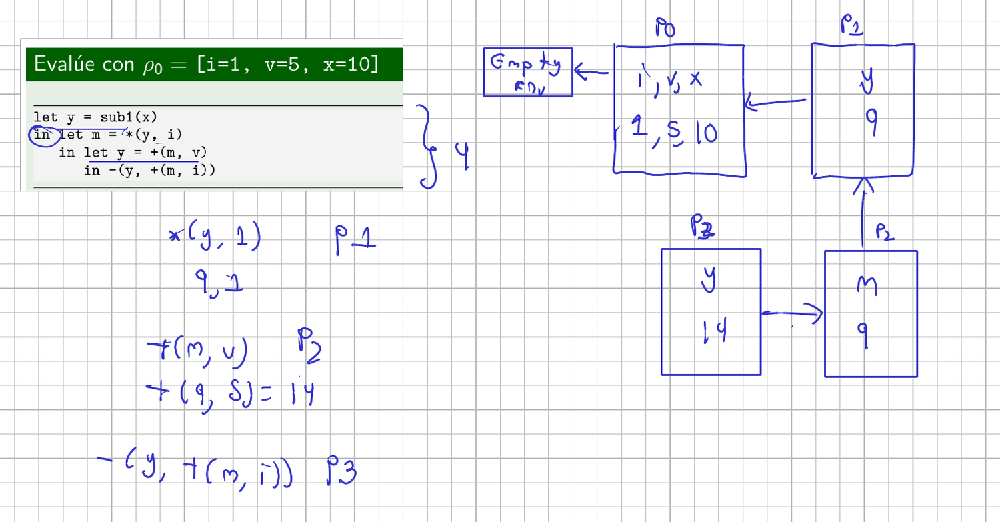
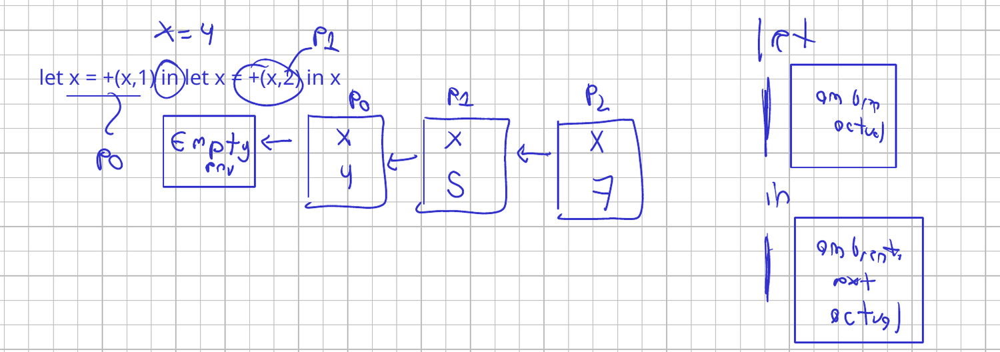
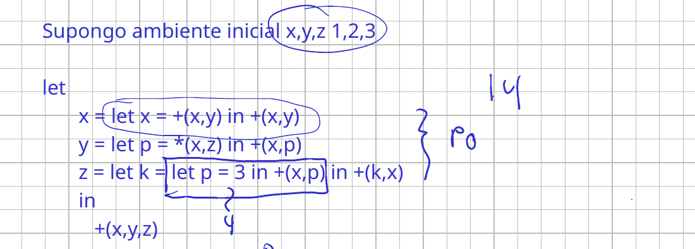
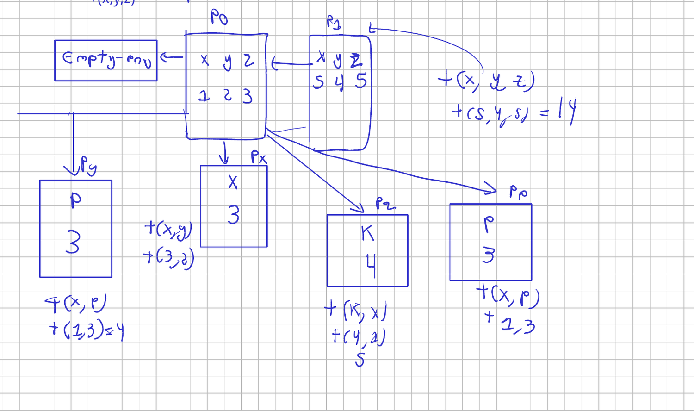

# Clase 4. Del texto al resultado: el proceso completo del interpretador

Martes 29 de septiembre de 2026.

Hasta ahora los programas llegaban ya partidos en piezas: listas simbólicas
que el parser recorría con `car` y `cdr`. Un programa de verdad llega como
texto, una cadena de caracteres y nada más. Esta sesión recorre lo que pasa
entre esa cadena y el valor que se imprime, y al final construye el primer
interpretador completo del curso: uno que evalúa números, variables,
primitivas y `let`.

Las diapositivas están en el Campus Virtual. Aquí quedan las notas, el código
de la demostración en C, en la carpeta `codigo/`, y los apuntes del tablero.

Referencia: Friedman y Wand, *Essentials of Programming Languages*, 3.ª
edición, §3.1 y §3.2.

## Del texto al resultado

La pregunta que abre la sesión. Dado este texto:

```
let x = 5 in -(x, 3)
```

la respuesta es 2. ¿Quién convierte el texto en árbol, y el árbol en esa
respuesta? Hay cuatro trabajos distintos ahí dentro: separar la cadena en
unidades con sentido, reconocer que la forma es `let … in …`, anotar que `x`
quedó ligada a 5, y calcular $5 - 3$.

Esos trabajos se reparten en tres etapas:

| Etapa | Recibe | Produce |
|---|---|---|
| Scanner | una cadena de caracteres | una lista de tokens |
| Parser | una lista de tokens | un árbol de sintaxis abstracta |
| Interpretador | un árbol y un ambiente | un valor |

El scanner agrupa caracteres en unidades, descarta los espacios y los
comentarios, y etiqueta cada unidad con su clase. De estructura no entiende
nada. El parser sí: decide que `-(x, 3)` es una primitiva con dos operandos.
El significado lo pone el interpretador, que averigua cuánto vale `x` y hace
la resta.

De ahí sale en qué etapa se detiene cada programa que no llega a dar un
valor. Un carácter que ninguna regla léxica reconoce lo para el scanner.
Tokens legales en un orden que la gramática no genera, o tokens que sobran al
final, los para el parser. Y una variable que nadie ligó no la detecta
ninguno de los dos: está bien escrita, y solo falla cuando el interpretador
va a buscar su valor.

## Interpretación y compilación

Las dos primeras etapas son las mismas en un compilador y en un
interpretador. Lo que cambia es qué se hace con el árbol: el interpretador lo
recorre y produce la respuesta; el compilador lo traduce a código de máquina
y no ejecuta nada.

| | Compilado | Interpretado |
|---|---|---|
| Quién ejecuta | la CPU, directamente | un programa intermedio |
| Cuándo se ven los errores | antes de ejecutar | hasta que la ejecución llega ahí |
| Otra arquitectura | hay que volver a construirlo | basta tener el interpretador |
| Un cambio en una línea | recompilar | se prueba de inmediato |

De ahí sale lo que se nota al usarlos. Un error en la última línea de un
programa compilado impide que se ejecute la primera; en uno interpretado, las
tres primeras líneas alcanzan a correr antes de fallar en la cuarta.

Java está en el medio: compila a *bytecode* una sola vez, y ese `.class` no lo
ejecuta ninguna CPU real sino la máquina virtual, que es un interpretador. El
JIT compila durante la ejecución los pedazos que más se usan, y por eso se
acerca a la velocidad de un compilado sin alcanzarla.

Python plantea la pregunta contraria: si el interpretador es lento, por qué es
el lenguaje del aprendizaje de máquina. Porque el intermediario se puede
saltar: las librerías que hacen el trabajo pesado están escritas en C y
ejecutan código de máquina directamente.

### Lo que produce un compilador, visto de verdad

Para que el binario deje de ser una palabra, la sesión bajó a C. El programa,
en [`codigo/ejemplo.c`](codigo/ejemplo.c):

```c
#include "stdlib.h"

int main() {

  int *arr = malloc(10 * sizeof(int));
  if (arr != NULL) {
    for (int i = 0; i < 10; i++) {
      *(arr + i) = i;
    }
  }
}
```

Diez espacios de tipo `int`, y un `int` ocupa 4 bytes: 40 bytes reservados.
Ese número aparece literalmente en el ensamblador que produce el compilador,
en [`codigo/ejemplo.s`](codigo/ejemplo.s):

```asm
	subq	$16, %rsp
	movl	$40, %edi
	call	malloc@PLT
	movq	%rax, -8(%rbp)
	cmpq	$0, -8(%rbp)
	je	.L2
```

`$40` es el argumento que se le pasa a `malloc`, y el `cmpq $0` con el salto
`je` es la comparación contra `NULL` del programa en C. El bucle queda más
abajo, con el índice en `-12(%rbp)` y el `cltq` que extiende el entero a 64
bits para poder sumarlo a la dirección base.

Un paso más y ya no hay texto que leer. El volcado del ejecutable, en
[`codigo/volcado-del-binario.txt`](codigo/volcado-del-binario.txt), empieza así:

```
0000000 457f 464c 0102 0001 0000 0000 0000 0000
0000010 0003 003e 0001 0000 1040 0000 0000 0000
```

Esos primeros cuatro bytes, `7f 45 4c 46`, son `\x7fELF`: la firma que dice
que el archivo es un ejecutable de Linux. De ahí en adelante son números que
la CPU sabe ejecutar y una persona no sabe leer. Eso es lo que entrega un
compilador y lo que nunca produce un interpretador.

## Lo que ve el scanner

Sobre el programa de arriba, los tokens son once:

```
let   x   =   5   in   -   (   x   ,   3   )
```

Los espacios no aparecen: el scanner los usa para saber dónde termina cada
token y los tira. Lo mismo con los comentarios, que en el lenguaje del curso
empiezan con `%` y llegan hasta el fin de la línea; una línea que empieza con
`%` no produce ningún token.

Cada token lleva su clase. `let` e `in` son palabras reservadas, porque la
gramática las nombra como literales; `x` es un identificador; `5` es un
número; el resto son literales. Y ahí está la sorpresa que se repite todos los
semestres: `add1` no es un identificador sino un literal de la gramática, así
que no sirve como nombre de variable. En cambio `zero?` sí sirve, mientras
esa primitiva no exista, porque el identificador admite el signo de
interrogación.

La regla que decide dónde corta es la del bocado más largo: el scanner toma la
cadena más larga que alguna regla reconozca, sin mirar hacia atrás ni
preguntarle al parser. Por eso `x5` es un solo token y `5x` son dos, un número
y un identificador. Y por eso el espacio cambia la cuenta: `-7` es un token,
porque el signo hace parte del número negativo, mientras que `- 7` son dos.

Cuando el scanner encuentra un carácter que ninguna regla reconoce, como `#`,
no levanta un error: corta ahí y devuelve la lista de tokens que alcanzó a
formar.

## SLLGEN: la especificación léxica y la gramática

Escribir el scanner y el parser a mano es trabajo de miles de líneas. SLLGEN
los genera a partir de dos listas.

La **especificación léxica** tiene una regla por clase de token, y cada regla
lleva tres cosas: un nombre arbitrario, una expresión regular y una acción.

```scheme
(define especificacion-lexica
  '((espacio-blanco (whitespace) skip)
    (comentario ("%" (arbno (not #\newline))) skip)
    (identificador (letter (arbno (or letter digit "_" "-" "?"))) symbol)
    (numero (digit (arbno digit)) number)
    (numero ("-" digit (arbno digit)) number)))
```

Las acciones son cuatro y no hay más: `skip` para lo que se reconoce solo para
descartarlo, y `symbol`, `number` y `string` para lo que se convierte en un
dato de Racket. Los operadores de la expresión regular son `or`, `arbno` (cero
o más), `concat`, y las clases `letter`, `digit` y `whitespace`.

La **gramática** tiene una producción por forma del lenguaje, y cada una
termina con el nombre de la variante que SLLGEN va a generar:

```scheme
(define especificacion-gramatical
  '((programa (expresion) a-program)
    (expresion (numero) lit-exp)
    (expresion (identificador) var-exp)
    (expresion (primitiva "(" (separated-list expresion ",") ")") primapp-exp)
    (primitiva ("+") add-prim)
    (primitiva ("-") subs-prim)))
```

Lo que queda entre comillas es un literal y no se captura; cada no terminal es
un campo de la variante. `arbno` y `separated-list` producen los dos una
lista, y la diferencia está en el separador: `separated-list` es la que admite
comas entre los elementos sin coma al final.

Con las dos listas, `sllgen:make-define-datatypes` genera los `define-datatype`
que en la sesión anterior se escribían a mano, y
`sllgen:make-string-scanner` y `sllgen:make-string-parser` generan las dos
primeras etapas.

La gramática tiene una restricción, y explica una rareza de la notación del
curso. El parser decide qué producción usar
mirando el no terminal que busca y el primer token de la cadena, nada más. Dos
producciones del mismo no terminal no pueden empezar con el mismo token: `var x`
y `var x = 10` chocan. Esa es la razón de que las primitivas del curso se
escriban con el operador adelante, `+(x, y)`: con el operador en medio, todas
las producciones de expresión empezarían igual.

## Un primer lenguaje interpretado

Dos nombres que hay que separar desde ahora. Los **valores expresados** son los
que el programador ve; los **valores denotados** son los que se guardan en los
ambientes. En este primer lenguaje coinciden, y son números. Cuando entren los
booleanos y después las referencias, dejan de coincidir.

La gramática entra por un envoltorio:

```scheme
(define-datatype programa programa?
  (a-program (exp expresion?)))
```

`programa` tiene un solo caso, que recibe una expresión. Es una limitación de
SLLGEN: hace falta un punto de entrada único, y `expresion` tiene muchos
casos. Más adelante, cuando el lenguaje tenga clases, el punto de entrada
serán las declaraciones de clase más una expresión. Todo empieza siempre por
`programa`.

Y el interpretador ya no vive en un archivo:

| Archivo | Qué tiene |
|---|---|
| `sintaxis` | las dos especificaciones, los datatypes, el scanner y el parser |
| `ambiente` | `empty-env`, `extend-env` y `apply-env` |
| `primitivas` | `eval-primitive` y las verificaciones |
| `interprete` | `eval-program` y `eval-expression` |
| `interfaz` | el punto de entrada y el REPL |

Los interpretadores del curso están en el Campus Virtual repartidos así, y es
la misma estructura del proyecto final. Quien ya hizo el fork lo sincroniza.

## Primitivas y evaluación

El punto de entrada abre el envoltorio y arranca:

```scheme
(define eval-program
  (lambda (pgm)
    (cases programa pgm
      (a-program (body) (eval-expression body init-env)))))
```

`eval-expression` tiene un caso por variante de expresión. Un literal devuelve
su número; una variable se busca en el ambiente; una primitiva evalúa primero
todos sus operandos y después aplica la operación:

```scheme
(define eval-expression
  (lambda (exp env)
    (cases expresion exp
      (lit-exp (dato) dato)
      (var-exp (id) (apply-env env id))
      (primapp-exp (prim rands)
                   (let ((args (map (lambda (r) (eval-expression r env)) rands)))
                     (eval-primitive prim args))))))
```

Las primitivas reciben una lista de operandos, no dos, y de ahí sale una
decisión que conviene conocer porque no es la aritmética de siempre:

- la suma y la multiplicación se aplican a toda la lista, con neutro 0 y 1;
- la resta es el primero menos la suma del resto, de modo que $a - b - c$
  es $a - (b + c)$;
- la división es el primero dividido por la multiplicación del resto;
- `add1` y `sub1` trabajan sobre el primero.

La razón es que solo se recorre con recursión lo que es asociativo. La resta y
la división se convierten en una suma y una multiplicación del resto, y así la
regla queda definida para cualquier cantidad de operandos.

El ambiente guarda sus valores con un predicado que siempre responde
verdadero. Un valor puede ser cualquier cosa que Racket reconozca, y combinar
`number?`, `symbol?` y los demás sería más frágil que aceptarlos todos.

En el REPL, con `x` ligada a 1:

```
+(x, 3)      4
+(x, x)      2
add1(x)      2
sub1(x)      0
```

`(scan&parse "x")` devuelve el árbol con su envoltorio `a-program`, y
`(eval-program (scan&parse "x"))` devuelve 1. Con algo más largo,
`+(1, +(x, y))` produce una primitiva de suma cuyo primer operando es el
literal 1 y cuyo segundo es otra suma de dos variables. Partir el texto en
varias líneas no cambia nada: el salto de línea es espacio en blanco.

Agregar una operación cuesta dos cambios y nada más. Para el módulo: una
producción nueva de primitiva en la gramática, con su nombre de variante, y su
caso en `eval-primitive`. No hay que programar el módulo, porque `modulo` ya
es de Racket. Ahí está la distinción que conviene tener presente: una cosa es
lo que hace el lenguaje que se está construyendo, y otra lo que hace Racket
cuando lo procesa. La suma del lenguaje es la suma de Racket.

## Ligadura local

Con lo anterior solo se pueden usar las variables del ambiente inicial. `let`
extiende el ambiente:

```
let <identificador> = <expresion> in <expresion>
```

La variante guarda tres campos: el identificador, la expresión ligada y el
cuerpo. Y la regla de evaluación tiene dos mitades que conviene no confundir:

- la expresión ligada se evalúa en el ambiente actual, el de antes del `let`;
- el cuerpo se evalúa en el ambiente extendido, el que ya incluye la ligadura
  nueva.

Por eso `let x = x in …` no tiene ningún problema: la `x` de la derecha se
busca en el ambiente anterior. Y por eso el orden importa al dibujar.

### Tres `let` anidados

Con $\rho_0 = [i = 1,\; v = 5,\; x = 10]$:



```
let y = sub1(x)
in let m = *(y, i)
   in let y = +(m, v)
      in -(y, +(m, i))
```

Cada `let` crea un eslabón:

| Ambiente | Ligadura | De dónde sale |
|---|---|---|
| $\rho_0$ | `i = 1`, `v = 5`, `x = 10` | el inicial |
| $\rho_1$ | `y = 9` | `sub1(x)` con `x = 10` |
| $\rho_2$ | `m = 9` | `*(y, i)` con `y = 9`, `i = 1` |
| $\rho_3$ | `y = 14` | `+(m, v)` con `m = 9`, `v = 5` |

El cuerpo se evalúa en $\rho_3$: `-(y, +(m, i))` es `-(14, +(9, 1))`, o sea
$14 - 10 = 4$.

La `y` del último `let` tapa a la del primero, y el `m` del segundo sigue
visible porque la búsqueda va de adentro hacia afuera. El ambiente vacío va
siempre al inicio de la cadena; sin él, el diagrama está mal desde el
principio.

### Cuando la ligadura nueva se llama igual



```
let x = +(x, 1) in let x = +(x, 2) in x
```

Con `x = 4` en el ambiente inicial, el resultado es 7 y no 6. La expresión
ligada del segundo `let` se evalúa en $\rho_1$, donde `x` ya vale 5, no en
$\rho_0$ donde valía 4. La cadena queda `x = 4`, `x = 5`, `x = 7`, y cada
eslabón tapa al anterior sin borrarlo.

### Un `let` con tres ligaduras y lets adentro

El último ejercicio de la sesión, con `x`, `y`, `z` ligadas a 1, 2 y 3:



```
let x = let x = +(x, y) in +(x, y)
    y = let p = *(x, z) in +(x, p)
    z = let k = let p = 3 in +(x, p) in +(k, x)
in +(x, y, z)
```

Las tres expresiones ligadas se evalúan en $\rho_0$, así que las tres ven
`x = 1`, `y = 2`, `z = 3`, y ninguna ve lo que las otras dos están ligando.
Cada una abre su propia cadena lateral:



| Ligadura | Cadena lateral | Cuerpo | Valor |
|---|---|---|---|
| `x` | `x = 3`, de `+(x, y)` | `+(x, y)` con `x = 3`, `y = 2` | 5 |
| `y` | `p = 3`, de `*(x, z)` | `+(x, p)` con `x = 1`, `p = 3` | 4 |
| `z` | `p = 3`, luego `k = 4` | `+(k, x)` con `k = 4`, `x = 1` | 5 |

En la primera, la `x` del cuerpo vale 3 porque el `let` interno la tapó,
mientras que la `y` sigue viniendo de $\rho_0$. En la tercera hay dos niveles:
`p = 3` sirve para calcular `k = +(x, p) = 4`, y recién entonces `+(k, x)`
da 5.

El ambiente extendido queda con `x = 5`, `y = 4`, `z = 5`, y el cuerpo
`+(x, y, z)` da 14.

Un `let` siempre se reduce a un valor. Por eso puede ir donde vaya una
expresión: dentro de una primitiva, dentro de otro `let`, o como la expresión
ligada de una declaración, que es lo que pasa aquí tres veces.

## Ejercicios de la segunda mitad

La segunda mitad fue sobre las [actividades interactivas](./Ejercicios.md) de
la sesión, y varias se resolvieron en el tablero.

En las de leer una especificación de SLLGEN, lo que se juzga es qué captura
cada producción. `Expression ::= Number` deja un solo campo; la del `let`, con identificador,
expresión y expresión, deja tres; y lo que va entre comillas no deja campo. Saber cuántos campos vienen y en qué orden es lo que después
permite escribir el `cases`.

En las de contar llamadas, la cuenta sale de recorrer el árbol: cada literal,
cada variable y cada primitiva son una llamada a `eval-expression`, y solo las
variables llaman a `apply-env`. Un programa que evalúa a 14 con dos
operaciones internas da seis llamadas y tres búsquedas.

En las de cadenas de ambientes, la pregunta que más discusión tuvo fue si una
ligadura vieja se sigue alcanzando después de que otra con el mismo nombre la
tapó. No se alcanza: la búsqueda para en la primera coincidencia yendo de
adentro hacia afuera. Y sobre si el ambiente inicial llega a consultarse, en
varios de estos programas la respuesta es que no, porque todo lo que el cuerpo
nombra lo ligó algún `let`.

## Los apuntes del tablero

La hoja de la sesión, con los tres ejercicios de `let` y sus cadenas de
ambientes, y el recuadro que separa lo que se evalúa en el ambiente actual de
lo que se evalúa en el extendido.

{ type=application/pdf style="min-height:70vh;width:100%" }

## Lo que sigue

El lenguaje solo tiene números. Al agregar `zero?` y el condicional aparecen
los booleanos, y con ellos los valores expresados dejan de ser una sola clase:
`if` evalúa la prueba, comprueba que sea booleana y solo entonces escoge la
rama. Las dos sesiones siguientes son de diagramas de ambientes, que es lo que
se acaba de empezar aquí.
