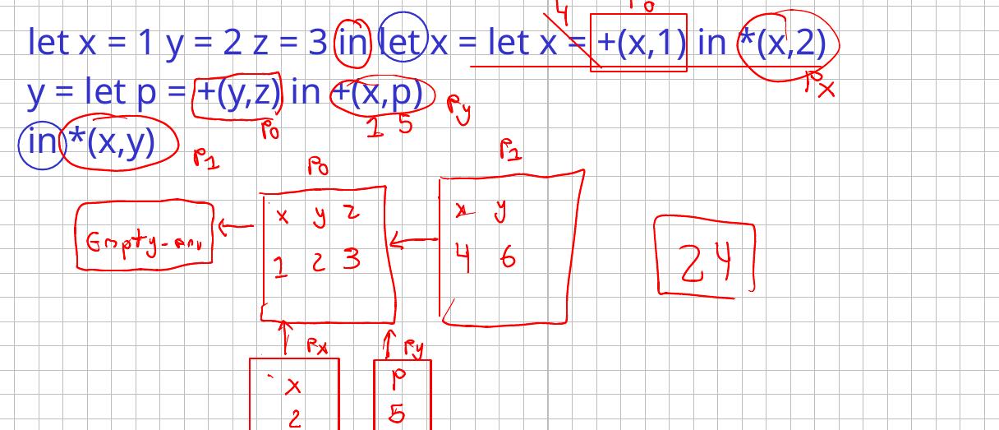
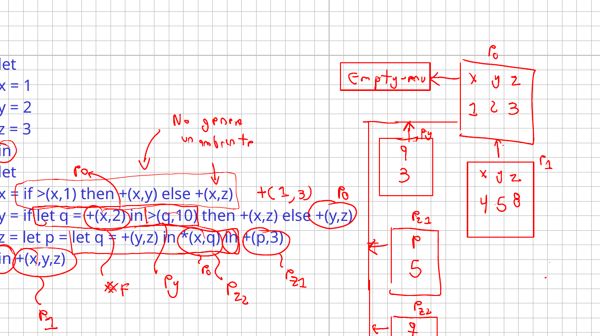
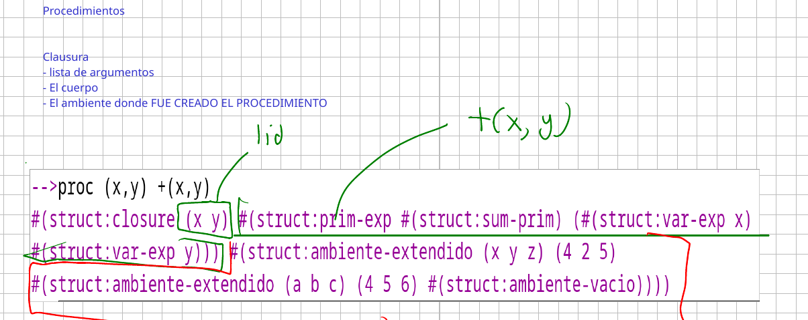
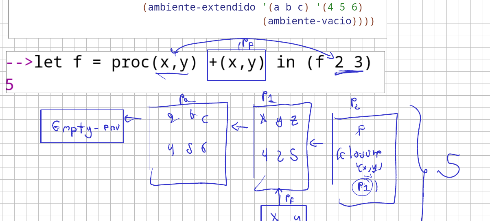
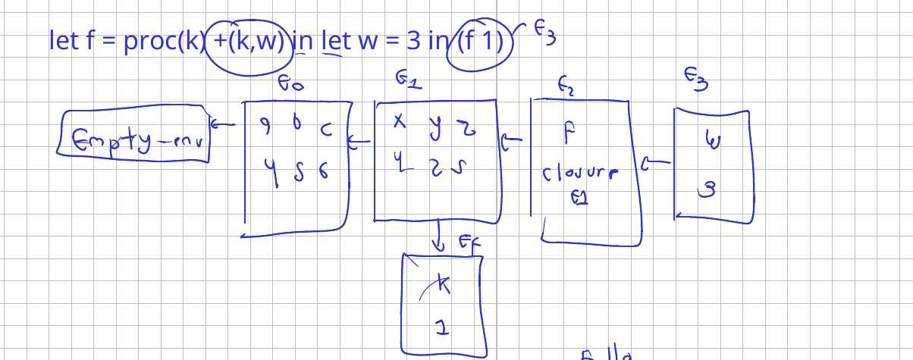
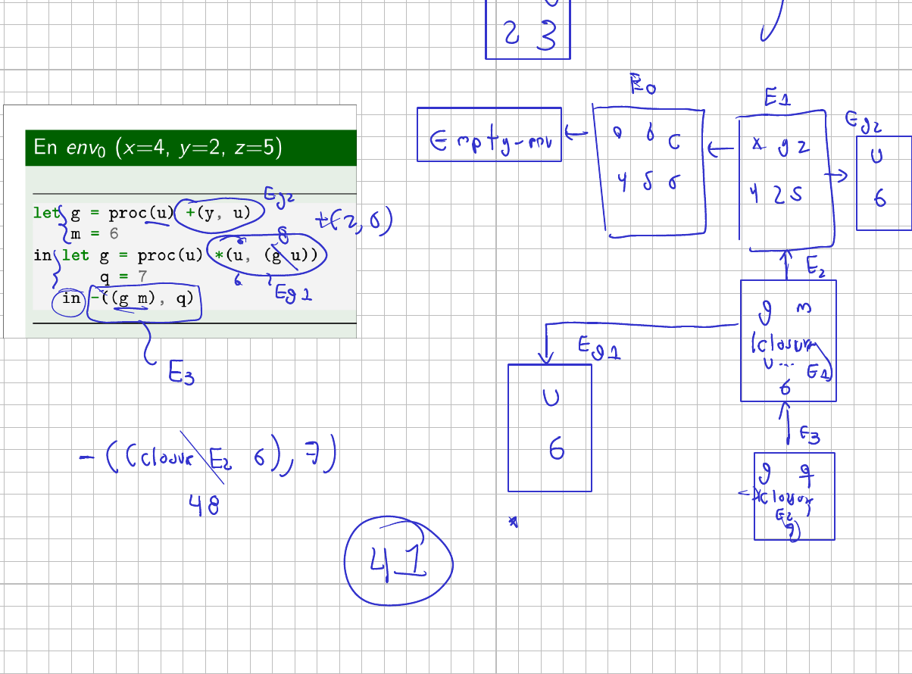
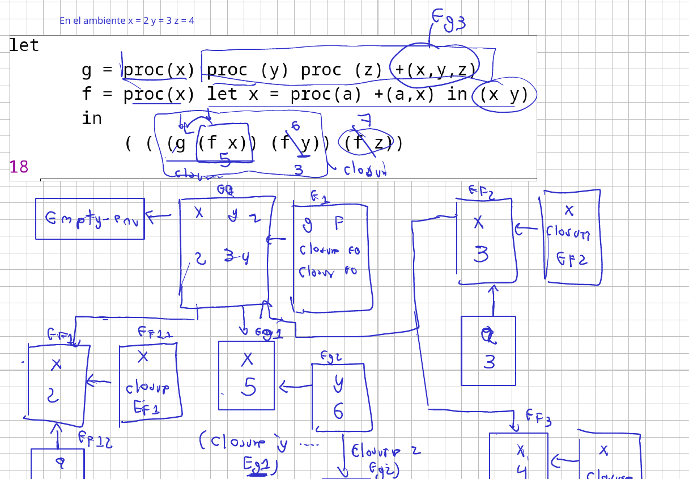
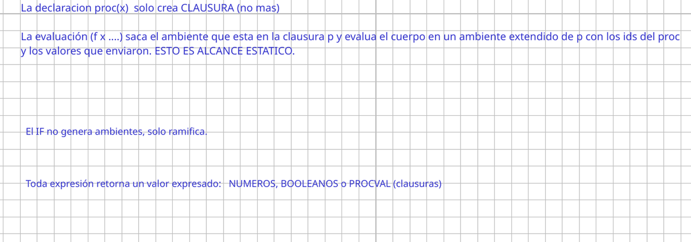

# Clase 5. Condicionales, procedimientos y alcance estático

Martes 6 de octubre de 2026.

El lenguaje de la sesión anterior calcula y nada más. Sus primitivas son las
cuatro aritméticas, `add1` y `sub1`, y ninguna produce un sí o un no; en el
léxico no hay `true` ni `false`. Falta el valor con el que se escogería entre
dos caminos, y con él la variante que lo recibiría. Aunque `let` nombra un
resultado, tampoco hay forma de nombrar un cálculo con sus argumentos sin
resolver, de modo que `+(x, y)` para varios pares hay que escribirlo tantas
veces como pares haya.

Esta sesión agrega las dos piezas que faltan, el condicional y el
procedimiento, y con el procedimiento aparece la pregunta que organiza el
resto del curso: cuando el cuerpo de un procedimiento nombra una variable que
no es parámetro suyo, ¿dónde se busca?

Las diapositivas y los intérpretes están en el Campus Virtual. Aquí quedan las
notas y los apuntes del tablero.

Referencia: Friedman y Wand, *Essentials of Programming Languages*, 3.ª
edición, §3.2 y §3.3.

## Lo que ahora puede valer una expresión

Hasta aquí los valores expresados y los denotados eran la misma cosa, un
número. Con esta sesión dejan de serlo y la lista crece a tres:

| Valor expresado | De dónde sale |
|---|---|
| número | literales y primitivas aritméticas |
| booleano | `true`, `false` y las primitivas de comparación |
| procval | una expresión `proc`, que produce una clausura |

La gramática crece con cuatro producciones: el condicional, la ligadura local,
la creación de un procedimiento y la aplicación. En el léxico entran `true` y
`false`, y entre las primitivas, las comparaciones binarias: mayor, menor,
mayor o igual, menor o igual e igual.

## El condicional

La sintaxis tiene tres partes, y la regla de evaluación tiene un paso que no
se puede saltar:

```scheme
(if-exp (condicion hace-verdadero hace-falso)
        (let ((test-value (evaluar-expresion condicion amb)))
          (if (boolean? test-value)
              (if test-value
                  (evaluar-expresion hace-verdadero amb)
                  (evaluar-expresion hace-falso amb))
              (eopl:error "El test-exp debe ser un booleano " condicion))))
```

Primero se evalúa la prueba y su valor se guarda. Después se comprueba que sea
booleano, y si no lo es el interpretador aborta. Solo entonces se ramifica.
Nunca se le pasa al `if` de Racket el resultado de `evaluar-expresion` sin antes
preguntar por el tipo, porque Racket trata como verdadero todo lo que no sea
`#f` y el error se escondería.

Con el ambiente de prueba, `if >(x, 2) then +(x, 1) else -(x, 1)` con `x = 4`
da 5. Y una prueba que no es booleana, como poner `+(x, 3)` donde va la
condición, no escoge rama: aborta.

De ahí sale el error más frecuente al dibujar:

> El `if` no genera ambientes, solo ramifica.

Es una expresión que devuelve un valor, como cualquier otra. El único que crea
ambientes, por ahora, es `let`.

## La ligadura local, otra vez

`let` ya estaba, pero conviene repetir su regla porque todo lo que sigue se
apoya en ella. Las partes derechas, que es como se nombra en clase a las
expresiones ligadas, se evalúan en el ambiente actual; el cuerpo, en el
ambiente extendido:

$$\text{valor-de}(\textbf{let } id = e \textbf{ in } c,\; \rho) = \text{valor-de}(c,\; [id = \text{valor-de}(e, \rho)]\rho)$$

### Un `let` con dos ligaduras y lets adentro

Con `x = 1`, `y = 2`, `z = 3`:



```
let x = 1 y = 2 z = 3
in let x = let x = +(x, 1) in *(x, 2)
       y = let p = +(y, z) in +(x, p)
   in *(x, y)
```

Las dos partes derechas se evalúan en $\rho_0$, así que ninguna ve lo que la
otra está ligando:

| Ligadura | Ambiente lateral | Cuerpo | Valor |
|---|---|---|---|
| `x` | `x = 2`, de `+(x, 1)` | `*(x, 2)` con la `x` interna | 4 |
| `y` | `p = 5`, de `+(y, z)` | `+(x, p)` con `x = 1` de $\rho_0$ | 6 |

El cuerpo `*(x, y)` se evalúa en $\rho_1$, donde `x = 4` e `y = 6`: da 24.
Dentro de la primera ligadura, la `x` del cuerpo vale 2 porque el `let` interno
la tapó; dentro de la segunda, la `x` sigue valiendo 1 porque ahí nadie la tapó.

### El mismo ejercicio, ahora con condicionales



```
let x = 1 y = 2 z = 3
in let x = if >(x, 1) then +(x, y) else +(x, z)
       y = if let q = +(x, 2) in >(q, 10) then +(x, z) else +(y, z)
       z = let p = let q = +(y, z) in *(x, q) in +(p, 3)
   in +(x, y, z)
```

Las tres ligaduras se evalúan en $\rho_0$:

- `x`: `>(1, 1)` es falso, así que la rama del `else` da `+(1, 3) = 4`. El `if`
  no abrió ningún ambiente.
- `y`: el `let` interno sí abre uno, con `q = 3`; la prueba `>(3, 10)` es falsa
  y el `else` da `+(2, 3) = 5`.
- `z`: dos niveles de `let`. Primero `q = +(2, 3) = 5`, después
  `p = *(1, 5) = 5`, y el cuerpo `+(p, 3) = 8`.

El cuerpo final `+(x, y, z)` se evalúa en $\rho_1$ con 4, 5 y 8: da 17. Los
ambientes del dibujo salen solo de los `let`; los dos `if` no agregan ninguno.

## Procedimientos y clausuras

Un procedimiento se escribe `proc(ids) cuerpo` y se aplica poniendo la
expresión del operador seguida de sus operandos. Lo que decide todo lo demás
es qué pasa al crearlo, y el tablero lo dice en una línea:

> La declaración `proc(x)` solo crea CLAUSURA, no más.

Crear un procedimiento no evalúa su cuerpo. Produce una **clausura**, que
guarda tres cosas:

1. la lista de parámetros formales,
2. el cuerpo sin evaluar,
3. el ambiente vigente cuando el procedimiento fue creado.

Eso se ve al imprimir uno en el intérprete:



```
--> proc (x,y) +(x,y)
#(struct:closure (x y)
    #(struct:prim-exp #(struct:sum-prim) (#(struct:var-exp x) #(struct:var-exp y)))
    #(struct:ambiente-extendido (x y z) (4 2 5)
        #(struct:ambiente-extendido (a b c) (4 5 6) #(struct:ambiente-vacio))))
```

Los paréntesis `(x y)` son los parámetros; el `prim-exp` es el cuerpo tal como
quedó en el árbol; y lo que sigue es la cadena de ambientes completa que había
en ese momento. La clausura no guarda un ambiente suelto: guarda la cadena
entera.

### Aplicar un procedimiento

El tablero también deja escrita la regla de la aplicación:

> La evaluación `(f x ...)` saca el ambiente que está en la clausura y evalúa
> el cuerpo en un ambiente extendido de ese, con los identificadores del `proc`
> y los valores que enviaron. Esto es alcance estático.

En el interpretador, por partes: se evalúan los operandos, se evalúa el
operador, se comprueba con `procval?` que de verdad sea un procedimiento (el
mismo patrón del `if`, preguntar por el tipo antes de usarlo), se compara la
cantidad de parámetros con la de operandos, y solo entonces se evalúa el
cuerpo. El ambiente que se extiende es el de la clausura, no el del sitio
desde donde se llamó.

Aplicar algo que no es procedimiento, como `3(4)`, falla al llegar a esa
comprobación, y los operandos ya se habían evaluado para entonces: los
operandos van primero.



Con `let f = proc(x,y) +(x,y) in (f 2 3)` sobre el ambiente de prueba, `f` se
liga a una clausura que guarda $\rho_1$; la llamada crea $\rho_f$ con `x = 2` e
`y = 3` extendiendo $\rho_1$, y el cuerpo da 5. Cada invocación crea su propio
ambiente.

## Alcance estático

Aquí está el punto de la sesión. Si el cuerpo de un procedimiento nombra una
variable que no es parámetro suyo, esa variable se resuelve **en el ambiente
donde el procedimiento fue creado**, no donde fue llamado. Para saber a qué se
refiere, se mira el texto del programa hacia afuera, por los `let` y los `proc`
que lo contienen, hasta encontrar su declaración.

El ejemplo que lo separa de la otra opción: un procedimiento que usa `x` se
crea cuando `x` vale 5, y se llama después, cuando `x` vale 28.

| | Qué ambiente usa | `f(2, 28)` |
|---|---|---|
| Alcance estático | el de la clausura, con `x = 5` | 25 |
| Alcance dinámico | el de la llamada, con `x = 28` | 2 |

El curso implementa el estático, y lo que lo decide es una sola cosa: que el
tercer campo de la clausura sea el ambiente de creación. Cambiar eso por el
ambiente de la llamada cambia el lenguaje entero.

### Cuando la variable libre no existe todavía



```
let f = proc(k) +(k, w) in let w = 3 in (f 1)
```

Con alcance dinámico esto daría 4. Con alcance estático falla, y conviene
seguir por qué. La clausura de `f` guardó la cadena que había cuando se creó,
y en esa cadena no hay ninguna `w`: la `w = 3` se liga después, en un ambiente
que la clausura nunca vio. Al evaluar `(f 1)` se extiende el ambiente guardado
con `k = 1`, se busca `w` hacia afuera, se llega al ambiente vacío y el
interpretador responde que no encuentra la variable.

### Una ligadura nueva no alcanza a la clausura vieja



Con `x = 4`, `y = 2`, `z = 5`:

```
let g = proc(u) +(y, u)
    m = 6
in let g = proc(u) *(u, (g u))
       q = 7
   in -((g m), q)
```

Hay dos procedimientos llamados `g`. El del cuerpo de la segunda clausura **no
es ella misma**: cuando esa clausura se creó, la `g` que estaba a la vista era
la primera, y es la que quedó guardada en su ambiente. De ahí sale el cálculo:

1. `(g m)` usa la segunda `g`, con `u = 6`.
2. Su cuerpo, `*(u, (g u))`, resuelve esa `g` interna en el ambiente que la
   clausura guardó, donde `g` es la primera: `(g 6)` es `+(y, 6)` con `y = 2`,
   o sea 8.
3. `*(6, 8)` da 48, y el cuerpo `-(48, q)` con `q = 7` da 41.

Si la `g` interna fuera la segunda, el procedimiento se llamaría a sí mismo sin
caso base. Esa es exactamente la razón de que `let` no sirva para definir
procedimientos recursivos, y de que haga falta otra forma para lograrlo.

### Procedimientos que devuelven procedimientos



El ambiente inicial de este cambia: `x = 2`, `y = 3`, `z = 4`.

```
let g = proc(x) proc(y) proc(z) +(x, y, z)
    f = proc(x) let x = proc(a) +(a, x) in (x y)
in (((g (f x)) (f y)) (f z))
```

`g` recibe un argumento y devuelve un procedimiento que recibe otro y devuelve
un tercero. Cada aplicación crea su ambiente y la clausura que devuelve guarda
ese ambiente, así que los valores se van acumulando en la cadena en lugar de
perderse.

`f` hace algo más sutil: su `let` interno liga `x` a un procedimiento, y el
cuerpo de ese procedimiento nombra `x`. Como la parte derecha se evalúa antes
de que exista la ligadura nueva, la `x` del cuerpo es el parámetro de `f`. Por
eso `(f 2)` da 5: `a` vale 3, que es la `y` del ambiente inicial, y `+(3, 2)`
es 5.

Así, `(f x) = 5`, `(f y) = 6` y `(f z) = 7`, y las tres aplicaciones de `g`
terminan sumando `+(5, 6, 7) = 18`.

La variante que se vio después agrega adelante un procedimiento anónimo
aplicado en el sitio, `(proc(x) +(x, y) z)`, que da `+(4, 3) = 7`, y el
programa completo suma `+(7, 18) = 25`.

## Las cuatro reglas, como quedaron escritas



- La declaración `proc(x)` solo crea clausura, no más.
- La evaluación `(f x ...)` saca el ambiente que está en la clausura y evalúa
  el cuerpo en un ambiente extendido de ese, con los identificadores del `proc`
  y los valores que enviaron. Esto es alcance estático.
- El `if` no genera ambientes, solo ramifica.
- Toda expresión retorna un valor expresado: números, booleanos o procval.

## Ejercicios de la segunda mitad

La segunda mitad fue de diagramas de ambientes sobre la herramienta del sitio,
contando tres cosas en cada programa: cuántos procedimientos se aplican,
cuántos ambientes se crean y cuántas clausuras.

En el caso del procedimiento aplicado dos veces sobre su propio resultado, los
ambientes son tres: el del `let` y uno por cada invocación. En el que recibe
otro procedimiento como argumento, las clausuras son dos y las aplicaciones
tres. Y en el que devuelve otro, `(hacer 3)` produce una clausura con `a = 3`
guardado, de modo que aplicarla a 4 y a 2 da 12 y 6, y la suma 18.

El cierre fue un ejercicio de un parcial de semestres anteriores, con un
ambiente inicial que ya trae una clausura ligada. Ahí apareció la confusión que
conviene evitar: en una lista de ligaduras, `g = (f x)` no liga una clausura
sino el resultado de aplicarla. Los valores que salieron fueron `t = 6`,
`s = 12` y `g = 14`.

Un aviso sobre la herramienta: al pedirle el caso de la variable libre que no
existe, no muestra el error como debería. El interpretador real sí lo reporta.

## Los apuntes del tablero

Las cuatro hojas de la sesión, con los dos ejercicios de `let` con
condicionales, la anatomía de la clausura, los ejemplos de procedimientos con
sus cadenas de ambientes, el ejercicio del parcial y las cuatro reglas.

{ type=application/pdf style="min-height:70vh;width:100%" }

## Lo que sigue

Queda el procedimiento que se llama a sí mismo. Con `let` no se puede, por la
razón que mostró el ejemplo de las dos `g`: cuando la clausura se crea, su
propio nombre todavía no está en el ambiente que guarda. La forma de atar ese
nudo es un ambiente que se refiera a sí mismo, y es lo que viene.
