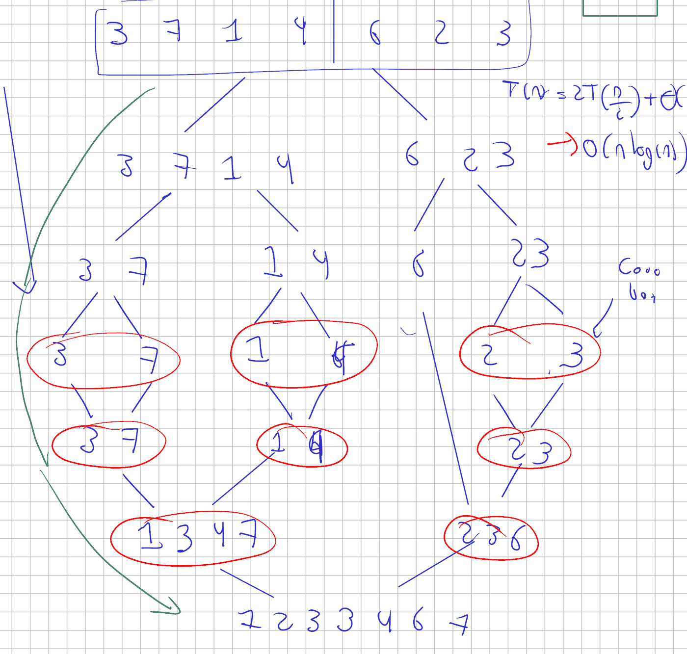

# Estrategias de paralelización

Lo que se vio en la segunda sesión: qué se reparte, de qué tamaño conviene
cada tarea, cómo se asignan las tareas a los hilos, y los tres casos que no
salen con un ciclo repartido. Las diapositivas están en el Campus Virtual;
aquí quedan las cuentas, las mediciones y el código que se corrió en clase.

## Qué se reparte

Hay dos cosas que se pueden partir: los datos o los trabajos. En la
descomposición de datos todos los hilos hacen la misma operación, cada uno
sobre un trozo. En la de tareas cada hilo hace un trabajo distinto sobre los
mismos datos. Y hay una tercera forma, que en realidad es la primera aplicada
en recursión: partir el problema en dos copias más pequeñas de sí mismo.

### Repartir los datos

El programa de la sesión suma un vector de doscientos millones de `long`. La
función que corre cada hilo recibe su tramo `[ini, fin)` y una variable de
salida por referencia:

```cpp
void sumar(const vector<long> &v, size_t ini, size_t fin, long &salida) {
  long s = 0;
  for (size_t i = ini; i < fin; i++) s += v[i];
  salida = s;  // cada hilo escribe en su propia variable: no hay carrera
}
```

Dos detalles de esa función que se discutieron. El `&` en `salida` es lo que
en programación orientada a objetos se llamó paso por alias: lo que el hilo
escriba ahí lo ve quien lo llamó. Y la suma se acumula en una variable local
`s` y se escribe en `salida` una sola vez al final. Sin eso, los cuatro
parciales, que son posiciones contiguas del vector `parciales`, caen en la
misma línea de caché y cada escritura de un hilo invalida la copia del
vecino: el false sharing de la sesión anterior.

El reparto es de la forma más simple: `paso = n / k`, el hilo `h` toma de
`h * paso` a `(h + 1) * paso`, y el último se queda con el resto. Los hilos
se guardan en un `vector<thread>`, se lanzan con `emplace_back`, y después
viene el `join` de cada uno: el programa principal espera ahí hasta que todos
terminen, y solo entonces suma los parciales. Sin el `join`, el programa sigue
sin que los hilos hayan acabado.

Lo que dio en el portátil de la clase, compilado a mano sin `-O2`, con el
reloj en nanosegundos y el total siempre en 400 000 000:

| Hilos | Acumulando en la local `s` | Acumulando sobre `salida` |
|---:|---:|---:|
| 1 | 1 946 ms | 2 041 ms |
| 2 | 597 ms | 2 618 ms |
| 4 | 256 ms | 2 805 ms |
| 8 | 137 ms | 2 869 ms |

La columna de la izquierda escala casi al ritmo de los hilos, y la razón
importa: sin optimización, cada `v[i]` cuesta varias instrucciones y la suma
está limitada por el procesador, no por la memoria. Con `-O2` el mismo
programa se topa con el ancho de banda antes que con los núcleos, que es lo
que muestra la tabla de las diapositivas.

La columna de la derecha es el mismo programa con una sola línea cambiada:
acumular directamente sobre `salida` en vez de sobre la local `s`. Con un
hilo da casi lo mismo. Con dos ya es cuatro veces más lento que la versión
local, y con ocho, veintiuna veces: agregar hilos lo empeora, porque los
parciales viven en posiciones contiguas del vector y cada escritura de un
hilo obliga a los demás a volver a cargar la línea. El resultado es idéntico
en las ocho filas; lo único que cambió es dónde se acumula.

Después se cambió `N` a diez mil, y ahí el orden se invirtió: la fila de ocho
hilos fue la más lenta. Con doscientos millones de números a cada hilo le
tocan veinticinco millones; con diez mil le tocan mil doscientos cincuenta,
que se suman en menos tiempo del que cuesta crear el hilo. Crear, planificar
y unir un hilo no es gratis, y cuando la tarea dura menos que eso, repartir
cuesta más que calcular.

!!! note "Lo que hay que tener presente al repartir datos"
    Los hilos de un proceso no tienen memoria propia: comparten el espacio de
    direcciones. Si dos acumulan sobre la misma variable, las escrituras se
    pisan. Los rangos tienen que ser disjuntos, y los parciales de hilos
    distintos, separados en memoria.

### Repartir los trabajos

El otro reparto: tres recorridos distintos del mismo vector, el máximo, la
suma y cuántos elementos son pares, cada uno en su hilo. Aquí no hay trozos:
hay tres trabajos. El total lo marca el más lento de los tres, y con tres
trabajos no hay forma de usar más de tres hilos. La descomposición de tareas
escala con la cantidad de trabajos distintos, no con el tamaño de los datos.

### Un problema que se parte en dos como él mismo

El mergesort se repasó en el tablero sobre `3 7 1 4 6 2 3`. Se parte por la
mitad hasta llegar a arreglos de un elemento, que ya están ordenados por
definición, y de vuelta se mezclan las dos mitades ordenadas. La mezcla se
hizo paso a paso con `1 3 5` contra `2 4 6`: se comparan las cabezas, sale la
menor, avanza ese lado, y lo que sobra al final se pega de corrido. Cuesta
`n` porque recorre las dos mitades una vez.



La flecha verde recorre el árbol en el orden en que lo hace la recursión:
toda la rama izquierda se resuelve antes de tocar la derecha, y las mezclas,
en rojo, van de abajo hacia arriba. Al repartir, las dos ramas del mismo
nivel corren a la vez y solo la mezcla que las une espera.

De ahí sale la recurrencia $T(n) = 2T(n/2) + n$, que da $n \log n$. El
costo espacial es $\Theta(n)$: la mezcla necesita un espacio temporal, porque
al intercambiar dentro del mismo arreglo se sobreescribe un valor que todavía
hacía falta. En el código ese espacio es el vector `tmp`, y por eso el
mergesort se muere con listas muy grandes donde quicksort no, aunque quicksort
tenga un peor caso cuadrático.

Lo que se paraleliza es la recursión: ordenar la mitad izquierda y ordenar la
derecha son el mismo trabajo sobre la mitad de los datos, y son
independientes. La mezcla del final necesita las dos mitades listas.

```cpp
void ordenar_par(vector<int> &v, vector<int> &tmp,
                 size_t ini, size_t fin, int prof) {
  if (fin - ini < 2) return;
  if (prof == 0 || fin - ini < MINIMO) {   // se acabó el presupuesto
    ordenar(v, tmp, ini, fin);
    return;
  }
  size_t med = ini + (fin - ini) / 2;
  thread izq(ordenar_par, ref(v), ref(tmp), ini, med, prof - 1);
  ordenar_par(v, tmp, med, fin, prof - 1); // la derecha, en este hilo
  izq.join();                              // esperar antes de mezclar
  mezclar(v, tmp, ini, med, fin);
}
```

Dos cortes, y los dos hacen falta. `prof` es el presupuesto de niveles que
pueden crear hilos: con profundidad $d$ se crean $2^d - 1$ hilos y el trabajo
queda en $2^d$ trozos. `MINIMO`, diez mil, es el tamaño por debajo del cual
un tramo no se reparte. Sin ninguno de los dos, la recursión sobre veinte
millones de enteros crearía más de dos mil hilos, y crearlos y unirlos cuesta
más que ordenar en secuencial.

En el portátil de la clase, compilado con `-O2`, la versión secuencial tardó
cerca de 5,9 s. Con dos hilos bajó a la mitad, siguió bajando con cuatro y con
ocho, y de ahí en adelante la ganancia fue mínima. La tabla de las
diapositivas, sobre cuatro núcleos, dice lo mismo con números:

| Corte | Hilos | Tiempo | Aceleración |
|---|---:|---:|---:|
| profundidad 0 | 1 | 2 194 ms | 1,02 |
| profundidad 1 | 2 | 1 221 ms | 1,82 |
| profundidad 2 | 4 | 774 ms | 2,88 |
| profundidad 3 | 8 | 654 ms | 3,41 |
| profundidad 4 | 16 | 640 ms | 3,48 |

La aceleración no llega al número de núcleos, y el motivo está en la última
mezcla: recorre el arreglo entero con un solo hilo. De cuatro a ocho hilos
todavía se gana algo aunque los núcleos sigan siendo cuatro, porque con un
nivel más de corte las mezclas intermedias también quedan repartidas.

Las condiciones para que un problema se pueda partir así son las mismas de
divide y vencerás: los subproblemas son del mismo tipo y la misma función
sirve para todos, son independientes entre sí, y combinarlos cuesta menos que
resolverlos.

## De qué tamaño hacer las tareas

Cuatrocientas tareas del mismo tamaño, ejecutadas en secuencia y de a cuatro
en hilos. Lo único que cambia entre las filas es cuánto trabajo hace cada
tarea:

| Tamaño de la tarea | Secuencial | 4 hilos | Relación |
|---:|---:|---:|---:|
| $10^3$ | 0,4 ms | 6,6 ms | 0,06 |
| $10^4$ | 4,0 ms | 7,4 ms | 0,54 |
| $10^5$ | 39,4 ms | 16,2 ms | 2,42 |
| $10^6$ | 393,6 ms | 108,3 ms | 3,64 |
| $10^7$ | 3 790,9 ms | 1 172,5 ms | 3,23 |

Con tareas de mil operaciones la versión con hilos es dieciséis veces más
lenta: se gastan 6,6 ms en administrar 0,4 ms de trabajo. La relación cruza
el 1 entre $10^4$ y $10^5$, llega a 3,64 y vuelve a bajar en la última fila,
donde el arreglo ya no cabe en caché y reaparece el límite de memoria.

Ese punto de cruce es la granularidad mínima útil, y no es una propiedad del
algoritmo: cambia con la máquina, con el sistema operativo y con el número de
hilos. Se mide, no se hereda. La consecuencia práctica es que con tareas
pequeñas no se crea un hilo por tarea: se agrupan varias en una, o se crean
pocos hilos y se les van entregando tareas. Eso es lo que hacen TBB y los
grupos de hilos.

## Quién hace cada tarea

Sesenta y cuatro tareas de costo muy desigual, la tarea `i` proporcional a
$i^2$, y cuatro hilos. Con reparto fijo por bloques contiguos, cada hilo sabe
de antemano cuáles le tocan y no hay nada que coordinar: 824 ms. Con reparto
por demanda, un contador compartido entrega la siguiente tarea libre y cada
hilo vuelve por otra al terminar: 379 ms.

La diferencia no está en hacer el trabajo más rápido sino en repartirlo
mejor. Con bloques contiguos al último hilo le tocan las tareas más caras, y
los otros tres pasan más de la mitad del tiempo esperando. Por demanda todos
siguen ocupados hasta el final. El precio es el contador, que en el código es
un `atomic<int>` con `fetch_add`: la forma barata de repartir sin cerrojo.

Para saber si hay desbalance, hay que contar cuántas tareas hizo cada hilo,
no solo mirar el tiempo total. Con `std::thread` el reparto lo decide el
programa; en OpenMP esto mismo es `schedule(static)` frente a
`schedule(dynamic)`, y se verá cuando llegue ese tema.

## Delegar el reparto: TBB

Con `std::thread` el programa decide cuántos hilos hay, qué rango le toca a
cada uno, y dónde va el `join`. Con TBB se describe el rango y la operación,
y el planificador de la biblioteca decide cuántas tareas crear, en qué hilo
correrlas y cómo rebalancear cuando unas terminan antes.

```cpp
result = tbb::parallel_reduce(
    tbb::blocked_range<int>(0, VECTOR_SIZE), 0L,
    [&](tbb::blocked_range<int> r, long init) -> long {
      for (int i = r.begin(); i < r.end(); i++) init += v[i];
      return init;
    },
    [](long x, long y) -> long { return x + y; });
```

Tres bloques. `blocked_range` es un rango de índices que se puede partir; el
planificador lo divide en dos, y cada mitad otra vez, hasta que los pedazos
sirven para repartir. `parallel_for` recorre ese rango en paralelo: la lambda
recibe un subrango, no un índice, y adentro va un ciclo normal que corre un
solo hilo, de corrido. `parallel_reduce` además recibe un valor inicial y una
función que combina los parciales.

Es la reducción de programación funcional. `fold` recorría la colección con
un acumulador y una función de dos argumentos, el acumulado y el elemento
actual; aquí la primera lambda hace eso sobre un subrango y la segunda dice
cómo se juntan dos acumulados. Para que la reducción se pueda repartir la
operación tiene que ser asociativa: la suma sirve, la resta no.

| | `std::thread` | TBB |
|---|---|---|
| Unidad | Un hilo del sistema | Una tarea |
| Reparto | Rangos calculados a mano | `blocked_range` partido por el planificador |
| Balanceo | Fijo, salvo que se programe | Dinámico |
| Número de hilos | Lo fija el programa | Lo detecta el runtime, o se acota |
| Cantidad de código | Crear, unir, acumular | Una llamada por bloque |
| Cambio de máquina | Se revisa el reparto | Se ajusta solo |

Se compila con `-ltbb`, y conviene `-O2` para que el código quede optimizado
y `-g` para poder depurar, en especial los fallos de segmentación. La biblioteca es externa y hay que instalarla; en los equipos de la
sala donde se dictó la sesión no está, y por eso la demostración corrió en el
portátil del docente. La sintaxis de TBB
es más pesada que la de `std::thread`; OpenMP, que viene después, deja el
mismo código de siempre con unas anotaciones encima, y es lo que se usa en la
práctica.

## Cuando cada paso depende del anterior

La suma de prefijos: la posición `i` guarda la suma de todos los anteriores
incluida ella. Con `3 1 4 1 5` sale `3 4 8 9 14`, y cada valor sale del que
está a su izquierda. Repartir el ciclo directo da un resultado incorrecto,
porque un hilo que arranque en la mitad no tiene el acumulado de lo que va
antes.

Es el `scan` de programación funcional, y la salida es la misma que allá. Se
calcula primero un árbol de sumas parciales: con `1 2 3 4`, el par de la
izquierda suma 3, el de la derecha 7, y el total 10. Con esos parciales cada
mitad ya sabe cuánto tiene que arrastrar, y a partir de ahí las mitades se
pueden resolver a la vez.

En el programa de la sesión son dos pasadas sobre veinte millones de
elementos. En la primera cada hilo suma su bloque y reporta el total; entre
las dos, se acumulan esos totales para obtener el desplazamiento de cada
bloque; en la segunda cada hilo rehace su bloque partiendo de su
desplazamiento. Es más trabajo que la versión secuencial, porque recorre los
datos dos veces, y aun así en el portátil de la clase la versión en dos
pasadas terminó en 1,7 s y por delante de la secuencial. Para que el efecto
se vea, el valor de cada posición cuesta algo de calcular; si el programa
solo mueve memoria, la segunda pasada cuesta más de lo que ahorra el reparto.

!!! note "Antes de declarar que algo no se puede paralelizar"
    Preguntarse si la dependencia es del problema o de cómo se escribió la
    solución. La suma de prefijos parecía secuencial y no lo era del todo.

## Etapas encadenadas: el pipeline

Hay trabajos que van por etapas: leer, calcular, escribir. Cada etapa es
secuencial por dentro y depende de la anterior. Lo que se puede hacer es
partir los datos en lotes y dejar que las tres etapas trabajen al mismo
tiempo sobre lotes distintos: mientras se calcula el lote 2, se lee el 3 y se
escribe el 1.

La comparación que se hizo en clase fue con la bandeja paisa. Nadie cocina el
arroz completo antes de poner los fríjoles: las tres cosas van al fuego a la
vez y se sirven a medida que salen. A diferencia de divide y vencerás, donde
el resultado aparece al final cuando se combinan los parciales, en un
pipeline los resultados salen de a poco.

Pasado el arranque, el ritmo lo marca la etapa más lenta, y acelerar cualquier
otra no cambia nada. Las únicas dos salidas son atacar el cuello de botella o
replicar esa etapa para que dos hilos la atiendan. Las etapas se conectan con
colas, y una cola entre dos hilos necesita un cerrojo: sin él, la etapa de
calcular puede intentar tomar un lote que la de leer todavía no terminó de
poner.

## Cómo elegir

| Situación | Estrategia |
|---|---|
| Muchos datos, una operación | Descomposición de datos |
| Varias operaciones independientes | Descomposición de tareas |
| Tareas muy pequeñas | Agrupar y usar un grupo de hilos |
| Tareas de costo desigual | Reparto por demanda |
| Cadena de dependencias | Reformular en dos pasadas |
| Flujo continuo por etapas | Pipeline |

Y tres pautas que valen para todas. Medir la versión secuencial antes de
repartir nada: es el punto de comparación y a veces también el ganador.
Verificar que el resultado paralelo coincide con el secuencial antes de mirar
los tiempos. Y cuando la aceleración se estanque, revisar primero cuánta
memoria mueve el programa por cada operación que hace, y si hay false sharing
por ahí: casi siempre está.

## El ejercicio de la sesión

El último tramo fue el ejercicio del repositorio, el producto de Hadamard con
TBB: llenar `u` y `v`, calcular `w[i] = u[i] * v[i]` en paralelo, sumar `w`
con una reducción paralela, e imprimir el resultado con el tiempo. Se resolvió
en vivo, y quedaron tres cosas de esa resolución.

El valor inicial de `parallel_reduce` va como `0L`. Con `0` a secas el
acumulador se toma como `int`, y la suma de diez millones de productos
desborda: el desbordamiento de siempre, ahora escondido en un argumento.

La primera comparación contra la versión secuencial salió injusta: el reloj
de la versión paralela incluía el llenado de los vectores y el de la
secuencial no. Al sacar el llenado del cronómetro y medir solo el producto y
la suma, la diferencia quedó en su lugar. Comparar los dos números antes que
los dos relojes, y después revisar que los relojes midan lo mismo.

Y `printf` en lugar de `cout` para imprimir, porque es más rápido; en un
programa que se está cronometrando, hasta la impresión cuenta.

El flujo del repositorio corre en cada `push` a la copia de cada quien. Para
que corra hay que hacer fork, entrar a la pestaña *Actions* de la copia y
habilitarlos, y clonar por SSH con una llave registrada en la cuenta. Desde
esta sesión el repositorio tiene cuatro partes, una por tema, y quien lo
bifurcó en clase tiene la versión de una sola; conviene rehacer el fork.

## Los apuntes del tablero

La hoja de la sesión, tal como quedó: las cifras de la suma con la variable
local y con la compartida, y el árbol del mergesort con su recurrencia.

{ type=application/pdf style="min-height:70vh;width:100%" }

!!! note "El campus desde la red inalámbrica"
    En Linux, la red inalámbrica de la universidad no resuelve el nombre del
    campus virtual. Se arregla poniendo los DNS de Google, `8.8.8.8` y
    `8.8.4.4`, en la configuración de la conexión. Por cable no pasa.
