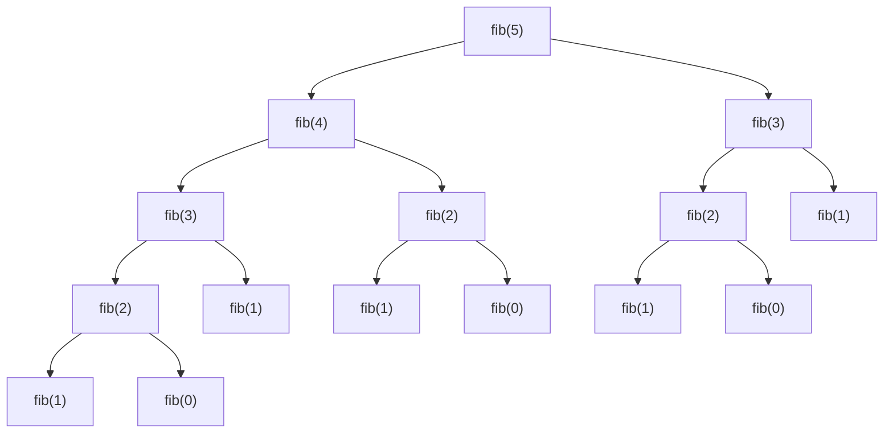

# Clase 2. Funciones y los procesos que generan

Jueves 17 de septiembre de 2026.

Cuando se escribe una función se dice qué se quiere. Cómo se comporta el
programa al evaluarla es otra cosa, y puede variar entre dos funciones que
devuelven exactamente lo mismo. La sesión toma el factorial, lo escribe de dos
maneras, pone el depurador a mostrar la pila en cada una, y de ahí saca los
nombres: recursión lineal, recursión de cola y recursión de árbol.

Las diapositivas están en el Campus Virtual. Aquí quedan las notas de lo que se
dijo en el salón y el código que se escribió en vivo, en
[`codigo/`](https://github.com/cardel/notasUniversidad/tree/master/docs/2026-II/PFC/C2/codigo). Los nueve ejercicios interactivos de la sesión están en
[Ejercicios](./Ejercicios.md).

Referencia: Abelson y Sussman, *Structure and Interpretation of Computer
Programs*, sección 1.2, *Procedures and the Processes They Generate*; Odersky,
Spoon y Venners, *Programming in Scala*, 3.ª edición, capítulos 4 y 8.

## Un `object` y un `main`

El primer archivo de la sesión empieza con `object Factorial`, y la pregunta
fue por qué `object` y no `class`. Un `object` es lo que en Java se declara
`static`: una clase de la que existe **una sola instancia** en todo el
programa. El `main` va ahí por la misma razón por la que en Java es `public
static void main`: el programa tiene que saber por dónde arranca, y solo puede
haber un punto de arranque.

```scala
object Factorial {
  def factorial(n: Int): Int = {
    if (n == 0) 1
    else n * factorial(n - 1)
  }

  def main(args: Array[String]): Unit = {
    println(factorial(5))
  }
}
```

`main` recibe los argumentos de la línea de comandos y devuelve `Unit`: es el
equivalente del `void`, ejecuta una secuencia de instrucciones y no produce
ningún valor.

## Funciones frente a procesos

`factorial(5)` da 120. La pregunta es cómo se llegó a ese número.

```
factorial(5) = 5 * factorial(4)
factorial(4) = 4 * factorial(3)
factorial(3) = 3 * factorial(2)
factorial(2) = 2 * factorial(1)
factorial(1) = 1 * factorial(0)
factorial(0) = 1
```

Ninguna de esas líneas se puede cerrar hasta que la de abajo devuelva.
`factorial(5)` necesita el valor de `factorial(4)` para hacer su
multiplicación, y así hasta el fondo. Solo cuando `factorial(0)` responde 1
empiezan a resolverse de abajo hacia arriba: 1, 1, 2, 6, 24, 120.

### Lo que mostró el depurador

Con un punto de interrupción dentro de `factorial` y avanzando llamada por
llamada, la ventana de marcos de pila mostró esto al llegar al fondo:

```
n = 0    <- el marco actual
n = 1
n = 2
n = 3
n = 4
n = 5    <- sigue abierto, esperando su multiplicación
```

Seis marcos abiertos al mismo tiempo, cada uno con su propio `n`. El de
`n = 5` no se puede cerrar porque todavía tiene pendiente `5 * ___`.

### La memoria de un programa

Para ver por qué eso importa hay que recordar cómo se reparte la memoria de un
programa en ejecución:

```
+--------------+
| pila         |  <- un marco por llamada: parámetros y variables locales
+--------------+
| montículo    |  <- arreglos y objetos
+--------------+
| código       |
+--------------+
```

Un `int* arr` de C++ vive en la pila, y lo que apunta vive en el montículo. Cada
llamada a una función abre un marco en la pila, un espacio de memoria aislado
donde viven sus variables, y ese marco se cierra cuando la función devuelve.

La pila de un hilo de la JVM tiene tamaño fijo, del orden de un megabyte, y se
puede subir con `-Xss`. Cuando se llena, la máquina virtual lanza
`StackOverflowError`. Con `factorial(100000)` son cien mil marcos abiertos al
tiempo, y no caben:

```
factorial(100000): StackOverflowError
```

### Dos cosas distintas

La **función** es el texto: tres líneas que no cambian. El **proceso** es lo
que ocurre al evaluarla, y crece con el argumento. Lo que se acaba de ver es
una función recursiva que genera un **proceso recursivo**: la expresión crece
mientras baja y se encoge mientras sube, y en el punto más hondo hay `n`
multiplicaciones esperando. A eso se le llama **recursión lineal**: tiempo
proporcional a `n`, y espacio también proporcional a `n`.

## Recursión lineal e iteración

Este curso no tiene ciclos. Si toda repetición se escribe con recursión y toda
recursión abre marcos, cualquier cálculo largo revienta la pila. Hace falta una
recursión que no acumule marcos.

El cambio es hacer la multiplicación **antes** de llamar, y llevar el producto
parcial en un parámetro:

```scala
import scala.annotation.tailrec

def factorialTail(n: Int): Int = {

  @tailrec
  def factorial(n: Int, acc: Int): Int = {
    if (n == 0) acc
    else factorial(n - 1, n * acc)
  }

  factorial(n, 1)
}
```

`acc` es el acumulador. Arranca en 1, que es el valor del caso base, y en cada
vuelta se le pega el `n` de turno. La función interna se llama igual que la
externa y no se estorban: la de adentro tapa a la de afuera dentro del bloque.

```
factorial(6, 1)
factorial(5, 6)
factorial(4, 30)
factorial(3, 120)
factorial(2, 360)
factorial(1, 720)
factorial(0, 720) = 720
```

Ninguna línea es más larga que la anterior. Cuando `factorial(6, 1)` llama a
`factorial(5, 6)` ya no le queda nada por hacer: lo que devuelva la llamada es
lo que devuelve ella. Así que su marco no sirve para nada y el compilador lo
**reutiliza** en lugar de apilar uno nuevo.

El depurador lo confirmó: al avanzar de `n = 6` a `n = 5`, el marco de
`n = 6` desapareció. Nunca hubo más de uno.

### `@tailrec`

Una llamada está **en posición de cola** cuando es la última acción de su
rama: nada se le hace encima al valor que devuelve. `@tailrec`, de
`scala.annotation`, no optimiza: **comprueba**. Si la llamada no está en
posición de cola, el programa no compila:

```
error: could not optimize @tailrec annotated method factorial:
       it contains a recursive call not in tail position
  @tailrec def factorial(n: Int): Int = if (n == 0) 1 else n * factorial(n - 1)
                                                                 ^^^^^^^^^^^^^^^^
```

Scala optimiza igual sin la anotación cuando puede; la diferencia es que sin
ella uno se entera del descuido cuando la pila se llena, en ejecución, y con
ella se entera al compilar. Va siempre.

No todos los lenguajes hacen esta optimización. Scala, Kotlin, Scheme, Racket,
Clojure, Haskell, OCaml, Erlang y Lua, entre otros, sí. Java y C++ no lo
garantizan: la misma función escrita con acumulador sigue abriendo un marco por
llamada.

### Función recursiva y proceso recursivo

`factorialTail` se llama a sí misma y aun así genera un **proceso iterativo**:
tiempo proporcional a `n`, espacio constante. Es lo que en un lenguaje
imperativo haría un `for`, sin `for`.

```
recursión lineal   proceso recursivo    n marcos de pila
recursión de cola  proceso iterativo    1 marco de pila
```

La señal que hay que buscar no está en el nombre de la función ni en si tiene
acumulador: está en **qué queda escrito alrededor de la llamada recursiva**.

### Contar hacia adelante

El `factIter` de los ejercicios va de 1 a `n` con un contador y un producto,
en lugar de bajar de `n` a 0:

```scala
def factIter(cont: Int, prod: Int, n: Int): Int =
  if (cont > n) prod
  else factIter(cont + 1, cont * prod, n)
```

| `cont` | `prod` |
|---:|---:|
| 1 | 1 |
| 2 | 1 |
| 3 | 2 |
| 4 | 6 |
| 5 | 24 |

El `prod` de cada fila es `cont × prod` de la fila anterior. Es la misma
recursión de cola en otra dirección: el resultado se arma antes de llamar y
viaja como argumento.

Con `n = 100000` la versión de cola termina y la lineal no:

```
factorial(100000):     StackOverflowError
factorialTail(100000): termina y devuelve 0
```

El 0 no es un factorial: el proceso cupo en la pila, pero `100000!` no cabe en
un `Int`. Espacio y rango son problemas distintos.

### Cuáles son de cola

Sobre los ejercicios interactivos se clasificaron varias versiones. Estas no
son de cola, aunque den el mismo valor:

```scala
n * factorial(n - 1)                        // la multiplicación espera
1 + factIter(cont + 1, cont * prod, n) - 1  // sumar y restar lo mismo también espera
math.max(x, factIter(cont + 1, prod, n))    // el max necesita el valor para comparar
```

Y esta sí, aunque parezca que hace algo antes:

```scala
val siguiente = cont * prod
factIter(cont + 1, siguiente, n)            // el val se calcula antes; la llamada es lo último
```

Un `val` calculado antes de llamar no rompe la cola. Una operación que
necesita el resultado de la llamada, por inocente que se vea, sí.

## Recursión de árbol

Aparece cuando una función tiene **más de un llamado recursivo**. El caso de
siempre es Fibonacci:

$$
\text{fib}(n) =
\begin{cases}
0 & n = 0 \\
1 & n = 1 \\
\text{fib}(n-1) + \text{fib}(n-2) & n > 1
\end{cases}
\qquad n \geq 0
$$

La precondición es `n ≥ 0`: para negativos la función no está definida.

```scala
def fibonacci(n: Int): Int = {
  if (n <= 1) n
  else fibonacci(n - 1) + fibonacci(n - 2)
}
```

Los dos casos base se juntan en uno: si `n` es 0 devuelve 0, si es 1 devuelve
1, así que devolver `n` cubre ambos.

```
fibonacci(5) = 5
fibonacci(6) = 8
```

### El árbol de `fib(5)`



Cada nodo abre dos. Las expresiones se evalúan de izquierda a derecha, así que
`fib(n - 2)` no arranca hasta que `fib(n - 1)` devolvió. El recorrido baja por
la rama izquierda hasta `fib(1)`, cierra, sube un nivel, abre la derecha, y
así: la pila nunca tiene más de una rama abierta a la vez.

De ahí salen dos números que se confunden:

- **Marcos abiertos al mismo tiempo, como máximo**: 5, la hondura del árbol.
  Es el mismo espacio que la recursión lineal, porque la rama derecha no puede
  empezar sin haber cerrado la izquierda.
- **Llamadas en total**: 15, una por nodo. Y `fib(3)` se calcula dos veces,
  `fib(2)` tres veces.

| `n` | llamadas | marcos al tiempo |
|---:|---:|---:|
| 5 | 15 | 5 |
| 6 | 25 | 6 |
| 10 | 177 | 10 |
| 20 | 21 891 | 20 |
| 30 | 2 692 537 | 30 |

El espacio crece como `n`; el tiempo crece como $2^n$. Es complejidad
exponencial, y por eso Fibonacci recursivo es una pésima idea aunque se vea
tan limpio.

### Qué se hace con eso

Los subproblemas repetidos —`fib(3)` dos veces, `fib(2)` tres— son la pista:
si se guarda el resultado la primera vez, el árbol se poda y queda lineal. Esa
técnica se llama memoización y se ve en el curso de algoritmos que sigue.

La otra salida es la iterativa, la misma que ya se escribió en C++ en los
cursos anteriores:

```cpp
int n = 6;      // 0 1 1 2 3 5 8
int ant = 0;
int act = 1;
for (int i = 1; i < n; i++) {
  int aux = act;
  act = act + ant;
  ant = aux;
}
printf("El fibonacci de %d es %d\n", n, act);
```

Dos variables que se van corriendo, un solo marco, tiempo proporcional a `n`.
Este Fibonacci en particular sí se puede llevar a recursión de cola, con dos
acumuladores que hagan de `ant` y `act`. Con más de dos llamadas recursivas, o
con llamadas que dependen unas de otras, la conversión deja de ser mecánica y
hay que buscar otra cosa.

### Partir el rango por la mitad

El `producto(i, j)` de los ejercicios interactivos parte el problema en dos
mitades independientes en lugar de recorrerlo de punta a punta:

```scala
def producto(i: Int, j: Int): Int =
  if (i >= j) 1
  else if (i == j - 1) i
  else {
    val m = i + (j - i) / 2
    producto(i, m) * producto(m, j)
  }
```

`producto(1, 5)` es `producto(1, 3) * producto(3, 5)`, y cada mitad se vuelve
a partir hasta llegar a rangos de un elemento. La simulación del ejercicio
resuelve la izquierda entera antes de tocar la derecha, y pinta la pila
bajando a un marco entre las dos.

| `n` | llamadas | hondura |
|---:|---:|---:|
| 4 | 7 | 3 |
| 8 | 15 | 4 |
| 16 | 31 | 5 |
| 1024 | 2047 | 11 |

Las llamadas son `2n − 1`: el tiempo sigue proporcional a `n`. La hondura es
$\log_2 n + 1$: el espacio pasó de mil marcos a once. Y el caso `i == j - 1`
no sobra: sin él, con `i = 1` y `j = 2` el corte da `m = 1` por la división
entera, la llamada derecha vuelve a ser `producto(1, 2)` y el proceso no
avanza. El caso base de un árbol tiene que cubrir el rango más pequeño que el
corte todavía puede producir.

## Tres procesos, una tabla

| | `factorial` | `factorialTail` | `producto` |
|---|---|---|---|
| Forma | crece y encoge | constante | árbol binario |
| Tiempo | ~ `n` | ~ `n` | ~ `n` |
| Espacio | ~ `n` | constante | ~ `log₂ n` |
| Proceso | recursivo lineal | iterativo | recursivo de árbol |

Las tres son funciones recursivas. Solo la segunda genera un proceso
iterativo.

## El Taller 1

Cifrados clásicos con recursión, en el repositorio
<https://github.com/EjerciciosClasesCardel/pfc-taller-1-cifrados-clasicos>.
El enunciado completo, con la rúbrica y la ecuación de calificación, es el PDF
del campus. Se entrega el **jueves 8 de octubre de 2026 a las 23:59**, en
grupos de hasta cuatro.

Lo que se dijo en el salón sobre cómo se trabaja:

- **Es un fork.** Un integrante hace el fork, agrega a los demás como
  colaboradores y todo el equipo trabaja sobre ese mismo fork. Clonar el
  repositorio original no sirve: no hay permiso de escritura. Un repositorio
  creado aparte se sanciona con el 30 %.
- **Un solo enlace por grupo**, registrado en la tarea del campus, con el hash
  del último commit. Dos integrantes que entreguen enlaces distintos reciben
  la nota más baja de los dos. No hay entregas por correo ni por Drive.
- **Se califica el último commit anterior a la fecha de cierre.** Los commits
  posteriores se descartan con un script. Se puede seguir trabajando después;
  no cuenta.
- **El `README.md` lleva nombre completo y código** de cada integrante. Hay
  homónimos en el curso y sin código no hay forma de casar la nota.
- **El código va en `app/src/main/scala/taller/CifradosClasicos.scala` y los
  informes en `docs/`.** Nada más se toca: ni las pruebas, ni la configuración
  del proyecto, ni los flujos de GitHub. Las 36 pruebas de ScalaTest vienen
  escritas y se corren con `./gradlew test`; en los talleres siguientes las
  pruebas las escribe el equipo. Antes de las pruebas corre Scalastyle, que detiene el flujo si
  aparece `var`, `while` o `return`. El taller se resuelve con recursión
  lineal, recursión de cola y recursión de árbol; una solución que funcione
  por otro camino no es lo que se evalúa.
- **Scala 2.13.18, no Scala 3.** La librería de la segunda parte del curso no
  es compatible con Scala 3.
- **Los informes van en `docs/proceso.md` y `docs/correccion.md`**, en
  Markdown, con la notación matemática en LaTeX y los diagramas en `mermaid`.
  Los dos archivos ya traen un ejemplo hecho sobre el factorial, y se
  reemplazan por el informe propio. Un `informe1.md` por otro lado no se
  revisa. No se leen PDF, ni `.docx`, ni imágenes, ni enlaces externos: lo que
  no está en Markdown no existe para la calificación. Para la recursión lineal
  la corrección se argumenta por inducción estructural; para la recursión de
  cola, con la argumentación de programas imperativos sobre el invariante.
  Las dos son de Matemáticas Discretas.
- **Todas las entregas pasan por MOSS**, el detector de similitud de Stanford,
  y por un detector de patrones de código generado. Usar la IA para preguntar
  dónde está un error y por qué está bien; mandarle el enunciado y pegar la
  respuesta no.
- **Cada integrante trabaja en su propia rama y la integra a `main` con un
  pull request.** Si hay conflicto, aparece en el pull request y se resuelve
  ahí, antes de que le llegue a los compañeros. Nunca `push --force`. Quien
  trabaja solo puede hacer push a `main` directamente.
- **Una sola cuenta de GitHub**, con el correo personal y el institucional
  como secundario. Con eso se pide el GitHub Education Pack y la licencia de
  estudiante de JetBrains. Si se configuran llaves SSH en un equipo de la
  sala, se borran al salir; el tutorial está en Asignaciones, en el campus.

Sobre herramientas: IntelliJ IDEA abre el proyecto por la carpeta raíz del
fork, descarga solo el Java y el Scala que necesita, y trae las tareas de
Gradle a la mano: `build` para compilar, `run` para ejecutar, `test` y
`scalastyleCheck` bajo *verification*. El complemento de Scala de Visual
Studio Code dio problemas en las dos sesiones.

## Lo que queda

El ejercicio de la sesión es
[recursión de cola: sumatorias con acumulador](https://github.com/EjerciciosClasesCardel/pfc-ejercicio-02-recursion-de-cola):
dos sumatorias que se escriben con `@tailrec` y un acumulador con valor por
defecto. Se entrega como los demás, con fork, *actions* habilitadas y la
dirección del fork con el hash del último commit en el campus.

Los ejercicios interactivos de [Ejercicios](./Ejercicios.md) quedan
disponibles para volver sobre la mecánica: `pendientes`, `acumulador` y
`cola` para contar marcos en las dos versiones del factorial, y `árbol` y
`cuentas` para el producto por mitades.

Lo que sigue: `factorialTail` y la suma con acumulador tienen el mismo
esqueleto —un contador, un acumulador, un valor de arranque— y cambian solo en
con qué se combina. Convertir esa diferencia en un parámetro es recibir una
función como argumento.
